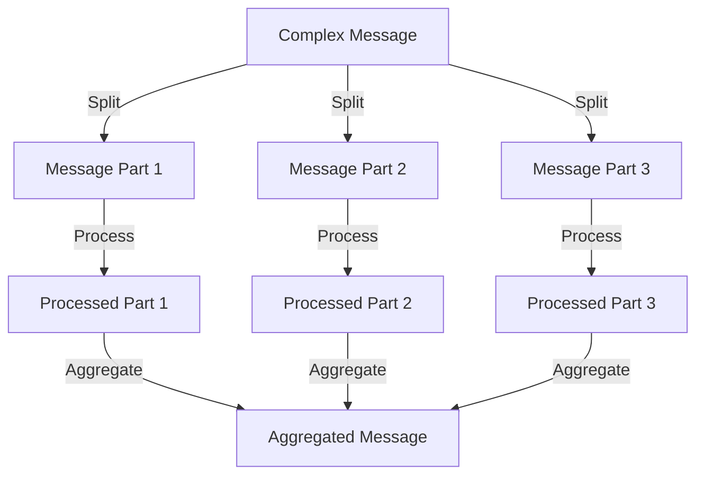
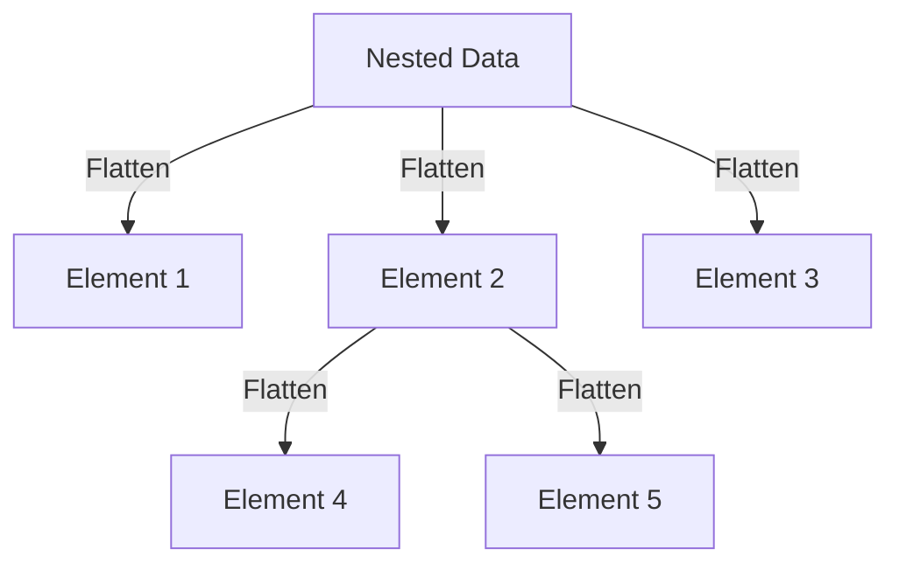

## 10.7. Splitter and Aggregator

In the realm of enterprise integration patterns, the Splitter and Aggregator patterns play a crucial role in managing complex data structures and ensuring efficient message processing. These patterns are particularly useful when dealing with systems that require the division of large messages into smaller, manageable parts and the subsequent recombination of these parts after processing. Let's delve into these patterns, exploring their intent, applicability, and implementation through detailed pseudocode examples.

### **Design Pattern Name**

- **Splitter and Aggregator**

### **Category**

- Enterprise Integration Patterns

### **Intent**

The Splitter pattern is designed to break down a complex message into smaller, more manageable pieces, allowing each piece to be processed independently. Conversely, the Aggregator pattern is used to collect and recombine these processed pieces into a single cohesive message. Together, these patterns facilitate the handling of complex data structures in a distributed system.

### **Diagrams**

#### **Visualizing the Splitter and Aggregator Workflow**



*Caption: The diagram illustrates the process of splitting a complex message into parts, processing each part, and aggregating the processed parts back into a single message.*

### **Key Participants**

- **Splitter**: Responsible for dividing a complex message into smaller parts.
- **Processor**: Handles the processing of each individual message part.
- **Aggregator**: Collects the processed parts and combines them into a single message.

### **Applicability**

- **Use the Splitter pattern** when you need to process different parts of a message independently.
- **Apply the Aggregator pattern** when you need to recombine processed message parts into a single entity.
- **Ideal for systems** where messages contain complex data structures that need to be handled in parts.

### **Sample Code Snippets**

#### **Splitter Pattern Implementation**

```pseudocode
// Define a function to split a complex message
function splitMessage(complexMessage):
    // Initialize an empty list to hold message parts
    messageParts = []

    // Iterate over each part of the complex message
    for part in complexMessage:
        // Add each part to the messageParts list
        messageParts.append(part)

    // Return the list of message parts
    return messageParts

// Example usage
complexMessage = ["Part1", "Part2", "Part3"]
messageParts = splitMessage(complexMessage)
```

*Comments: This pseudocode demonstrates how to split a complex message into individual parts, which can then be processed independently.*

#### **Aggregator Pattern Implementation**

```pseudocode
// Define a function to aggregate processed message parts
function aggregateParts(processedParts):
    // Initialize an empty string to hold the aggregated message
    aggregatedMessage = ""

    // Iterate over each processed part
    for part in processedParts:
        // Concatenate each part to form the aggregated message
        aggregatedMessage += part + " "

    // Return the aggregated message
    return aggregatedMessage.trim()

// Example usage
processedParts = ["Processed Part1", "Processed Part2", "Processed Part3"]
aggregatedMessage = aggregateParts(processedParts)
```

*Comments: This pseudocode illustrates how to aggregate processed message parts into a single cohesive message.*

### **Design Considerations**

- **When to Use**: Employ these patterns when dealing with large or complex messages that need to be processed in parts.
- **Considerations**: Ensure that the order of message parts is maintained during aggregation if it is critical to the integrity of the message.
- **Pitfalls**: Be cautious of potential data loss or corruption during the splitting and aggregation processes.

### **Differences and Similarities**

- **Differences**: The Splitter pattern focuses on dividing messages, while the Aggregator pattern focuses on combining them.
- **Similarities**: Both patterns are integral to managing message flow in distributed systems and often work in tandem.

### **Handling Complex Data Structures**

In many enterprise systems, messages are not simple strings or numbers but complex data structures that may include nested elements, arrays, or objects. The Splitter and Aggregator patterns are particularly adept at handling such complexities.

#### **Example: Handling Nested Data Structures**

```pseudocode
// Define a function to split a nested data structure
function splitNestedData(nestedData):
    // Initialize an empty list to hold flattened parts
    flattenedParts = []

    // Recursive function to flatten the nested data
    function flatten(data):
        if data is a list or array:
            for element in data:
                flatten(element)
        else:
            flattenedParts.append(data)

    // Call the flatten function on the nested data
    flatten(nestedData)

    // Return the list of flattened parts
    return flattenedParts

// Example usage
nestedData = [[1, 2], [3, [4, 5]], 6]
flattenedParts = splitNestedData(nestedData)
```

*Comments: This pseudocode demonstrates how to handle nested data structures by recursively flattening them into individual parts.*

### **Try It Yourself**

Encourage experimentation by suggesting modifications to the code examples:

- **Modify the Splitter** to handle different data types, such as JSON or XML.
- **Experiment with the Aggregator** by implementing different aggregation strategies, such as summing numerical parts or concatenating strings with delimiters.
- **Explore Error Handling**: Implement error handling mechanisms to manage potential issues during the splitting or aggregation processes.

### **Visualizing Complex Data Handling**

#### **Nested Data Structure Splitting**



*Caption: The diagram illustrates the process of flattening a nested data structure into individual elements.*

### **References and Links**

For further reading on enterprise integration patterns, consider exploring the following resources:

- [Enterprise Integration Patterns](https://www.enterpriseintegrationpatterns.com/) - A comprehensive guide to integration patterns.
- [MDN Web Docs](https://developer.mozilla.org/en-US/docs/Web) - For additional information on data structures and algorithms.
- [W3Schools](https://www.w3schools.com/) - A resource for learning about different programming paradigms and data handling techniques.

### **Knowledge Check**

Pose questions or small challenges within the text to engage readers:

- **Question**: What are some potential challenges when using the Splitter and Aggregator patterns in a distributed system?
- **Challenge**: Implement a Splitter that can handle JSON data and an Aggregator that reconstructs the original JSON structure.

### **Embrace the Journey**

Remember, mastering these patterns is just the beginning. As you progress, you'll encounter more complex scenarios that will require creative solutions. Keep experimenting, stay curious, and enjoy the journey!

### **Conclusion**

The Splitter and Aggregator patterns are powerful tools in the arsenal of enterprise integration patterns. By understanding and implementing these patterns, you can effectively manage complex data structures and ensure efficient message processing in distributed systems. Whether you're dealing with simple messages or intricate nested data, these patterns provide a robust framework for handling message flow.

## Quiz Time!



### What is the primary purpose of the Splitter pattern?

- [x] To divide a complex message into smaller parts
- [ ] To aggregate processed message parts into a single message
- [ ] To handle errors in message processing
- [ ] To encrypt messages for secure transmission

> **Explanation:** The Splitter pattern is used to divide a complex message into smaller, manageable parts for independent processing.

### Which pattern is used to recombine processed message parts into a single message?

- [ ] Splitter
- [x] Aggregator
- [ ] Decorator
- [ ] Observer

> **Explanation:** The Aggregator pattern is responsible for collecting processed message parts and combining them into a single cohesive message.

### What is a key consideration when using the Splitter and Aggregator patterns?

- [x] Maintaining the order of message parts during aggregation
- [ ] Ensuring messages are encrypted
- [ ] Minimizing the number of message parts
- [ ] Avoiding the use of nested data structures

> **Explanation:** Maintaining the order of message parts during aggregation is crucial to ensure the integrity of the final message.

### In the context of the Splitter pattern, what does the term "flattening" refer to?

- [x] Converting nested data structures into individual elements
- [ ] Compressing data to reduce size
- [ ] Encrypting data for security
- [ ] Aggregating data into a single structure

> **Explanation:** Flattening refers to the process of converting nested data structures into individual elements for easier processing.

### Which of the following is a potential pitfall of using the Splitter pattern?

- [x] Data loss or corruption during splitting
- [ ] Increased message size
- [ ] Reduced processing speed
- [ ] Difficulty in encrypting messages

> **Explanation:** Data loss or corruption can occur during the splitting process if not handled carefully.

### What role does the Processor play in the Splitter and Aggregator patterns?

- [x] It handles the processing of each individual message part
- [ ] It splits the complex message into parts
- [ ] It aggregates the processed parts into a single message
- [ ] It encrypts messages for secure transmission

> **Explanation:** The Processor is responsible for handling the processing of each individual message part after splitting.

### How can you modify the Splitter to handle different data types?

- [x] Implement different parsing strategies for each data type
- [ ] Use a single parsing strategy for all data types
- [ ] Avoid using the Splitter pattern for different data types
- [ ] Encrypt data before splitting

> **Explanation:** Implementing different parsing strategies for each data type allows the Splitter to handle various data structures effectively.

### What is the benefit of using the Aggregator pattern in a distributed system?

- [x] It allows for the recombination of processed message parts into a single message
- [ ] It encrypts messages for secure transmission
- [ ] It reduces the size of messages
- [ ] It speeds up message processing

> **Explanation:** The Aggregator pattern is beneficial in recombining processed message parts into a single message, ensuring coherence in distributed systems.

### True or False: The Splitter and Aggregator patterns are only applicable to string messages.

- [ ] True
- [x] False

> **Explanation:** The Splitter and Aggregator patterns can be applied to various data types, including complex data structures like JSON or XML.

### Which of the following resources can provide further reading on enterprise integration patterns?

- [x] Enterprise Integration Patterns website
- [ ] A cookbook on Italian cuisine
- [ ] A novel about space exploration
- [ ] A guide to birdwatching

> **Explanation:** The Enterprise Integration Patterns website is a comprehensive resource for learning more about integration patterns.




