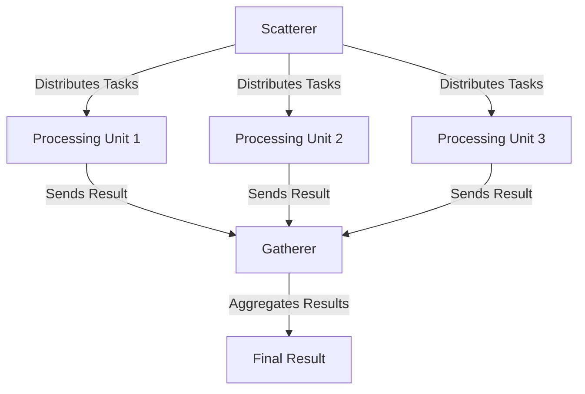

## 10.8. Scatter-Gather Pattern

The Scatter-Gather Pattern is a powerful design pattern used in enterprise integration to handle parallel processing of messages and the subsequent collection of results. This pattern is particularly useful in systems where tasks can be divided into smaller, independent units of work that can be processed concurrently, and the results need to be aggregated for further processing or decision-making.

### Intent

The primary intent of the Scatter-Gather Pattern is to enable parallel processing of tasks by distributing them across multiple processing units and then gathering the results. This pattern helps in improving the efficiency and performance of systems by leveraging concurrency.

### Key Participants

1. **Scatterer**: The component responsible for distributing tasks to multiple processing units.
2. **Processing Units**: These are the components that perform the actual work on the distributed tasks. They operate independently and concurrently.
3. **Gatherer**: The component that collects the results from the processing units and aggregates them for further use.

### Applicability

The Scatter-Gather Pattern is applicable in scenarios where:

- Tasks can be broken down into smaller, independent units.
- Parallel processing can significantly improve performance.
- Results from parallel tasks need to be aggregated for further processing.

### Sample Code Snippets

Let's explore the Scatter-Gather Pattern using pseudocode. We'll demonstrate how to implement a simple system that processes tasks in parallel and gathers the results.

#### Scatterer

The Scatterer is responsible for distributing tasks to multiple processing units.

```pseudocode
function scatter(tasks):
    processingUnits = getAvailableProcessingUnits()
    for task in tasks:
        unit = selectProcessingUnit(processingUnits)
        unit.process(task)
```

#### Processing Units

Each processing unit processes a given task independently.

```pseudocode
class ProcessingUnit:
    function process(task):
        result = performTask(task)
        return result
```

#### Gatherer

The Gatherer collects results from the processing units and aggregates them.

```pseudocode
function gather(results):
    aggregatedResult = aggregateResults(results)
    return aggregatedResult
```

### Design Considerations

- **Concurrency**: Ensure that the system can handle concurrent processing efficiently.
- **Fault Tolerance**: Implement mechanisms to handle failures in processing units.
- **Load Balancing**: Distribute tasks evenly across processing units to avoid bottlenecks.

### Differences and Similarities

The Scatter-Gather Pattern is often compared to the **Fork-Join Pattern**. While both patterns involve parallel processing, the Scatter-Gather Pattern focuses on distributing tasks and collecting results, whereas the Fork-Join Pattern is more about dividing a task into subtasks and then combining the results.

### Visualizing the Scatter-Gather Pattern

Below is a Mermaid.js diagram illustrating the Scatter-Gather Pattern.



### Try It Yourself

To experiment with the Scatter-Gather Pattern, try modifying the pseudocode to:

- Add more processing units.
- Implement a fault tolerance mechanism.
- Optimize the load balancing strategy.

### Real-World Applications

The Scatter-Gather Pattern is widely used in various domains, including:

- **Data Processing**: Distributing data processing tasks across multiple nodes in a cluster.
- **Web Services**: Handling concurrent API requests and aggregating responses.
- **Financial Systems**: Processing transactions in parallel and aggregating results for reporting.

### Knowledge Check

To reinforce your understanding of the Scatter-Gather Pattern, consider the following questions:

1. What are the key components of the Scatter-Gather Pattern?
2. How does the pattern improve system performance?
3. What are some real-world applications of this pattern?

### Conclusion

The Scatter-Gather Pattern is a versatile design pattern that enhances system performance by leveraging parallel processing. By understanding and implementing this pattern, you can build efficient and scalable systems capable of handling complex tasks.

## Quiz Time!



### What is the primary intent of the Scatter-Gather Pattern?

- [x] To enable parallel processing of tasks and gather results.
- [ ] To sequentially process tasks and store results.
- [ ] To distribute tasks without collecting results.
- [ ] To process tasks in a single processing unit.

> **Explanation:** The Scatter-Gather Pattern is designed to distribute tasks for parallel processing and then gather the results for further use.

### Which component is responsible for distributing tasks in the Scatter-Gather Pattern?

- [x] Scatterer
- [ ] Gatherer
- [ ] Processing Unit
- [ ] Aggregator

> **Explanation:** The Scatterer is the component that distributes tasks to multiple processing units.

### What is the role of the Gatherer in the Scatter-Gather Pattern?

- [x] To collect and aggregate results from processing units.
- [ ] To distribute tasks to processing units.
- [ ] To perform tasks independently.
- [ ] To balance the load among processing units.

> **Explanation:** The Gatherer collects results from processing units and aggregates them for further processing.

### How does the Scatter-Gather Pattern improve system performance?

- [x] By enabling parallel processing of tasks.
- [ ] By processing tasks sequentially.
- [ ] By reducing the number of processing units.
- [ ] By eliminating the need for result aggregation.

> **Explanation:** The pattern improves performance by allowing tasks to be processed concurrently across multiple units.

### In which scenarios is the Scatter-Gather Pattern applicable?

- [x] When tasks can be broken down into smaller, independent units.
- [ ] When tasks must be processed sequentially.
- [ ] When results do not need to be aggregated.
- [ ] When only a single processing unit is available.

> **Explanation:** The pattern is applicable when tasks can be divided and processed independently, and results need to be aggregated.

### What is a key consideration when implementing the Scatter-Gather Pattern?

- [x] Ensuring efficient concurrency and load balancing.
- [ ] Minimizing the number of processing units.
- [ ] Avoiding parallel processing.
- [ ] Disabling result aggregation.

> **Explanation:** Efficient concurrency and load balancing are crucial for the successful implementation of the pattern.

### How does the Scatter-Gather Pattern differ from the Fork-Join Pattern?

- [x] Scatter-Gather focuses on distributing tasks and collecting results, while Fork-Join divides tasks into subtasks.
- [ ] Scatter-Gather processes tasks sequentially, while Fork-Join processes them in parallel.
- [ ] Scatter-Gather does not aggregate results, while Fork-Join does.
- [ ] Scatter-Gather uses a single processing unit, while Fork-Join uses multiple units.

> **Explanation:** Scatter-Gather is about task distribution and result collection, whereas Fork-Join focuses on dividing tasks into subtasks.

### What is a real-world application of the Scatter-Gather Pattern?

- [x] Distributing data processing tasks across a cluster.
- [ ] Processing tasks in a single-threaded application.
- [ ] Sequentially executing tasks in a batch process.
- [ ] Storing results without aggregation.

> **Explanation:** The pattern is used in scenarios like distributing data processing tasks across multiple nodes in a cluster.

### Which component performs the actual work on distributed tasks?

- [x] Processing Units
- [ ] Scatterer
- [ ] Gatherer
- [ ] Aggregator

> **Explanation:** Processing Units are responsible for performing the actual work on the distributed tasks.

### True or False: The Scatter-Gather Pattern is only applicable in single-threaded environments.

- [ ] True
- [x] False

> **Explanation:** The Scatter-Gather Pattern is designed for parallel processing and is not limited to single-threaded environments.



Remember, mastering the Scatter-Gather Pattern is just the beginning. As you continue to explore design patterns, you'll discover more ways to optimize and enhance your software systems. Keep experimenting, stay curious, and enjoy the journey!
