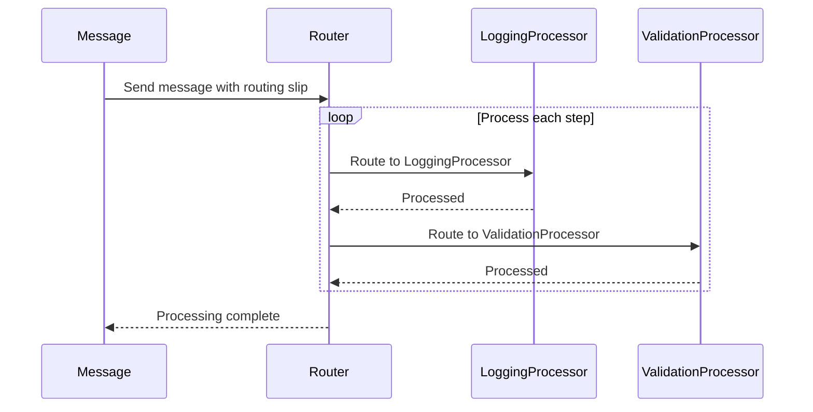

## 10.9. Routing Slip Pattern

In the realm of enterprise integration, the **Routing Slip Pattern** emerges as a powerful solution for defining dynamic routing paths and implementing processing sequences. This pattern is particularly useful in scenarios where messages or tasks need to be processed by a series of components, each performing a specific function, and where the sequence of these components can vary based on the message content or other criteria.

### Design Pattern Name

**Routing Slip Pattern**

### Category

**Enterprise Integration Patterns**

### Intent

The intent of the Routing Slip Pattern is to enable dynamic and flexible routing of messages or tasks through a series of processing steps. Each step in the sequence is determined at runtime, allowing for adaptable workflows that can change based on the context or content of the message.

### Key Participants

1. **Message**: The data or task that needs to be processed.
2. **Routing Slip**: A list or sequence of processing steps that the message must follow.
3. **Processor**: A component that performs a specific operation on the message.
4. **Router**: The mechanism that reads the routing slip and directs the message to the appropriate processor.

### Applicability

The Routing Slip Pattern is applicable in scenarios where:

- The processing sequence of a message can vary based on its content or external conditions.
- There is a need for flexible and dynamic workflows.
- The system must support complex routing logic without hardcoding the paths.

### Sample Code Snippets

Let's dive into some pseudocode examples to illustrate the Routing Slip Pattern. We'll start by defining the basic components: the message, routing slip, and processors.

```pseudocode
// Define a Message class
class Message {
    data: Any
    routingSlip: List<String>
}

// Define a Processor interface
interface Processor {
    process(message: Message): void
}

// Define a Router class
class Router {
    processors: Map<String, Processor>

    route(message: Message): void {
        while not message.routingSlip.isEmpty() {
            step = message.routingSlip.removeFirst()
            processor = processors.get(step)
            if processor is not null {
                processor.process(message)
            } else {
                print("No processor found for step: " + step)
            }
        }
    }
}
```

In this pseudocode, we define a `Message` class that contains the data to be processed and a `routingSlip`, which is a list of processing steps. The `Processor` interface defines a `process` method that each processor must implement. The `Router` class manages the routing of messages by reading the routing slip and directing the message to the appropriate processor.

### Implementing Processing Sequences

To implement processing sequences using the Routing Slip Pattern, we need to define specific processors and a mechanism to populate the routing slip based on the message content.

```pseudocode
// Define specific processors
class LoggingProcessor implements Processor {
    process(message: Message): void {
        print("Logging message: " + message.data)
    }
}

class ValidationProcessor implements Processor {
    process(message: Message): void {
        if isValid(message.data) {
            print("Message is valid")
        } else {
            print("Message is invalid")
        }
    }
}

// Example of setting up a routing slip
function setupRoutingSlip(message: Message): void {
    if message.data.contains("log") {
        message.routingSlip.add("LoggingProcessor")
    }
    if message.data.contains("validate") {
        message.routingSlip.add("ValidationProcessor")
    }
}

// Example usage
message = new Message(data: "log and validate this message")
setupRoutingSlip(message)

router = new Router(processors: {
    "LoggingProcessor": new LoggingProcessor(),
    "ValidationProcessor": new ValidationProcessor()
})

router.route(message)
```

In this example, we define two specific processors: `LoggingProcessor` and `ValidationProcessor`. We also provide a `setupRoutingSlip` function that populates the routing slip based on the message content. The `Router` then processes the message according to the routing slip.

### Visualizing the Routing Slip Pattern

To better understand the flow of the Routing Slip Pattern, let's visualize it using a sequence diagram.



**Figure 1: Sequence Diagram of the Routing Slip Pattern**

This diagram illustrates the flow of a message through the routing slip. The message is sent to the router, which processes each step in the routing slip by directing the message to the appropriate processor.

### Design Considerations

When implementing the Routing Slip Pattern, consider the following:

- **Error Handling**: Ensure that the system can handle errors gracefully, such as when a processor is not found or when processing fails.
- **Performance**: Be mindful of the performance implications of dynamic routing, especially in high-throughput systems.
- **Scalability**: Design the system to scale horizontally by distributing processors across multiple nodes or services.
- **Security**: Ensure that the routing slip cannot be tampered with, as this could lead to unauthorized processing steps.

### Differences and Similarities

The Routing Slip Pattern is often compared to the **Process Manager Pattern**. While both patterns involve directing messages through a series of processing steps, the Routing Slip Pattern focuses on dynamic routing based on the message content, whereas the Process Manager Pattern typically involves more complex state management and orchestration.

### Try It Yourself

To gain a deeper understanding of the Routing Slip Pattern, try modifying the pseudocode examples:

- Add new processors that perform different operations on the message.
- Implement conditional logic in the `setupRoutingSlip` function to create more complex routing paths.
- Experiment with error handling by introducing scenarios where a processor might fail.

### References and Links

For further reading on the Routing Slip Pattern and related concepts, consider the following resources:

- [Enterprise Integration Patterns](https://www.enterpriseintegrationpatterns.com/)
- [Message Routing Patterns](https://www.enterpriseintegrationpatterns.com/patterns/messaging/MessageRouter.html)

### Knowledge Check

To reinforce your understanding of the Routing Slip Pattern, consider the following questions and exercises:

1. What are the key components of the Routing Slip Pattern?
2. How does the Routing Slip Pattern enable dynamic routing?
3. What are some potential challenges when implementing the Routing Slip Pattern?
4. Modify the pseudocode to include error handling for missing processors.
5. Create a new processor that transforms the message data in some way.

### Embrace the Journey

Remember, mastering design patterns is a journey. The Routing Slip Pattern is just one of many tools in your software design toolkit. As you continue to explore and experiment with different patterns, you'll gain a deeper understanding of how to build flexible, scalable, and maintainable systems. Keep experimenting, stay curious, and enjoy the journey!

## Quiz Time!



### What is the primary intent of the Routing Slip Pattern?

- [x] To enable dynamic and flexible routing of messages through a series of processing steps.
- [ ] To statically define a fixed sequence of processing steps for messages.
- [ ] To manage state transitions in a workflow.
- [ ] To provide a centralized point for message processing.

> **Explanation:** The Routing Slip Pattern is designed to allow dynamic routing of messages through various processing steps based on runtime conditions.

### Which component in the Routing Slip Pattern is responsible for directing messages to the appropriate processor?

- [ ] Message
- [x] Router
- [ ] Processor
- [ ] Routing Slip

> **Explanation:** The Router reads the routing slip and directs the message to the appropriate processor.

### What is a key benefit of using the Routing Slip Pattern?

- [x] It allows for adaptable workflows that can change based on the context or content of the message.
- [ ] It simplifies the implementation of static workflows.
- [ ] It reduces the need for error handling.
- [ ] It eliminates the need for message validation.

> **Explanation:** The Routing Slip Pattern provides flexibility by allowing the processing sequence to be determined at runtime.

### How does the Routing Slip Pattern differ from the Process Manager Pattern?

- [x] The Routing Slip Pattern focuses on dynamic routing based on message content, while the Process Manager Pattern involves complex state management.
- [ ] The Routing Slip Pattern is used for static routing, while the Process Manager Pattern is for dynamic routing.
- [ ] The Routing Slip Pattern is only applicable in synchronous systems.
- [ ] The Process Manager Pattern does not involve routing messages.

> **Explanation:** The Routing Slip Pattern is about dynamic routing, whereas the Process Manager Pattern handles state management and orchestration.

### What should be considered when implementing the Routing Slip Pattern?

- [x] Error handling, performance, scalability, and security.
- [ ] Only error handling.
- [ ] Only performance.
- [ ] Only scalability.

> **Explanation:** Implementing the Routing Slip Pattern requires careful consideration of error handling, performance, scalability, and security.

### In the pseudocode example, what does the `setupRoutingSlip` function do?

- [x] It populates the routing slip based on the message content.
- [ ] It processes the message.
- [ ] It validates the message.
- [ ] It logs the message data.

> **Explanation:** The `setupRoutingSlip` function determines the processing steps by analyzing the message content.

### Which of the following is NOT a key participant in the Routing Slip Pattern?

- [ ] Message
- [ ] Routing Slip
- [ ] Processor
- [x] State Manager

> **Explanation:** The State Manager is not a component of the Routing Slip Pattern.

### What is the role of the Processor in the Routing Slip Pattern?

- [x] To perform a specific operation on the message.
- [ ] To route the message to the next step.
- [ ] To manage the routing slip.
- [ ] To validate the routing slip.

> **Explanation:** The Processor is responsible for executing a specific task on the message.

### True or False: The Routing Slip Pattern can be used to implement static workflows.

- [ ] True
- [x] False

> **Explanation:** The Routing Slip Pattern is intended for dynamic workflows where the sequence can change based on conditions.

### What is a potential challenge when using the Routing Slip Pattern?

- [x] Managing complex routing logic without hardcoding paths.
- [ ] Ensuring messages are processed in a fixed order.
- [ ] Reducing the number of processing steps.
- [ ] Eliminating the need for message validation.

> **Explanation:** One challenge is handling complex routing logic dynamically without hardcoding the paths.


