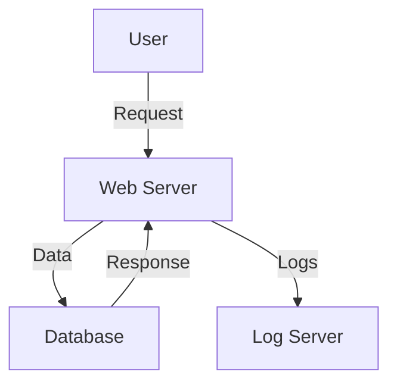
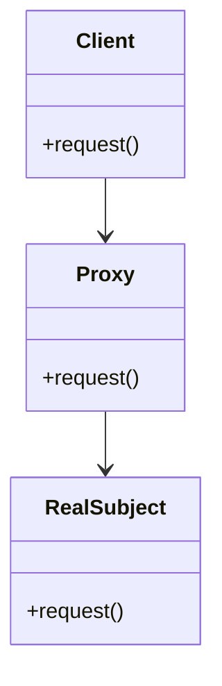

## 11.1. Introduction to Security Patterns

In today's digital landscape, security is paramount. As software engineers and architects, we must design systems that are not only functional and efficient but also secure against a myriad of threats. Security patterns provide a structured approach to achieving this goal. In this section, we will delve into the principles of secure design and the process of threat modeling, two foundational aspects of implementing security patterns effectively.

### Principles of Secure Design

Security patterns are built upon a set of core principles that guide the development of secure systems. These principles help ensure that security is not an afterthought but an integral part of the design process. Let's explore these principles in detail:

#### 1. **Least Privilege**

The principle of least privilege dictates that a system should grant users and processes the minimum level of access necessary to perform their functions. This minimizes the potential damage from accidental or malicious actions.

**Example Pseudocode:**

```pseudocode
// Define a function that grants access based on role
function grantAccess(userRole):
    if userRole == "admin":
        return "full access"
    elif userRole == "editor":
        return "edit access"
    elif userRole == "viewer":
        return "read-only access"
    else:
        return "no access"
```

#### 2. **Defense in Depth**

This principle involves implementing multiple layers of security controls throughout a system. If one layer is breached, others remain to protect the system.

**Example Pseudocode:**

```pseudocode
// Function to authenticate user with multiple checks
function authenticateUser(username, password, otp):
    if checkPassword(username, password):
        if checkOTP(username, otp):
            return "authenticated"
    return "authentication failed"
```

#### 3. **Fail-Safe Defaults**

Systems should default to a secure state in the event of a failure. This means denying access unless explicitly granted.

**Example Pseudocode:**

```pseudocode
// Function to handle access requests with fail-safe defaults
function requestAccess(user):
    if user.isAuthenticated():
        return "access granted"
    return "access denied"
```

#### 4. **Economy of Mechanism**

Security mechanisms should be as simple as possible. Complexity increases the likelihood of errors, which can lead to vulnerabilities.

**Example Pseudocode:**

```pseudocode
// Simple function to validate input
function validateInput(input):
    return input.isAlphanumeric()
```

#### 5. **Complete Mediation**

Every access to a resource should be checked for authorization. This ensures that permissions are enforced consistently.

**Example Pseudocode:**

```pseudocode
// Function to check access for every request
function checkAccess(resource, user):
    if hasPermission(resource, user):
        return "access allowed"
    return "access denied"
```

#### 6. **Open Design**

Security should not depend on the secrecy of the design or implementation. Instead, it should rely on the strength of the mechanisms themselves.

#### 7. **Separation of Privilege**

This principle involves using multiple independent conditions to grant access. It reduces the risk of a single point of failure.

**Example Pseudocode:**

```pseudocode
// Function requiring multiple conditions for access
function secureAccess(user, token):
    if user.isAuthenticated() and token.isValid():
        return "access granted"
    return "access denied"
```

#### 8. **Least Common Mechanism**

Minimize the sharing of mechanisms across different users or processes to reduce the risk of information leakage.

#### 9. **Psychological Acceptability**

Security mechanisms should not make the system difficult to use. Usability should be balanced with security.

### Threat Modeling

Threat modeling is a process used to identify, assess, and address potential security threats to a system. It helps in understanding the attack surface and devising strategies to mitigate risks. Let's break down the threat modeling process:

#### 1. **Identify Assets**

Determine what needs protection, such as data, processes, and system components.

#### 2. **Create an Architecture Overview**

Develop a high-level diagram of the system architecture to understand data flow and interactions.



#### 3. **Decompose the Application**

Break down the system into smaller components to analyze each part's security requirements.

#### 4. **Identify Threats**

Use frameworks like STRIDE (Spoofing, Tampering, Repudiation, Information Disclosure, Denial of Service, Elevation of Privilege) to identify potential threats.

#### 5. **Document Threats**

Create a threat list with details on each threat, including potential impact and likelihood.

#### 6. **Rate Threats**

Assess the severity of each threat based on its potential impact and likelihood of occurrence.

#### 7. **Mitigate Threats**

Develop strategies to address identified threats, such as implementing security controls or redesigning vulnerable components.

### Sample Threat Model

Let's consider a simple web application and apply threat modeling to it.

#### Architecture Overview

The application consists of a web server, a database, and a log server. Users interact with the web server, which communicates with the database and logs activities.

#### Threat Identification

Using the STRIDE framework, we identify the following threats:

- **Spoofing:** An attacker impersonates a legitimate user.
- **Tampering:** Data is altered during transmission between the web server and database.
- **Repudiation:** Users deny their actions, such as deleting records.
- **Information Disclosure:** Sensitive data is exposed to unauthorized users.
- **Denial of Service:** The web server is overwhelmed with requests, causing downtime.
- **Elevation of Privilege:** An attacker gains higher access rights than intended.

#### Mitigation Strategies

- **Authentication and Authorization:** Implement strong authentication mechanisms to prevent spoofing and elevation of privilege.
- **Data Encryption:** Use encryption to protect data in transit, mitigating tampering and information disclosure.
- **Logging and Monitoring:** Maintain detailed logs and monitor for suspicious activities to address repudiation and denial of service.
- **Rate Limiting:** Implement rate limiting to prevent denial of service attacks.

### Try It Yourself

Experiment with the pseudocode examples provided by modifying them to fit different scenarios. For instance, try implementing a more complex authentication mechanism that includes biometric verification. Consider how the principles of secure design can be applied to enhance the security of your own projects.

### Visualizing Security Patterns

To better understand how security patterns fit into the overall architecture of a system, let's visualize a common security pattern: the **Security Proxy**.



**Diagram Description:** The diagram illustrates the Security Proxy pattern, where the client interacts with a proxy instead of directly with the real subject. The proxy controls access and can implement additional security checks.

### References and Further Reading

- [OWASP Security Principles](https://owasp.org/www-project-top-ten/)
- [NIST Cybersecurity Framework](https://www.nist.gov/cyberframework)
- [Microsoft Threat Modeling Tool](https://www.microsoft.com/en-us/securityengineering/sdl/threatmodeling)

### Knowledge Check

To reinforce your understanding, consider the following questions:

1. How does the principle of least privilege enhance security?
2. What is the purpose of threat modeling in secure design?
3. How can the STRIDE framework be used to identify threats?
4. Why is it important to document and rate threats?
5. What are some common mitigation strategies for security threats?

### Summary

In this section, we've explored the foundational principles of secure design and the process of threat modeling. By understanding and applying these concepts, we can create systems that are resilient against a wide range of security threats. Remember, security is an ongoing process that requires continuous evaluation and adaptation. As you continue your journey in mastering design patterns, keep security at the forefront of your design considerations.

## Quiz Time!



### Which principle involves granting users the minimum level of access necessary?

- [x] Least Privilege
- [ ] Defense in Depth
- [ ] Fail-Safe Defaults
- [ ] Economy of Mechanism

> **Explanation:** The principle of least privilege ensures that users and processes have only the access necessary to perform their tasks, minimizing potential damage from misuse.


### What is the purpose of threat modeling?

- [x] To identify, assess, and address potential security threats
- [ ] To design user interfaces
- [ ] To optimize database queries
- [ ] To improve application performance

> **Explanation:** Threat modeling is used to identify, assess, and address potential security threats to a system, helping to understand the attack surface and mitigate risks.


### Which framework is used to identify potential threats in threat modeling?

- [x] STRIDE
- [ ] MVC
- [ ] SOLID
- [ ] REST

> **Explanation:** The STRIDE framework is used in threat modeling to identify potential threats such as Spoofing, Tampering, Repudiation, Information Disclosure, Denial of Service, and Elevation of Privilege.


### What does the principle of defense in depth involve?

- [x] Implementing multiple layers of security controls
- [ ] Granting full access to all users
- [ ] Relying on a single security mechanism
- [ ] Keeping security mechanisms secret

> **Explanation:** Defense in depth involves implementing multiple layers of security controls throughout a system to protect against breaches.


### Why is it important to document and rate threats?

- [x] To assess their severity and prioritize mitigation strategies
- [ ] To increase the complexity of the system
- [ ] To reduce the number of security controls
- [ ] To simplify the threat modeling process

> **Explanation:** Documenting and rating threats helps assess their severity and prioritize mitigation strategies, ensuring that the most critical threats are addressed first.


### What is a common mitigation strategy for denial of service attacks?

- [x] Rate Limiting
- [ ] Increasing user privileges
- [ ] Disabling logging
- [ ] Reducing encryption

> **Explanation:** Rate limiting is a common mitigation strategy for denial of service attacks, as it helps prevent the server from being overwhelmed with requests.


### Which principle emphasizes the simplicity of security mechanisms?

- [x] Economy of Mechanism
- [ ] Separation of Privilege
- [ ] Complete Mediation
- [ ] Open Design

> **Explanation:** The principle of economy of mechanism emphasizes that security mechanisms should be as simple as possible to reduce the likelihood of errors and vulnerabilities.


### What is the role of a security proxy in a system?

- [x] To control access and implement security checks
- [ ] To store user data
- [ ] To execute database queries
- [ ] To manage user interfaces

> **Explanation:** A security proxy controls access and can implement additional security checks, acting as an intermediary between the client and the real subject.


### Which principle involves using multiple independent conditions to grant access?

- [x] Separation of Privilege
- [ ] Least Common Mechanism
- [ ] Psychological Acceptability
- [ ] Open Design

> **Explanation:** The principle of separation of privilege involves using multiple independent conditions to grant access, reducing the risk of a single point of failure.


### True or False: Security should depend on the secrecy of the design.

- [ ] True
- [x] False

> **Explanation:** Security should not depend on the secrecy of the design. Instead, it should rely on the strength of the mechanisms themselves, following the principle of open design.


