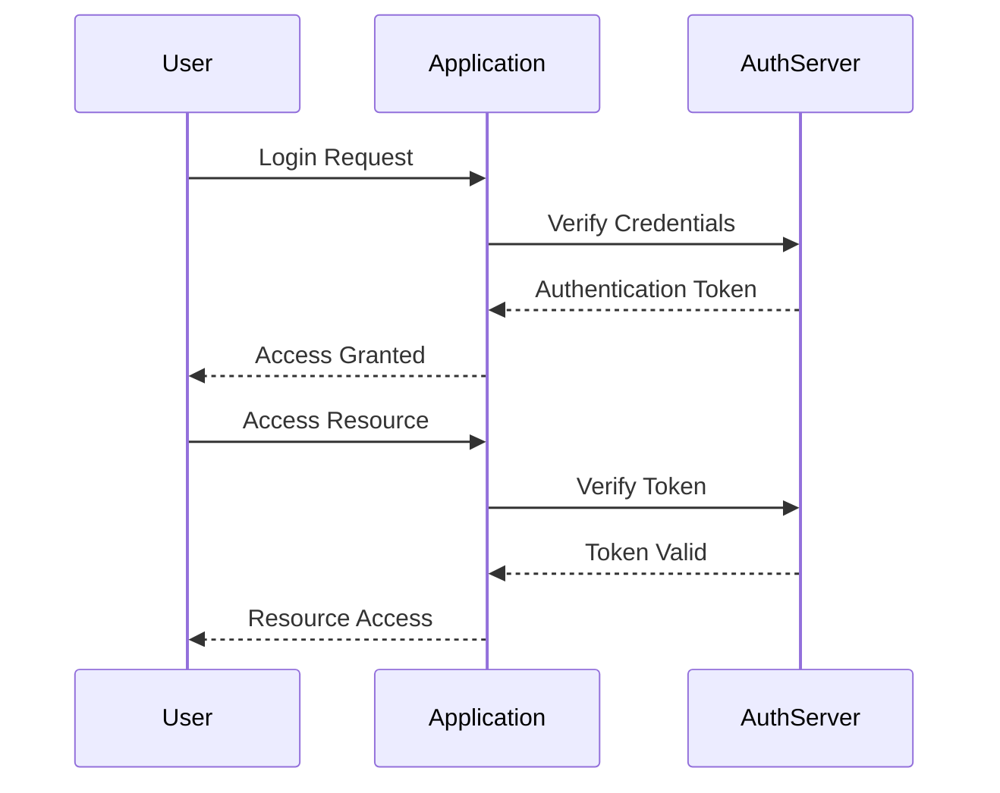

## 11.2. Authentication and Authorization Patterns

In today's interconnected world, ensuring secure access to software systems is more critical than ever. Authentication and authorization are foundational components of secure software design, providing mechanisms to verify user identities and control access to resources. This section delves into the patterns and practices that underpin these processes, equipping you with the knowledge to implement robust security measures in your applications.

### Introduction to Authentication and Authorization

**Authentication** is the process of verifying the identity of a user or system. It answers the question, "Who are you?" Common methods include passwords, biometrics, and multi-factor authentication (MFA).

**Authorization**, on the other hand, determines what an authenticated user is allowed to do. It answers the question, "What can you do?" Authorization is typically enforced through access control lists (ACLs), role-based access control (RBAC), or attribute-based access control (ABAC).

Together, these processes form the backbone of secure access control, ensuring that only authorized users can access specific resources or perform certain actions.

### Key Concepts and Terminology

Before diving into specific patterns, let's clarify some key terms:

- **Identity Provider (IdP):** A service that creates, maintains, and manages identity information for users.
- **Access Token:** A token that grants access to specific resources, often used in OAuth and similar protocols.
- **Claims:** Assertions about an entity (e.g., user attributes) used in token-based authentication.
- **Principals:** Entities that can be authenticated, such as users or services.

### Authentication Patterns

Authentication patterns are strategies used to verify the identity of users or systems. Below, we explore several common patterns, each with its unique benefits and use cases.

#### 1. Basic Authentication

**Intent:** Basic Authentication is a simple authentication scheme built into the HTTP protocol. It transmits credentials as user ID/password pairs, encoded using Base64.

**Applicability:** Use Basic Authentication for simple applications where security requirements are minimal. It is not recommended for sensitive data without additional security measures like HTTPS.

**Pseudocode Example:**

```pseudocode
function authenticate(request):
    credentials = request.getHeader("Authorization")
    if credentials is None:
        return False
    decodedCredentials = base64Decode(credentials)
    username, password = decodedCredentials.split(":")
    return verifyCredentials(username, password)

function verifyCredentials(username, password):
    // Check against stored credentials
    storedPassword = getPasswordForUser(username)
    return password == storedPassword
```

**Design Considerations:** Basic Authentication should always be used over HTTPS to protect credentials from being intercepted. Consider using more secure alternatives for sensitive applications.

#### 2. Token-Based Authentication

**Intent:** Token-Based Authentication involves issuing a token to a user upon successful login, which is then used for subsequent requests. This pattern is commonly used in RESTful APIs.

**Applicability:** Suitable for stateless applications and microservices architectures where scalability and decoupling are priorities.

**Pseudocode Example:**

```pseudocode
function login(username, password):
    if verifyCredentials(username, password):
        token = generateToken(username)
        return token
    else:
        return "Invalid credentials"

function authenticate(request):
    token = request.getHeader("Authorization")
    if token is None:
        return False
    return verifyToken(token)

function verifyToken(token):
    // Decode and validate token
    payload = decodeToken(token)
    return payload is not None and not isTokenExpired(payload)
```

**Design Considerations:** Ensure tokens are securely generated and stored. Consider using JWT (JSON Web Tokens) for a standardized token format.

#### 3. Multi-Factor Authentication (MFA)

**Intent:** MFA adds an extra layer of security by requiring two or more verification factors. These factors can include something you know (password), something you have (smartphone), or something you are (biometric).

**Applicability:** Use MFA for applications requiring high security, such as financial services or sensitive data access.

**Pseudocode Example:**

```pseudocode
function authenticate(username, password, secondFactor):
    if not verifyCredentials(username, password):
        return "Invalid credentials"
    if not verifySecondFactor(username, secondFactor):
        return "Second factor verification failed"
    return "Authentication successful"

function verifySecondFactor(username, secondFactor):
    // Check second factor (e.g., OTP)
    expectedFactor = getExpectedSecondFactor(username)
    return secondFactor == expectedFactor
```

**Design Considerations:** Ensure the second factor is secure and user-friendly. Consider using time-based one-time passwords (TOTP) or push notifications for verification.

### Authorization Patterns

Authorization patterns determine what authenticated users can do within a system. These patterns help enforce access control and ensure users have appropriate permissions.

#### 1. Role-Based Access Control (RBAC)

**Intent:** RBAC assigns permissions to roles rather than individual users. Users are then assigned roles, simplifying permission management.

**Applicability:** Use RBAC in systems with well-defined roles and permissions, such as enterprise applications.

**Pseudocode Example:**

```pseudocode
function checkAccess(user, resource, action):
    roles = getUserRoles(user)
    for role in roles:
        if hasPermission(role, resource, action):
            return True
    return False

function hasPermission(role, resource, action):
    permissions = getPermissionsForRole(role)
    return (resource, action) in permissions
```

**Design Considerations:** Define roles and permissions clearly. Avoid role explosion by keeping the number of roles manageable.

#### 2. Attribute-Based Access Control (ABAC)

**Intent:** ABAC grants access based on attributes of the user, resource, and environment. It provides fine-grained access control.

**Applicability:** Use ABAC for complex systems where access decisions depend on multiple attributes.

**Pseudocode Example:**

```pseudocode
function checkAccess(user, resource, action, context):
    userAttributes = getUserAttributes(user)
    resourceAttributes = getResourceAttributes(resource)
    contextAttributes = getContextAttributes(context)
    return evaluatePolicy(userAttributes, resourceAttributes, contextAttributes, action)

function evaluatePolicy(userAttributes, resourceAttributes, contextAttributes, action):
    // Evaluate access policy based on attributes
    return policyEngine.evaluate(userAttributes, resourceAttributes, contextAttributes, action)
```

**Design Considerations:** Ensure policies are well-defined and manageable. Use a policy engine to evaluate complex attribute-based rules.

#### 3. Access Control Lists (ACLs)

**Intent:** ACLs specify which users or system processes are granted access to objects, as well as what operations are allowed on given objects.

**Applicability:** Use ACLs for systems where access control needs to be specified at the level of individual resources.

**Pseudocode Example:**

```pseudocode
function checkAccess(user, resource, action):
    acl = getAclForResource(resource)
    if user in acl and action in acl[user]:
        return True
    return False
```

**Design Considerations:** Manage ACLs carefully to avoid complexity. Consider using ACLs in conjunction with other access control mechanisms for flexibility.

### Visualizing Authentication and Authorization

To better understand the interaction between authentication and authorization, let's visualize the process using a sequence diagram.



**Diagram Description:** This sequence diagram illustrates the typical flow of authentication and authorization. The user initiates a login request, which is verified by the authentication server. Upon successful authentication, an access token is issued. The user can then access resources by presenting the token, which is verified by the server.

### Try It Yourself

To deepen your understanding, try modifying the pseudocode examples provided:

1. **Enhance Token-Based Authentication:** Implement token expiration and refresh mechanisms.
2. **Experiment with RBAC:** Create a new role and assign specific permissions to it. Test how it affects access control.
3. **Explore ABAC:** Add new attributes to the policy engine and observe how they influence access decisions.

### Key Takeaways

- **Authentication** and **authorization** are critical components of secure software design.
- **Basic Authentication** is simple but should be used with caution due to security concerns.
- **Token-Based Authentication** is ideal for stateless applications and microservices.
- **Multi-Factor Authentication** enhances security by requiring additional verification factors.
- **Role-Based Access Control** simplifies permission management through roles.
- **Attribute-Based Access Control** provides fine-grained access control based on attributes.
- **Access Control Lists** offer resource-specific access control but can become complex.

### Further Reading

For more in-depth information on authentication and authorization, consider exploring the following resources:

- [OAuth 2.0](https://oauth.net/2/)
- [OpenID Connect](https://openid.net/connect/)
- [JSON Web Tokens (JWT)](https://jwt.io/)
- [NIST Digital Identity Guidelines](https://pages.nist.gov/800-63-3/)

## Quiz Time!



### What is the primary purpose of authentication in software systems?

- [x] To verify the identity of a user or system
- [ ] To determine what resources a user can access
- [ ] To encrypt data during transmission
- [ ] To log user activities

> **Explanation:** Authentication verifies the identity of a user or system, ensuring that they are who they claim to be.

### Which authentication pattern is most suitable for stateless applications?

- [x] Token-Based Authentication
- [ ] Basic Authentication
- [ ] Multi-Factor Authentication
- [ ] Password-Based Authentication

> **Explanation:** Token-Based Authentication is ideal for stateless applications as it allows for scalable and decoupled architectures.

### What does RBAC stand for?

- [x] Role-Based Access Control
- [ ] Resource-Based Access Control
- [ ] Rule-Based Access Control
- [ ] Role-Bound Access Control

> **Explanation:** RBAC stands for Role-Based Access Control, a pattern that assigns permissions to roles rather than individual users.

### In ABAC, what are access decisions based on?

- [x] Attributes of the user, resource, and environment
- [ ] Roles assigned to the user
- [ ] Access control lists
- [ ] User credentials

> **Explanation:** ABAC (Attribute-Based Access Control) makes access decisions based on attributes of the user, resource, and environment.

### What is a common method used in Multi-Factor Authentication?

- [x] Time-based One-Time Password (TOTP)
- [ ] Base64 Encoding
- [ ] JSON Web Tokens (JWT)
- [ ] Access Control Lists (ACLs)

> **Explanation:** Time-based One-Time Password (TOTP) is a common method used in Multi-Factor Authentication to provide an additional layer of security.

### What is the role of an Identity Provider (IdP) in authentication?

- [x] To create, maintain, and manage identity information for users
- [ ] To encrypt data during transmission
- [ ] To authorize access to resources
- [ ] To store user passwords

> **Explanation:** An Identity Provider (IdP) is responsible for creating, maintaining, and managing identity information for users.

### Which pattern is used to specify access control at the level of individual resources?

- [x] Access Control Lists (ACLs)
- [ ] Role-Based Access Control (RBAC)
- [ ] Attribute-Based Access Control (ABAC)
- [ ] Token-Based Authentication

> **Explanation:** Access Control Lists (ACLs) specify which users or system processes are granted access to objects and what operations are allowed on them.

### What is a key benefit of using Role-Based Access Control (RBAC)?

- [x] Simplifies permission management through roles
- [ ] Provides fine-grained access control
- [ ] Requires multiple verification factors
- [ ] Encrypts user credentials

> **Explanation:** Role-Based Access Control (RBAC) simplifies permission management by assigning permissions to roles rather than individual users.

### Which of the following is NOT a factor used in Multi-Factor Authentication?

- [x] User's favorite color
- [ ] Password
- [ ] Smartphone
- [ ] Biometric

> **Explanation:** Multi-Factor Authentication typically involves something you know (password), something you have (smartphone), or something you are (biometric), but not subjective factors like a user's favorite color.

### True or False: Access tokens should be securely generated and stored.

- [x] True
- [ ] False

> **Explanation:** Access tokens should be securely generated and stored to prevent unauthorized access and ensure the integrity of the authentication process.



Remember, mastering authentication and authorization patterns is a journey. By understanding these patterns and applying them thoughtfully, you can build secure and robust software systems. Keep exploring, experimenting, and enhancing your skills!
