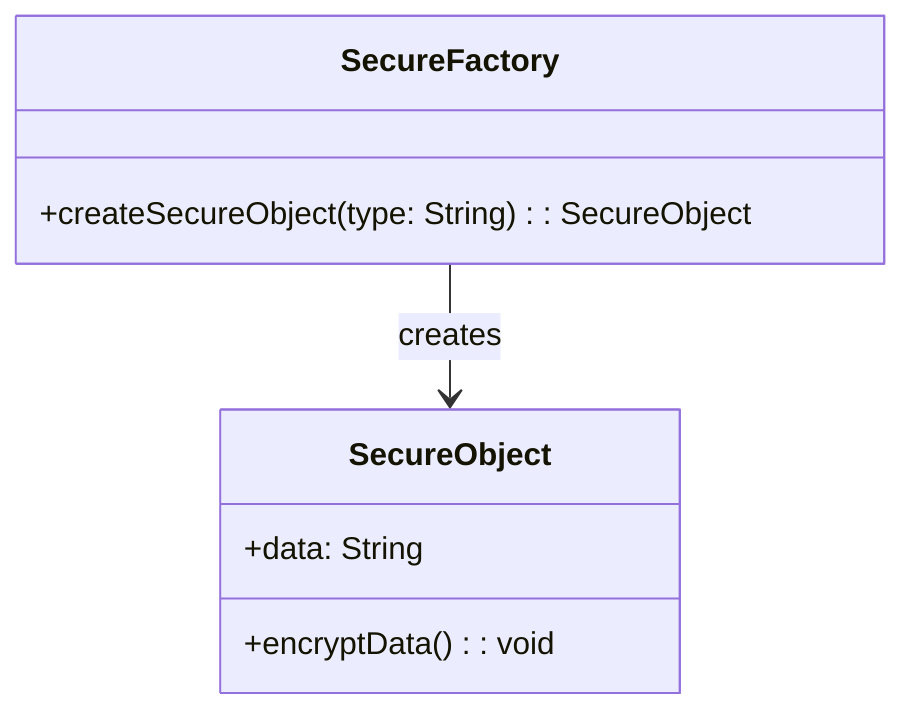
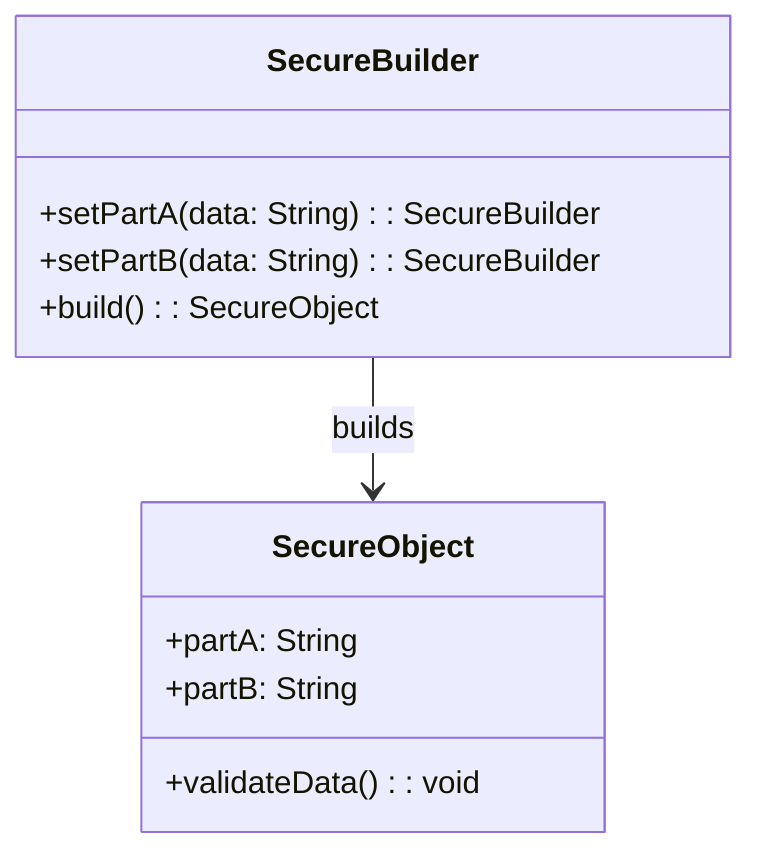
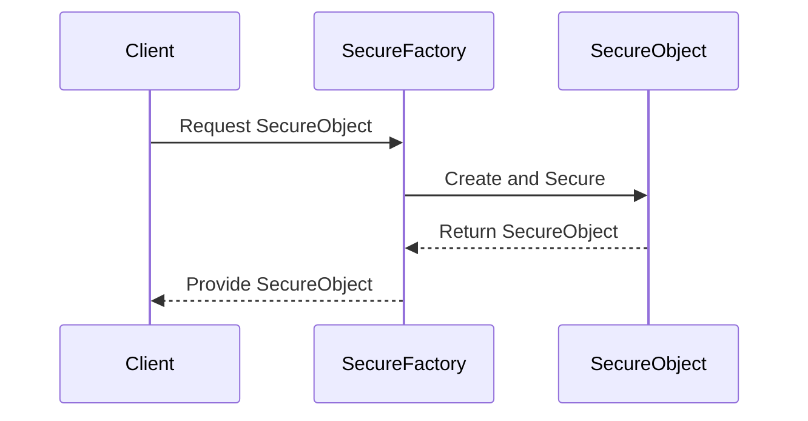

## 11.3. Secure Factory and Builder Patterns

In the realm of software design, ensuring the secure creation of objects is paramount, especially when dealing with sensitive information. The Secure Factory and Builder Patterns provide robust solutions to these challenges. This section delves into these patterns, offering insights into their implementation, benefits, and best practices.

### Design Pattern Name: Secure Factory Pattern

#### Category
Creational Pattern

#### Intent
The Secure Factory Pattern aims to encapsulate the creation logic of objects, ensuring that sensitive information is handled securely during the instantiation process. It provides a centralized approach to object creation, allowing for enhanced security measures such as input validation, encryption, and access control.

#### Diagrams



*Caption: A class diagram illustrating the relationship between SecureFactory and SecureObject.*

#### Key Participants
- **SecureFactory**: The central entity responsible for creating secure objects. It implements security measures during the creation process.
- **SecureObject**: The product created by the factory, which contains sensitive information that needs protection.

#### Applicability
Use the Secure Factory Pattern when:
- You need to centralize the creation of objects that handle sensitive data.
- Security measures such as encryption or validation are required during object instantiation.
- You want to enforce consistent security policies across different types of objects.

#### Sample Code Snippets

```pseudocode
class SecureFactory {
    method createSecureObject(type) {
        if (type == "Sensitive") {
            object = new SecureObject()
            object.encryptData()
            return object
        }
        // Handle other types
    }
}

class SecureObject {
    var data

    method encryptData() {
        // Implement encryption logic
    }
}

// Usage
factory = new SecureFactory()
secureObject = factory.createSecureObject("Sensitive")
```

*Caption: Pseudocode demonstrating the Secure Factory Pattern.*

#### Design Considerations
- **Security**: Ensure that the factory implements robust security measures, such as encryption and validation, to protect sensitive data.
- **Scalability**: Design the factory to handle the creation of various object types without compromising security.
- **Maintainability**: Keep the factory code modular and easy to update with new security protocols.

#### Differences and Similarities
- **Similar to the Factory Method Pattern**, the Secure Factory Pattern centralizes object creation but with a focus on security.
- **Differs from the Builder Pattern**, which focuses on constructing complex objects step-by-step.

### Design Pattern Name: Secure Builder Pattern

#### Category
Creational Pattern

#### Intent
The Secure Builder Pattern is designed to construct complex objects securely by separating the construction process from the representation. It allows for the step-by-step creation of objects while ensuring that each step adheres to security protocols.

#### Diagrams



*Caption: A class diagram illustrating the relationship between SecureBuilder and SecureObject.*

#### Key Participants
- **SecureBuilder**: Responsible for constructing the object in a secure manner, ensuring each part is validated and secure.
- **SecureObject**: The final product, composed of various secure parts.

#### Applicability
Use the Secure Builder Pattern when:
- You need to construct complex objects with multiple parts, each requiring security validation.
- The construction process involves multiple steps that must adhere to security protocols.
- Flexibility in object creation is needed, allowing for different configurations.

#### Sample Code Snippets

```pseudocode
class SecureBuilder {
    var partA
    var partB

    method setPartA(data) {
        // Validate and secure data
        this.partA = data
        return this
    }

    method setPartB(data) {
        // Validate and secure data
        this.partB = data
        return this
    }

    method build() {
        object = new SecureObject()
        object.partA = this.partA
        object.partB = this.partB
        object.validateData()
        return object
    }
}

class SecureObject {
    var partA
    var partB

    method validateData() {
        // Implement validation logic
    }
}

// Usage
builder = new SecureBuilder()
secureObject = builder.setPartA("DataA").setPartB("DataB").build()
```

*Caption: Pseudocode demonstrating the Secure Builder Pattern.*

#### Design Considerations
- **Security**: Each step in the builder should incorporate security checks to ensure data integrity.
- **Flexibility**: Allow for various configurations while maintaining security standards.
- **Complexity**: Manage the complexity of building secure objects without compromising usability.

#### Differences and Similarities
- **Similar to the Builder Pattern**, the Secure Builder Pattern constructs objects step-by-step but emphasizes security at each step.
- **Differs from the Secure Factory Pattern**, which centralizes the creation process without the step-by-step construction.

### Ensuring Safe Object Creation

The Secure Factory and Builder Patterns are instrumental in ensuring safe object creation. By centralizing and securing the creation process, these patterns help prevent common security vulnerabilities such as data leaks and unauthorized access.

#### Managing Sensitive Information

Handling sensitive information requires careful consideration of security measures. Both patterns provide mechanisms to manage sensitive data securely, ensuring that objects are created with the necessary protections in place.

### Try It Yourself

To deepen your understanding, try modifying the pseudocode examples:
- **Experiment with different security measures**: Implement additional security protocols such as hashing or access control in the Secure Factory or Builder.
- **Create new object types**: Extend the patterns to handle different types of secure objects, ensuring each type adheres to security standards.
- **Integrate with existing systems**: Adapt the patterns to work within your current software architecture, focusing on enhancing security.

### Visualizing Secure Object Creation



*Caption: A sequence diagram illustrating the process of secure object creation using the Secure Factory Pattern.*

### Knowledge Check

- **Why is centralizing object creation important for security?**
- **What are the key differences between the Secure Factory and Builder Patterns?**
- **How can you enhance the security of the Builder Pattern?**

### Embrace the Journey

Remember, mastering these patterns is just the beginning. As you continue to explore design patterns, you'll discover new ways to enhance security and efficiency in your software designs. Keep experimenting, stay curious, and enjoy the journey!

### References and Links

- [Design Patterns: Elements of Reusable Object-Oriented Software](https://en.wikipedia.org/wiki/Design_Patterns) by Erich Gamma, Richard Helm, Ralph Johnson, and John Vlissides
- [Secure Coding Guidelines](https://owasp.org/www-project-secure-coding-practices-quick-reference-guide/) by OWASP

## Quiz Time!



### What is the primary intent of the Secure Factory Pattern?

- [x] To encapsulate the creation logic of objects with security measures
- [ ] To build complex objects step-by-step
- [ ] To manage object lifecycles
- [ ] To facilitate object cloning

> **Explanation:** The Secure Factory Pattern focuses on encapsulating the creation logic of objects while implementing security measures.

### Which participant in the Secure Factory Pattern is responsible for creating secure objects?

- [x] SecureFactory
- [ ] SecureObject
- [ ] Client
- [ ] SecurityManager

> **Explanation:** The SecureFactory is responsible for creating secure objects, implementing necessary security measures.

### How does the Secure Builder Pattern differ from the Secure Factory Pattern?

- [x] It constructs objects step-by-step with security checks at each step
- [ ] It centralizes object creation
- [ ] It focuses on object cloning
- [ ] It manages object lifecycles

> **Explanation:** The Secure Builder Pattern constructs objects step-by-step, ensuring security checks at each stage.

### What is a key consideration when implementing the Secure Factory Pattern?

- [x] Ensuring robust security measures during object creation
- [ ] Allowing for object cloning
- [ ] Managing object lifecycles
- [ ] Facilitating object serialization

> **Explanation:** Ensuring robust security measures during object creation is crucial for the Secure Factory Pattern.

### Which pattern is suitable for constructing complex objects with multiple secure parts?

- [x] Secure Builder Pattern
- [ ] Secure Factory Pattern
- [ ] Singleton Pattern
- [ ] Prototype Pattern

> **Explanation:** The Secure Builder Pattern is suitable for constructing complex objects with multiple secure parts.

### What is the role of the SecureObject in the Secure Factory Pattern?

- [x] To represent the product created by the factory
- [ ] To manage object lifecycles
- [ ] To facilitate object cloning
- [ ] To implement security measures

> **Explanation:** The SecureObject represents the product created by the factory, containing sensitive information.

### How can you enhance the security of the Builder Pattern?

- [x] By incorporating security checks at each step of the construction process
- [ ] By centralizing object creation
- [ ] By facilitating object cloning
- [ ] By managing object lifecycles

> **Explanation:** Enhancing security in the Builder Pattern involves incorporating security checks at each construction step.

### What is a common use case for the Secure Factory Pattern?

- [x] Centralizing the creation of objects that handle sensitive data
- [ ] Constructing complex objects step-by-step
- [ ] Managing object lifecycles
- [ ] Facilitating object cloning

> **Explanation:** A common use case for the Secure Factory Pattern is centralizing the creation of objects that handle sensitive data.

### What should be considered when designing a Secure Builder?

- [x] Flexibility and security at each construction step
- [ ] Centralization of object creation
- [ ] Object cloning capabilities
- [ ] Object lifecycle management

> **Explanation:** Designing a Secure Builder requires considering flexibility and security at each construction step.

### True or False: The Secure Factory Pattern and Secure Builder Pattern are both creational patterns.

- [x] True
- [ ] False

> **Explanation:** Both the Secure Factory Pattern and Secure Builder Pattern are categorized as creational patterns.


