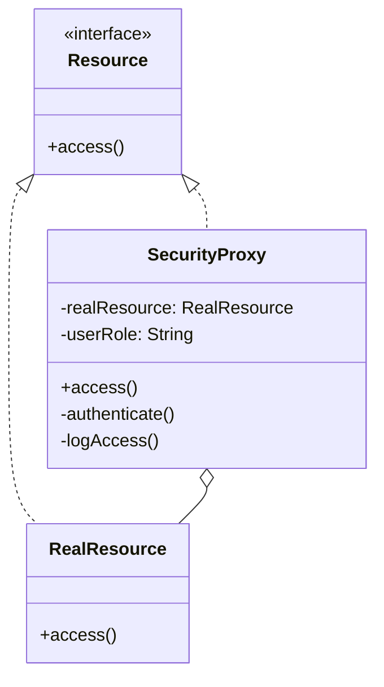

## 11.4. Security Proxy

In the realm of software design patterns, the Security Proxy stands out as a crucial pattern for managing access to resources and implementing auditing mechanisms. This pattern is particularly valuable in scenarios where direct access to an object or resource must be controlled and monitored, ensuring that only authorized actions are performed. In this section, we will delve into the intricacies of the Security Proxy pattern, exploring its intent, structure, and practical applications.

### Design Pattern Name: Security Proxy

#### Category

The Security Proxy falls under the category of **Structural Design Patterns**. Structural patterns are concerned with how classes and objects are composed to form larger structures, focusing on simplifying the relationships between entities.

#### Intent

The primary intent of the Security Proxy pattern is to control access to an object by acting as an intermediary. This proxy can enforce access control policies, authenticate requests, and log interactions for auditing purposes. By doing so, it enhances the security of the system and provides a mechanism for monitoring resource usage.

### Key Participants

The Security Proxy pattern involves several key participants:

- **Subject**: This is the common interface for RealSubject and Proxy, allowing Proxy to be used anywhere RealSubject is expected.
- **RealSubject**: The actual object that the proxy represents. This is the object that performs the real operations.
- **Proxy**: The intermediary that controls access to the RealSubject. It implements the same interface as the RealSubject and adds additional functionality such as access control and auditing.

### Applicability

The Security Proxy pattern is applicable in scenarios where:

- Access to a resource must be controlled and restricted based on certain criteria.
- Actions performed on a resource need to be logged for auditing and accountability.
- The system requires a mechanism to authenticate and authorize requests before allowing access to the resource.

### Sample Code Snippets

Let's explore a pseudocode implementation of the Security Proxy pattern. In this example, we'll demonstrate how a Security Proxy can control access to a sensitive resource and log actions for auditing purposes.

```pseudocode
// Define the Subject interface
interface Resource {
    function access();
}

// Implement the RealSubject class
class RealResource implements Resource {
    function access() {
        // Perform the actual operation on the resource
        print("Accessing the real resource.");
    }
}

// Implement the SecurityProxy class
class SecurityProxy implements Resource {
    private realResource: RealResource;
    private userRole: String;

    function SecurityProxy(realResource: RealResource, userRole: String) {
        this.realResource = realResource;
        this.userRole = userRole;
    }

    function access() {
        if (this.authenticate()) {
            this.realResource.access();
            this.logAccess();
        } else {
            print("Access denied.");
        }
    }

    private function authenticate() {
        // Check if the user role has the necessary permissions
        return this.userRole == "Admin";
    }

    private function logAccess() {
        // Log the access for auditing purposes
        print("Access logged for auditing.");
    }
}

// Client code
function main() {
    realResource = new RealResource();
    proxy = new SecurityProxy(realResource, "Admin");
    proxy.access();  // Output: Accessing the real resource. Access logged for auditing.

    proxy = new SecurityProxy(realResource, "Guest");
    proxy.access();  // Output: Access denied.
}

main();
```

In this pseudocode, we define a `Resource` interface that both `RealResource` and `SecurityProxy` implement. The `SecurityProxy` class controls access to the `RealResource` by checking the user's role and logging access attempts.

### Design Considerations

When implementing the Security Proxy pattern, consider the following:

- **Performance Overhead**: Introducing a proxy can add latency to the system due to additional checks and logging. Ensure that the performance impact is acceptable for your use case.
- **Security**: The proxy must be robust against security vulnerabilities, such as bypassing authentication or tampering with logs.
- **Scalability**: Consider how the proxy will scale with the number of requests and users. Implement efficient logging and access control mechanisms to handle high loads.

### Differences and Similarities

The Security Proxy pattern is often compared to other proxy patterns, such as the Virtual Proxy and Remote Proxy. While all these patterns involve an intermediary, the Security Proxy specifically focuses on access control and auditing, whereas other proxies may focus on lazy loading or remote access.

### Visualizing the Security Proxy Pattern

To better understand the Security Proxy pattern, let's visualize its structure using a class diagram.



**Diagram Description**: This class diagram illustrates the relationship between the `Resource` interface, `RealResource`, and `SecurityProxy`. The `SecurityProxy` acts as an intermediary, implementing the `Resource` interface and controlling access to the `RealResource`.

### Implementing Auditing

Auditing is a critical aspect of the Security Proxy pattern, ensuring that all access attempts are recorded for accountability and analysis. Let's explore how auditing can be implemented effectively.

#### Logging Access Attempts

To implement auditing, the Security Proxy should log each access attempt, including details such as the user, timestamp, and action performed. This information can be stored in a secure log file or database.

```pseudocode
private function logAccess() {
    // Get the current timestamp
    timestamp = getCurrentTimestamp();
    // Log the access details
    print("Access logged: User=" + this.userRole + ", Timestamp=" + timestamp);
}
```

#### Ensuring Log Integrity

To prevent tampering with logs, consider using cryptographic techniques to ensure log integrity. For example, you can generate a hash of each log entry and store it alongside the log. This way, any modification to the log can be detected by comparing the stored hash with a newly computed hash.

#### Analyzing Audit Logs

Audit logs can be analyzed to identify patterns of unauthorized access attempts, detect potential security breaches, and ensure compliance with security policies. Implement tools and processes to regularly review and analyze audit logs.

### Try It Yourself

To deepen your understanding of the Security Proxy pattern, try modifying the pseudocode example:

- **Add Role-Based Access Control**: Extend the `authenticate` function to support multiple roles with different permissions.
- **Implement Log Rotation**: Modify the `logAccess` function to rotate logs when they reach a certain size, ensuring efficient log management.
- **Enhance Security**: Implement additional security measures, such as encrypting log entries or using secure communication channels between the proxy and the real resource.

### Knowledge Check

Let's reinforce your understanding of the Security Proxy pattern with a few questions:

- What is the primary purpose of the Security Proxy pattern?
- How does the Security Proxy pattern enhance security in a software system?
- What are some potential performance considerations when implementing a Security Proxy?
- How can audit logs be protected from tampering?

### Embrace the Journey

Remember, mastering design patterns is a journey. As you explore the Security Proxy pattern, consider how it can be applied to real-world scenarios in your projects. Experiment with different implementations, and don't hesitate to explore additional resources to deepen your understanding.

### References and Links

For further reading on the Security Proxy pattern and related topics, consider the following resources:

- [Design Patterns: Elements of Reusable Object-Oriented Software](https://en.wikipedia.org/wiki/Design_Patterns) by Erich Gamma, Richard Helm, Ralph Johnson, and John Vlissides
- [OWASP Security Principles](https://owasp.org/www-project-top-ten/)
- [Secure Coding Practices](https://www.sans.org/white-papers/secure-coding-practices-370/)

## Quiz Time!



### What is the primary purpose of the Security Proxy pattern?

- [x] To control access to a resource and implement auditing
- [ ] To enhance performance by caching results
- [ ] To provide a user-friendly interface to a complex subsystem
- [ ] To manage object creation

> **Explanation:** The Security Proxy pattern is designed to control access to a resource and implement auditing mechanisms, ensuring that only authorized actions are performed.

### Which of the following is NOT a key participant in the Security Proxy pattern?

- [ ] Subject
- [x] Decorator
- [ ] RealSubject
- [ ] Proxy

> **Explanation:** The Decorator is not a participant in the Security Proxy pattern. The key participants are Subject, RealSubject, and Proxy.

### How does the Security Proxy pattern enhance security?

- [x] By authenticating requests and logging access attempts
- [ ] By encrypting all data transmissions
- [ ] By compressing data to reduce size
- [ ] By providing a backup of the resource

> **Explanation:** The Security Proxy pattern enhances security by authenticating requests and logging access attempts for auditing purposes.

### What is a potential performance consideration when implementing a Security Proxy?

- [x] The added latency due to authentication and logging
- [ ] The increased memory usage from object creation
- [ ] The complexity of the user interface
- [ ] The need for additional hardware resources

> **Explanation:** The Security Proxy can introduce latency due to the additional steps of authentication and logging, which may impact performance.

### How can audit logs be protected from tampering?

- [x] By using cryptographic techniques to ensure log integrity
- [ ] By storing them in plain text files
- [x] By generating a hash of each log entry
- [ ] By allowing unrestricted access to logs

> **Explanation:** Audit logs can be protected by using cryptographic techniques and generating hashes for each log entry to detect any modifications.

### What role does the Proxy play in the Security Proxy pattern?

- [x] It acts as an intermediary controlling access to the RealSubject
- [ ] It performs the actual operations on the resource
- [ ] It provides a simplified interface to the client
- [ ] It manages the lifecycle of the RealSubject

> **Explanation:** The Proxy acts as an intermediary, controlling access to the RealSubject and adding functionality such as authentication and logging.

### Which of the following is a common use case for the Security Proxy pattern?

- [x] Implementing role-based access control
- [ ] Optimizing database queries
- [x] Logging access attempts for auditing
- [ ] Rendering complex graphics

> **Explanation:** Common use cases for the Security Proxy pattern include implementing role-based access control and logging access attempts for auditing.

### What is the relationship between the Proxy and RealSubject in the Security Proxy pattern?

- [x] The Proxy holds a reference to the RealSubject
- [ ] The RealSubject inherits from the Proxy
- [ ] The Proxy and RealSubject are unrelated
- [ ] The Proxy is a subclass of the RealSubject

> **Explanation:** The Proxy holds a reference to the RealSubject, allowing it to control access and delegate operations to the RealSubject.

### True or False: The Security Proxy pattern can be used to encrypt data transmissions.

- [ ] True
- [x] False

> **Explanation:** The Security Proxy pattern is primarily focused on access control and auditing, not encryption. However, encryption can be implemented alongside the proxy if needed.

### Which diagram best represents the Security Proxy pattern?

- [x] A class diagram showing the relationship between Subject, RealSubject, and Proxy
- [ ] A sequence diagram illustrating the flow of method calls
- [ ] A flowchart depicting the decision-making process
- [ ] A state diagram representing different states of the system

> **Explanation:** A class diagram is best suited to represent the Security Proxy pattern, showing the relationship between Subject, RealSubject, and Proxy.



By understanding and implementing the Security Proxy pattern, you can enhance the security and accountability of your software systems. Keep exploring and experimenting with design patterns to build robust and secure applications.
