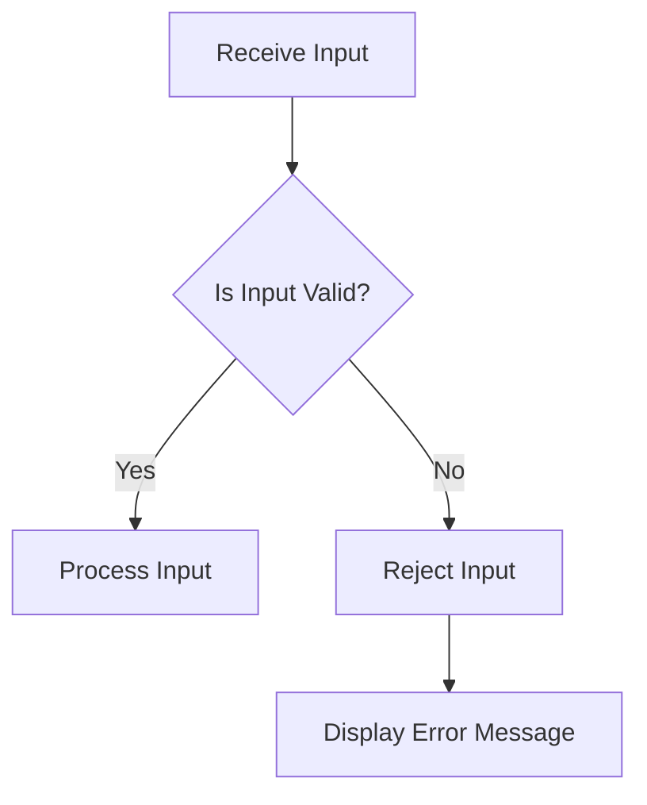

## 11.5. Input Validation Patterns

In the realm of software security, input validation stands as a critical line of defense against malicious attacks. This section delves into the intricacies of input validation patterns, focusing on preventing injection attacks and sanitizing user input. As expert developers, understanding and implementing these patterns is paramount to safeguarding applications from vulnerabilities.

### Introduction to Input Validation

Input validation is the process of ensuring that the data provided by users or external systems is clean, correct, and useful. This process is essential to prevent various types of attacks, such as SQL injection, cross-site scripting (XSS), and command injection, which exploit vulnerabilities in input handling.

#### Why Input Validation Matters

- **Security**: Proper input validation prevents attackers from injecting malicious code into applications.
- **Data Integrity**: Ensures that the data stored and processed by the application is accurate and consistent.
- **Application Stability**: Reduces the risk of application crashes due to unexpected input.

### Common Injection Attacks

Injection attacks occur when untrusted data is sent to an interpreter as part of a command or query. The attacker's hostile data can trick the interpreter into executing unintended commands or accessing unauthorized data.

#### Types of Injection Attacks

- **SQL Injection**: Involves inserting or "injecting" SQL queries via the input data from the client to the application.
- **Cross-Site Scripting (XSS)**: Occurs when an attacker injects malicious scripts into content from otherwise trusted websites.
- **Command Injection**: Involves executing arbitrary commands on the host operating system via a vulnerable application.

### Input Validation Patterns

Input validation patterns are design patterns that provide a structured approach to validating user input. These patterns help in systematically checking and sanitizing inputs to prevent security vulnerabilities.

#### Design Pattern Name: Input Validation

- **Category**: Security Design Patterns
- **Intent**: To ensure that input data is safe and conforms to expected formats before processing.
- **Key Participants**:
  - **Validator**: The component responsible for checking the input against predefined rules.
  - **Sanitizer**: The component that cleans or modifies input to make it safe for processing.
  - **Input Source**: The origin of the data, such as user input fields or external APIs.

#### Applicability

- Use input validation patterns when accepting data from untrusted sources.
- Apply these patterns to any application that interacts with databases, file systems, or external services.

### Sample Code Snippets

Let's explore some pseudocode examples to illustrate input validation patterns.

#### Basic Input Validation

```pseudocode
function validateInput(input):
    if input is null or input is empty:
        return false
    if input contains invalid characters:
        return false
    return true

// Usage
userInput = getUserInput()
if validateInput(userInput):
    processInput(userInput)
else:
    displayError("Invalid input!")
```

#### SQL Injection Prevention

```pseudocode
function sanitizeSQLInput(input):
    // Replace single quotes with escaped quotes
    return input.replace("'", "''")

// Usage
userInput = getUserInput()
sanitizedInput = sanitizeSQLInput(userInput)
query = "SELECT * FROM users WHERE username = '" + sanitizedInput + "'"
executeQuery(query)
```

#### XSS Prevention

```pseudocode
function sanitizeHTMLInput(input):
    // Encode special HTML characters
    return input.replace("<", "&lt;").replace(">", "&gt;")

// Usage
userInput = getUserInput()
sanitizedInput = sanitizeHTMLInput(userInput)
displayContent(sanitizedInput)
```

### Design Considerations

When implementing input validation patterns, consider the following:

- **Whitelist vs. Blacklist**: Prefer whitelisting acceptable input over blacklisting known bad input, as it's more secure.
- **Centralized Validation**: Centralize validation logic to ensure consistency and reduce duplication.
- **Error Handling**: Provide clear error messages to users without exposing sensitive information.

### Differences and Similarities

Input validation patterns can often be confused with other security patterns, such as authentication and authorization. While input validation focuses on ensuring data integrity and security, authentication and authorization deal with verifying user identities and permissions.

### Visualizing Input Validation

To better understand the flow of input validation, let's visualize the process using a flowchart.



**Figure 1**: Input validation process flowchart.

### Try It Yourself

To deepen your understanding, try modifying the pseudocode examples to handle additional input types, such as email addresses or phone numbers. Experiment with different validation rules and observe how they affect the application's behavior.

### References and Links

For further reading on input validation and security best practices, consider the following resources:

- [OWASP Input Validation Cheat Sheet](https://cheatsheetseries.owasp.org/cheatsheets/Input_Validation_Cheat_Sheet.html)
- [MDN Web Docs: Input Validation](https://developer.mozilla.org/en-US/docs/Learn/Forms/Form_validation)

### Knowledge Check

Let's reinforce what we've learned with some questions and exercises.

- **Question**: What is the primary goal of input validation?
- **Exercise**: Implement a pseudocode function to validate email addresses using regular expressions.

### Embrace the Journey

Remember, mastering input validation is a journey. As you continue to explore and implement these patterns, you'll enhance your ability to create secure, robust applications. Keep experimenting, stay curious, and enjoy the process of learning and growing as a developer.

## Quiz Time!



### What is the primary purpose of input validation?

- [x] To ensure input data is safe and conforms to expected formats
- [ ] To authenticate users
- [ ] To improve application performance
- [ ] To manage database connections

> **Explanation:** Input validation ensures that input data is safe and conforms to expected formats before processing, preventing security vulnerabilities.

### Which of the following is a common type of injection attack?

- [x] SQL Injection
- [ ] Buffer Overflow
- [ ] Denial of Service
- [ ] Man-in-the-Middle

> **Explanation:** SQL Injection is a common type of injection attack where malicious SQL queries are inserted into input fields.

### What is the difference between whitelisting and blacklisting in input validation?

- [x] Whitelisting allows only known good input, while blacklisting blocks known bad input.
- [ ] Whitelisting blocks known bad input, while blacklisting allows only known good input.
- [ ] Whitelisting is more secure than blacklisting.
- [ ] Blacklisting is more secure than whitelisting.

> **Explanation:** Whitelisting allows only known good input, making it more secure than blacklisting, which blocks known bad input.

### In the context of input validation, what is a sanitizer?

- [x] A component that cleans or modifies input to make it safe for processing
- [ ] A tool for authenticating users
- [ ] A method for encrypting data
- [ ] A library for managing database connections

> **Explanation:** A sanitizer is a component that cleans or modifies input to make it safe for processing, preventing security vulnerabilities.

### Which pattern is often confused with input validation patterns?

- [x] Authentication and Authorization
- [ ] Singleton Pattern
- [ ] Factory Pattern
- [ ] Observer Pattern

> **Explanation:** Input validation patterns are often confused with authentication and authorization, which deal with verifying user identities and permissions.

### What is the benefit of centralized validation logic?

- [x] Ensures consistency and reduces duplication
- [ ] Increases application performance
- [ ] Simplifies user authentication
- [ ] Enhances database management

> **Explanation:** Centralized validation logic ensures consistency and reduces duplication, making it easier to maintain and update validation rules.

### What is the main advantage of using whitelisting over blacklisting?

- [x] Whitelisting is more secure as it allows only known good input.
- [ ] Whitelisting is faster than blacklisting.
- [ ] Whitelisting requires less maintenance.
- [ ] Whitelisting is easier to implement.

> **Explanation:** Whitelisting is more secure as it allows only known good input, reducing the risk of security vulnerabilities.

### What should be included in error messages related to input validation?

- [x] Clear error messages without exposing sensitive information
- [ ] Detailed stack traces
- [ ] User's personal information
- [ ] Database connection details

> **Explanation:** Error messages should be clear and informative without exposing sensitive information to prevent security risks.

### Which of the following is a key participant in input validation patterns?

- [x] Validator
- [ ] Observer
- [ ] Singleton
- [ ] Factory

> **Explanation:** The validator is a key participant in input validation patterns, responsible for checking input against predefined rules.

### True or False: Input validation patterns are only applicable to web applications.

- [ ] True
- [x] False

> **Explanation:** Input validation patterns are applicable to any application that accepts data from untrusted sources, not just web applications.


