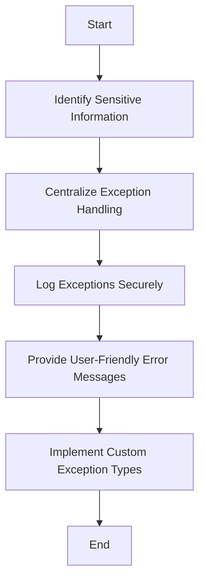

## 11.6. Exception Shielding

In the realm of software development, security is paramount. One often overlooked aspect of security is how applications handle exceptions. Exception Shielding is a design pattern that focuses on protecting sensitive information from being exposed through error messages and ensuring that errors are handled securely. This pattern is crucial for maintaining the integrity and confidentiality of an application, especially in environments where sensitive data is processed.

### Introduction to Exception Shielding

Exception Shielding is a security design pattern that aims to prevent sensitive information from being exposed through exception messages. When an application encounters an error, it may generate an exception that contains details about the error. If these details are not handled properly, they can be exposed to end-users or malicious actors, potentially leading to security vulnerabilities.

#### Key Concepts

- **Sensitive Information**: Data that must be protected from unauthorized access, such as user credentials, personal information, and system configurations.
- **Exception Handling**: The process of responding to the occurrence of exceptions, which are runtime anomalies or errors.
- **Security Vulnerabilities**: Weaknesses in a system that can be exploited to gain unauthorized access or cause harm.

### The Importance of Exception Shielding

Exception Shielding is essential for several reasons:

1. **Preventing Information Disclosure**: Unhandled exceptions can reveal sensitive information, such as database queries, file paths, or stack traces, which can be exploited by attackers.

2. **Enhancing User Experience**: By providing user-friendly error messages, applications can improve user satisfaction and reduce confusion.

3. **Maintaining System Integrity**: Proper exception handling ensures that the system remains stable and secure, even in the face of unexpected errors.

### Implementing Exception Shielding

To implement Exception Shielding effectively, developers must follow a structured approach to handle exceptions securely. This involves several key steps:

#### 1. Identify Sensitive Information

The first step in Exception Shielding is to identify what constitutes sensitive information within the application. This can include:

- User credentials (e.g., usernames, passwords)
- Personal data (e.g., social security numbers, credit card information)
- System configurations (e.g., database connection strings, API keys)

#### 2. Centralize Exception Handling

Centralizing exception handling allows developers to manage exceptions consistently across the application. This can be achieved by implementing a global exception handler or using middleware in web applications.

```pseudocode
// Pseudocode for a centralized exception handler
function GlobalExceptionHandler(exception):
    logException(exception) // Log the exception details for internal use
    return GenericErrorMessage // Return a generic error message to the user
```

#### 3. Log Exceptions Securely

Logging exceptions is crucial for diagnosing issues, but logs must be handled securely to prevent sensitive information from being exposed. Use secure logging practices, such as:

- Redacting sensitive information from logs
- Storing logs in a secure location
- Limiting access to logs to authorized personnel only

```pseudocode
// Pseudocode for secure logging
function logException(exception):
    sanitizedException = redactSensitiveInfo(exception)
    writeToSecureLog(sanitizedException)
```

#### 4. Provide User-Friendly Error Messages

Instead of displaying technical error details to users, provide generic error messages that do not reveal sensitive information. This helps maintain security while ensuring a positive user experience.

```pseudocode
// Pseudocode for user-friendly error messages
function getGenericErrorMessage():
    return "An unexpected error occurred. Please try again later."
```

#### 5. Implement Custom Exception Types

Creating custom exception types allows developers to categorize and handle exceptions more effectively. This can help in distinguishing between different types of errors and applying appropriate handling strategies.

```pseudocode
// Pseudocode for custom exception types
class DatabaseException extends Exception:
    pass

class ValidationException extends Exception:
    pass
```

### Exception Shielding in Different Programming Paradigms

Exception Shielding can be applied across various programming paradigms, including Object-Oriented Programming (OOP) and Functional Programming (FP).

#### Exception Shielding in OOP

In OOP, Exception Shielding can be implemented using classes and inheritance. By creating a hierarchy of exception classes, developers can handle different types of exceptions in a structured manner.

```pseudocode
// Pseudocode for exception hierarchy in OOP
class ApplicationException extends Exception:
    pass

class DatabaseException extends ApplicationException:
    pass

class ValidationException extends ApplicationException:
    pass
```

#### Exception Shielding in FP

In FP, exception handling can be achieved using monads or other functional constructs. This allows for a more declarative approach to handling errors.

```pseudocode
// Pseudocode for exception handling in FP using monads
function handleException(monad):
    return monad.catch(exception -> logAndReturnGenericError(exception))
```

### Visualizing Exception Shielding

To better understand how Exception Shielding works, let's visualize the process using a flowchart.



**Figure 1: Exception Shielding Process Flowchart**

### Design Considerations

When implementing Exception Shielding, consider the following:

- **Performance Impact**: Ensure that exception handling does not introduce significant performance overhead.
- **Scalability**: Design the exception handling mechanism to scale with the application.
- **Compliance**: Adhere to relevant security standards and regulations, such as GDPR or HIPAA.

### Differences and Similarities with Other Patterns

Exception Shielding is often confused with other patterns, such as:

- **Exception Handling**: While both involve managing exceptions, Exception Shielding specifically focuses on protecting sensitive information.
- **Logging**: Exception Shielding includes logging as a component, but its primary goal is to prevent information disclosure.

### Try It Yourself

To gain a deeper understanding of Exception Shielding, try modifying the pseudocode examples provided. Experiment with different types of exceptions and observe how the system handles them. Consider implementing Exception Shielding in a small project to see its impact on security and user experience.

### Knowledge Check

Before we conclude, let's summarize the key takeaways from this section:

- Exception Shielding is a security design pattern that protects sensitive information from being exposed through error messages.
- It involves identifying sensitive information, centralizing exception handling, logging exceptions securely, providing user-friendly error messages, and implementing custom exception types.
- Exception Shielding can be applied across different programming paradigms, including OOP and FP.

### Embrace the Journey

Remember, Exception Shielding is just one aspect of building secure applications. As you continue your journey in software development, keep exploring other security design patterns and best practices. Stay curious, keep learning, and enjoy the process of creating secure and robust software solutions.

## Quiz Time!



### What is the primary goal of Exception Shielding?

- [x] To protect sensitive information from being exposed through error messages
- [ ] To improve application performance
- [ ] To enhance user interface design
- [ ] To simplify code structure

> **Explanation:** Exception Shielding focuses on preventing sensitive information from being exposed through error messages, ensuring security.

### Which of the following is NOT a component of Exception Shielding?

- [ ] Centralizing exception handling
- [ ] Logging exceptions securely
- [x] Improving database performance
- [ ] Providing user-friendly error messages

> **Explanation:** Exception Shielding involves centralizing exception handling, logging securely, and providing user-friendly error messages, but not improving database performance.

### How can Exception Shielding be implemented in Functional Programming?

- [ ] Using inheritance and polymorphism
- [x] Using monads or functional constructs
- [ ] Using global variables
- [ ] Using procedural loops

> **Explanation:** In Functional Programming, Exception Shielding can be implemented using monads or functional constructs to handle errors declaratively.

### What should be done to logs to ensure they are secure?

- [x] Redact sensitive information
- [ ] Store logs in plain text
- [ ] Allow public access to logs
- [ ] Include stack traces in logs

> **Explanation:** To ensure logs are secure, sensitive information should be redacted, and access should be limited.

### Why is it important to provide user-friendly error messages?

- [x] To enhance user experience and prevent information disclosure
- [ ] To increase system performance
- [ ] To reduce code complexity
- [ ] To improve database queries

> **Explanation:** User-friendly error messages enhance user experience and prevent the disclosure of sensitive information.

### Which of the following is a key consideration when implementing Exception Shielding?

- [ ] Increasing code complexity
- [x] Ensuring compliance with security standards
- [ ] Reducing application features
- [ ] Eliminating all exceptions

> **Explanation:** Ensuring compliance with security standards is a key consideration when implementing Exception Shielding.

### What is the role of custom exception types in Exception Shielding?

- [x] To categorize and handle exceptions more effectively
- [ ] To increase application speed
- [ ] To simplify user interfaces
- [ ] To reduce memory usage

> **Explanation:** Custom exception types help categorize and handle exceptions more effectively, aiding in Exception Shielding.

### Which of the following is a benefit of centralizing exception handling?

- [x] Consistent management of exceptions across the application
- [ ] Faster database queries
- [ ] Improved graphics rendering
- [ ] Increased code duplication

> **Explanation:** Centralizing exception handling ensures consistent management of exceptions across the application.

### What is a potential pitfall of not implementing Exception Shielding?

- [x] Exposure of sensitive information through error messages
- [ ] Faster application performance
- [ ] Improved user interface design
- [ ] Reduced code complexity

> **Explanation:** Without Exception Shielding, sensitive information may be exposed through error messages, leading to security vulnerabilities.

### True or False: Exception Shielding is only applicable in Object-Oriented Programming.

- [ ] True
- [x] False

> **Explanation:** Exception Shielding can be applied in various programming paradigms, including Object-Oriented Programming and Functional Programming.


