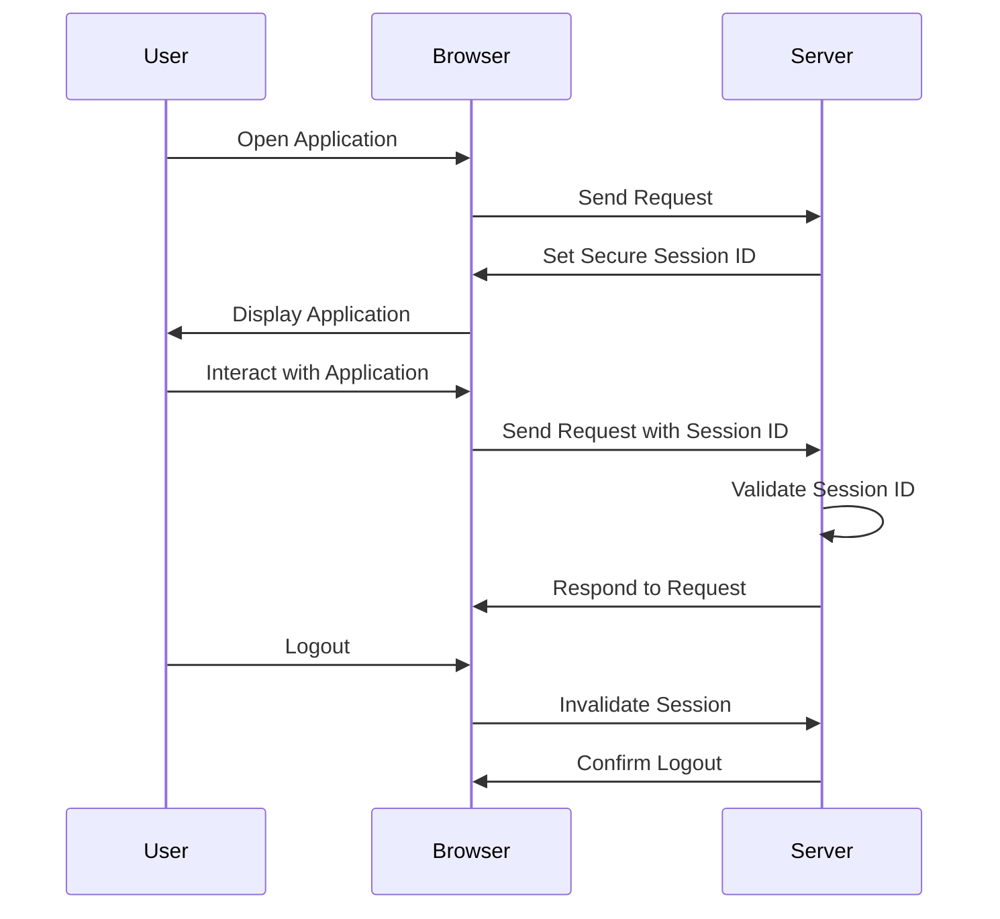

## 11.7. Secure Session Management

In the realm of software development, particularly in web applications, managing user sessions securely is paramount. Secure session management is a critical aspect of software security, focusing on maintaining session integrity and preventing hijacking. This section will delve into the principles, techniques, and best practices for secure session management, providing you with the knowledge to protect user sessions effectively.

### Understanding Sessions

Before we dive into secure session management, let's clarify what a session is. A session is a semi-permanent interactive information interchange between two or more communicating devices, or between a computer and user. In web applications, a session typically refers to the period during which a user interacts with an application, and it is often used to persist user data across multiple requests.

#### Key Concepts

- **Session ID**: A unique identifier assigned to a session, often stored in a cookie or URL, which allows the server to recognize subsequent requests from the same user.
- **Session State**: The data associated with a session, such as user preferences, authentication status, and other relevant information.
- **Session Timeout**: A mechanism to automatically terminate a session after a period of inactivity to enhance security.

### The Importance of Secure Session Management

Secure session management is crucial for several reasons:

1. **Session Integrity**: Ensures that session data is not tampered with or accessed by unauthorized parties.
2. **User Authentication**: Maintains the authenticated state of a user across multiple requests.
3. **Data Confidentiality**: Protects sensitive information exchanged during a session.
4. **Preventing Session Hijacking**: Mitigates the risk of attackers gaining unauthorized access to a user's session.

### Common Threats to Session Security

Understanding the threats to session security is the first step in implementing effective countermeasures. Here are some common threats:

- **Session Hijacking**: An attacker gains unauthorized access to a user's session by stealing or predicting the session ID.
- **Session Fixation**: An attacker sets a known session ID for a user, allowing them to hijack the session once the user logs in.
- **Cross-Site Scripting (XSS)**: Malicious scripts injected into web pages can steal session IDs.
- **Cross-Site Request Forgery (CSRF)**: An attacker tricks a user into executing unwanted actions on a web application where they are authenticated.

### Techniques for Secure Session Management

To mitigate these threats, we can employ several techniques for secure session management:

#### 1. Secure Session ID Generation

- **Randomness**: Ensure session IDs are generated using a cryptographically secure random number generator to prevent prediction.
- **Length**: Use sufficiently long session IDs to make brute-force attacks impractical.
- **Regeneration**: Regenerate session IDs after authentication and periodically during the session to reduce the risk of hijacking.

#### 2. Secure Cookie Attributes

- **HttpOnly**: Set the `HttpOnly` attribute on cookies to prevent client-side scripts from accessing the session ID.
- **Secure**: Use the `Secure` attribute to ensure cookies are only sent over HTTPS, protecting them from interception.
- **SameSite**: Implement the `SameSite` attribute to mitigate CSRF attacks by restricting how cookies are sent with cross-site requests.

#### 3. Session Timeout and Invalidation

- **Timeout**: Implement session timeouts to automatically terminate inactive sessions, reducing the window of opportunity for attackers.
- **Invalidation**: Invalidate sessions upon logout and after a certain period of inactivity to prevent unauthorized access.

#### 4. Session Fixation Prevention

- **Regenerate Session ID**: Always regenerate the session ID upon user authentication to prevent session fixation attacks.
- **Destroy Old Sessions**: Ensure old sessions are destroyed when a new session is created.

#### 5. Cross-Site Scripting (XSS) Protection

- **Input Validation**: Validate and sanitize user input to prevent the injection of malicious scripts.
- **Content Security Policy (CSP)**: Implement CSP headers to restrict the sources from which scripts can be loaded.

#### 6. Cross-Site Request Forgery (CSRF) Protection

- **CSRF Tokens**: Use unique tokens for each user session to validate requests and prevent CSRF attacks.
- **SameSite Cookies**: Leverage the `SameSite` attribute to restrict cross-site cookie usage.

### Pseudocode Examples

Let's explore some pseudocode examples to illustrate secure session management techniques.

#### Secure Session ID Generation

```pseudocode
function generateSecureSessionID():
    # Use a cryptographically secure random number generator
    return cryptoRandomBytes(32).toHexString()

sessionID = generateSecureSessionID()
```

#### Setting Secure Cookie Attributes

```pseudocode
function setSecureCookie(name, value):
    cookie = name + "=" + value
    cookie += "; HttpOnly"  # Prevent client-side access
    cookie += "; Secure"    # Ensure HTTPS transmission
    cookie += "; SameSite=Strict"  # Restrict cross-site requests
    setCookieHeader(cookie)

setSecureCookie("sessionID", sessionID)
```

#### Session Timeout and Invalidation

```pseudocode
function checkSessionTimeout(lastActivityTime):
    currentTime = getCurrentTime()
    timeoutDuration = 30 * 60  # 30 minutes
    if (currentTime - lastActivityTime) > timeoutDuration:
        invalidateSession()
        return false
    return true

function invalidateSession():
    # Destroy session data and cookies
    destroySessionData()
    deleteCookie("sessionID")

if not checkSessionTimeout(user.lastActivityTime):
    redirectToLoginPage()
```

#### CSRF Token Generation and Validation

```pseudocode
function generateCSRFToken():
    return cryptoRandomBytes(32).toHexString()

function validateCSRFToken(requestToken, sessionToken):
    return requestToken == sessionToken

sessionToken = generateCSRFToken()
if not validateCSRFToken(request.csrfToken, sessionToken):
    rejectRequest()
```

### Visualizing Secure Session Management

To better understand the flow of secure session management, let's visualize the process using a sequence diagram.



### Best Practices for Secure Session Management

Here are some best practices to follow for secure session management:

- **Use HTTPS**: Always use HTTPS to encrypt data in transit, protecting session IDs from interception.
- **Limit Session Scope**: Restrict session data to the minimum necessary for functionality.
- **Monitor Session Activity**: Implement logging and monitoring to detect suspicious session activity.
- **Educate Users**: Inform users about the importance of logging out and keeping their credentials secure.

### Knowledge Check

Let's pose some questions to reinforce your understanding of secure session management:

1. What is the primary purpose of a session ID?
2. How can session fixation attacks be prevented?
3. Why is it important to regenerate session IDs periodically?
4. What role does the `HttpOnly` attribute play in cookie security?
5. How do CSRF tokens help protect against cross-site request forgery?

### Try It Yourself

Experiment with the pseudocode examples provided. Try modifying the session timeout duration, implementing additional security headers, or testing the CSRF token validation logic. This hands-on practice will deepen your understanding of secure session management.

### Embrace the Journey

Remember, mastering secure session management is an ongoing journey. As you implement these techniques, you'll enhance the security of your applications and protect your users from potential threats. Keep exploring, stay vigilant, and continue to refine your skills in secure software design.

### Conclusion

Secure session management is a vital component of software security, ensuring the integrity and confidentiality of user sessions. By understanding the threats and implementing robust security measures, you can safeguard your applications and provide a secure experience for your users.

## Quiz Time!



### What is the primary purpose of a session ID?

- [x] To uniquely identify a user's session
- [ ] To store user preferences
- [ ] To encrypt data
- [ ] To validate user input

> **Explanation:** A session ID is used to uniquely identify a user's session, allowing the server to recognize subsequent requests from the same user.

### Which attribute should be set on cookies to prevent client-side scripts from accessing the session ID?

- [ ] Secure
- [x] HttpOnly
- [ ] SameSite
- [ ] Domain

> **Explanation:** The `HttpOnly` attribute prevents client-side scripts from accessing the session ID, enhancing security.

### How can session fixation attacks be prevented?

- [ ] By using short session IDs
- [x] By regenerating session IDs upon authentication
- [ ] By setting cookies with the `Secure` attribute
- [ ] By using CSRF tokens

> **Explanation:** Regenerating session IDs upon authentication prevents session fixation attacks by ensuring that a new session ID is assigned after login.

### Why is it important to regenerate session IDs periodically?

- [ ] To improve performance
- [ ] To reduce server load
- [x] To reduce the risk of session hijacking
- [ ] To enhance user experience

> **Explanation:** Regenerating session IDs periodically reduces the risk of session hijacking by making it more difficult for attackers to predict or steal session IDs.

### What role does the `HttpOnly` attribute play in cookie security?

- [x] It prevents client-side scripts from accessing cookies
- [ ] It ensures cookies are only sent over HTTPS
- [ ] It restricts cross-site requests
- [ ] It encrypts cookie data

> **Explanation:** The `HttpOnly` attribute prevents client-side scripts from accessing cookies, protecting them from XSS attacks.

### How do CSRF tokens help protect against cross-site request forgery?

- [ ] By encrypting session data
- [x] By validating that requests originate from the authenticated user
- [ ] By setting the `Secure` attribute on cookies
- [ ] By using long session IDs

> **Explanation:** CSRF tokens validate that requests originate from the authenticated user, preventing unauthorized actions initiated by attackers.

### What is the benefit of setting the `Secure` attribute on cookies?

- [ ] It prevents client-side access to cookies
- [x] It ensures cookies are only sent over HTTPS
- [ ] It restricts cross-site requests
- [ ] It encrypts cookie data

> **Explanation:** The `Secure` attribute ensures cookies are only sent over HTTPS, protecting them from interception.

### Which technique helps mitigate the risk of session hijacking?

- [ ] Using short session IDs
- [x] Regenerating session IDs periodically
- [ ] Setting cookies with the `Domain` attribute
- [ ] Using input validation

> **Explanation:** Regenerating session IDs periodically helps mitigate the risk of session hijacking by making it more difficult for attackers to predict or steal session IDs.

### What is the purpose of session timeout?

- [ ] To improve server performance
- [ ] To enhance user experience
- [x] To automatically terminate inactive sessions
- [ ] To encrypt session data

> **Explanation:** Session timeout automatically terminates inactive sessions, reducing the window of opportunity for attackers.

### True or False: The `SameSite` attribute on cookies helps protect against CSRF attacks.

- [x] True
- [ ] False

> **Explanation:** The `SameSite` attribute helps protect against CSRF attacks by restricting how cookies are sent with cross-site requests.


