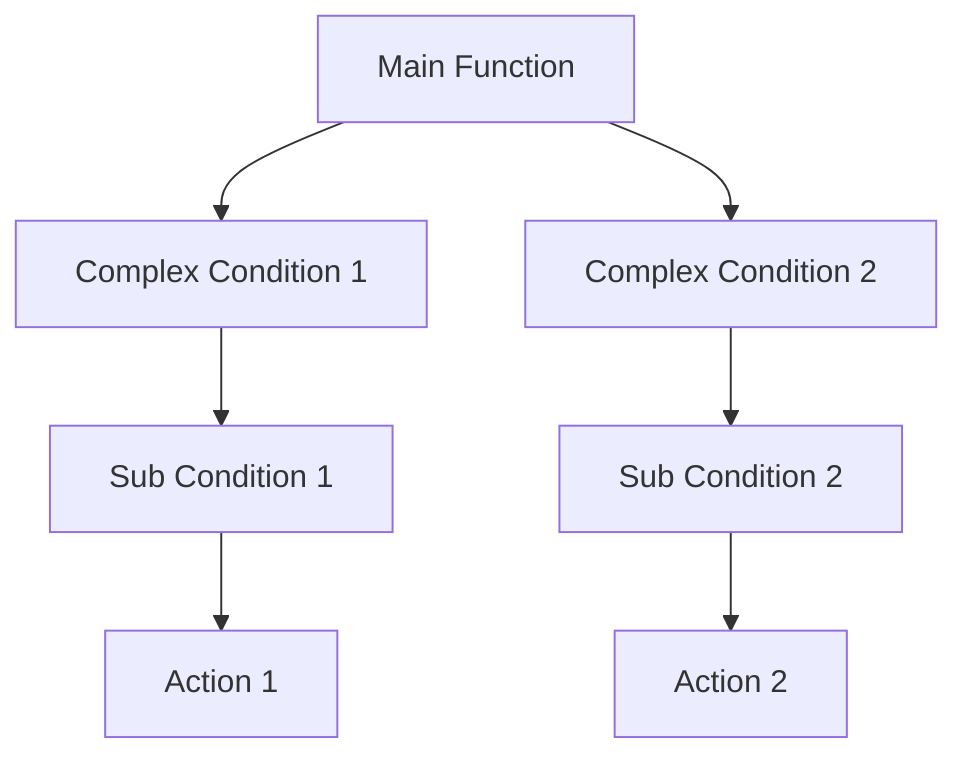
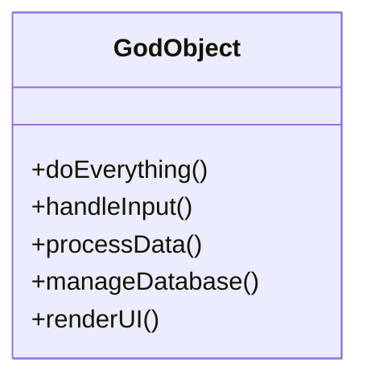

## 12.1. Understanding Anti-Patterns

In the world of software development, the term "anti-pattern" is often used to describe a common response to a recurring problem that is usually ineffective and risks being counterproductive. While design patterns provide a proven solution to common design problems, anti-patterns represent the opposite: they are the pitfalls that developers fall into, often due to lack of experience or understanding. In this section, we will explore the concept of anti-patterns, their impact on software projects, and strategies to avoid them.

### What Are Anti-Patterns?

Anti-patterns are essentially poor solutions to recurring problems. They are the result of developers choosing a path that seems easier or more intuitive at first glance but ultimately leads to more problems than it solves. Understanding anti-patterns is crucial for expert developers and architects because it helps them recognize and avoid these pitfalls, leading to cleaner, more maintainable code.

#### Characteristics of Anti-Patterns

1. **Recurring Problem**: Anti-patterns arise from common problems faced in software development.
2. **Ineffective Solution**: The solutions provided by anti-patterns are usually ineffective and lead to further complications.
3. **Negative Consequences**: They often result in increased complexity, reduced performance, and higher maintenance costs.
4. **Commonly Misunderstood**: Anti-patterns are often mistaken for best practices due to their prevalence.

### Common Anti-Patterns in Software Design

Let's delve into some of the most common anti-patterns encountered in software development, understanding their characteristics, consequences, and how to avoid them.

#### 1. Spaghetti Code

**Description**: Spaghetti code is a term used to describe code that is tangled and difficult to follow. It usually lacks structure and is characterized by a complex and convoluted control flow.

**Consequences**:
- Difficult to maintain and extend.
- High risk of introducing bugs when making changes.
- Poor readability, making it hard for new developers to understand.

**Avoidance Strategies**:
- Use modular design to break down code into smaller, manageable pieces.
- Follow coding standards and best practices for code organization.
- Regularly refactor code to improve its structure.

**Example**:

```pseudocode
function processData(input) {
    if (input == null) {
        return;
    }
    // Complex nested conditions
    if (input.type == "A") {
        // Do something
    } else if (input.type == "B") {
        // Do something else
    } else {
        // Another condition
    }
    // More nested logic
}
```

**Refactored Example**:

```pseudocode
function processData(input) {
    if (input == null) {
        return;
    }
    switch (input.type) {
        case "A":
            handleTypeA(input);
            break;
        case "B":
            handleTypeB(input);
            break;
        default:
            handleDefault(input);
    }
}

function handleTypeA(input) {
    // Handle type A
}

function handleTypeB(input) {
    // Handle type B
}

function handleDefault(input) {
    // Handle default case
}
```

#### 2. The God Object

**Description**: A God Object is an object that knows too much or does too much. It is a class that has grown to encompass too many responsibilities, violating the Single Responsibility Principle.

**Consequences**:
- Hard to maintain and test due to its size and complexity.
- Changes in one part of the object can have unforeseen effects on other parts.
- Difficult to reuse parts of the code.

**Avoidance Strategies**:
- Break down the God Object into smaller, more focused classes.
- Apply the Single Responsibility Principle to ensure each class has one reason to change.
- Use design patterns like Facade or Mediator to manage complex interactions.

**Example**:

```pseudocode
class GodObject {
    function doEverything() {
        // Handles user input
        // Processes data
        // Manages database connections
        // Renders UI
    }
}
```

**Refactored Example**:

```pseudocode
class InputHandler {
    function handleInput() {
        // Handles user input
    }
}

class DataProcessor {
    function processData() {
        // Processes data
    }
}

class DatabaseManager {
    function manageDatabase() {
        // Manages database connections
    }
}

class UIManager {
    function renderUI() {
        // Renders UI
    }
}
```

#### 3. Lava Flow

**Description**: Lava Flow refers to code that is left over from previous versions or experiments and is no longer used or understood. It accumulates in the codebase, making it harder to maintain.

**Consequences**:
- Increases the complexity of the codebase.
- Makes it difficult to identify which parts of the code are still relevant.
- Can introduce bugs if accidentally modified.

**Avoidance Strategies**:
- Regularly review and clean up the codebase.
- Remove unused code and document any necessary legacy code.
- Use version control to track changes and remove obsolete code safely.

**Example**:

```pseudocode
function oldFeature() {
    // This feature is no longer used
}

function newFeature() {
    // This is the current implementation
}
```

**Refactored Example**:

```pseudocode
function newFeature() {
    // This is the current implementation
}
// Removed oldFeature as it is no longer needed
```

#### 4. Golden Hammer

**Description**: The Golden Hammer anti-pattern occurs when developers overuse a familiar technology or pattern, applying it to every problem regardless of its suitability.

**Consequences**:
- Leads to suboptimal solutions that do not address the problem effectively.
- Can result in increased complexity and reduced performance.
- Limits the exploration of potentially better solutions.

**Avoidance Strategies**:
- Evaluate the problem and consider multiple solutions before choosing one.
- Stay updated with new technologies and patterns.
- Encourage a culture of learning and experimentation within the team.

**Example**:

```pseudocode
function processDataWithXML(input) {
    // Always uses XML for data processing, even when JSON might be more suitable
}
```

**Refactored Example**:

```pseudocode
function processData(input, format) {
    if (format == "XML") {
        processXML(input);
    } else if (format == "JSON") {
        processJSON(input);
    }
}

function processXML(input) {
    // Process XML data
}

function processJSON(input) {
    // Process JSON data
}
```

### Visualizing Anti-Patterns

To better understand the impact of anti-patterns, let's visualize the structure of a codebase affected by these issues using Mermaid.js diagrams.

#### Spaghetti Code Structure



**Caption**: This diagram illustrates the tangled and complex flow of spaghetti code, where conditions and actions are deeply nested and interconnected, making it difficult to follow and maintain.

#### God Object Structure



**Caption**: The God Object diagram shows a single class with multiple responsibilities, violating the Single Responsibility Principle and leading to a complex and hard-to-maintain code structure.

### The Cost of Poor Solutions

Anti-patterns can have significant negative impacts on software projects. They often lead to increased maintenance costs, reduced code quality, and slower development times. Understanding the cost of poor solutions is essential for developers and architects to prioritize code quality and maintainability.

#### Impact on Development

1. **Increased Complexity**: Anti-patterns often result in complex code that is difficult to understand and modify.
2. **Higher Maintenance Costs**: Poorly designed code requires more effort to maintain and extend, leading to higher costs over time.
3. **Reduced Performance**: Inefficient solutions can lead to performance bottlenecks and scalability issues.

#### Impact on Team Dynamics

1. **Decreased Morale**: Working with poorly designed code can be frustrating and demotivating for developers.
2. **Knowledge Silos**: Anti-patterns can lead to knowledge silos, where only a few team members understand certain parts of the codebase.
3. **Increased Onboarding Time**: New developers may struggle to understand and work with a codebase riddled with anti-patterns.

### Strategies for Avoiding Anti-Patterns

Avoiding anti-patterns requires a proactive approach to software design and development. Here are some strategies to help you steer clear of these common pitfalls:

#### 1. Continuous Learning and Improvement

- **Stay Updated**: Keep up with the latest developments in software design and best practices.
- **Encourage Learning**: Foster a culture of continuous learning and improvement within your team.

#### 2. Code Reviews and Pair Programming

- **Conduct Regular Code Reviews**: Regular code reviews help identify and address anti-patterns early in the development process.
- **Pair Programming**: Pair programming encourages collaboration and knowledge sharing, reducing the likelihood of anti-patterns.

#### 3. Refactoring and Technical Debt Management

- **Refactor Regularly**: Regular refactoring helps improve code quality and eliminate anti-patterns.
- **Manage Technical Debt**: Keep track of technical debt and prioritize its reduction to maintain a healthy codebase.

#### 4. Design Patterns and Best Practices

- **Use Design Patterns**: Apply appropriate design patterns to solve common problems effectively.
- **Follow Best Practices**: Adhere to coding standards and best practices to ensure code quality.

### Try It Yourself

To gain a deeper understanding of anti-patterns, try refactoring a piece of spaghetti code or breaking down a God Object in your own projects. Experiment with different design patterns and see how they can improve the structure and maintainability of your code.

### Knowledge Check

- **What is an anti-pattern, and how does it differ from a design pattern?**
- **Identify a piece of spaghetti code in your project and refactor it using modular design.**
- **Discuss the impact of the God Object anti-pattern on code maintainability.**

### Embrace the Journey

Remember, understanding and avoiding anti-patterns is a continuous journey. As you gain experience, you'll become better at recognizing these pitfalls and applying effective solutions. Keep experimenting, stay curious, and enjoy the process of improving your code quality.

## Quiz Time!



### What is an anti-pattern?

- [x] A common but ineffective solution to a recurring problem
- [ ] A proven solution to a common problem
- [ ] A design pattern used in functional programming
- [ ] A type of software bug

> **Explanation:** An anti-pattern is a common but ineffective solution to a recurring problem, often leading to negative consequences.

### Which of the following is a characteristic of spaghetti code?

- [x] Complex and convoluted control flow
- [ ] Clear and modular structure
- [ ] High performance
- [ ] Easy to maintain

> **Explanation:** Spaghetti code is characterized by complex and convoluted control flow, making it difficult to maintain and understand.

### What is the main problem with the God Object anti-pattern?

- [x] It violates the Single Responsibility Principle
- [ ] It uses too many design patterns
- [ ] It is too modular
- [ ] It is too simple

> **Explanation:** The God Object anti-pattern violates the Single Responsibility Principle by having too many responsibilities in a single class.

### How can the Golden Hammer anti-pattern be avoided?

- [x] Evaluate the problem and consider multiple solutions
- [ ] Always use the same technology for every problem
- [ ] Ignore new technologies and patterns
- [ ] Avoid learning and experimentation

> **Explanation:** To avoid the Golden Hammer anti-pattern, evaluate the problem and consider multiple solutions before choosing one.

### What is a consequence of the Lava Flow anti-pattern?

- [x] Increased complexity of the codebase
- [ ] Improved code readability
- [ ] Reduced maintenance costs
- [ ] Enhanced performance

> **Explanation:** The Lava Flow anti-pattern increases the complexity of the codebase by leaving behind unused or obsolete code.

### Which strategy can help avoid anti-patterns?

- [x] Conduct regular code reviews
- [ ] Ignore technical debt
- [ ] Avoid refactoring
- [ ] Use the same solution for every problem

> **Explanation:** Conducting regular code reviews helps identify and address anti-patterns early in the development process.

### What is the impact of anti-patterns on team dynamics?

- [x] Decreased morale and increased onboarding time
- [ ] Improved collaboration
- [ ] Faster development times
- [ ] Reduced knowledge silos

> **Explanation:** Anti-patterns can decrease morale and increase onboarding time due to the complexity and poor design of the codebase.

### What is a key benefit of refactoring code regularly?

- [x] Improved code quality and elimination of anti-patterns
- [ ] Increased technical debt
- [ ] Reduced code readability
- [ ] Slower development times

> **Explanation:** Regular refactoring improves code quality and helps eliminate anti-patterns, leading to a more maintainable codebase.

### How does pair programming help avoid anti-patterns?

- [x] Encourages collaboration and knowledge sharing
- [ ] Increases technical debt
- [ ] Promotes individual work
- [ ] Reduces code quality

> **Explanation:** Pair programming encourages collaboration and knowledge sharing, reducing the likelihood of anti-patterns.

### True or False: Anti-patterns are always easy to identify and fix.

- [ ] True
- [x] False

> **Explanation:** Anti-patterns are not always easy to identify and fix, as they can be deeply embedded in the codebase and require careful analysis and refactoring.




