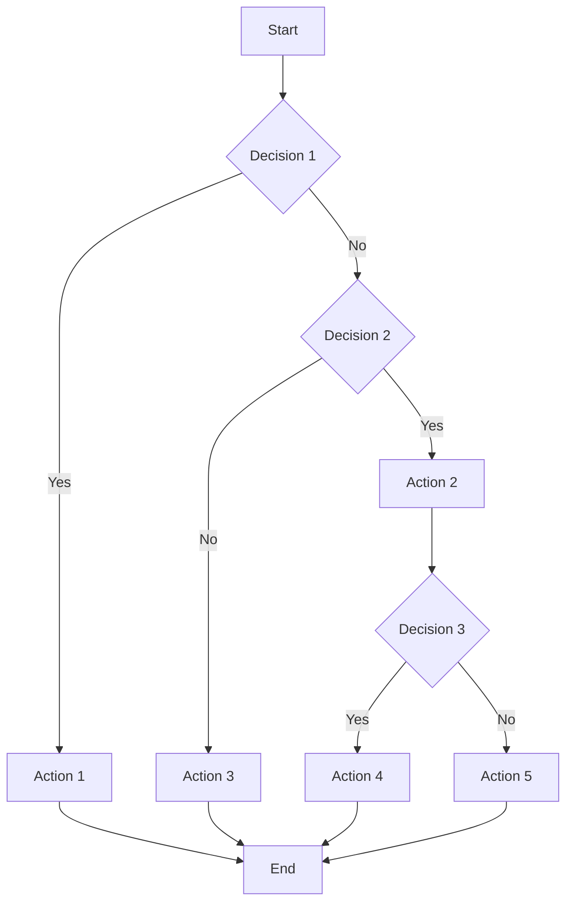

## 12.2. Spaghetti Code

In the realm of software development, the term "spaghetti code" is often used to describe a codebase that is tangled, unstructured, and difficult to maintain. This section will delve into the concept of spaghetti code, explore its causes and consequences, and provide strategies for refactoring to improve code quality.

### Understanding Spaghetti Code

#### Definition and Characteristics

Spaghetti code refers to a codebase that lacks a clear structure, making it difficult to follow, understand, and modify. This type of code is often characterized by:

- **Complex and Intertwined Logic:** Functions and methods are tightly coupled, with numerous interdependencies that make changes risky and error-prone.
- **Lack of Modularity:** Code is not organized into reusable modules or components, leading to duplication and inconsistencies.
- **Poor Naming Conventions:** Variables and functions have non-descriptive names, making it hard to discern their purpose.
- **Inconsistent Formatting:** Code lacks a consistent style, with varying indentation, spacing, and line breaks.
- **Excessive Use of Goto Statements:** In some older languages, the use of `goto` statements leads to non-linear control flow, contributing to the tangled nature of the code.

#### Causes of Spaghetti Code

Spaghetti code often arises from several factors, including:

- **Lack of Planning:** Developers may dive into coding without a clear design or architecture, leading to ad-hoc solutions.
- **Time Pressure:** Tight deadlines can force developers to prioritize quick fixes over clean, maintainable code.
- **Inexperienced Developers:** Novice programmers may lack the knowledge or experience to implement structured and modular code.
- **Evolving Requirements:** Frequent changes in requirements can lead to patches and workarounds that degrade the codebase over time.
- **Lack of Code Reviews:** Without regular code reviews, poor coding practices can go unchecked and proliferate.

#### Consequences of Spaghetti Code

The presence of spaghetti code in a project can have several negative impacts:

- **Difficult Maintenance:** Understanding and modifying tangled code is time-consuming and error-prone, leading to increased maintenance costs.
- **Reduced Readability:** New team members or developers unfamiliar with the codebase struggle to comprehend its logic, slowing down onboarding and collaboration.
- **Increased Bug Rate:** The complexity and interdependencies in spaghetti code make it prone to bugs and regressions when changes are made.
- **Hindered Scalability:** As the codebase grows, the lack of structure makes it challenging to scale and extend the software.
- **Technical Debt:** Over time, spaghetti code accumulates technical debt, requiring significant effort to refactor and clean up.

### Visualizing Spaghetti Code

To better understand the complexity of spaghetti code, let's visualize it using a flowchart. This diagram represents a typical spaghetti code structure, highlighting its tangled and non-linear nature.



**Diagram Description:** This flowchart illustrates the tangled and non-linear flow typical of spaghetti code, with multiple decision points and actions leading to a complex and difficult-to-follow structure.

### Strategies for Refactoring Spaghetti Code

Refactoring spaghetti code is essential to improve its maintainability, readability, and scalability. Here are some effective strategies to tackle this challenge:

#### 1. Modularize the Code

**Break Down Monolithic Functions:** Identify large functions or methods and break them down into smaller, more manageable pieces. Each function should have a single responsibility and a clear purpose.

**Create Reusable Components:** Extract common functionality into reusable modules or classes. This reduces duplication and promotes code reuse.

**Use Design Patterns:** Apply appropriate design patterns to organize and structure the code. For example, the **Factory Method** pattern can help manage object creation, while the **Observer** pattern can facilitate event-driven communication.

#### 2. Improve Naming Conventions

**Use Descriptive Names:** Ensure that variables, functions, and classes have meaningful and descriptive names that convey their purpose and functionality.

**Follow Consistent Naming Standards:** Adopt a consistent naming convention throughout the codebase to enhance readability and maintainability.

#### 3. Enhance Code Formatting

**Adopt a Consistent Style Guide:** Use a style guide to ensure consistent formatting, including indentation, spacing, and line breaks. Tools like linters can automate this process.

**Organize Code Logically:** Group related code together and use comments to separate different sections or functionalities.

#### 4. Simplify Control Flow

**Reduce Nested Logic:** Minimize the use of deeply nested loops and conditionals. Consider using early returns or guard clauses to simplify logic.

**Eliminate Goto Statements:** Replace `goto` statements with structured control flow constructs like loops and conditionals.

#### 5. Implement Unit Tests

**Write Tests for Critical Functions:** Develop unit tests for key functions and methods to ensure they work as expected. This provides a safety net when refactoring.

**Use Test-Driven Development (TDD):** Adopt TDD practices to guide the refactoring process, ensuring that changes do not introduce new bugs.

#### 6. Conduct Code Reviews

**Regularly Review Code:** Implement a code review process to catch potential issues early and promote best practices.

**Encourage Peer Feedback:** Foster a culture of collaboration and feedback among team members to continuously improve code quality.

### Sample Code Snippets

Let's explore a simple example of spaghetti code and how it can be refactored for clarity and maintainability.

**Original Spaghetti Code:**

```pseudocode
function processOrder(order) {
    if (order.status == "new") {
        if (order.payment == "pending") {
            if (order.items.length > 0) {
                // Process payment
                processPayment(order);
                order.status = "processed";
            } else {
                console.log("No items in order.");
            }
        } else {
            console.log("Payment already processed.");
        }
    } else {
        console.log("Order already processed.");
    }
}
```

**Refactored Code:**

```pseudocode
function processOrder(order) {
    if (!isNewOrder(order)) {
        console.log("Order already processed.");
        return;
    }
    
    if (!hasPendingPayment(order)) {
        console.log("Payment already processed.");
        return;
    }
    
    if (!hasItems(order)) {
        console.log("No items in order.");
        return;
    }
    
    processPayment(order);
    updateOrderStatus(order, "processed");
}

function isNewOrder(order) {
    return order.status == "new";
}

function hasPendingPayment(order) {
    return order.payment == "pending";
}

function hasItems(order) {
    return order.items.length > 0;
}

function updateOrderStatus(order, status) {
    order.status = status;
}
```

**Explanation:** The refactored code breaks down the logic into smaller, reusable functions, improving readability and maintainability. Each function has a clear responsibility, and the control flow is simplified with early returns.

### Try It Yourself

To deepen your understanding of refactoring spaghetti code, try the following exercises:

1. **Identify Spaghetti Code:** Review a codebase you are familiar with and identify areas that exhibit characteristics of spaghetti code.

2. **Refactor a Function:** Choose a complex function and refactor it using the strategies outlined above. Focus on improving modularity, naming conventions, and control flow.

3. **Write Unit Tests:** Develop unit tests for the refactored function to ensure it behaves as expected. Use these tests to guide further refactoring efforts.

4. **Conduct a Code Review:** Pair with a colleague to review each other's code. Provide feedback on areas that could benefit from refactoring and discuss potential improvements.

### Knowledge Check

Let's reinforce what we've learned with a few questions:

- What are the key characteristics of spaghetti code?
- How can modularization help in refactoring spaghetti code?
- Why is it important to improve naming conventions in a codebase?
- What role do unit tests play in the refactoring process?
- How can code reviews contribute to maintaining code quality?

### Summary of Key Takeaways

- **Spaghetti Code:** A tangled and unstructured codebase that is difficult to maintain and understand.
- **Causes:** Lack of planning, time pressure, inexperienced developers, evolving requirements, and lack of code reviews.
- **Consequences:** Difficult maintenance, reduced readability, increased bug rate, hindered scalability, and technical debt.
- **Refactoring Strategies:** Modularize code, improve naming conventions, enhance code formatting, simplify control flow, implement unit tests, and conduct code reviews.

Remember, refactoring spaghetti code is an ongoing process that requires diligence and collaboration. By applying these strategies, you can transform a tangled codebase into a clean, maintainable, and scalable solution. Keep experimenting, stay curious, and enjoy the journey of continuous improvement!

## Quiz Time!



### What is a key characteristic of spaghetti code?

- [x] Lack of structure
- [ ] Well-organized modules
- [ ] Clear naming conventions
- [ ] Consistent formatting

> **Explanation:** Spaghetti code is characterized by a lack of structure, making it difficult to follow and maintain.

### Which factor often leads to the creation of spaghetti code?

- [x] Lack of planning
- [ ] Consistent code reviews
- [ ] Use of design patterns
- [ ] Modular code organization

> **Explanation:** A lack of planning can lead to ad-hoc solutions and a tangled codebase, resulting in spaghetti code.

### How can modularization help in refactoring spaghetti code?

- [x] By breaking down monolithic functions into smaller, manageable pieces
- [ ] By increasing code duplication
- [ ] By using more global variables
- [ ] By adding more nested loops

> **Explanation:** Modularization involves breaking down large functions into smaller, manageable pieces, improving readability and maintainability.

### Why is it important to improve naming conventions in a codebase?

- [x] To enhance readability and convey purpose
- [ ] To increase code complexity
- [ ] To make code harder to understand
- [ ] To reduce code size

> **Explanation:** Improving naming conventions enhances readability and helps convey the purpose of variables and functions.

### What role do unit tests play in the refactoring process?

- [x] They provide a safety net to ensure changes do not introduce new bugs
- [ ] They increase code complexity
- [ ] They make code harder to understand
- [ ] They reduce code size

> **Explanation:** Unit tests provide a safety net during refactoring, ensuring that changes do not introduce new bugs.

### How can code reviews contribute to maintaining code quality?

- [x] By catching potential issues early and promoting best practices
- [ ] By increasing code duplication
- [ ] By using more global variables
- [ ] By adding more nested loops

> **Explanation:** Code reviews help catch potential issues early and promote best practices, contributing to higher code quality.

### What is a common consequence of spaghetti code?

- [x] Difficult maintenance
- [ ] Increased readability
- [ ] Reduced bug rate
- [ ] Improved scalability

> **Explanation:** Spaghetti code often leads to difficult maintenance due to its tangled and unstructured nature.

### Which strategy can help simplify control flow in spaghetti code?

- [x] Reduce nested logic
- [ ] Increase code duplication
- [ ] Use more global variables
- [ ] Add more nested loops

> **Explanation:** Simplifying control flow involves reducing nested logic, making the code easier to follow and maintain.

### What is a benefit of conducting code reviews?

- [x] Encouraging collaboration and feedback among team members
- [ ] Increasing code duplication
- [ ] Using more global variables
- [ ] Adding more nested loops

> **Explanation:** Code reviews encourage collaboration and feedback, helping to improve code quality and maintainability.

### True or False: Spaghetti code is easy to maintain and understand.

- [ ] True
- [x] False

> **Explanation:** Spaghetti code is difficult to maintain and understand due to its lack of structure and tangled nature.


