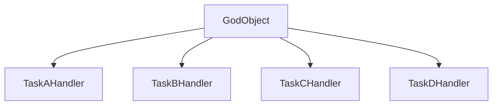

## 12.3. The God Object

In the realm of software design, the term "God Object" refers to an anti-pattern where a single class is overloaded with responsibilities, often leading to a myriad of problems in software maintainability and scalability. This section aims to demystify the God Object, explore its implications, and provide strategies for breaking down responsibilities to foster cleaner and more modular code.

### Understanding the God Object

#### What is a God Object?

A God Object is a class that knows too much or does too much. It is characterized by having an excessive number of methods, attributes, or dependencies, making it a central point of control in the system. This anti-pattern often emerges when developers, in an attempt to centralize functionality, inadvertently create a class that becomes a bottleneck for development and maintenance.

#### Characteristics of a God Object

- **High Complexity**: The class contains a large amount of code, making it difficult to understand and modify.
- **Multiple Responsibilities**: It violates the Single Responsibility Principle (SRP) by handling various unrelated tasks.
- **High Coupling**: Other classes depend heavily on the God Object, leading to tight coupling and reduced flexibility.
- **Low Cohesion**: The class lacks a clear focus, with methods and attributes that are not closely related.

#### Why Do God Objects Occur?

God Objects often arise from a lack of planning or understanding of design principles. They can also result from:

- **Rapid Prototyping**: Quick iterations without proper refactoring can lead to bloated classes.
- **Legacy Code**: Over time, classes accumulate responsibilities as new features are added.
- **Misguided Abstraction**: Attempting to abstract too much functionality into a single class.

### The Pitfalls of God Objects

#### Maintenance Challenges

God Objects are notoriously difficult to maintain. Their complexity makes it hard to identify where changes need to be made, increasing the risk of introducing bugs. As a result, developers may become hesitant to modify the class, leading to technical debt.

#### Scalability Issues

As a system grows, a God Object can become a bottleneck. Its central role means that any changes or enhancements require careful consideration of its impact on the entire system, hindering scalability.

#### Testing Difficulties

Testing a God Object is challenging due to its numerous responsibilities and dependencies. Unit tests become cumbersome, and achieving high test coverage is difficult, reducing the reliability of the software.

#### Poor Reusability

God Objects are often tightly coupled with specific implementations, making them difficult to reuse in different contexts. This lack of modularity limits the ability to extend or adapt the system.

### Breaking Down Responsibilities

To address the issues posed by God Objects, it's essential to break down their responsibilities into smaller, more manageable components. This process involves several key strategies:

#### 1. Apply the Single Responsibility Principle (SRP)

The SRP states that a class should have only one reason to change, meaning it should have only one responsibility. By adhering to this principle, we can decompose a God Object into multiple classes, each focused on a specific task.

#### 2. Use Composition Over Inheritance

Favor composition over inheritance to create flexible and reusable components. By composing objects with well-defined interfaces, we can build complex functionality without relying on a monolithic class.

#### 3. Implement Design Patterns

Design patterns provide proven solutions for organizing code and managing responsibilities. Patterns such as the Strategy, Observer, and Factory Method can help distribute functionality across multiple classes.

#### 4. Refactor Incrementally

Refactoring a God Object can be a daunting task. Approach it incrementally by identifying and extracting cohesive groups of methods and attributes into new classes. This gradual process minimizes disruption and reduces the risk of introducing errors.

### Code Example: Refactoring a God Object

Let's consider a pseudocode example of a God Object and demonstrate how to refactor it into smaller, more focused classes.

#### Initial God Object

```pseudocode
class GodObject {
    // Attributes
    data1
    data2
    data3

    // Methods
    methodA() {
        // Handles task A
    }

    methodB() {
        // Handles task B
    }

    methodC() {
        // Handles task C
    }

    methodD() {
        // Handles task D
    }
}
```

#### Refactored Classes

```pseudocode
class TaskAHandler {
    data1

    methodA() {
        // Handles task A
    }
}

class TaskBHandler {
    data2

    methodB() {
        // Handles task B
    }
}

class TaskCHandler {
    data3

    methodC() {
        // Handles task C
    }
}

class TaskDHandler {
    methodD() {
        // Handles task D
    }
}
```

By refactoring the God Object into separate classes, each class now has a single responsibility, making the codebase more modular and easier to maintain.

### Visualizing the Refactoring Process

Below is a diagram illustrating the transformation from a God Object to a set of specialized classes.



**Diagram Description:** The diagram shows the GodObject being decomposed into four distinct classes, each responsible for a specific task.

### Design Considerations

When refactoring a God Object, consider the following:

- **Identify Cohesive Groups**: Look for methods and attributes that naturally belong together and can form a new class.
- **Maintain Functionality**: Ensure that the refactoring process does not alter the existing functionality of the system.
- **Test Thoroughly**: After refactoring, update and run tests to verify that the system behaves as expected.

### Differences and Similarities with Other Patterns

The God Object is often confused with other anti-patterns, such as the Blob and the Swiss Army Knife. While they share similarities, the key distinction lies in their scope and impact:

- **Blob**: Similar to the God Object, but typically refers to a class that accumulates data rather than functionality.
- **Swiss Army Knife**: A class that provides a wide range of unrelated functionalities, often leading to low cohesion.

### Try It Yourself

To gain hands-on experience, try refactoring a God Object in your own codebase. Identify a class with multiple responsibilities and break it down into smaller, focused classes. Experiment with different design patterns to see how they can help distribute responsibilities effectively.

### References and Further Reading

- [Martin Fowler's Refactoring: Improving the Design of Existing Code](https://martinfowler.com/books/refactoring.html)
- [Design Patterns: Elements of Reusable Object-Oriented Software](https://en.wikipedia.org/wiki/Design_Patterns)
- [Single Responsibility Principle - Wikipedia](https://en.wikipedia.org/wiki/Single_responsibility_principle)

### Knowledge Check

- What are the main characteristics of a God Object?
- How does the Single Responsibility Principle help in refactoring a God Object?
- What are some common pitfalls of maintaining a God Object?
- How can design patterns assist in breaking down a God Object?

### Embrace the Journey

Remember, refactoring a God Object is just the beginning. As you progress, you'll develop a deeper understanding of design principles and patterns that will enhance your ability to create clean, maintainable code. Keep experimenting, stay curious, and enjoy the journey!

---

## Quiz Time!



### What is a key characteristic of a God Object?

- [x] High complexity and multiple responsibilities
- [ ] Low coupling and high cohesion
- [ ] Minimal dependencies
- [ ] Single responsibility

> **Explanation:** A God Object is characterized by high complexity and multiple responsibilities, often leading to maintenance challenges.

### Why is a God Object difficult to maintain?

- [x] It has too many responsibilities and dependencies.
- [ ] It is too simple and lacks functionality.
- [ ] It is isolated and not used by other classes.
- [ ] It follows the Single Responsibility Principle.

> **Explanation:** The complexity and numerous dependencies of a God Object make it difficult to maintain and modify.

### Which principle helps in breaking down a God Object?

- [x] Single Responsibility Principle (SRP)
- [ ] Open/Closed Principle (OCP)
- [ ] Liskov Substitution Principle (LSP)
- [ ] Dependency Inversion Principle (DIP)

> **Explanation:** The Single Responsibility Principle (SRP) states that a class should have only one reason to change, helping to break down a God Object into smaller, focused classes.

### What is a common result of refactoring a God Object?

- [x] Increased modularity and maintainability
- [ ] Decreased code readability
- [ ] Increased coupling between classes
- [ ] Reduced test coverage

> **Explanation:** Refactoring a God Object into smaller classes increases modularity and maintainability, making the codebase easier to manage.

### How can design patterns assist in refactoring a God Object?

- [x] By providing proven solutions for organizing code
- [ ] By increasing the complexity of the codebase
- [ ] By centralizing all functionality in one class
- [ ] By eliminating the need for refactoring

> **Explanation:** Design patterns offer proven solutions for organizing code and managing responsibilities, aiding in the refactoring of a God Object.

### What is a potential pitfall of a God Object?

- [x] It can become a bottleneck for scalability.
- [ ] It simplifies the codebase.
- [ ] It enhances code reusability.
- [ ] It reduces the number of classes.

> **Explanation:** A God Object can become a bottleneck for scalability due to its central role and complexity.

### What is the difference between a God Object and a Blob?

- [x] A God Object accumulates functionality, while a Blob accumulates data.
- [ ] A Blob accumulates functionality, while a God Object accumulates data.
- [ ] Both are the same and refer to overloaded classes.
- [ ] A Blob is a design pattern, while a God Object is an anti-pattern.

> **Explanation:** A God Object accumulates functionality, whereas a Blob typically refers to a class that accumulates data.

### How can composition help in refactoring a God Object?

- [x] By allowing flexible and reusable components
- [ ] By increasing inheritance hierarchies
- [ ] By centralizing all logic in one class
- [ ] By reducing the number of interfaces

> **Explanation:** Composition allows for flexible and reusable components, helping to distribute responsibilities and refactor a God Object.

### What is the main goal of refactoring a God Object?

- [x] To create smaller, more focused classes
- [ ] To increase the number of methods in a class
- [ ] To centralize all functionality in one class
- [ ] To eliminate all classes in the system

> **Explanation:** The main goal of refactoring a God Object is to create smaller, more focused classes that adhere to the Single Responsibility Principle.

### True or False: A God Object is beneficial for code reusability.

- [ ] True
- [x] False

> **Explanation:** False. A God Object is not beneficial for code reusability due to its tight coupling and lack of modularity.




