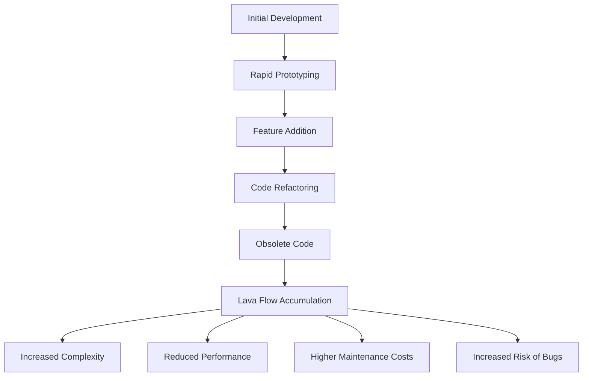

## 12.4. Lava Flow

In the dynamic world of software development, maintaining clean and efficient code is crucial for the longevity and success of any project. One of the most insidious anti-patterns that can plague a codebase is known as "Lava Flow." This term describes the accumulation of dead code and obsolete logic that remains in a system, often due to rapid development cycles and poor documentation. In this section, we will delve into the concept of Lava Flow, explore its causes and consequences, and provide strategies for cleaning up legacy systems to improve code quality and maintainability.

### Understanding Lava Flow

**Lava Flow** is a metaphor used to describe the remnants of code that are no longer useful but remain in the system, much like hardened lava that obstructs and complicates the landscape. This dead code can result from various factors, including:

- **Rapid Prototyping:** During the initial stages of development, developers may write code quickly to test ideas or features. Once these features are no longer needed, the code is often left behind.
- **Poor Documentation:** Without proper documentation, it becomes challenging to determine which parts of the code are still relevant, leading to the retention of obsolete code.
- **Lack of Refactoring:** Over time, as new features are added, the codebase can become cluttered with outdated logic that is not refactored or removed.
- **Fear of Breaking Changes:** Developers may hesitate to remove code for fear of introducing bugs or breaking existing functionality, especially in complex systems.

### The Impact of Lava Flow

The presence of Lava Flow in a codebase can have several negative consequences:

1. **Increased Complexity:** Dead code adds unnecessary complexity, making the system harder to understand and maintain.
2. **Reduced Performance:** Obsolete code can slow down the system, consuming resources and affecting performance.
3. **Higher Maintenance Costs:** Maintaining a codebase with Lava Flow requires more effort, as developers must sift through irrelevant code to make changes or add new features.
4. **Increased Risk of Bugs:** Dead code can introduce unexpected behavior or conflicts, leading to bugs and instability.

### Identifying Lava Flow

To effectively manage Lava Flow, it is essential to identify areas of dead code within the system. Here are some strategies to help locate Lava Flow:

- **Code Analysis Tools:** Utilize static analysis tools to detect unused code and dependencies. These tools can highlight areas of the codebase that may contain Lava Flow.
- **Code Reviews:** Conduct regular code reviews to identify and discuss potential dead code. Encourage team members to question the necessity of certain code segments.
- **Version Control History:** Examine the version control history to understand the evolution of the codebase. This can provide insights into which parts of the code are outdated or redundant.

### Strategies for Cleaning Up Lava Flow

Once Lava Flow has been identified, the next step is to clean up the codebase. Here are some strategies to effectively remove dead code and improve system maintainability:

#### 1. Refactoring

Refactoring is the process of restructuring existing code without changing its external behavior. It is a crucial step in removing Lava Flow and improving code quality. Follow these steps for effective refactoring:

- **Identify Redundant Code:** Use code analysis tools to identify redundant or unused code segments.
- **Simplify Complex Logic:** Break down complex logic into smaller, more manageable functions or classes.
- **Remove Unused Dependencies:** Eliminate unused libraries or modules that are no longer necessary.
- **Test Thoroughly:** Ensure that the refactored code is thoroughly tested to prevent introducing new bugs.

#### 2. Documentation and Knowledge Sharing

Proper documentation and knowledge sharing are essential for preventing Lava Flow in the future. Implement the following practices:

- **Maintain Up-to-Date Documentation:** Ensure that documentation is regularly updated to reflect changes in the codebase.
- **Conduct Knowledge Sharing Sessions:** Organize regular sessions where team members can share insights and discuss code changes.
- **Encourage Code Comments:** Encourage developers to add comments to their code, explaining the purpose and functionality of different sections.

#### 3. Implementing Automated Tests

Automated tests can help detect and prevent Lava Flow by ensuring that only necessary code is executed. Consider the following testing strategies:

- **Unit Testing:** Write unit tests for individual components to verify their functionality and identify dead code.
- **Integration Testing:** Conduct integration tests to ensure that different parts of the system work together as expected.
- **Continuous Integration:** Implement continuous integration practices to automatically run tests and detect issues early in the development process.

#### 4. Regular Code Audits

Conducting regular code audits can help identify and address Lava Flow before it becomes a significant problem. Follow these guidelines for effective code audits:

- **Schedule Regular Audits:** Set a schedule for regular code audits to review the codebase and identify areas for improvement.
- **Involve Multiple Team Members:** Involve multiple team members in the audit process to gain different perspectives and insights.
- **Document Findings and Actions:** Document the findings of each audit and outline the actions taken to address identified issues.

### Visualizing Lava Flow

To better understand the concept of Lava Flow, let's visualize how dead code can accumulate in a system over time. The following diagram illustrates the flow of code changes and the accumulation of dead code:



**Diagram Description:** This flowchart illustrates the progression from initial development to the accumulation of Lava Flow. It highlights how rapid prototyping, feature addition, and lack of refactoring contribute to the buildup of obsolete code, leading to increased complexity, reduced performance, higher maintenance costs, and an increased risk of bugs.

### Try It Yourself

To better understand how Lava Flow can affect a codebase, try experimenting with the following pseudocode example. This example demonstrates a simple system with dead code that can be refactored and cleaned up.

```pseudocode
// Original Code with Lava Flow

class UserManager {
    function createUser(name, email) {
        // Create a new user
        var user = new User(name, email);
        // Add user to database
        database.add(user);
    }

    function deleteUser(userId) {
        // Delete user from database
        database.remove(userId);
    }

    // Unused function - Lava Flow
    function updateUserEmail(userId, newEmail) {
        // Update user email in database
        var user = database.get(userId);
        if (user != null) {
            user.email = newEmail;
            database.update(user);
        }
    }
}

// Refactored Code without Lava Flow

class UserManager {
    function createUser(name, email) {
        // Create a new user
        var user = new User(name, email);
        // Add user to database
        database.add(user);
    }

    function deleteUser(userId) {
        // Delete user from database
        database.remove(userId);
    }
}
```

**Exercise:** In the original code, the `updateUserEmail` function is an example of Lava Flow, as it is not used anywhere in the system. Try removing this function and refactoring the code to improve maintainability. Consider adding comments to explain the purpose of each function.

### Knowledge Check

To reinforce your understanding of Lava Flow, consider the following questions:

- What are the primary causes of Lava Flow in a codebase?
- How can Lava Flow impact the performance and maintainability of a system?
- What strategies can be implemented to identify and remove Lava Flow?

### Conclusion

Lava Flow is a common anti-pattern that can significantly impact the quality and maintainability of a codebase. By understanding its causes and consequences, developers can take proactive steps to identify and remove dead code, improving the overall efficiency and performance of their systems. Remember, maintaining a clean and well-documented codebase is essential for the long-term success of any software project. As you continue your journey in software development, keep experimenting, stay curious, and embrace the challenge of maintaining high-quality code.

## Quiz Time!



### What is Lava Flow in software development?

- [x] Accumulation of dead code and obsolete logic in a system
- [ ] A method for rapid prototyping
- [ ] A technique for improving code performance
- [ ] A tool for automated testing

> **Explanation:** Lava Flow refers to the accumulation of dead code and obsolete logic that remains in a system, often due to rapid development cycles and poor documentation.

### Which of the following is a consequence of Lava Flow?

- [x] Increased complexity
- [x] Reduced performance
- [ ] Improved code readability
- [ ] Enhanced system security

> **Explanation:** Lava Flow increases complexity and reduces performance, making the system harder to maintain and potentially introducing bugs.

### What is a common cause of Lava Flow?

- [x] Rapid prototyping
- [ ] Comprehensive documentation
- [ ] Regular code audits
- [ ] Automated testing

> **Explanation:** Rapid prototyping can lead to the accumulation of dead code as developers quickly test ideas and features without cleaning up obsolete code.

### How can code analysis tools help manage Lava Flow?

- [x] By detecting unused code and dependencies
- [ ] By automatically refactoring code
- [ ] By writing documentation
- [ ] By conducting code reviews

> **Explanation:** Code analysis tools can help detect unused code and dependencies, highlighting areas of the codebase that may contain Lava Flow.

### What is a key step in refactoring to remove Lava Flow?

- [x] Identify redundant code
- [ ] Add more features
- [ ] Increase code complexity
- [ ] Reduce code comments

> **Explanation:** Identifying redundant code is a key step in refactoring to remove Lava Flow and improve code quality.

### Why is documentation important in preventing Lava Flow?

- [x] It helps determine which parts of the code are still relevant
- [ ] It increases code complexity
- [ ] It reduces code readability
- [ ] It eliminates the need for testing

> **Explanation:** Proper documentation helps developers understand which parts of the code are still relevant, preventing the accumulation of obsolete code.

### What is the role of automated tests in managing Lava Flow?

- [x] Ensuring that only necessary code is executed
- [ ] Increasing code complexity
- [ ] Writing documentation
- [ ] Conducting code reviews

> **Explanation:** Automated tests help ensure that only necessary code is executed, preventing the accumulation of dead code.

### How can regular code audits help manage Lava Flow?

- [x] By identifying and addressing dead code before it becomes a significant problem
- [ ] By increasing code complexity
- [ ] By adding more features
- [ ] By reducing code readability

> **Explanation:** Regular code audits can help identify and address dead code, preventing the accumulation of Lava Flow.

### What is a benefit of removing Lava Flow from a codebase?

- [x] Improved system performance
- [ ] Increased code complexity
- [ ] Reduced code readability
- [ ] Higher maintenance costs

> **Explanation:** Removing Lava Flow improves system performance by eliminating unnecessary code and reducing complexity.

### True or False: Lava Flow only affects small codebases.

- [ ] True
- [x] False

> **Explanation:** Lava Flow can affect codebases of any size, leading to increased complexity and maintenance challenges regardless of the system's scale.


