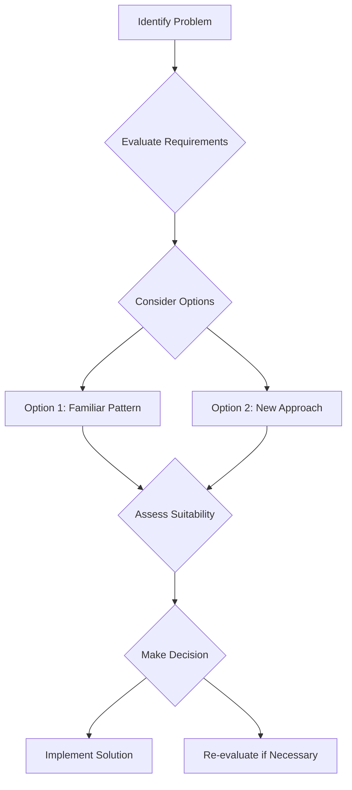

## 12.5. Golden Hammer

In the realm of software design, the term **Golden Hammer** refers to an anti-pattern where a developer or team becomes overly reliant on a familiar tool, technique, or pattern, applying it to every problem regardless of its suitability. This phenomenon can lead to suboptimal solutions, increased complexity, and reduced adaptability. In this section, we will delve into the intricacies of the Golden Hammer anti-pattern, explore its causes and consequences, and provide strategies for avoiding its pitfalls. We'll also discuss how to choose the right tool for the job, ensuring that your software designs are both effective and efficient.

### Understanding the Golden Hammer Anti-Pattern

The phrase "Golden Hammer" originates from the adage, "If all you have is a hammer, everything looks like a nail." In software development, this translates to the tendency to apply a familiar solution to every problem, even when it may not be the best fit. This can occur at various levels, from individual developers to entire teams or organizations.

#### Key Characteristics

- **Over-Reliance on Familiar Solutions:** Developers may default to using a particular design pattern, library, or technology stack because they are comfortable with it, rather than because it is the most appropriate choice.
- **Lack of Exploration:** There may be a reluctance to explore new tools or techniques, leading to missed opportunities for innovation and improvement.
- **Inflexibility:** Solutions become rigid and difficult to adapt to changing requirements or environments.

#### Causes of the Golden Hammer

1. **Comfort and Familiarity:** Developers often gravitate towards tools and patterns they are familiar with, as this can reduce the perceived risk and effort involved in solving a problem.
2. **Time Constraints:** Tight deadlines may encourage the use of known solutions, as exploring alternatives can be time-consuming.
3. **Organizational Culture:** A culture that discourages experimentation or penalizes failure can lead to a reliance on tried-and-tested methods.
4. **Lack of Knowledge:** Developers may not be aware of other potential solutions or may lack the skills to implement them effectively.

### Consequences of the Golden Hammer

The overuse of familiar patterns can have several negative consequences:

- **Inefficiency:** Applying an inappropriate solution can lead to inefficient code, increased resource consumption, and slower performance.
- **Complexity:** Using a one-size-fits-all approach can result in convoluted designs that are difficult to understand and maintain.
- **Stagnation:** A lack of innovation and adaptability can hinder the growth and evolution of a software system, making it difficult to meet new challenges or requirements.
- **Technical Debt:** Over time, the accumulation of suboptimal solutions can lead to significant technical debt, requiring costly refactoring or re-engineering efforts.

### Recognizing the Golden Hammer in Your Projects

To avoid falling into the Golden Hammer trap, it's important to recognize the signs that it may be occurring in your projects:

- **Repetitive Use of the Same Pattern:** If you find yourself or your team repeatedly using the same design pattern or technology, regardless of the problem at hand, it may be time to reassess your approach.
- **Resistance to Change:** A reluctance to consider new tools or techniques, even when they may offer clear benefits, can indicate a Golden Hammer mindset.
- **Feedback from Peers:** Colleagues or stakeholders may express concerns about the suitability of your chosen solutions or suggest alternatives that you have not considered.

### Strategies for Avoiding the Golden Hammer

To prevent the overuse of familiar patterns, consider the following strategies:

#### 1. **Encourage Continuous Learning**

Promote a culture of continuous learning and exploration within your team or organization. Encourage developers to stay up-to-date with the latest trends and technologies, and provide opportunities for them to experiment with new tools and techniques.

#### 2. **Foster a Growth Mindset**

Cultivate a growth mindset that embraces experimentation and learning from failure. Encourage developers to take calculated risks and explore new solutions, even if they may not always succeed.

#### 3. **Conduct Regular Reviews**

Implement regular design and code reviews to assess the suitability of chosen solutions. Encourage constructive feedback and open discussions about alternative approaches.

#### 4. **Diversify Your Toolbox**

Ensure that your team has access to a diverse set of tools and technologies. Encourage developers to explore and learn new tools, and provide training and resources to support their growth.

#### 5. **Evaluate Each Problem Individually**

Approach each problem with a fresh perspective, evaluating the specific requirements and constraints before selecting a solution. Consider multiple options and weigh their pros and cons before making a decision.

### Choosing the Right Tool for the Job

Selecting the right tool or pattern for a given problem is a critical skill for software developers. Here are some guidelines to help you make informed decisions:

#### 1. **Understand the Problem Domain**

Before selecting a tool or pattern, take the time to thoroughly understand the problem domain. Identify the key requirements, constraints, and goals of the project, and consider how different solutions may address them.

#### 2. **Consider the Trade-offs**

Every tool or pattern comes with its own set of trade-offs. Consider factors such as performance, scalability, maintainability, and ease of use when evaluating potential solutions.

#### 3. **Leverage Existing Knowledge**

While it's important to avoid over-reliance on familiar solutions, leveraging existing knowledge and expertise can be beneficial. Consider how your team's skills and experience align with different tools and patterns.

#### 4. **Prototype and Experiment**

Before committing to a particular solution, consider creating prototypes or conducting experiments to test its suitability. This can help you identify potential issues and refine your approach before investing significant time and resources.

#### 5. **Seek Input from Others**

Collaborate with colleagues and stakeholders to gather diverse perspectives and insights. Consider their feedback and suggestions when evaluating potential solutions.

### Code Example: Avoiding the Golden Hammer

Let's explore a simple example to illustrate the concept of avoiding the Golden Hammer. Suppose we have a requirement to process a collection of data and perform some operations on each element. A developer familiar with object-oriented programming might instinctively reach for the **Iterator Pattern** to solve this problem. However, in a functional programming context, a more appropriate solution might be to use **higher-order functions** such as `map` or `filter`.

#### Pseudocode Example

```pseudocode
// Object-Oriented Approach using Iterator Pattern
class DataProcessor {
    constructor(dataCollection) {
        this.dataCollection = dataCollection;
    }

    process() {
        let iterator = this.dataCollection.createIterator();
        while (iterator.hasNext()) {
            let element = iterator.next();
            this.performOperation(element);
        }
    }

    performOperation(element) {
        // Perform some operation on the element
    }
}

// Functional Approach using Higher-Order Functions
function processData(dataCollection, operation) {
    return dataCollection.map(operation);
}

// Example usage
let data = [1, 2, 3, 4, 5];
let result = processData(data, (element) => element * 2);
```

In this example, the functional approach using `map` is more concise and leverages the strengths of functional programming. By considering the specific context and requirements, we can avoid the Golden Hammer and choose the most appropriate solution.

### Visualizing the Golden Hammer

To further illustrate the concept of the Golden Hammer, let's use a diagram to visualize the decision-making process when selecting a tool or pattern.



**Diagram Description:** This flowchart represents the decision-making process for selecting a tool or pattern. It emphasizes the importance of evaluating requirements, considering multiple options, and assessing the suitability of each solution before making a decision.

### Try It Yourself

To reinforce your understanding of the Golden Hammer, try modifying the pseudocode example provided above. Experiment with different patterns or approaches to solve the same problem, and consider the trade-offs and benefits of each solution. Reflect on how your choices align with the principles discussed in this section.

### Knowledge Check

Before we conclude, let's pose a few questions to test your understanding of the Golden Hammer anti-pattern:

1. What are some common causes of the Golden Hammer anti-pattern?
2. How can you recognize the Golden Hammer in your projects?
3. What strategies can you use to avoid the Golden Hammer?
4. Why is it important to choose the right tool for the job?
5. How can prototyping and experimentation help in selecting a solution?

### Summary and Key Takeaways

In this section, we've explored the Golden Hammer anti-pattern, its causes, consequences, and strategies for avoidance. By recognizing the signs of the Golden Hammer and adopting a thoughtful, flexible approach to problem-solving, you can ensure that your software designs are both effective and adaptable. Remember, the key to avoiding the Golden Hammer is to remain open to new ideas, continuously learn and grow, and always choose the right tool for the job.

### Embrace the Journey

As you continue your journey in software development, remember that mastering design patterns and avoiding anti-patterns like the Golden Hammer is an ongoing process. Stay curious, embrace new challenges, and never stop learning. By doing so, you'll become a more versatile and effective developer, capable of tackling any problem that comes your way.

## Quiz Time!



### What is the Golden Hammer anti-pattern?

- [x] Over-reliance on a familiar tool or pattern for all problems
- [ ] A tool that solves all problems effectively
- [ ] A pattern that is universally applicable
- [ ] A design pattern for building hammers

> **Explanation:** The Golden Hammer anti-pattern refers to the tendency to use a familiar tool or pattern for all problems, regardless of its suitability.

### Which of the following is a consequence of the Golden Hammer?

- [x] Inefficiency
- [x] Increased complexity
- [ ] Improved performance
- [ ] Simplified design

> **Explanation:** The Golden Hammer can lead to inefficiency and increased complexity due to the inappropriate application of solutions.

### How can you recognize the Golden Hammer in your projects?

- [x] Repetitive use of the same pattern
- [x] Resistance to change
- [ ] Frequent experimentation
- [ ] Diverse tool usage

> **Explanation:** Signs of the Golden Hammer include repetitive use of the same pattern and resistance to change.

### What is a strategy to avoid the Golden Hammer?

- [x] Encourage continuous learning
- [ ] Stick to familiar solutions
- [ ] Avoid experimentation
- [ ] Use the same tool for all problems

> **Explanation:** Encouraging continuous learning helps prevent over-reliance on familiar solutions.

### Why is it important to choose the right tool for the job?

- [x] To ensure efficiency and effectiveness
- [ ] To reduce learning efforts
- [ ] To maintain consistency
- [ ] To avoid change

> **Explanation:** Choosing the right tool ensures that solutions are efficient and effective for the specific problem.

### What role does prototyping play in avoiding the Golden Hammer?

- [x] It helps test the suitability of solutions
- [ ] It guarantees the best solution
- [ ] It eliminates the need for decision-making
- [ ] It simplifies the problem

> **Explanation:** Prototyping allows testing and refining solutions before full implementation.

### How can fostering a growth mindset help avoid the Golden Hammer?

- [x] Encourages experimentation and learning from failure
- [ ] Promotes sticking to known solutions
- [ ] Discourages risk-taking
- [ ] Limits tool exploration

> **Explanation:** A growth mindset encourages experimentation and learning, reducing reliance on familiar solutions.

### What is a sign of the Golden Hammer in a team?

- [x] Reluctance to consider new tools
- [ ] Frequent tool updates
- [ ] Diverse problem-solving approaches
- [ ] Open discussions about alternatives

> **Explanation:** Reluctance to consider new tools is a sign of the Golden Hammer.

### What should you do before selecting a tool or pattern?

- [x] Understand the problem domain
- [ ] Choose the most popular tool
- [ ] Avoid consulting others
- [ ] Stick to past solutions

> **Explanation:** Understanding the problem domain is crucial for selecting the right tool or pattern.

### True or False: The Golden Hammer is a beneficial pattern in software design.

- [ ] True
- [x] False

> **Explanation:** The Golden Hammer is an anti-pattern, indicating over-reliance on familiar solutions, which is not beneficial.


