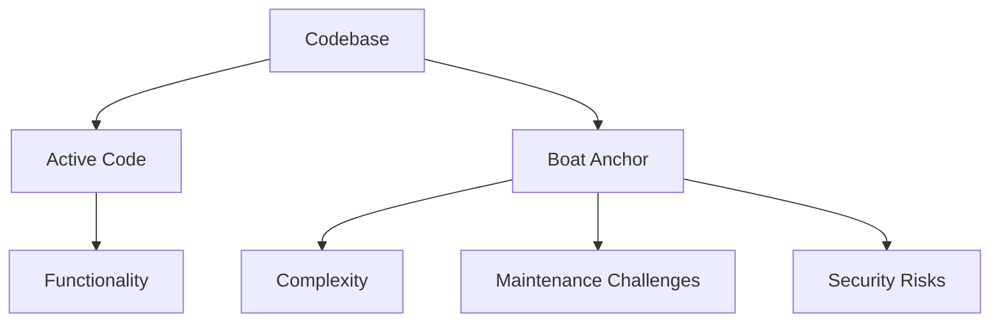

## 12.6. Boat Anchor

In the realm of software development, the term "Boat Anchor" refers to an anti-pattern where unused code or components are left in the system, contributing to unnecessary complexity and potential maintenance challenges. This section delves into the intricacies of the Boat Anchor anti-pattern, offering insights into its identification, implications, and strategies for removal.

### Understanding the Boat Anchor Anti-Pattern

#### Definition and Origin

The Boat Anchor anti-pattern derives its name from the nautical metaphor of an anchor that serves no purpose other than to weigh down a boat. Similarly, in software, a Boat Anchor is any piece of code, library, or component that is no longer used but remains in the codebase, unnecessarily complicating the system.

#### Key Characteristics

- **Unused Code**: Code that is no longer invoked or required by the application.
- **Dead Code**: Segments that are never executed due to logic changes or feature removals.
- **Obsolete Libraries**: External dependencies that are no longer utilized but still included.
- **Redundant Components**: Modules or classes that have been superseded by newer implementations.

### The Impact of Boat Anchors

#### Increased Complexity

Boat Anchors contribute to the overall complexity of a software system, making it harder to understand and maintain. They can obscure the true functionality of the codebase, leading to confusion and errors.

#### Maintenance Challenges

Unused code can become a breeding ground for bugs, as developers may inadvertently modify or rely on it without realizing its obsolescence. It also increases the cognitive load on developers, who must sift through irrelevant code to find what they need.

#### Performance Implications

While unused code itself may not directly impact performance, it can lead to larger binaries, increased memory usage, and longer build times, especially if the code is part of a larger library or framework.

#### Security Risks

Obsolete code can introduce security vulnerabilities, as it may not be subject to the same scrutiny and updates as active code. This can leave the system exposed to exploits that target outdated components.

### Identifying Boat Anchors

#### Code Analysis Tools

Utilize static analysis tools to scan the codebase for unused variables, functions, and classes. These tools can provide reports highlighting potential Boat Anchors.

#### Code Reviews

Incorporate regular code reviews into the development process to identify and discuss unused code. Peer reviews can be an effective way to catch Boat Anchors that automated tools might miss.

#### Dependency Management

Regularly audit external dependencies to ensure they are still necessary. Tools like dependency checkers can help identify libraries that are no longer used.

### Strategies for Removing Boat Anchors

#### Refactoring

Refactoring involves restructuring existing code without changing its external behavior. This process can help remove unused code and improve the overall design of the system.

```pseudocode
// Pseudocode Example of Refactoring to Remove Boat Anchors

class PaymentProcessor {
    // Old method, no longer used
    function processCreditCardPayment(cardDetails) {
        // Code to process payment
    }

    // New method in use
    function processPayment(paymentDetails) {
        // Code to process payment
    }
}

// Refactor by removing the unused method
class PaymentProcessor {
    function processPayment(paymentDetails) {
        // Code to process payment
    }
}
```

#### Documentation

Maintain up-to-date documentation that reflects the current state of the codebase. This can help prevent the introduction of new Boat Anchors and assist in identifying existing ones.

#### Automated Testing

Implement comprehensive automated tests to ensure that the removal of unused code does not affect the functionality of the application. This provides confidence that refactoring efforts are safe and effective.

### Visualizing the Impact of Boat Anchors

To better understand the impact of Boat Anchors on a software system, let's visualize the complexity they introduce using a Mermaid.js diagram.



**Diagram Explanation**: This diagram illustrates how Boat Anchors, represented as unused code within the codebase, contribute to increased complexity, maintenance challenges, and security risks, while the active code provides the desired functionality.

### Try It Yourself

To truly grasp the concept of Boat Anchors, try the following exercise:

1. **Identify Unused Code**: Choose a project you are familiar with and use a static analysis tool to identify unused code.
2. **Refactor the Codebase**: Remove the identified Boat Anchors and refactor the code to improve clarity and maintainability.
3. **Run Tests**: Execute your test suite to ensure that the functionality remains intact after the removal of unused code.
4. **Document Changes**: Update the project documentation to reflect the current state of the codebase.

### Design Considerations

When dealing with Boat Anchors, consider the following:

- **Risk Assessment**: Evaluate the risk of removing unused code, especially in legacy systems where the impact may not be immediately apparent.
- **Version Control**: Use version control systems to track changes and facilitate rollback if necessary.
- **Team Communication**: Ensure that all team members are aware of the refactoring efforts and understand the rationale behind removing unused code.

### Differences and Similarities with Other Anti-Patterns

#### Similarities with Lava Flow

Both Boat Anchors and Lava Flow involve remnants of obsolete code. However, Lava Flow is characterized by code that is difficult to remove due to its entanglement with active code, whereas Boat Anchors are typically isolated and easier to eliminate.

#### Differences from Dead Code

While Boat Anchors and Dead Code both refer to unused code, Dead Code specifically denotes code that is never executed, whereas Boat Anchors can include any unused components, such as libraries or modules.

### Knowledge Check

Let's reinforce our understanding with a few questions:

- What are the potential risks of leaving Boat Anchors in a codebase?
- How can static analysis tools assist in identifying Boat Anchors?
- Why is it important to maintain up-to-date documentation when dealing with Boat Anchors?

### Embrace the Journey

Remember, removing Boat Anchors is an ongoing process that requires vigilance and dedication. As you continue to refine your codebase, you'll find that eliminating unnecessary complexity not only improves the quality of your software but also enhances your skills as a developer. Keep experimenting, stay curious, and enjoy the journey!

## Quiz Time!



### What is a Boat Anchor in software development?

- [x] Unused code or components that add unnecessary complexity
- [ ] A design pattern for managing resources
- [ ] A method for optimizing performance
- [ ] A tool for code analysis

> **Explanation:** A Boat Anchor refers to unused code or components that remain in the system, adding unnecessary complexity.

### How do Boat Anchors affect software maintenance?

- [x] They increase the cognitive load on developers
- [ ] They improve code readability
- [ ] They enhance system performance
- [ ] They simplify debugging

> **Explanation:** Boat Anchors increase the cognitive load on developers as they must sift through irrelevant code to find what they need, complicating maintenance.

### Which tool can help identify unused code in a codebase?

- [x] Static analysis tools
- [ ] Code obfuscators
- [ ] Performance profilers
- [ ] Debuggers

> **Explanation:** Static analysis tools can scan the codebase for unused variables, functions, and classes, helping to identify Boat Anchors.

### What is a key characteristic of a Boat Anchor?

- [x] It is no longer used but remains in the codebase
- [ ] It is a critical component of the system
- [ ] It improves code efficiency
- [ ] It is frequently updated

> **Explanation:** A Boat Anchor is characterized by being no longer used but still present in the codebase, contributing to unnecessary complexity.

### What should be done after removing Boat Anchors?

- [x] Run automated tests to ensure functionality remains intact
- [ ] Ignore the changes and move on
- [x] Update documentation to reflect the current state
- [ ] Reintroduce the unused code if needed

> **Explanation:** After removing Boat Anchors, it's important to run automated tests to ensure functionality remains intact and update documentation to reflect the current state.

### What is a similarity between Boat Anchors and Lava Flow?

- [x] Both involve remnants of obsolete code
- [ ] Both are critical design patterns
- [ ] Both improve system performance
- [ ] Both simplify code maintenance

> **Explanation:** Both Boat Anchors and Lava Flow involve remnants of obsolete code, although they differ in their entanglement with active code.

### Why is it important to use version control when removing Boat Anchors?

- [x] To track changes and facilitate rollback if necessary
- [ ] To permanently delete all unused code
- [x] To ensure team members are aware of changes
- [ ] To prevent any future code modifications

> **Explanation:** Version control is important for tracking changes, facilitating rollback if necessary, and ensuring team members are aware of changes.

### What is a difference between Boat Anchors and Dead Code?

- [x] Dead Code is never executed, whereas Boat Anchors can include unused components
- [ ] Boat Anchors are always executed
- [ ] Dead Code improves system performance
- [ ] Boat Anchors are critical for system functionality

> **Explanation:** Dead Code specifically denotes code that is never executed, whereas Boat Anchors can include any unused components, such as libraries or modules.

### How can code reviews help in identifying Boat Anchors?

- [x] By allowing peers to discuss and identify unused code
- [ ] By automatically removing unused code
- [ ] By optimizing code performance
- [ ] By simplifying code logic

> **Explanation:** Code reviews allow peers to discuss and identify unused code, helping to catch Boat Anchors that automated tools might miss.

### True or False: Boat Anchors can introduce security vulnerabilities.

- [x] True
- [ ] False

> **Explanation:** True. Obsolete code can introduce security vulnerabilities, as it may not be subject to the same scrutiny and updates as active code.


