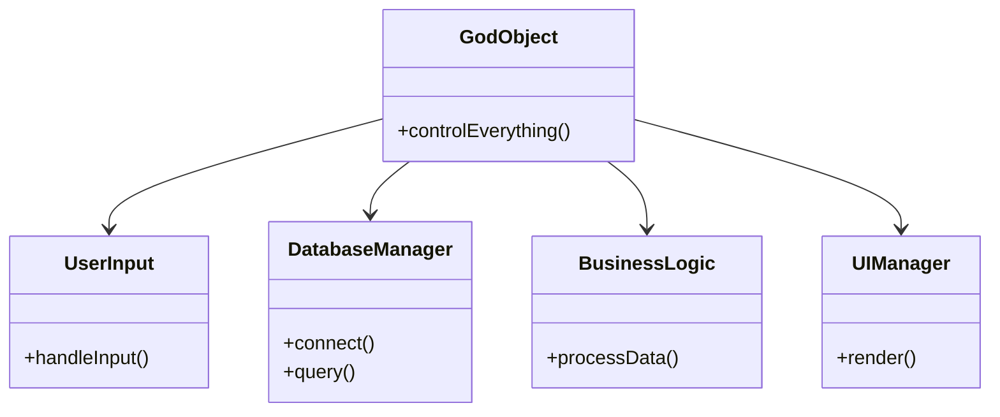

## 12.7. Dead End Patterns

In the realm of software development, design patterns serve as time-tested solutions to common problems. However, not all patterns lead to success. Some patterns, known as "Dead End Patterns," can lead to suboptimal or even detrimental outcomes if not recognized and addressed promptly. In this section, we will explore the concept of Dead End Patterns, how to identify them, and strategies for recovery.

### Understanding Dead End Patterns

Dead End Patterns are design patterns or practices that initially seem beneficial but ultimately lead to a point where further development becomes difficult or impossible without significant refactoring. These patterns often arise from a combination of poor design choices, lack of foresight, and evolving requirements that the original design cannot accommodate.

#### Characteristics of Dead End Patterns

1. **Lack of Scalability**: The design cannot accommodate growth or increased complexity.
2. **Rigid Structure**: The design is inflexible, making changes difficult and costly.
3. **High Maintenance Cost**: Frequent changes lead to increased maintenance efforts.
4. **Poor Performance**: The design results in inefficient resource usage or slow execution.
5. **Limited Reusability**: The design is too specific, limiting its applicability in different contexts.

### Recognizing Dead End Patterns

Identifying Dead End Patterns early in the development process is crucial to prevent long-term issues. Here are some common indicators:

- **Frequent Refactoring**: If you find yourself constantly refactoring the same part of the codebase, it may be a sign of a Dead End Pattern.
- **Complex Dependencies**: A web of dependencies that makes understanding and modifying the code difficult.
- **Code Duplication**: Repeated code blocks that indicate a lack of abstraction.
- **Inconsistent Behavior**: Different parts of the system behave unpredictably due to tightly coupled components.

#### Example of a Dead End Pattern: The God Object

The God Object is a classic example of a Dead End Pattern. It refers to a single class that knows too much or does too much, resulting in a monolithic and unmanageable code structure.

**Key Characteristics**:
- Centralized control over many aspects of the application.
- High coupling with other components.
- Difficult to test and maintain.

**Pseudocode Example**:

```pseudocode
class GodObject {
    function controlEverything() {
        // Handles user input
        // Manages database connections
        // Processes business logic
        // Renders UI components
    }
}
```

**Consequences**:
- Changes in one area can have unintended effects elsewhere.
- Difficult to isolate and fix bugs.
- Hard to extend or modify without breaking existing functionality.

### Strategies for Recovery

Recovering from a Dead End Pattern requires a thoughtful approach to refactoring and redesign. Here are some strategies to consider:

#### 1. **Incremental Refactoring**

Break down the refactoring process into manageable steps. Focus on one aspect of the design at a time to minimize disruption.

**Steps**:
- Identify the most problematic areas.
- Refactor small, isolated parts of the code.
- Continuously test to ensure functionality remains intact.

#### 2. **Decoupling Components**

Reduce dependencies between components to increase flexibility and reusability.

**Approach**:
- Use interfaces or abstract classes to define clear boundaries.
- Implement dependency injection to manage component interactions.
- Separate concerns by adhering to the Single Responsibility Principle.

**Pseudocode Example**:

```pseudocode
interface UserInputHandler {
    function handleInput(input);
}

class UserInput implements UserInputHandler {
    function handleInput(input) {
        // Process input
    }
}

class Application {
    private UserInputHandler inputHandler;

    function __construct(UserInputHandler handler) {
        this.inputHandler = handler;
    }

    function run() {
        // Use inputHandler to process input
    }
}
```

#### 3. **Enhancing Modularity**

Design the system in a way that allows individual components to be developed, tested, and deployed independently.

**Techniques**:
- Use modular design patterns such as the Microservices Architecture.
- Implement feature toggles to enable or disable components without affecting the entire system.

#### 4. **Improving Abstraction**

Increase the level of abstraction to simplify complex logic and reduce duplication.

**Methods**:
- Identify common patterns and extract them into reusable functions or classes.
- Use design patterns such as Strategy or Template Method to encapsulate varying behavior.

**Pseudocode Example**:

```pseudocode
abstract class PaymentProcessor {
    function processPayment(amount) {
        // Common payment processing logic
        this.executeTransaction(amount);
    }

    abstract function executeTransaction(amount);
}

class CreditCardProcessor extends PaymentProcessor {
    function executeTransaction(amount) {
        // Specific logic for credit card transactions
    }
}

class PayPalProcessor extends PaymentProcessor {
    function executeTransaction(amount) {
        // Specific logic for PayPal transactions
    }
}
```

#### 5. **Adopting Agile Practices**

Embrace Agile methodologies to adapt to changing requirements and improve collaboration.

**Practices**:
- Conduct regular code reviews to identify potential Dead End Patterns early.
- Use pair programming to share knowledge and improve code quality.
- Implement continuous integration and delivery to streamline the development process.

### Visualizing Dead End Patterns

To better understand how Dead End Patterns manifest in software design, let's visualize a common scenario using a class diagram.



**Diagram Description**: This class diagram illustrates the God Object pattern, where a single class (GodObject) has dependencies on multiple components (UserInput, DatabaseManager, BusinessLogic, UIManager), leading to a tightly coupled and unmanageable design.

### Differences and Similarities with Other Patterns

Dead End Patterns are often confused with other anti-patterns, such as Spaghetti Code or the Golden Hammer. While they share some similarities, it's important to distinguish between them:

- **Spaghetti Code**: Characterized by a lack of structure, leading to tangled and hard-to-follow code. Unlike Dead End Patterns, Spaghetti Code doesn't necessarily result from a specific design choice but rather from poor coding practices.
- **Golden Hammer**: Involves overusing a familiar tool or pattern, regardless of its suitability. Dead End Patterns, on the other hand, arise from designs that initially seem appropriate but become problematic over time.

### Knowledge Check

To reinforce your understanding of Dead End Patterns, consider the following questions:

1. What are some common characteristics of Dead End Patterns?
2. How can you identify a Dead End Pattern in your codebase?
3. What strategies can help you recover from a Dead End Pattern?
4. How does the God Object pattern exemplify a Dead End Pattern?
5. What are the differences between Dead End Patterns and other anti-patterns like Spaghetti Code?

### Try It Yourself

To deepen your understanding, try modifying the pseudocode examples provided. For instance, refactor the God Object example to decouple its responsibilities into separate classes. Experiment with different design patterns to see how they can improve the code structure.

### Conclusion

Dead End Patterns are a significant challenge in software development, but they can be overcome with careful analysis and strategic refactoring. By recognizing these patterns early and applying the strategies outlined in this section, you can enhance the scalability, maintainability, and performance of your software designs. Remember, the journey to mastering design patterns is ongoing. Stay curious, keep experimenting, and embrace the learning process.

## Quiz Time!



### What is a common characteristic of Dead End Patterns?

- [x] Lack of scalability
- [ ] High performance
- [ ] Simple structure
- [ ] Easy maintenance

> **Explanation:** Dead End Patterns often lack scalability, making it difficult to accommodate growth or increased complexity.


### Which of the following is a sign of a Dead End Pattern?

- [x] Frequent refactoring of the same code
- [ ] High test coverage
- [ ] Modular design
- [ ] Clear documentation

> **Explanation:** Frequent refactoring of the same code can indicate a Dead End Pattern, as it suggests underlying design issues.


### What is a key strategy for recovering from a Dead End Pattern?

- [x] Incremental refactoring
- [ ] Ignoring the problem
- [ ] Adding more features
- [ ] Increasing team size

> **Explanation:** Incremental refactoring involves breaking down the refactoring process into manageable steps, focusing on one aspect at a time.


### How does the God Object pattern exemplify a Dead End Pattern?

- [x] It centralizes control and creates high coupling
- [ ] It improves modularity
- [ ] It enhances performance
- [ ] It simplifies testing

> **Explanation:** The God Object pattern centralizes control and creates high coupling, leading to a monolithic and unmanageable code structure.


### What is the difference between Dead End Patterns and Spaghetti Code?

- [x] Dead End Patterns result from specific design choices, while Spaghetti Code arises from poor coding practices
- [ ] Both are the same
- [ ] Spaghetti Code is more structured
- [ ] Dead End Patterns are easier to fix

> **Explanation:** Dead End Patterns result from specific design choices that become problematic over time, whereas Spaghetti Code arises from a lack of structure and poor coding practices.


### Which design pattern can help decouple components in a Dead End Pattern?

- [x] Dependency Injection
- [ ] Singleton
- [ ] God Object
- [ ] Spaghetti Code

> **Explanation:** Dependency Injection can help decouple components by managing component interactions and reducing dependencies.


### What is a benefit of enhancing modularity in software design?

- [x] Independent development and deployment of components
- [ ] Increased complexity
- [ ] Higher maintenance cost
- [ ] Tight coupling

> **Explanation:** Enhancing modularity allows for the independent development, testing, and deployment of components, improving flexibility and maintainability.


### How can Agile practices help in recovering from Dead End Patterns?

- [x] By adapting to changing requirements and improving collaboration
- [ ] By increasing documentation
- [ ] By reducing testing
- [ ] By ignoring design issues

> **Explanation:** Agile practices help adapt to changing requirements and improve collaboration, facilitating the recovery from Dead End Patterns.


### What is a common pitfall of the God Object pattern?

- [x] Difficult to isolate and fix bugs
- [ ] High performance
- [ ] Low coupling
- [ ] Easy to extend

> **Explanation:** The God Object pattern makes it difficult to isolate and fix bugs due to its centralized control and high coupling.


### True or False: Dead End Patterns are easy to identify and fix.

- [ ] True
- [x] False

> **Explanation:** Dead End Patterns can be challenging to identify and fix, as they often arise from complex dependencies and poor design choices.


