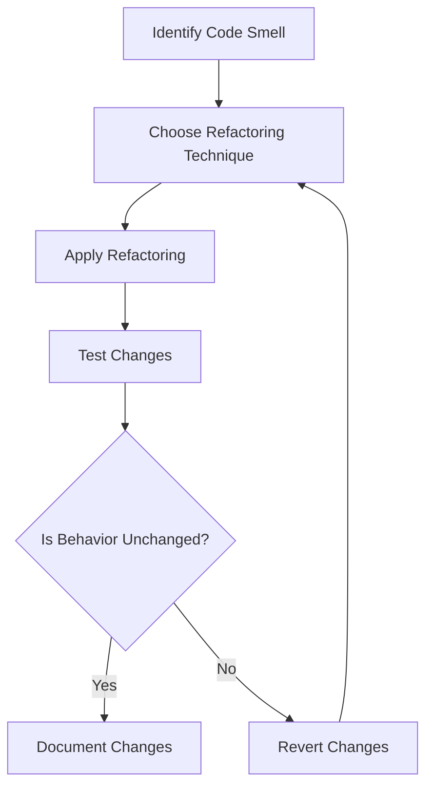

## 13.1. Introduction to Refactoring

In the realm of software development, refactoring stands as a pivotal practice that enhances the internal structure of code without altering its external behavior. This process is akin to renovating a house: while the outward appearance remains unchanged, the internal layout and functionality are significantly improved. Refactoring is essential for maintaining clean, efficient, and maintainable code, which in turn supports the longevity and scalability of software systems.

### Understanding Refactoring

Refactoring is the disciplined technique of restructuring existing code, improving its readability, and reducing complexity while preserving its functionality. This practice is not about fixing bugs or adding new features; instead, it focuses on enhancing the code's structure and clarity. By doing so, developers can make the codebase easier to understand, modify, and extend.

#### Key Objectives of Refactoring

1. **Enhance Readability:** Clear and understandable code is easier to maintain and less prone to errors. Refactoring aims to make code more comprehensible by improving naming conventions, simplifying logic, and organizing code into coherent structures.

2. **Reduce Complexity:** Complex code is difficult to manage and can lead to errors. Refactoring simplifies code by breaking down intricate logic into smaller, manageable pieces, often using design patterns to achieve this goal.

3. **Improve Maintainability:** Code that is easy to read and understand is also easier to maintain. Refactoring ensures that the codebase remains adaptable to future changes, reducing the risk of introducing bugs during modifications.

4. **Optimize Performance:** While not the primary goal, refactoring can lead to performance improvements by eliminating redundant code, optimizing algorithms, and enhancing resource management.

5. **Facilitate Testing:** Well-structured code is easier to test. Refactoring can improve test coverage and make it simpler to write unit tests, thereby enhancing the overall reliability of the software.

### The Importance of Clean Code

Clean code is the foundation of robust software development. It is code that is easy to read, understand, and modify. Clean code adheres to established coding standards and best practices, making it accessible to other developers who may work on the project in the future.

#### Characteristics of Clean Code

- **Simplicity:** Clean code avoids unnecessary complexity. It is straightforward, with a clear and concise logic flow.
- **Consistency:** Consistent naming conventions, formatting, and style guide adherence make code predictable and easier to navigate.
- **Modularity:** Clean code is organized into modules or functions, each responsible for a single task or functionality.
- **Documentation:** While clean code often documents itself through clear naming and structure, additional comments and documentation can provide context and explanations where needed.

### Refactoring Techniques

Refactoring encompasses a variety of techniques that target different aspects of code improvement. These techniques can be applied individually or in combination, depending on the specific needs of the codebase.

#### Common Refactoring Techniques

1. **Extract Method:** This technique involves breaking down a large method into smaller, more manageable methods. Each extracted method should have a single responsibility, improving readability and reusability.

   ```pseudocode
   // Before Refactoring
   function calculateTotal(order) {
       let total = 0;
       for (item in order.items) {
           total += item.price * item.quantity;
       }
       total += order.tax;
       total -= order.discount;
       return total;
   }

   // After Refactoring
   function calculateTotal(order) {
       let total = calculateSubtotal(order.items);
       total += order.tax;
       total -= order.discount;
       return total;
   }

   function calculateSubtotal(items) {
       let subtotal = 0;
       for (item in items) {
           subtotal += item.price * item.quantity;
       }
       return subtotal;
   }
   ```

2. **Rename Variable:** Renaming variables to more descriptive names can significantly enhance code readability. This technique ensures that variable names convey their purpose and usage clearly.

   ```pseudocode
   // Before Refactoring
   let x = 10;

   // After Refactoring
   let maxRetries = 10;
   ```

3. **Inline Method:** This technique involves replacing a method call with the method's content. It is useful when a method is trivial and does not add significant value.

   ```pseudocode
   // Before Refactoring
   function getBasePrice() {
       return 100;
   }

   let price = getBasePrice();

   // After Refactoring
   let price = 100;
   ```

4. **Move Method:** Moving a method to a more appropriate class or module can improve code organization and cohesion. This technique is often used when a method is more relevant to another class.

   ```pseudocode
   // Before Refactoring
   class Order {
       function calculateShipping() {
           // Shipping calculation logic
       }
   }

   // After Refactoring
   class ShippingCalculator {
       function calculate(order) {
           // Shipping calculation logic
       }
   }
   ```

5. **Replace Temp with Query:** This technique involves replacing temporary variables with method calls. It enhances code clarity by eliminating unnecessary variables and encapsulating logic within methods.

   ```pseudocode
   // Before Refactoring
   let basePrice = quantity * itemPrice;
   if (basePrice > 1000) {
       // Apply discount
   }

   // After Refactoring
   if (calculateBasePrice(quantity, itemPrice) > 1000) {
       // Apply discount
   }

   function calculateBasePrice(quantity, itemPrice) {
       return quantity * itemPrice;
   }
   ```

### Visualizing Refactoring

To better understand the refactoring process, let's visualize a simple refactoring scenario using a flowchart. This diagram illustrates the steps involved in refactoring a piece of code, from identifying the need for refactoring to verifying the changes.



**Diagram Explanation:** This flowchart outlines the refactoring process. It begins with identifying a code smell, selecting an appropriate refactoring technique, applying the changes, and testing to ensure behavior remains unchanged. If the behavior changes, the changes are reverted, and the process is repeated. Successful refactoring is documented for future reference.

### When to Refactor

Refactoring should be an integral part of the development process, not an afterthought. However, knowing when to refactor is crucial to avoid unnecessary changes and maintain productivity.

#### Ideal Times to Refactor

- **Before Adding New Features:** Refactoring before implementing new features ensures that the codebase is in a clean state, reducing the risk of introducing bugs.
- **After Fixing Bugs:** Once a bug is fixed, refactoring can help prevent similar issues in the future by improving code clarity and structure.
- **During Code Reviews:** Code reviews are an excellent opportunity to identify areas for improvement and refactor code collaboratively.
- **When Code Smells Emerge:** Code smells, such as duplicated code, long methods, and large classes, are indicators that refactoring is needed.

### Challenges and Considerations

While refactoring offers numerous benefits, it also presents challenges that developers must navigate carefully.

#### Common Challenges

1. **Time Constraints:** Refactoring can be time-consuming, especially in large codebases. Balancing refactoring with other development tasks requires careful planning and prioritization.

2. **Risk of Introducing Bugs:** Although refactoring aims to preserve behavior, changes can inadvertently introduce bugs. Comprehensive testing is essential to mitigate this risk.

3. **Resistance to Change:** Developers may be resistant to refactoring, especially if they are unfamiliar with the codebase or the benefits of refactoring. Encouraging a culture of continuous improvement can help overcome this resistance.

4. **Lack of Automated Tests:** Automated tests provide a safety net during refactoring. Without them, verifying that behavior remains unchanged becomes more challenging.

### Best Practices for Refactoring

To maximize the benefits of refactoring and minimize potential pitfalls, developers should adhere to best practices.

#### Recommended Practices

- **Refactor Incrementally:** Break down refactoring tasks into small, manageable changes. This approach reduces the risk of introducing errors and makes it easier to track progress.

- **Maintain Comprehensive Tests:** Automated tests are crucial for verifying that refactoring does not alter behavior. Ensure that tests cover all critical functionality and edge cases.

- **Document Changes:** Keep a record of refactoring changes, including the rationale and impact. Documentation aids in knowledge sharing and future maintenance.

- **Collaborate with Peers:** Engage in code reviews and pair programming to gain insights and feedback from fellow developers. Collaboration fosters a culture of continuous improvement.

- **Embrace Continuous Integration:** Integrate refactoring into the continuous integration process to ensure that changes are tested and validated automatically.

### Try It Yourself

To practice refactoring, take a piece of code from a personal project or an open-source repository and apply the techniques discussed. Start by identifying code smells and choose appropriate refactoring techniques to improve the code. Test your changes to ensure behavior remains unchanged, and document your process and findings.

### Conclusion

Refactoring is a vital practice in software development that enhances code quality, readability, and maintainability without changing its external behavior. By embracing refactoring, developers can ensure that their code remains clean, efficient, and adaptable to future changes. Remember, refactoring is not a one-time task but an ongoing process that contributes to the overall health and longevity of software systems.

---

## Quiz Time!



### What is the primary goal of refactoring?

- [x] Improve code structure without changing behavior
- [ ] Fix bugs in the code
- [ ] Add new features to the code
- [ ] Optimize code for performance

> **Explanation:** The primary goal of refactoring is to improve the internal structure of the code without altering its external behavior.

### Which of the following is a common refactoring technique?

- [x] Extract Method
- [ ] Debugging
- [ ] Code Compilation
- [ ] Feature Addition

> **Explanation:** Extract Method is a common refactoring technique used to break down large methods into smaller, more manageable ones.

### What is a code smell?

- [x] An indicator of potential issues in the code
- [ ] A bug in the code
- [ ] A feature request
- [ ] A performance optimization

> **Explanation:** A code smell is an indicator of potential issues in the code that may require refactoring.

### When is it ideal to refactor code?

- [x] Before adding new features
- [x] After fixing bugs
- [ ] During feature development
- [ ] After code compilation

> **Explanation:** Refactoring is ideal before adding new features and after fixing bugs to ensure the codebase is clean and maintainable.

### What is a challenge of refactoring?

- [x] Risk of introducing bugs
- [ ] Improved code readability
- [ ] Enhanced performance
- [ ] Simplified logic

> **Explanation:** One challenge of refactoring is the risk of introducing bugs, which requires comprehensive testing to mitigate.

### What does the "Extract Method" technique involve?

- [x] Breaking down a large method into smaller ones
- [ ] Combining multiple methods into one
- [ ] Renaming variables for clarity
- [ ] Moving methods to different classes

> **Explanation:** The Extract Method technique involves breaking down a large method into smaller, more manageable methods.

### Why is clean code important?

- [x] It enhances readability and maintainability
- [ ] It increases code execution speed
- [ ] It reduces the need for documentation
- [ ] It eliminates all bugs

> **Explanation:** Clean code enhances readability and maintainability, making it easier to understand and modify.

### What is a benefit of automated tests during refactoring?

- [x] They verify that behavior remains unchanged
- [ ] They increase code complexity
- [ ] They replace the need for manual testing
- [ ] They eliminate all code smells

> **Explanation:** Automated tests verify that behavior remains unchanged during refactoring, providing a safety net for changes.

### What should be documented during refactoring?

- [x] Changes made and their rationale
- [ ] Only the final code
- [ ] The original code state
- [ ] Test results

> **Explanation:** Documenting changes made and their rationale aids in knowledge sharing and future maintenance.

### True or False: Refactoring should only be done when there are visible issues in the code.

- [ ] True
- [x] False

> **Explanation:** Refactoring should be an ongoing process, not limited to when visible issues arise. It helps maintain clean and efficient code.


