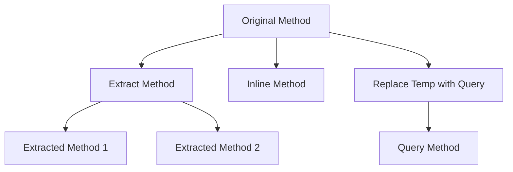

## 13.2. Composing Methods

In the realm of software development, composing methods is a crucial refactoring technique that enhances code readability, maintainability, and reusability. By breaking down complex methods into smaller, more manageable pieces, developers can create code that is easier to understand and modify. This section delves into three essential refactoring techniques: Extract Method, Inline Method, and Replace Temp with Query. Each technique serves a unique purpose and offers distinct benefits, making them invaluable tools in a developer's arsenal.

### Introduction to Composing Methods

Composing methods involves restructuring existing code to improve its structure without altering its external behavior. This practice is essential for maintaining high-quality codebases, as it allows developers to simplify complex logic, reduce duplication, and enhance the overall design of the software. By applying composing methods, developers can achieve a more modular and cohesive code structure, facilitating easier maintenance and future enhancements.

### Extract Method

#### Intent

The Extract Method refactoring technique aims to decompose a large, complex method into smaller, more focused methods. This approach enhances code readability and promotes code reuse by isolating specific functionality into distinct methods.

#### Key Participants

- **Original Method**: The method containing the logic to be extracted.
- **Extracted Method**: The new method created to encapsulate the extracted logic.

#### Applicability

Use the Extract Method when:

- A method is too long or complex, making it difficult to understand.
- A specific block of code is repeated in multiple places.
- A section of code can be given a meaningful name, improving readability.

#### Sample Code Snippets

Consider the following pseudocode example of a method that calculates the total price of items in a shopping cart, including tax:

```pseudocode
function calculateTotal(cart) {
    let total = 0;
    for each item in cart {
        total += item.price;
    }
    let tax = total * 0.1;
    total += tax;
    return total;
}
```

By applying the Extract Method technique, we can refactor the code as follows:

```pseudocode
function calculateTotal(cart) {
    let subtotal = calculateSubtotal(cart);
    let tax = calculateTax(subtotal);
    return subtotal + tax;
}

function calculateSubtotal(cart) {
    let total = 0;
    for each item in cart {
        total += item.price;
    }
    return total;
}

function calculateTax(subtotal) {
    return subtotal * 0.1;
}
```

In this refactored version, the `calculateSubtotal` and `calculateTax` methods encapsulate specific functionality, making the `calculateTotal` method more concise and easier to understand.

#### Design Considerations

- **Naming**: Choose meaningful names for extracted methods to convey their purpose clearly.
- **Parameters**: Ensure extracted methods receive the necessary parameters to function independently.
- **Visibility**: Consider the appropriate visibility (public, private, etc.) for extracted methods based on their usage context.

#### Differences and Similarities

The Extract Method technique is often compared to the Inline Method technique, as both involve method manipulation. However, while Extract Method focuses on breaking down methods, Inline Method aims to consolidate them.

### Inline Method

#### Intent

The Inline Method refactoring technique involves replacing a method call with the method's body. This approach is useful when a method's implementation is straightforward, and its abstraction adds unnecessary complexity.

#### Key Participants

- **Original Method**: The method to be inlined.
- **Calling Code**: The code that invokes the original method.

#### Applicability

Use the Inline Method when:

- A method is trivial and does not provide meaningful abstraction.
- The method is called only once, and inlining it simplifies the code.
- The method's name does not add clarity to its functionality.

#### Sample Code Snippets

Consider the following pseudocode example of a method that checks if a user is an administrator:

```pseudocode
function isAdmin(user) {
    return user.role == "admin";
}

function performAdminTask(user) {
    if (isAdmin(user)) {
        // Perform admin task
    }
}
```

By applying the Inline Method technique, we can refactor the code as follows:

```pseudocode
function performAdminTask(user) {
    if (user.role == "admin") {
        // Perform admin task
    }
}
```

In this refactored version, the `isAdmin` method is inlined, simplifying the `performAdminTask` method by removing an unnecessary abstraction.

#### Design Considerations

- **Readability**: Ensure that inlining a method does not reduce code readability.
- **Duplication**: Avoid inlining methods if it results in code duplication.
- **Complexity**: Consider the complexity of the inlined method's logic and whether it benefits from being a separate method.

#### Differences and Similarities

The Inline Method technique contrasts with the Extract Method technique, as it focuses on consolidating methods rather than decomposing them.

### Replace Temp with Query

#### Intent

The Replace Temp with Query refactoring technique involves replacing temporary variables with method calls. This approach enhances code clarity by eliminating intermediate variables and directly expressing the logic.

#### Key Participants

- **Temporary Variable**: The variable to be replaced.
- **Query Method**: The method that encapsulates the logic previously assigned to the temporary variable.

#### Applicability

Use Replace Temp with Query when:

- A temporary variable is used to store the result of an expression that can be encapsulated in a method.
- The logic assigned to the temporary variable is complex and benefits from being named.
- The temporary variable is used in multiple places, and a method call improves readability.

#### Sample Code Snippets

Consider the following pseudocode example of a method that calculates the discounted price of an item:

```pseudocode
function calculateDiscountedPrice(item) {
    let discount = item.price * 0.1;
    let discountedPrice = item.price - discount;
    return discountedPrice;
}
```

By applying the Replace Temp with Query technique, we can refactor the code as follows:

```pseudocode
function calculateDiscountedPrice(item) {
    return item.price - calculateDiscount(item);
}

function calculateDiscount(item) {
    return item.price * 0.1;
}
```

In this refactored version, the `calculateDiscount` method replaces the temporary variable `discount`, making the code more expressive and easier to understand.

#### Design Considerations

- **Performance**: Consider the performance implications of replacing temporary variables with method calls, especially in performance-critical code.
- **Naming**: Choose descriptive names for query methods to convey their purpose clearly.
- **Reusability**: Query methods can be reused across different parts of the codebase, promoting consistency.

#### Differences and Similarities

The Replace Temp with Query technique is similar to the Extract Method technique, as both involve creating methods to encapsulate logic. However, Replace Temp with Query specifically targets temporary variables.

### Visualizing Method Composition

To better understand the process of composing methods, let's visualize the transformation of a complex method into smaller, more manageable pieces using a flowchart.



**Figure 1: Visualizing Method Composition**

In this flowchart, the original method undergoes various transformations, including extracting methods, inlining methods, and replacing temporary variables with query methods. Each transformation contributes to a more modular and cohesive code structure.

### Try It Yourself

To reinforce your understanding of composing methods, try applying these techniques to a sample codebase. Start with a complex method and identify opportunities to extract methods, inline methods, and replace temporary variables with query methods. Experiment with different approaches and observe how they impact code readability and maintainability.

### Knowledge Check

Before we conclude, let's test your understanding of composing methods with a few questions:

1. What is the primary goal of the Extract Method technique?
2. When should you consider using the Inline Method technique?
3. How does the Replace Temp with Query technique improve code clarity?
4. What are the key considerations when choosing method names for extracted methods?
5. How can composing methods enhance code maintainability?

### Conclusion

Composing methods is a powerful refactoring technique that enables developers to create cleaner, more maintainable code. By mastering techniques such as Extract Method, Inline Method, and Replace Temp with Query, developers can enhance code readability, reduce duplication, and promote code reuse. Remember, this is just the beginning. As you progress, you'll build more complex and interactive software systems. Keep experimenting, stay curious, and enjoy the journey!

## Quiz Time!



### What is the primary goal of the Extract Method technique?

- [x] To decompose a large, complex method into smaller, more focused methods.
- [ ] To replace a method call with the method's body.
- [ ] To replace temporary variables with method calls.
- [ ] To consolidate multiple methods into one.

> **Explanation:** The Extract Method technique aims to break down complex methods into smaller, more manageable pieces, enhancing readability and promoting code reuse.

### When should you consider using the Inline Method technique?

- [x] When a method is trivial and does not provide meaningful abstraction.
- [ ] When a method is too long or complex.
- [ ] When a temporary variable is used to store the result of an expression.
- [ ] When a method is called multiple times.

> **Explanation:** Inline Method is used when a method's abstraction is unnecessary, and inlining it simplifies the code.

### How does the Replace Temp with Query technique improve code clarity?

- [x] By eliminating intermediate variables and directly expressing the logic.
- [ ] By consolidating multiple methods into one.
- [ ] By decomposing a large, complex method into smaller methods.
- [ ] By replacing a method call with the method's body.

> **Explanation:** Replace Temp with Query enhances clarity by removing temporary variables and using method calls to express logic directly.

### What are the key considerations when choosing method names for extracted methods?

- [x] Choose meaningful names that convey the method's purpose clearly.
- [ ] Use short, generic names to keep the code concise.
- [ ] Avoid using verbs in method names.
- [ ] Ensure method names are unique across the codebase.

> **Explanation:** Meaningful names help convey the purpose of extracted methods, improving code readability.

### How can composing methods enhance code maintainability?

- [x] By creating a more modular and cohesive code structure.
- [ ] By increasing the number of methods in the codebase.
- [ ] By reducing the need for comments in the code.
- [ ] By making methods longer and more detailed.

> **Explanation:** Composing methods enhances maintainability by promoting modularity and cohesion, making the code easier to understand and modify.

### Which technique involves replacing a method call with the method's body?

- [x] Inline Method
- [ ] Extract Method
- [ ] Replace Temp with Query
- [ ] Consolidate Method

> **Explanation:** Inline Method involves replacing a method call with the method's body, simplifying the code.

### What is a key benefit of using the Extract Method technique?

- [x] It promotes code reuse by isolating specific functionality.
- [ ] It reduces the number of methods in the codebase.
- [ ] It eliminates the need for temporary variables.
- [ ] It consolidates multiple methods into one.

> **Explanation:** Extract Method promotes code reuse by isolating specific functionality into distinct methods.

### When should you avoid using the Inline Method technique?

- [x] When inlining results in code duplication.
- [ ] When a method is trivial and does not provide meaningful abstraction.
- [ ] When a method is called only once.
- [ ] When a method's name does not add clarity.

> **Explanation:** Avoid inlining if it leads to code duplication, as it can reduce maintainability.

### What is the primary focus of the Replace Temp with Query technique?

- [x] Replacing temporary variables with method calls.
- [ ] Decomposing a large, complex method into smaller methods.
- [ ] Replacing a method call with the method's body.
- [ ] Consolidating multiple methods into one.

> **Explanation:** Replace Temp with Query focuses on replacing temporary variables with method calls to improve clarity.

### True or False: The Inline Method technique is used to break down complex methods into smaller pieces.

- [ ] True
- [x] False

> **Explanation:** False. The Inline Method technique is used to replace a method call with the method's body, not to break down methods.


