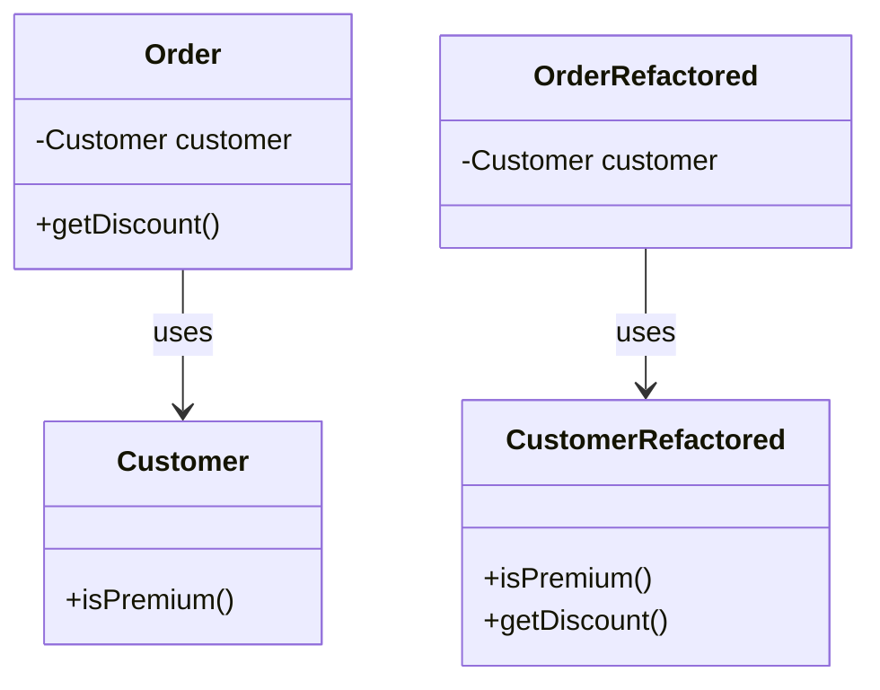

## 13.3. Moving Features Between Objects

In the realm of software design, the ability to refactor code efficiently is a crucial skill for expert developers. Refactoring involves restructuring existing code without altering its external behavior, thereby improving its readability, maintainability, and extensibility. One of the key aspects of refactoring is moving features between objects, which can be achieved through patterns such as Move Method, Move Field, Extract Class, and Inline Class. This section delves into these patterns, providing insights, pseudocode examples, and practical applications.

### Understanding the Need for Moving Features

Before diving into specific patterns, it's essential to understand why moving features between objects is necessary. As software evolves, classes can become bloated with responsibilities, leading to code that is difficult to manage and extend. By moving methods and fields to more appropriate classes, we can achieve a cleaner and more modular design. This process aligns with the Single Responsibility Principle (SRP) of the SOLID design principles, which advocates for classes to have only one reason to change.

### Move Method

#### Intent

The Move Method pattern is used when a method in a class uses more features of another class than its own. By moving the method to the class it interacts with the most, we enhance cohesion and reduce coupling.

#### Key Participants

- **Source Class**: The class where the method currently resides.
- **Target Class**: The class where the method will be moved to.

#### Applicability

Use the Move Method pattern when:

- A method in a class is more closely related to another class.
- The method accesses data from another class more frequently than its own.
- Moving the method will reduce dependencies between classes.

#### Sample Code Snippets

Here's a simple example to illustrate the Move Method pattern:

```pseudocode
// Before refactoring
class Order {
    Customer customer;

    function getDiscount() {
        if (customer.isPremium()) {
            return 0.1;
        }
        return 0.05;
    }
}

class Customer {
    function isPremium() {
        // Check if the customer is premium
    }
}

// After refactoring
class Order {
    Customer customer;
}

class Customer {
    function isPremium() {
        // Check if the customer is premium
    }

    function getDiscount() {
        if (this.isPremium()) {
            return 0.1;
        }
        return 0.05;
    }
}
```

In this example, the `getDiscount` method is moved from the `Order` class to the `Customer` class because it relies more on the `Customer` class's data.

#### Design Considerations

- **Cohesion**: Ensure that the method logically belongs to the target class.
- **Dependencies**: Check for any dependencies that might be affected by the move.
- **Access Modifiers**: Adjust access modifiers to maintain encapsulation.

#### Differences and Similarities

The Move Method pattern is often confused with the Extract Method pattern. While Move Method involves relocating an entire method to another class, Extract Method involves breaking down a method into smaller, more manageable pieces within the same class.

### Move Field

#### Intent

The Move Field pattern is used when a field in a class is more related to another class. By moving the field, we can improve data encapsulation and reduce unnecessary dependencies.

#### Key Participants

- **Source Class**: The class where the field currently resides.
- **Target Class**: The class where the field will be moved to.

#### Applicability

Use the Move Field pattern when:

- A field in a class is more closely associated with another class.
- The field is frequently accessed by another class.
- Moving the field will enhance encapsulation and reduce coupling.

#### Sample Code Snippets

Here's an example of the Move Field pattern:

```pseudocode
// Before refactoring
class Order {
    Customer customer;
    string customerName;
}

class Customer {
    // Customer details
}

// After refactoring
class Order {
    Customer customer;
}

class Customer {
    string customerName;
    // Customer details
}
```

In this example, the `customerName` field is moved from the `Order` class to the `Customer` class because it logically belongs to the `Customer`.

#### Design Considerations

- **Encapsulation**: Ensure that the field is encapsulated within the target class.
- **Access Methods**: Provide access methods if necessary to maintain functionality.
- **Impact on Other Methods**: Consider how the move affects methods that use the field.

#### Differences and Similarities

The Move Field pattern is similar to the Move Method pattern in that both involve relocating elements to improve design. However, Move Field specifically deals with data fields, whereas Move Method deals with behavior.

### Extract Class

#### Intent

The Extract Class pattern is used to split a class that has grown too large and is handling multiple responsibilities. By extracting a new class, we can adhere to the Single Responsibility Principle and improve code organization.

#### Key Participants

- **Original Class**: The class that is too large or has multiple responsibilities.
- **New Class**: The class that is created to take over some responsibilities.

#### Applicability

Use the Extract Class pattern when:

- A class is handling multiple responsibilities.
- The class has grown too large and complex.
- Extracting a new class will improve modularity and maintainability.

#### Sample Code Snippets

Here's an example of the Extract Class pattern:

```pseudocode
// Before refactoring
class Employee {
    string name;
    string address;
    string phoneNumber;
    function calculatePay() {
        // Calculate pay
    }
    function save() {
        // Save employee details
    }
}

// After refactoring
class Employee {
    string name;
    ContactDetails contactDetails;
    function calculatePay() {
        // Calculate pay
    }
}

class ContactDetails {
    string address;
    string phoneNumber;
    function save() {
        // Save contact details
    }
}
```

In this example, the `ContactDetails` class is extracted from the `Employee` class to handle contact-related information separately.

#### Design Considerations

- **Single Responsibility**: Ensure each class has a single responsibility.
- **Inter-Class Communication**: Define clear interfaces for communication between classes.
- **Code Duplication**: Avoid duplicating code during extraction.

#### Differences and Similarities

The Extract Class pattern is often compared to the Extract Method pattern. While Extract Class involves creating a new class to handle specific responsibilities, Extract Method focuses on breaking down methods within the same class.

### Inline Class

#### Intent

The Inline Class pattern is used when a class is no longer necessary and its responsibilities can be absorbed by another class. This pattern helps simplify the class structure and eliminate unnecessary abstractions.

#### Key Participants

- **Target Class**: The class that will absorb the responsibilities.
- **Inline Class**: The class that will be removed.

#### Applicability

Use the Inline Class pattern when:

- A class has become redundant or unnecessary.
- The class's responsibilities can be easily absorbed by another class.
- Inlining the class will simplify the design.

#### Sample Code Snippets

Here's an example of the Inline Class pattern:

```pseudocode
// Before refactoring
class Address {
    string street;
    string city;
    string zipCode;
}

class Customer {
    Address address;
    function getFullAddress() {
        return address.street + ", " + address.city + ", " + address.zipCode;
    }
}

// After refactoring
class Customer {
    string street;
    string city;
    string zipCode;
    function getFullAddress() {
        return street + ", " + city + ", " + zipCode;
    }
}
```

In this example, the `Address` class is inlined into the `Customer` class because it was deemed unnecessary as a separate entity.

#### Design Considerations

- **Simplicity**: Ensure that inlining the class simplifies the design.
- **Data Integrity**: Maintain data integrity during the inlining process.
- **Impact on Other Classes**: Consider how inlining affects other classes that interact with the inline class.

#### Differences and Similarities

The Inline Class pattern is the opposite of the Extract Class pattern. While Inline Class involves merging classes to simplify design, Extract Class involves creating new classes to distribute responsibilities.

### Visualizing the Process

Let's use a Mermaid.js diagram to visualize the process of moving features between objects, focusing on the Move Method pattern:



**Diagram Description**: This diagram illustrates the transition of the `getDiscount` method from the `Order` class to the `Customer` class, showing the improved cohesion and reduced coupling.

### Try It Yourself

To deepen your understanding, try modifying the code examples provided:

1. **Experiment with Move Method**: Identify a method in your codebase that could be moved to another class. Refactor the code and observe the impact on design and dependencies.

2. **Apply Move Field**: Find a field that is more relevant to another class. Move it and ensure that all dependencies are updated accordingly.

3. **Extract a Class**: Look for a class that has grown too large. Extract a new class to handle some of its responsibilities and test the refactored code.

4. **Inline a Class**: Identify a class that has become redundant. Inline its responsibilities into another class and verify that the design is simplified.

### Knowledge Check

To reinforce your learning, consider the following questions:

- What are the benefits of moving methods and fields between classes?
- How does the Move Method pattern improve cohesion in a codebase?
- When should you consider using the Extract Class pattern?
- What are the potential pitfalls of inlining a class?

### Embrace the Journey

Remember, refactoring is an ongoing process that requires careful consideration and practice. As you refine your skills in moving features between objects, you'll discover new ways to enhance your code's design and maintainability. Keep experimenting, stay curious, and enjoy the journey of mastering refactoring patterns!

## Quiz Time!



### What is the primary goal of the Move Method pattern?

- [x] To enhance cohesion by relocating a method to a class it interacts with more frequently.
- [ ] To extract a method into a separate class for better organization.
- [ ] To inline a method into another method for simplicity.
- [ ] To remove a method entirely from the codebase.

> **Explanation:** The Move Method pattern aims to enhance cohesion by relocating a method to the class it interacts with more frequently, thereby reducing coupling.

### When should you use the Move Field pattern?

- [x] When a field in a class is more closely associated with another class.
- [ ] When a field needs to be duplicated across multiple classes.
- [ ] When a field is no longer used and should be removed.
- [ ] When a field needs to be converted into a method.

> **Explanation:** The Move Field pattern is used when a field in a class is more closely associated with another class, improving data encapsulation and reducing unnecessary dependencies.

### What is the Extract Class pattern used for?

- [x] Splitting a class that has grown too large and is handling multiple responsibilities.
- [ ] Merging two classes into one for simplicity.
- [ ] Removing a class entirely from the codebase.
- [ ] Inlining a class into a method for better performance.

> **Explanation:** The Extract Class pattern is used to split a class that has grown too large and is handling multiple responsibilities, adhering to the Single Responsibility Principle.

### What is the Inline Class pattern?

- [x] A pattern used to absorb a class's responsibilities into another class when it becomes redundant.
- [ ] A pattern used to extract a class from a method for better organization.
- [ ] A pattern used to merge two classes into one.
- [ ] A pattern used to convert a class into a method.

> **Explanation:** The Inline Class pattern is used to absorb a class's responsibilities into another class when it becomes redundant, simplifying the class structure.

### Which pattern is the opposite of the Extract Class pattern?

- [x] Inline Class
- [ ] Move Method
- [ ] Move Field
- [ ] Extract Method

> **Explanation:** The Inline Class pattern is the opposite of the Extract Class pattern, as it involves merging classes to simplify design.

### What should be considered when applying the Move Method pattern?

- [x] Cohesion and dependencies between classes.
- [ ] The number of lines of code in the method.
- [ ] The method's performance impact.
- [ ] The method's naming convention.

> **Explanation:** When applying the Move Method pattern, consider cohesion and dependencies between classes to ensure the method logically belongs to the target class.

### How does the Move Field pattern improve design?

- [x] By enhancing encapsulation and reducing coupling.
- [ ] By increasing the number of fields in a class.
- [ ] By converting fields into methods.
- [ ] By duplicating fields across classes.

> **Explanation:** The Move Field pattern improves design by enhancing encapsulation and reducing coupling, ensuring fields are located in the most appropriate class.

### What is a key benefit of the Extract Class pattern?

- [x] Improved modularity and maintainability.
- [ ] Reduced number of classes in the codebase.
- [ ] Increased complexity of class interactions.
- [ ] Simplified method signatures.

> **Explanation:** A key benefit of the Extract Class pattern is improved modularity and maintainability, as it distributes responsibilities across multiple classes.

### What is a potential pitfall of inlining a class?

- [x] Loss of data integrity during the inlining process.
- [ ] Increased number of classes in the codebase.
- [ ] Reduced performance due to additional method calls.
- [ ] Increased complexity of class interactions.

> **Explanation:** A potential pitfall of inlining a class is the loss of data integrity during the inlining process, which must be carefully managed.

### True or False: The Move Method pattern can reduce dependencies between classes.

- [x] True
- [ ] False

> **Explanation:** True. The Move Method pattern can reduce dependencies between classes by relocating methods to the classes they interact with more frequently.


