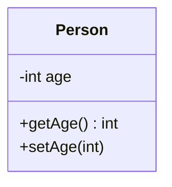
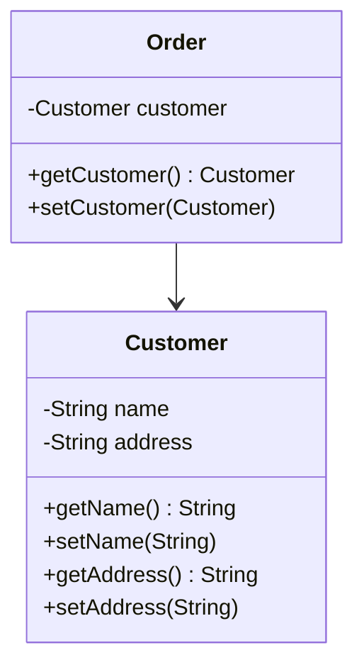
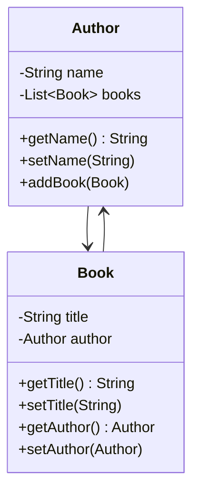

## 13.4. Organizing Data

In the realm of software design, organizing data effectively is crucial for building maintainable, scalable, and robust systems. This section delves into three pivotal techniques for organizing data: **Encapsulating Fields**, **Replacing Data Value with Object**, and **Changing Unidirectional Association to Bidirectional**. These techniques are part of the broader category of refactoring patterns, which aim to improve the internal structure of code without altering its external behavior. By mastering these techniques, developers can enhance code readability, reduce complexity, and facilitate easier modifications.

### Encapsulate Field

#### Intent

The **Encapsulate Field** pattern is a fundamental technique in object-oriented programming (OOP) that involves wrapping a field within getter and setter methods. This encapsulation provides controlled access to the field, allowing for validation, logging, or other processing when the field is accessed or modified. Encapsulation is a cornerstone of the OOP paradigm, promoting data hiding and abstraction.

#### Key Participants

- **Field**: The variable or data member that needs encapsulation.
- **Getter Method**: A method that retrieves the value of the field.
- **Setter Method**: A method that sets or updates the value of the field, often with validation.

#### Applicability

- Use the Encapsulate Field pattern when you need to control access to a field, such as enforcing constraints or triggering side effects.
- It is applicable when the internal representation of a field might change, but you want to maintain a consistent interface.

#### Sample Code Snippets

Below is a pseudocode example demonstrating the encapsulation of a field:

```pseudocode
class Person
    private field age

    method getAge()
        return age

    method setAge(newAge)
        if newAge >= 0
            age = newAge
        else
            throw Error("Age cannot be negative")
```

In this example, the `age` field is encapsulated within the `Person` class. The `getAge` method provides read access, while the `setAge` method ensures that the age cannot be set to a negative value.

#### Design Considerations

- **Validation**: Encapsulation allows for validation logic within setter methods, ensuring data integrity.
- **Consistency**: By encapsulating fields, you can change the internal representation without affecting external code.
- **Performance**: Consider the performance implications of adding method calls for field access, especially in performance-critical applications.

#### Differences and Similarities

Encapsulation is often compared to the **Information Hiding** principle, where the internal details of a class are hidden from the outside world. Both concepts aim to reduce coupling and increase modularity.

### Replace Data Value with Object

#### Intent

The **Replace Data Value with Object** pattern involves transforming a simple data value into a full-fledged object. This refactoring is beneficial when a data value starts accumulating additional responsibilities or when related data needs to be grouped together.

#### Key Participants

- **Data Value**: The simple data element that needs to be replaced.
- **Object**: The new class or structure that encapsulates the data value and potentially related data and behavior.

#### Applicability

- Use this pattern when a data value is associated with additional data or behavior that logically belongs together.
- It is suitable when the data value is used in multiple places, and changes to its structure would otherwise require widespread modifications.

#### Sample Code Snippets

Consider the following pseudocode example:

```pseudocode
class Order
    private field orderDate
    private field customerName

    method getOrderDate()
        return orderDate

    method setOrderDate(newDate)
        orderDate = newDate

    method getCustomerName()
        return customerName

    method setCustomerName(newName)
        customerName = newName
```

After applying the Replace Data Value with Object pattern, the code becomes:

```pseudocode
class Order
    private field customer

    method getCustomer()
        return customer

    method setCustomer(newCustomer)
        customer = newCustomer

class Customer
    private field name
    private field address

    method getName()
        return name

    method setName(newName)
        name = newName

    method getAddress()
        return address

    method setAddress(newAddress)
        address = newAddress
```

In this example, the `customerName` field is replaced with a `Customer` object, which encapsulates both the name and address of the customer.

#### Design Considerations

- **Cohesion**: This pattern increases cohesion by grouping related data and behavior into a single object.
- **Flexibility**: It enhances flexibility, allowing for easier modifications and extensions.
- **Complexity**: Be mindful of the added complexity when introducing new classes or objects.

#### Differences and Similarities

This pattern is similar to the **Extract Class** refactoring, where a class is divided into two or more classes to improve cohesion and reduce complexity.

### Change Unidirectional Association to Bidirectional

#### Intent

The **Change Unidirectional Association to Bidirectional** pattern involves modifying the relationship between two classes from a one-way association to a two-way association. This change is often necessary when both classes need to be aware of each other and interact more closely.

#### Key Participants

- **Source Class**: The class that initially holds a reference to the target class.
- **Target Class**: The class that will be modified to hold a reference back to the source class.

#### Applicability

- Use this pattern when both classes need to interact with each other, and a unidirectional association is insufficient.
- It is applicable when operations in one class require access to the other class's data or behavior.

#### Sample Code Snippets

Here's an example of changing a unidirectional association to bidirectional:

```pseudocode
class Author
    private field name
    private field books

    method getName()
        return name

    method setName(newName)
        name = newName

    method addBook(book)
        books.add(book)

class Book
    private field title

    method getTitle()
        return title

    method setTitle(newTitle)
        title = newTitle
```

After applying the Change Unidirectional Association to Bidirectional pattern:

```pseudocode
class Author
    private field name
    private field books

    method getName()
        return name

    method setName(newName)
        name = newName

    method addBook(book)
        books.add(book)
        book.setAuthor(this)

class Book
    private field title
    private field author

    method getTitle()
        return title

    method setTitle(newTitle)
        title = newTitle

    method getAuthor()
        return author

    method setAuthor(newAuthor)
        author = newAuthor
```

In this example, the `Book` class now holds a reference back to the `Author` class, allowing for bidirectional interaction.

#### Design Considerations

- **Coupling**: Bidirectional associations increase coupling between classes, which can complicate maintenance.
- **Navigation**: They provide easier navigation between related objects, enhancing usability.
- **Consistency**: Ensure consistency by updating both sides of the association when changes occur.

#### Differences and Similarities

This pattern contrasts with the **Unidirectional Association**, where only one class holds a reference to the other. Bidirectional associations are more complex but offer greater flexibility.

### Visualizing Data Organization

To better understand these concepts, let's visualize the relationships and transformations using Mermaid.js diagrams.

#### Encapsulate Field Diagram



**Caption**: This diagram illustrates the encapsulation of the `age` field within the `Person` class, showing the getter and setter methods.

#### Replace Data Value with Object Diagram



**Caption**: This diagram shows the transformation of a simple data value into a `Customer` object within the `Order` class.

#### Change Unidirectional to Bidirectional Association Diagram



**Caption**: This diagram displays the bidirectional association between the `Author` and `Book` classes, highlighting the mutual references.

### Try It Yourself

To solidify your understanding, try modifying the pseudocode examples:

1. **Encapsulate Field**: Add a validation rule to the `setAge` method to ensure the age is not greater than 150.
2. **Replace Data Value with Object**: Extend the `Customer` class to include a phone number and modify the `Order` class accordingly.
3. **Change Unidirectional to Bidirectional Association**: Implement a method in the `Author` class to remove a book and update the bidirectional association.

### References and Links

- [Encapsulation in OOP](https://en.wikipedia.org/wiki/Encapsulation_(computer_programming))
- [Refactoring: Improving the Design of Existing Code](https://martinfowler.com/books/refactoring.html)
- [Object-Oriented Design Principles](https://www.oreilly.com/library/view/object-oriented-design/9780136079675/)

### Knowledge Check

- **Question**: What is the primary benefit of encapsulating a field?
- **Exercise**: Refactor a simple class in your codebase to encapsulate its fields.

### Embrace the Journey

Remember, organizing data effectively is a continuous journey. As you refine your skills, you'll discover new ways to enhance your code's structure and maintainability. Keep experimenting, stay curious, and enjoy the process!

## Quiz Time!



### What is the primary purpose of encapsulating a field in object-oriented programming?

- [x] To control access and enforce validation rules
- [ ] To increase the number of methods in a class
- [ ] To make fields publicly accessible
- [ ] To reduce the number of classes in a program

> **Explanation:** Encapsulation allows for controlled access to fields, enabling validation and other processing when fields are accessed or modified.

### When should you use the Replace Data Value with Object pattern?

- [x] When a data value starts accumulating additional responsibilities
- [ ] When you want to reduce the number of classes
- [ ] When a data value is used only once in the code
- [ ] When you need to increase code complexity

> **Explanation:** This pattern is used when a simple data value needs to be replaced with an object to encapsulate additional data or behavior.

### What is a potential downside of changing a unidirectional association to bidirectional?

- [x] Increased coupling between classes
- [ ] Reduced flexibility in code
- [ ] Decreased readability of code
- [ ] Loss of encapsulation

> **Explanation:** Bidirectional associations increase coupling between classes, which can complicate maintenance.

### Which of the following is a key participant in the Encapsulate Field pattern?

- [x] Getter Method
- [ ] Constructor
- [ ] Interface
- [ ] Abstract Class

> **Explanation:** The getter method is a key participant in the Encapsulate Field pattern, providing controlled access to the field.

### What does the Replace Data Value with Object pattern improve?

- [x] Cohesion by grouping related data and behavior
- [ ] Performance by reducing method calls
- [ ] Security by hiding data
- [ ] Scalability by reducing code size

> **Explanation:** This pattern improves cohesion by grouping related data and behavior into a single object.

### How does encapsulation contribute to consistency in code?

- [x] By allowing changes to internal representation without affecting external code
- [ ] By making all fields publicly accessible
- [ ] By reducing the number of methods in a class
- [ ] By increasing the number of classes

> **Explanation:** Encapsulation allows for changes to the internal representation of a field without affecting the external interface, maintaining consistency.

### What is a similarity between the Replace Data Value with Object and Extract Class patterns?

- [x] Both aim to improve cohesion and reduce complexity
- [ ] Both increase the number of methods in a class
- [ ] Both make fields publicly accessible
- [ ] Both reduce the number of classes

> **Explanation:** Both patterns aim to improve cohesion and reduce complexity by organizing related data and behavior into classes.

### What is a key consideration when implementing bidirectional associations?

- [x] Ensuring consistency by updating both sides of the association
- [ ] Reducing the number of methods in a class
- [ ] Making all fields publicly accessible
- [ ] Decreasing the number of classes

> **Explanation:** Consistency must be maintained by updating both sides of the association when changes occur.

### True or False: Encapsulation can be used to enforce validation rules on fields.

- [x] True
- [ ] False

> **Explanation:** Encapsulation allows for validation logic within setter methods, ensuring data integrity.

### True or False: The Replace Data Value with Object pattern is used to simplify code by reducing the number of classes.

- [ ] True
- [x] False

> **Explanation:** This pattern often introduces new classes to encapsulate data and behavior, improving cohesion and flexibility.


