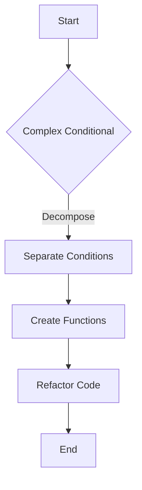

## 13.5. Simplifying Conditional Expressions

Conditional expressions are a fundamental part of programming, allowing us to make decisions based on different criteria. However, they can often become complex and difficult to read, especially in large codebases. Simplifying these expressions is crucial for maintaining clean, readable, and maintainable code. In this section, we will explore techniques to simplify conditional expressions, focusing on decomposing conditionals, consolidating duplicate conditional fragments, and removing control flags.

### Understanding Conditional Complexity

Before we dive into the techniques, let's understand why conditional expressions can become complex. As software evolves, new conditions are often added to existing logic, leading to nested and intertwined conditional statements. This complexity can result in:

- **Reduced Readability:** Complex conditionals are hard to read and understand, making it difficult for developers to grasp the logic quickly.
- **Increased Maintenance Effort:** Modifying complex conditionals can introduce bugs if not done carefully, as the logic is often not straightforward.
- **Higher Error Rates:** The more complex the conditional logic, the higher the chance of errors, especially if the logic is not well-documented or tested.

### Techniques for Simplifying Conditional Expressions

Let's explore some effective techniques to simplify conditional expressions, making them more readable and maintainable.

#### 1. Decompose Conditional

**Decomposing conditional expressions** involves breaking down complex conditions into simpler, more understandable parts. This technique improves readability by isolating each condition into a separate method or variable, making the logic clearer.

##### Example

Consider the following complex conditional expression:

```pseudocode
if (user.isActive && user.hasPermission && !user.isBanned) {
    // Execute action
}
```

This expression checks multiple conditions, making it difficult to understand at a glance. We can decompose it as follows:

```pseudocode
function isEligibleForAction(user) {
    return user.isActive && user.hasPermission && !user.isBanned;
}

if (isEligibleForAction(user)) {
    // Execute action
}
```

By decomposing the conditional into a separate function `isEligibleForAction`, we make the main logic more readable and self-explanatory.

##### Benefits

- **Improved Readability:** Each condition is encapsulated in a descriptive function, making the code easier to understand.
- **Reusability:** The decomposed condition can be reused in other parts of the codebase.
- **Easier Testing:** Individual conditions can be tested separately, ensuring each part of the logic works as expected.

##### Try It Yourself

Experiment with decomposing complex conditionals in your codebase. Identify a complex conditional and break it down into smaller, more manageable parts. Notice how the readability and maintainability of your code improve.

#### 2. Consolidate Duplicate Conditional Fragments

**Consolidating duplicate conditional fragments** involves identifying and merging repeated conditions within the code. This technique reduces redundancy and simplifies the logic by ensuring each condition is evaluated only once.

##### Example

Consider the following code with duplicate conditional fragments:

```pseudocode
if (user.isActive) {
    if (user.hasPermission) {
        // Action A
    }
}

if (user.isActive) {
    if (user.isAdmin) {
        // Action B
    }
}
```

We can consolidate the duplicate condition `user.isActive` as follows:

```pseudocode
if (user.isActive) {
    if (user.hasPermission) {
        // Action A
    }
    if (user.isAdmin) {
        // Action B
    }
}
```

By consolidating the duplicate condition, we reduce redundancy and make the code more efficient.

##### Benefits

- **Reduced Redundancy:** Duplicate conditions are merged, reducing the number of evaluations.
- **Improved Efficiency:** The code executes faster as conditions are checked only once.
- **Simplified Logic:** The overall logic becomes clearer and easier to follow.

##### Try It Yourself

Look for duplicate conditional fragments in your codebase. Consolidate them to reduce redundancy and improve efficiency. Observe how this simplification enhances the clarity of your code.

#### 3. Remove Control Flag

**Removing control flags** involves eliminating unnecessary flags that control the flow of execution. Control flags often complicate the logic and make the code harder to understand. By removing them, we can streamline the code and improve readability.

##### Example

Consider the following code with a control flag:

```pseudocode
flag = false;
if (condition1) {
    // Do something
    flag = true;
}

if (flag) {
    // Do something else
}
```

We can remove the control flag by restructuring the logic:

```pseudocode
if (condition1) {
    // Do something
    // Do something else
}
```

By removing the control flag, we simplify the flow of execution and make the code more straightforward.

##### Benefits

- **Simplified Flow:** The removal of control flags leads to a more straightforward flow of execution.
- **Improved Readability:** The logic is easier to understand without the distraction of control flags.
- **Reduced Complexity:** The code becomes less complex, making it easier to maintain.

##### Try It Yourself

Identify control flags in your codebase and explore ways to eliminate them. Restructure the logic to simplify the flow of execution and enhance readability.

### Visualizing Conditional Simplification

To better understand the process of simplifying conditional expressions, let's visualize it using a flowchart. This flowchart illustrates the steps involved in decomposing a complex conditional expression.



**Figure 1:** Flowchart illustrating the process of decomposing a complex conditional expression.

### Design Considerations

When simplifying conditional expressions, it's essential to consider the following:

- **Maintainability:** Ensure that the simplified code is maintainable and easy to understand for other developers.
- **Performance:** While simplification often improves performance, be mindful of any potential performance trade-offs.
- **Testing:** Thoroughly test the simplified code to ensure that the logic remains correct and that no new bugs are introduced.

### Differences and Similarities

Simplifying conditional expressions shares similarities with other refactoring techniques, such as:

- **Extract Method:** Both techniques involve breaking down complex logic into smaller, more manageable parts.
- **Inline Method:** While simplifying conditionals often involves creating new methods, inline method refactoring involves the opposite—integrating methods into the main logic.

Understanding these similarities and differences can help you choose the appropriate refactoring technique for your specific use case.

### Knowledge Check

Let's reinforce our understanding of simplifying conditional expressions with a few questions:

1. What are the benefits of decomposing conditional expressions?
2. How does consolidating duplicate conditional fragments improve code efficiency?
3. Why is it important to remove control flags from your code?

### Conclusion

Simplifying conditional expressions is a crucial aspect of maintaining clean, readable, and maintainable code. By decomposing conditionals, consolidating duplicate fragments, and removing control flags, we can enhance the clarity and efficiency of our code. Remember, this is just the beginning. As you progress, you'll build more complex and interactive systems. Keep experimenting, stay curious, and enjoy the journey!

## Quiz Time!



### What is the primary benefit of decomposing conditional expressions?

- [x] Improved readability and maintainability
- [ ] Increased complexity
- [ ] Reduced performance
- [ ] More control flags

> **Explanation:** Decomposing conditional expressions improves readability and maintainability by breaking down complex logic into simpler, more understandable parts.

### How does consolidating duplicate conditional fragments affect code efficiency?

- [x] It reduces redundancy and improves efficiency
- [ ] It increases redundancy and decreases efficiency
- [ ] It has no impact on efficiency
- [ ] It introduces new bugs

> **Explanation:** Consolidating duplicate conditional fragments reduces redundancy, leading to fewer evaluations and improved code efficiency.

### What is a control flag?

- [x] A variable used to control the flow of execution
- [ ] A type of error in the code
- [ ] A method for improving performance
- [ ] A design pattern

> **Explanation:** A control flag is a variable used to control the flow of execution, often complicating the logic.

### Why should control flags be removed from code?

- [x] To simplify the flow of execution and improve readability
- [ ] To increase the number of conditions
- [ ] To add more complexity
- [ ] To reduce code efficiency

> **Explanation:** Removing control flags simplifies the flow of execution and improves readability by eliminating unnecessary variables.

### Which refactoring technique is similar to simplifying conditional expressions?

- [x] Extract Method
- [ ] Inline Method
- [ ] Add Control Flag
- [ ] Increase Complexity

> **Explanation:** Extract Method is similar to simplifying conditional expressions as both involve breaking down complex logic into smaller parts.

### What is a potential trade-off when simplifying conditional expressions?

- [x] Performance trade-offs
- [ ] Increased complexity
- [ ] More control flags
- [ ] Reduced readability

> **Explanation:** While simplification often improves performance, there can be potential performance trade-offs to consider.

### How can you test the correctness of simplified conditional expressions?

- [x] By thoroughly testing the simplified code
- [ ] By adding more control flags
- [ ] By increasing complexity
- [ ] By ignoring testing

> **Explanation:** Thoroughly testing the simplified code ensures that the logic remains correct and no new bugs are introduced.

### What should you consider when simplifying conditional expressions?

- [x] Maintainability and performance
- [ ] Adding more complexity
- [ ] Increasing redundancy
- [ ] Ignoring testing

> **Explanation:** When simplifying conditional expressions, consider maintainability and performance to ensure the code remains efficient and understandable.

### Is it beneficial to reuse decomposed conditional expressions?

- [x] Yes, it improves reusability
- [ ] No, it decreases reusability
- [ ] It has no impact on reusability
- [ ] It introduces new bugs

> **Explanation:** Reusing decomposed conditional expressions improves reusability, allowing the logic to be applied in different parts of the codebase.

### Simplifying conditional expressions is important for:

- [x] Enhancing code readability and maintainability
- [ ] Increasing code complexity
- [ ] Adding more control flags
- [ ] Reducing code efficiency

> **Explanation:** Simplifying conditional expressions enhances code readability and maintainability, making it easier for developers to understand and modify the code.


