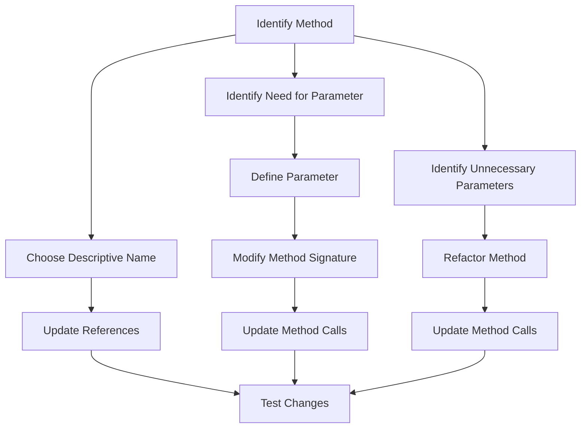

## 13.6. Making Method Calls Simpler

In the realm of software development, the clarity and simplicity of method calls are paramount for maintaining clean, efficient, and understandable code. As systems grow in complexity, the need to refactor method calls becomes increasingly important. In this section, we will explore techniques to simplify method calls, focusing on renaming methods, adding parameters, and removing parameters. These practices not only enhance readability but also improve the maintainability of your codebase.

### Introduction to Simplifying Method Calls

Method calls are the backbone of any software application. They encapsulate functionality and facilitate communication between different parts of a program. However, as code evolves, method calls can become cumbersome and difficult to understand. Simplifying these calls is a crucial aspect of refactoring, which involves restructuring existing code without changing its external behavior.

**Key Objectives:**
- Enhance code readability and maintainability.
- Improve communication among developers.
- Facilitate easier debugging and testing.

Let's delve into the specific techniques for making method calls simpler, starting with renaming methods.

### Renaming Methods

Renaming a method is one of the simplest yet most effective refactoring techniques. A well-named method conveys its purpose and functionality, making it easier for developers to understand and use it correctly.

#### Why Rename Methods?

- **Clarity**: A descriptive name provides immediate insight into what the method does.
- **Consistency**: Aligns method names with naming conventions and domain terminology.
- **Avoidance of Ambiguity**: Prevents confusion by eliminating vague or misleading names.

#### Steps to Rename a Method

1. **Identify the Method**: Determine which method needs renaming based on its clarity and relevance.
2. **Choose a Descriptive Name**: Select a name that accurately reflects the method's purpose and functionality.
3. **Update References**: Ensure all calls to the method are updated with the new name.
4. **Test the Changes**: Run tests to confirm that the renaming has not introduced any errors.

#### Example of Renaming a Method

Consider a method named `processData`. This name is generic and does not specify what kind of data is being processed or how. A more descriptive name could be `processCustomerData`.

```pseudocode
// Before renaming
function processData(data) {
    // Process the data
}

// After renaming
function processCustomerData(customerData) {
    // Process the customer data
}
```

#### Best Practices for Renaming Methods

- **Use Action Verbs**: Start method names with verbs to indicate actions (e.g., `calculateTotal`, `fetchRecords`).
- **Be Specific**: Avoid generic terms; specify the context or type of data involved.
- **Adopt Naming Conventions**: Follow consistent naming conventions across the codebase.

### Adding Parameters

Adding parameters to a method can enhance its flexibility and adaptability. This technique allows a method to accept additional data, enabling it to perform more complex operations or handle a wider range of scenarios.

#### Why Add Parameters?

- **Increased Flexibility**: Allows methods to handle more cases or variations.
- **Enhanced Reusability**: Makes methods more general-purpose and applicable in different contexts.
- **Improved Modularity**: Reduces the need for multiple similar methods by consolidating functionality.

#### Steps to Add a Parameter

1. **Identify the Need**: Determine why the method requires additional data.
2. **Define the Parameter**: Specify the type and purpose of the new parameter.
3. **Modify the Method Signature**: Update the method's definition to include the new parameter.
4. **Update Method Calls**: Adjust all calls to the method to pass the appropriate arguments.
5. **Test the Changes**: Ensure the method functions correctly with the new parameter.

#### Example of Adding a Parameter

Suppose we have a method that calculates the total price of items, but it currently does not account for discounts. We can add a parameter to include discount calculations.

```pseudocode
// Before adding parameter
function calculateTotalPrice(items) {
    total = 0
    for each item in items {
        total += item.price
    }
    return total
}

// After adding parameter
function calculateTotalPrice(items, discountRate) {
    total = 0
    for each item in items {
        total += item.price
    }
    total = total - (total * discountRate)
    return total
}
```

#### Best Practices for Adding Parameters

- **Keep Parameters Relevant**: Only add parameters that are essential for the method's operation.
- **Limit the Number of Parameters**: Too many parameters can make a method cumbersome and difficult to use.
- **Use Default Values**: Consider providing default values for optional parameters to maintain backward compatibility.

### Removing Parameters

Removing unnecessary parameters from a method simplifies its interface and reduces complexity. This technique is useful when parameters are no longer needed or when they complicate the method's usage.

#### Why Remove Parameters?

- **Simplification**: Reduces the cognitive load on developers by streamlining method signatures.
- **Elimination of Redundancy**: Removes parameters that are not used or can be derived from other data.
- **Improved Maintainability**: Simplifies testing and debugging by reducing the number of variables involved.

#### Steps to Remove a Parameter

1. **Identify Unnecessary Parameters**: Determine which parameters are redundant or unused.
2. **Refactor the Method**: Update the method to exclude the unnecessary parameters.
3. **Update Method Calls**: Adjust all calls to the method to remove the redundant arguments.
4. **Test the Changes**: Verify that the method still functions correctly without the removed parameters.

#### Example of Removing a Parameter

Consider a method that calculates the area of a rectangle but redundantly accepts both the width and an area parameter.

```pseudocode
// Before removing parameter
function calculateArea(width, height, area) {
    return width * height
}

// After removing parameter
function calculateArea(width, height) {
    return width * height
}
```

#### Best Practices for Removing Parameters

- **Ensure Parameters Are Truly Unnecessary**: Confirm that the parameter is not used or can be derived from other data.
- **Maintain Backward Compatibility**: Consider the impact on existing code and provide alternatives if necessary.
- **Document Changes**: Clearly document the removal of parameters to inform other developers.

### Visualizing Method Simplification

To better understand the process of simplifying method calls, let's visualize the transformation of a method using a flowchart. This diagram illustrates the steps involved in renaming a method, adding a parameter, and removing a parameter.



**Diagram Description:** This flowchart outlines the steps for simplifying method calls by renaming methods, adding parameters, and removing parameters. Each path leads to testing changes to ensure functionality.

### Try It Yourself

To solidify your understanding of simplifying method calls, try experimenting with the following exercises:

1. **Rename a Method**: Identify a method in your codebase with a vague name and rename it to something more descriptive. Update all references and test the changes.

2. **Add a Parameter**: Take a method that could benefit from additional data input. Add a parameter to enhance its functionality and update all method calls accordingly.

3. **Remove a Parameter**: Find a method with a redundant parameter. Refactor the method to remove it and ensure all calls are updated.

### Knowledge Check

Before we conclude, let's review some key concepts:

- **Why is renaming methods important?**
  - It enhances clarity and prevents ambiguity.
  
- **What are the benefits of adding parameters?**
  - Increased flexibility and reusability.

- **When should you remove a parameter?**
  - When it is redundant or unused.

### Embrace the Journey

Remember, simplifying method calls is an ongoing process that requires careful consideration and testing. As you refine your skills, you'll find that these techniques not only improve your code but also foster better collaboration and understanding among your development team. Keep experimenting, stay curious, and enjoy the journey of mastering method call simplification!

### References and Further Reading

For more information on refactoring and simplifying method calls, consider exploring the following resources:

- [Refactoring: Improving the Design of Existing Code](https://martinfowler.com/books/refactoring.html) by Martin Fowler
- [Clean Code: A Handbook of Agile Software Craftsmanship](https://www.oreilly.com/library/view/clean-code-a/9780136083238/) by Robert C. Martin
- [The Art of Readable Code](https://www.oreilly.com/library/view/the-art-of/9781449318482/) by Dustin Boswell and Trevor Foucher

## Quiz Time!



### What is the primary benefit of renaming a method?

- [x] Enhances clarity and understanding
- [ ] Increases execution speed
- [ ] Reduces memory usage
- [ ] Increases the number of parameters

> **Explanation:** Renaming a method enhances clarity and understanding by providing a descriptive name that accurately reflects its purpose.

### When should you consider adding a parameter to a method?

- [x] When the method needs to handle more cases
- [ ] When the method is too complex
- [ ] When the method has too many parameters
- [ ] When the method is rarely used

> **Explanation:** Adding a parameter is beneficial when a method needs to handle more cases or variations, increasing its flexibility.

### What is a key consideration when removing a parameter from a method?

- [x] Ensure the parameter is truly unnecessary
- [ ] Increase the method's complexity
- [ ] Add more parameters
- [ ] Change the method's return type

> **Explanation:** It's important to ensure that the parameter is truly unnecessary and not used elsewhere before removing it.

### Which of the following is a best practice for renaming methods?

- [x] Use action verbs to indicate actions
- [ ] Use generic terms to cover all cases
- [ ] Avoid using verbs in method names
- [ ] Use random names to avoid conflicts

> **Explanation:** Using action verbs in method names helps indicate the actions they perform, enhancing clarity.

### What is a potential downside of adding too many parameters to a method?

- [x] Makes the method cumbersome and difficult to use
- [ ] Increases the method's execution speed
- [ ] Reduces the method's flexibility
- [ ] Enhances the method's readability

> **Explanation:** Adding too many parameters can make a method cumbersome and difficult to use, reducing its readability.

### Why is it important to update all references when renaming a method?

- [x] To ensure the code functions correctly with the new name
- [ ] To increase the method's complexity
- [ ] To change the method's return type
- [ ] To add more parameters

> **Explanation:** Updating all references ensures that the code functions correctly with the new method name, preventing errors.

### What should you do after adding a parameter to a method?

- [x] Update all method calls to pass the appropriate arguments
- [ ] Remove other parameters
- [ ] Change the method's return type
- [ ] Increase the method's complexity

> **Explanation:** After adding a parameter, it's crucial to update all method calls to pass the appropriate arguments.

### What is a benefit of removing unnecessary parameters from a method?

- [x] Simplifies the method's interface
- [ ] Increases the method's complexity
- [ ] Adds more parameters
- [ ] Changes the method's return type

> **Explanation:** Removing unnecessary parameters simplifies the method's interface, making it easier to use and understand.

### Which of the following is a reason to rename a method?

- [x] To prevent confusion by eliminating vague names
- [ ] To increase the method's execution speed
- [ ] To add more parameters
- [ ] To change the method's return type

> **Explanation:** Renaming a method helps prevent confusion by eliminating vague or misleading names, enhancing clarity.

### True or False: Adding a parameter to a method always improves its readability.

- [ ] True
- [x] False

> **Explanation:** Adding a parameter does not always improve readability; it should be done when necessary to enhance functionality without making the method cumbersome.


