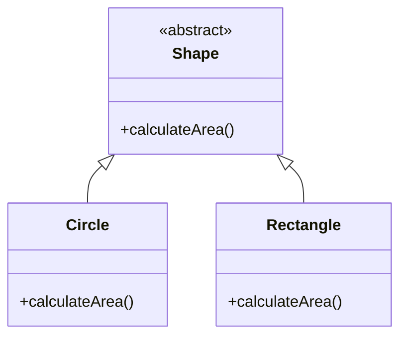
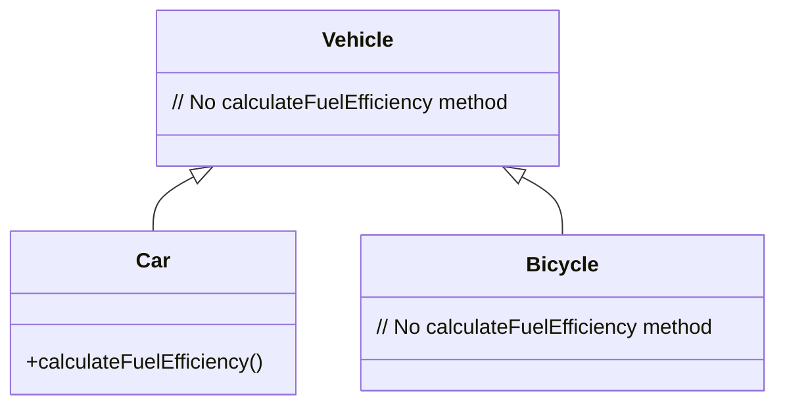
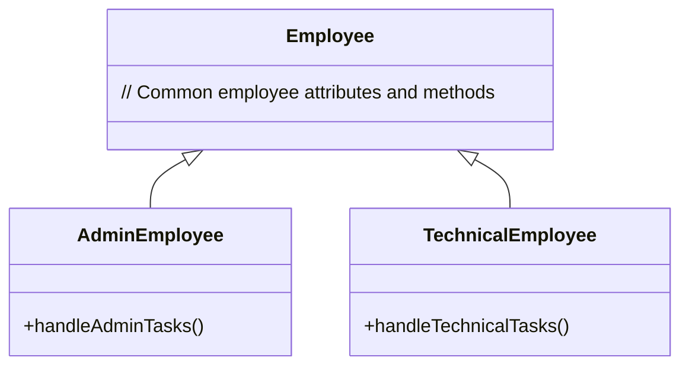

## 13.7. Dealing with Generalization

In the realm of software design, generalization is a powerful concept that allows developers to create flexible and reusable code structures. By abstracting common functionality and characteristics into higher-level constructs, we can reduce redundancy, enhance maintainability, and promote code reuse. This section delves into the intricacies of dealing with generalization through three key refactoring patterns: Pull Up Field/Method, Push Down Method/Field, and Extract Subclass/Superclass. We'll explore these patterns in detail, providing clear pseudocode examples and diagrams to illustrate their application.

### Understanding Generalization

Generalization in software design refers to the process of abstracting common features from multiple classes into a single superclass or interface. This abstraction allows for shared behavior and attributes to be defined once and reused across different subclasses. Generalization is a cornerstone of object-oriented programming (OOP) and is instrumental in achieving polymorphism and code reuse.

#### Key Concepts

- **Abstraction:** The process of identifying commonalities among classes and encapsulating them in a higher-level construct.
- **Polymorphism:** The ability of different classes to be treated as instances of the same class through a common interface.
- **Code Reuse:** The practice of using existing code for new functions or applications, reducing redundancy and improving maintainability.

### Pull Up Field/Method

The Pull Up Field/Method refactoring pattern involves moving common fields or methods from multiple subclasses to a shared superclass. This pattern is useful when you identify duplicated code across subclasses that can be abstracted into a single location.

#### Intent

The intent of the Pull Up Field/Method pattern is to eliminate redundancy by centralizing shared functionality in a superclass. This not only reduces code duplication but also simplifies maintenance by localizing changes to a single point.

#### Key Participants

- **Superclass:** The class to which common fields or methods are moved.
- **Subclasses:** The classes from which fields or methods are extracted.

#### Applicability

- When multiple subclasses have identical fields or methods.
- When you want to enforce a common interface or behavior across subclasses.

#### Pseudocode Example

Let's consider a scenario where we have two subclasses, `Circle` and `Rectangle`, both of which have a method `calculateArea`. We can pull up this method to a superclass `Shape`.

```pseudocode
// Before Pull Up Method
class Circle {
    method calculateArea() {
        return PI * radius * radius;
    }
}

class Rectangle {
    method calculateArea() {
        return width * height;
    }
}

// After Pull Up Method
class Shape {
    method calculateArea() {
        // Abstract method, implementation in subclasses
    }
}

class Circle extends Shape {
    method calculateArea() {
        return PI * radius * radius;
    }
}

class Rectangle extends Shape {
    method calculateArea() {
        return width * height;
    }
}
```

In this example, the `calculateArea` method is defined in the superclass `Shape` as an abstract method, and each subclass provides its specific implementation.

#### Design Considerations

- Ensure that the pulled-up method or field is truly common to all subclasses.
- Consider the impact on existing code that relies on subclass-specific implementations.

### Push Down Method/Field

The Push Down Method/Field refactoring pattern is the inverse of Pull Up. It involves moving methods or fields from a superclass to specific subclasses. This pattern is useful when a method or field in a superclass is only relevant to certain subclasses.

#### Intent

The intent of the Push Down Method/Field pattern is to localize functionality that is not shared by all subclasses, thereby adhering to the Single Responsibility Principle.

#### Key Participants

- **Superclass:** The class from which methods or fields are moved.
- **Subclasses:** The classes to which methods or fields are moved.

#### Applicability

- When a method or field in a superclass is only used by some subclasses.
- When you want to reduce the complexity of a superclass by delegating specific responsibilities to subclasses.

#### Pseudocode Example

Consider a superclass `Vehicle` with a method `calculateFuelEfficiency` that is only applicable to some subclasses.

```pseudocode
// Before Push Down Method
class Vehicle {
    method calculateFuelEfficiency() {
        // Implementation specific to certain vehicles
    }
}

class Car extends Vehicle {
    // Uses calculateFuelEfficiency
}

class Bicycle extends Vehicle {
    // Does not use calculateFuelEfficiency
}

// After Push Down Method
class Vehicle {
    // No calculateFuelEfficiency method
}

class Car extends Vehicle {
    method calculateFuelEfficiency() {
        // Implementation specific to cars
    }
}

class Bicycle extends Vehicle {
    // No calculateFuelEfficiency method
}
```

In this example, the `calculateFuelEfficiency` method is pushed down to the `Car` subclass, as it is not relevant to `Bicycle`.

#### Design Considerations

- Ensure that the pushed-down method or field is not required by other subclasses.
- Consider the impact on code that interacts with the superclass.

### Extract Subclass/Superclass

The Extract Subclass/Superclass pattern involves creating a new subclass or superclass to encapsulate specific functionality or attributes. This pattern is useful for organizing code and improving readability.

#### Intent

The intent of the Extract Subclass/Superclass pattern is to create a more organized and maintainable class hierarchy by segregating distinct responsibilities into separate classes.

#### Key Participants

- **Original Class:** The class from which functionality is extracted.
- **New Subclass/Superclass:** The class that encapsulates the extracted functionality.

#### Applicability

- When a class has multiple responsibilities that can be separated.
- When you want to create a more flexible and extensible class hierarchy.

#### Pseudocode Example

Consider a class `Employee` that handles both administrative and technical tasks. We can extract these responsibilities into separate subclasses.

```pseudocode
// Before Extract Subclass
class Employee {
    method handleAdminTasks() {
        // Administrative tasks
    }
    
    method handleTechnicalTasks() {
        // Technical tasks
    }
}

// After Extract Subclass
class Employee {
    // Common employee attributes and methods
}

class AdminEmployee extends Employee {
    method handleAdminTasks() {
        // Administrative tasks
    }
}

class TechnicalEmployee extends Employee {
    method handleTechnicalTasks() {
        // Technical tasks
    }
}
```

In this example, the `Employee` class is refactored into two subclasses, `AdminEmployee` and `TechnicalEmployee`, each handling specific responsibilities.

#### Design Considerations

- Ensure that the extracted functionality is cohesive and logically grouped.
- Consider the impact on existing code and the need for interface changes.

### Visualizing Generalization

To better understand the process of generalization, let's visualize the relationships between classes before and after applying these refactoring patterns.



**Diagram 1: Visualizing Pull Up Method**

In this diagram, the `calculateArea` method is abstracted into the `Shape` superclass, with `Circle` and `Rectangle` providing specific implementations.



**Diagram 2: Visualizing Push Down Method**

Here, the `calculateFuelEfficiency` method is pushed down to the `Car` subclass, as it is not relevant to `Bicycle`.



**Diagram 3: Visualizing Extract Subclass**

This diagram shows the extraction of `AdminEmployee` and `TechnicalEmployee` subclasses from the `Employee` class, each handling specific responsibilities.

### Differences and Similarities

While Pull Up, Push Down, and Extract patterns all deal with generalization, they serve distinct purposes:

- **Pull Up vs. Push Down:** Pull Up centralizes shared functionality, while Push Down localizes specific functionality.
- **Extract Subclass vs. Extract Superclass:** Extract Subclass creates more specialized classes, whereas Extract Superclass creates a more generalized class.

### Try It Yourself

To deepen your understanding of these patterns, try modifying the pseudocode examples:

- **Experiment with Pull Up Method:** Identify another common method or field in your codebase and pull it up to a superclass.
- **Explore Push Down Method:** Find a method in a superclass that is only used by certain subclasses and push it down.
- **Practice Extract Subclass:** Identify a class with multiple responsibilities and extract them into separate subclasses.

### Knowledge Check

- **What is the primary goal of the Pull Up Method pattern?**
- **When should you use the Push Down Method pattern?**
- **How does the Extract Subclass pattern improve code organization?**

### Conclusion

Dealing with generalization through refactoring patterns like Pull Up, Push Down, and Extract is essential for creating maintainable and flexible software designs. These patterns help eliminate redundancy, adhere to the Single Responsibility Principle, and create a more organized class hierarchy. By mastering these techniques, you'll be better equipped to handle complex software design challenges and create robust, scalable systems.

Remember, this is just the beginning. As you progress, you'll build more complex and interactive software designs. Keep experimenting, stay curious, and enjoy the journey!

## Quiz Time!



### What is the primary goal of the Pull Up Method pattern?

- [x] To centralize shared functionality in a superclass
- [ ] To localize specific functionality in subclasses
- [ ] To create a more organized class hierarchy
- [ ] To separate distinct responsibilities into different classes

> **Explanation:** The Pull Up Method pattern aims to eliminate redundancy by centralizing shared functionality in a superclass.

### When should you use the Push Down Method pattern?

- [x] When a method in a superclass is only used by certain subclasses
- [ ] When multiple subclasses have identical methods
- [ ] When you want to create a more flexible class hierarchy
- [ ] When a class has multiple responsibilities

> **Explanation:** The Push Down Method pattern is used to localize functionality that is not shared by all subclasses.

### How does the Extract Subclass pattern improve code organization?

- [x] By segregating distinct responsibilities into separate classes
- [ ] By centralizing shared functionality in a superclass
- [ ] By localizing specific functionality in subclasses
- [ ] By creating a more generalized class

> **Explanation:** The Extract Subclass pattern improves code organization by separating distinct responsibilities into different classes.

### What is the key difference between Pull Up and Push Down patterns?

- [x] Pull Up centralizes shared functionality, while Push Down localizes specific functionality
- [ ] Pull Up creates more specialized classes, while Push Down creates a more generalized class
- [ ] Pull Up is used for extracting subclasses, while Push Down is used for extracting superclasses
- [ ] Pull Up is used for creating new classes, while Push Down is used for removing classes

> **Explanation:** Pull Up centralizes shared functionality in a superclass, while Push Down localizes specific functionality in subclasses.

### Which pattern would you use to create a more generalized class?

- [ ] Pull Up Method
- [ ] Push Down Method
- [x] Extract Superclass
- [ ] Extract Subclass

> **Explanation:** The Extract Superclass pattern is used to create a more generalized class by abstracting common functionality.

### What is the intent of the Extract Subclass pattern?

- [x] To create a more organized and maintainable class hierarchy
- [ ] To centralize shared functionality in a superclass
- [ ] To localize specific functionality in subclasses
- [ ] To create a more generalized class

> **Explanation:** The Extract Subclass pattern aims to create a more organized and maintainable class hierarchy by segregating responsibilities.

### Which pattern helps in adhering to the Single Responsibility Principle?

- [ ] Pull Up Method
- [x] Push Down Method
- [ ] Extract Superclass
- [x] Extract Subclass

> **Explanation:** Both Push Down Method and Extract Subclass patterns help in adhering to the Single Responsibility Principle by localizing and segregating responsibilities.

### What is a key consideration when using the Pull Up Method pattern?

- [x] Ensuring the pulled-up method is common to all subclasses
- [ ] Ensuring the pushed-down method is not required by other subclasses
- [ ] Ensuring the extracted functionality is cohesive
- [ ] Ensuring the superclass remains unchanged

> **Explanation:** When using the Pull Up Method pattern, it's important to ensure that the method being pulled up is common to all subclasses.

### How does the Push Down Method pattern affect the superclass?

- [x] It reduces the complexity of the superclass by delegating specific responsibilities to subclasses
- [ ] It increases the complexity of the superclass by adding more methods
- [ ] It creates a more generalized superclass
- [ ] It has no effect on the superclass

> **Explanation:** The Push Down Method pattern reduces the complexity of the superclass by delegating specific responsibilities to subclasses.

### True or False: The Extract Subclass pattern can help in creating a more flexible and extensible class hierarchy.

- [x] True
- [ ] False

> **Explanation:** True. The Extract Subclass pattern helps in creating a more flexible and extensible class hierarchy by segregating distinct responsibilities into separate classes.


