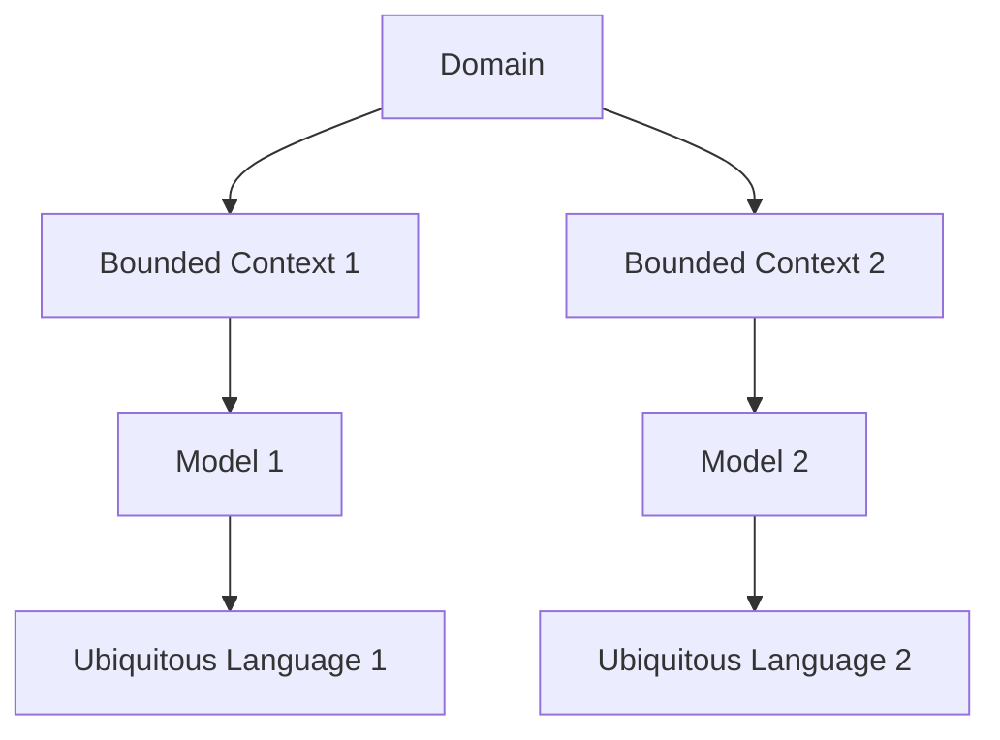
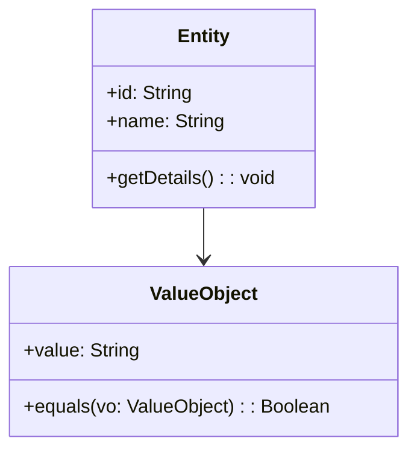

## 14.1. Introduction to DDD

In the ever-evolving landscape of software development, complexity is an inevitable challenge. As systems grow, so does the intricacy of managing various components, interactions, and business requirements. Domain-Driven Design (DDD) emerges as a powerful methodology to address this complexity by focusing on the core domain and its logic. Let's delve into the principles of DDD, emphasizing the importance of Ubiquitous Language in bridging the gap between technical and business teams.

### Understanding Domain-Driven Design

Domain-Driven Design is a strategic approach to software development that prioritizes the business domain and domain logic above all else. It encourages collaboration between domain experts and developers to create a shared understanding of the domain, which is then reflected in the software model. This alignment ensures that the software accurately represents the business needs and can adapt to changes over time.

#### Key Concepts of DDD

1. **Domain**: The sphere of knowledge and activity around which the application logic revolves. It is the primary focus of DDD, where the business rules and logic reside.

2. **Model**: An abstraction of the domain that helps in understanding and solving domain-related problems. It is a representation of the domain that is used to communicate and implement the domain logic.

3. **Ubiquitous Language**: A common language developed by the team that is used consistently by all members, including developers, domain experts, and stakeholders. It is embedded in the code and documentation, ensuring clarity and reducing miscommunication.

4. **Bounded Context**: A boundary within which a particular model is defined and applicable. It helps in managing the complexity by dividing the domain into smaller, manageable parts.

5. **Entities and Value Objects**: Entities are objects with a distinct identity that persists over time, while Value Objects are immutable and defined by their attributes.

6. **Aggregates**: A cluster of domain objects that can be treated as a single unit. It ensures consistency within the boundary of the aggregate.

7. **Repositories**: Mechanisms for retrieving and storing aggregates. They abstract the data access layer, providing a clean interface for the domain logic.

8. **Domain Services**: Operations that do not naturally fit within an entity or value object. They encapsulate domain logic that involves multiple entities or aggregates.

### The Role of Ubiquitous Language

Ubiquitous Language is a cornerstone of DDD, serving as a bridge between the technical and business aspects of a project. It is a language that evolves within the team, reflecting the domain model and ensuring that everyone speaks the same language when discussing domain concepts.

#### Developing Ubiquitous Language

- **Collaborative Workshops**: Engage domain experts, developers, and stakeholders in workshops to explore and define the domain concepts. This collaborative effort helps in building a shared understanding and developing a common language.

- **Iterative Refinement**: As the project progresses, the language should evolve to accommodate new insights and changes in the domain. Regular reviews and updates ensure that the language remains relevant and accurate.

- **Embedding in Code**: Use the Ubiquitous Language in code, documentation, and communication. Class names, method names, and comments should reflect the language, making the codebase self-explanatory and reducing the cognitive load.

#### Benefits of Ubiquitous Language

- **Enhanced Communication**: By using a common language, team members can communicate effectively, reducing misunderstandings and misinterpretations.

- **Alignment with Business Goals**: The language ensures that the software model aligns with the business objectives, facilitating better decision-making and prioritization.

- **Improved Collaboration**: A shared language fosters collaboration between developers and domain experts, leading to a more cohesive and efficient team.

### Implementing DDD: A Step-by-Step Guide

Implementing DDD requires a strategic approach, focusing on understanding the domain and building a model that accurately represents it. Here's a step-by-step guide to implementing DDD in your projects:

#### Step 1: Explore the Domain

- **Engage with Domain Experts**: Collaborate with domain experts to gain a deep understanding of the domain. Conduct interviews, workshops, and brainstorming sessions to gather insights and identify key concepts.

- **Identify Core Domain**: Determine the core domain, which is the most critical part of the business that provides a competitive advantage. Focus your efforts on modeling this area accurately.

#### Step 2: Define Bounded Contexts

- **Divide the Domain**: Break down the domain into smaller, manageable parts, each with its own model and language. This division helps in managing complexity and ensuring clarity.

- **Establish Clear Boundaries**: Define the boundaries of each context, ensuring that the models within a context are consistent and cohesive.

#### Step 3: Develop the Model

- **Create a Shared Model**: Collaborate with domain experts to create a model that accurately represents the domain. Use diagrams, flowcharts, and other visual aids to facilitate understanding.

- **Iterate and Refine**: Continuously refine the model as new insights emerge. Regularly review and update the model to ensure it remains relevant and accurate.

#### Step 4: Implement the Model

- **Use Ubiquitous Language**: Embed the language in the code, ensuring that class names, method names, and comments reflect the domain concepts.

- **Leverage Design Patterns**: Use design patterns to implement the model, ensuring that the code is maintainable and scalable.

- **Test and Validate**: Regularly test the implementation to ensure it aligns with the domain model and meets the business requirements.

#### Step 5: Evolve the Model

- **Adapt to Changes**: As the domain evolves, update the model to reflect the changes. Regularly engage with domain experts to stay informed about new developments.

- **Continuous Improvement**: Encourage a culture of continuous improvement, where the team is always looking for ways to enhance the model and the implementation.

### Visualizing DDD Concepts

To better understand DDD, let's visualize some of its key concepts using Mermaid.js diagrams.

#### Bounded Context and Ubiquitous Language

*Diagram Description*: This diagram illustrates how a domain is divided into bounded contexts, each with its own model and Ubiquitous Language. It highlights the separation of concerns and the importance of context-specific language.

#### Entity and Value Object

*Diagram Description*: This class diagram represents the relationship between an Entity and a Value Object. Entities have a distinct identity, while Value Objects are defined by their attributes.

### Practical Applications of DDD

Domain-Driven Design is particularly beneficial in complex domains where the business logic is intricate and constantly evolving. Here are some practical applications of DDD:

#### Complex Business Domains

In domains with complex business rules and logic, DDD helps in creating a model that accurately represents the domain, ensuring that the software aligns with the business needs.

#### Large-Scale Systems

For large-scale systems with multiple components and interactions, DDD provides a framework for managing complexity by dividing the domain into bounded contexts.

#### Evolving Domains

In domains that are constantly evolving, DDD facilitates adaptability by encouraging continuous collaboration between domain experts and developers.

### Challenges and Considerations

While DDD offers numerous benefits, it also presents certain challenges that need to be addressed:

#### Complexity of Implementation

Implementing DDD requires a deep understanding of the domain and a commitment to collaboration. It can be challenging to align all team members and stakeholders around a shared model and language.

#### Resource Intensive

DDD is resource-intensive, requiring significant time and effort to explore the domain, develop the model, and implement the design. It may not be suitable for small projects with limited resources.

#### Resistance to Change

Adopting DDD may face resistance from team members and stakeholders who are accustomed to traditional development methodologies. It requires a cultural shift towards collaboration and continuous improvement.

### Try It Yourself

To get hands-on experience with DDD, try implementing a simple domain model for a library management system. Define the core domain concepts, create a Ubiquitous Language, and develop a model using pseudocode. Experiment with different design patterns to implement the model, and iterate on your design as you gain new insights.

### Knowledge Check

- **Question**: What is the primary focus of Domain-Driven Design?
  - **Answer**: The primary focus of Domain-Driven Design is the business domain and domain logic.

- **Question**: What is Ubiquitous Language, and why is it important in DDD?
  - **Answer**: Ubiquitous Language is a common language developed by the team that is used consistently by all members. It is important because it ensures clarity and reduces miscommunication.

- **Question**: What is a Bounded Context in DDD?
  - **Answer**: A Bounded Context is a boundary within which a particular model is defined and applicable. It helps in managing complexity by dividing the domain into smaller, manageable parts.

### Conclusion

Domain-Driven Design is a powerful methodology for tackling complexity in software development. By focusing on the core domain and developing a shared understanding through Ubiquitous Language, DDD aligns technical and business teams, ensuring that the software accurately represents the business needs. While it presents certain challenges, the benefits of DDD in managing complexity, enhancing communication, and improving collaboration make it a valuable approach for complex and evolving domains.

## Quiz Time!



### What is the primary focus of Domain-Driven Design (DDD)?

- [x] Business domain and domain logic
- [ ] User interface design
- [ ] Database optimization
- [ ] Network architecture

> **Explanation:** DDD focuses on the business domain and domain logic to ensure that the software aligns with business needs.

### What is Ubiquitous Language in DDD?

- [x] A common language used by all team members
- [ ] A programming language for domain modeling
- [ ] A database schema language
- [ ] A user interface design language

> **Explanation:** Ubiquitous Language is a common language developed by the team to ensure clarity and reduce miscommunication.

### What is a Bounded Context?

- [x] A boundary within which a particular model is defined
- [ ] A database schema
- [ ] A user interface component
- [ ] A network protocol

> **Explanation:** A Bounded Context is a boundary within which a particular model is defined and applicable, helping manage complexity.

### Why is Ubiquitous Language important in DDD?

- [x] It ensures clarity and reduces miscommunication
- [ ] It optimizes database queries
- [ ] It improves network performance
- [ ] It enhances user interface design

> **Explanation:** Ubiquitous Language ensures clarity and reduces miscommunication by providing a common language for all team members.

### What is the role of Domain Experts in DDD?

- [x] Collaborate with developers to create a shared understanding of the domain
- [ ] Design user interfaces
- [ ] Optimize database performance
- [ ] Configure network settings

> **Explanation:** Domain Experts collaborate with developers to create a shared understanding of the domain, which is essential for accurate domain modeling.

### What is the purpose of dividing a domain into Bounded Contexts?

- [x] To manage complexity by creating smaller, manageable parts
- [ ] To optimize database queries
- [ ] To enhance user interface design
- [ ] To improve network performance

> **Explanation:** Dividing a domain into Bounded Contexts helps manage complexity by creating smaller, manageable parts with clear boundaries.

### What are Entities in DDD?

- [x] Objects with a distinct identity that persists over time
- [ ] Immutable objects defined by their attributes
- [ ] Database tables
- [ ] User interface components

> **Explanation:** Entities are objects with a distinct identity that persists over time, making them a key concept in domain modeling.

### What are Value Objects in DDD?

- [x] Immutable objects defined by their attributes
- [ ] Objects with a distinct identity
- [ ] Database tables
- [ ] User interface components

> **Explanation:** Value Objects are immutable and defined by their attributes, making them distinct from Entities.

### What is the role of Repositories in DDD?

- [x] Mechanisms for retrieving and storing aggregates
- [ ] User interface design
- [ ] Database schema optimization
- [ ] Network configuration

> **Explanation:** Repositories provide mechanisms for retrieving and storing aggregates, abstracting the data access layer.

### True or False: DDD is suitable for small projects with limited resources.

- [ ] True
- [x] False

> **Explanation:** DDD is resource-intensive and may not be suitable for small projects with limited resources.


