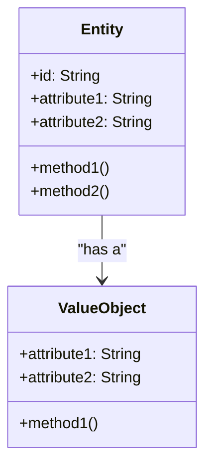

## 14.2. Entities and Value Objects

In the realm of Domain-Driven Design (DDD), understanding the distinction between Entities and Value Objects is crucial for modeling complex domains effectively. These two concepts form the backbone of a well-structured domain model, allowing developers to represent real-world scenarios accurately within software systems. This section will delve into the core concepts of Entities and Value Objects, providing detailed explanations, pseudocode examples, and practical insights to help you master these foundational elements of DDD.

### Defining Core Concepts

#### What Are Entities?

Entities are objects that have a distinct identity that runs through time and different states. They are unique within the context of the application and are often used to represent real-world objects or concepts that have a lifecycle. The identity of an Entity is what distinguishes it from other objects, even if all its attributes are identical. This identity is typically represented by a unique identifier, such as a database primary key.

**Key Characteristics of Entities:**

- **Identity:** Entities have a unique identifier that distinguishes them from other objects.
- **Lifecycle:** Entities have a lifecycle and can change state over time.
- **Equality:** Two entities are considered equal if they have the same identity, not necessarily the same attribute values.

#### What Are Value Objects?

Value Objects, on the other hand, are objects that describe some characteristics or attributes but have no conceptual identity. They are defined by their attributes and are immutable, meaning their state cannot change once they are created. Value Objects are often used to represent descriptive aspects of the domain, such as measurements, quantities, or complex attributes.

**Key Characteristics of Value Objects:**

- **Immutability:** Value Objects do not change once created.
- **Equality:** Two Value Objects are equal if all their attributes are equal.
- **No Identity:** Value Objects do not have a unique identifier.

### Entities vs. Value Objects: A Comparative Analysis

Understanding the differences between Entities and Value Objects is essential for designing a robust domain model. Let's compare these two concepts to highlight their distinct roles within a domain-driven design.

| Aspect             | Entities                            | Value Objects                        |
|--------------------|-------------------------------------|--------------------------------------|
| Identity           | Unique identifier                   | No identity                          |
| State Change       | Mutable, can change over time       | Immutable, cannot change             |
| Equality           | Based on identity                   | Based on attribute values            |
| Lifecycle          | Have a lifecycle                    | No lifecycle                         |
| Usage              | Represent real-world objects        | Represent descriptive aspects        |

#### Visualizing Entities and Value Objects

To better understand the relationship between Entities and Value Objects, let's visualize their interactions within a domain model using a class diagram.



**Diagram Description:** The class diagram above illustrates an Entity that contains a Value Object. The Entity has a unique identifier (`id`) and attributes that can change over time, while the Value Object is defined by its attributes and methods, emphasizing its immutability.

### Pseudocode Examples

Let's explore some pseudocode examples to demonstrate how Entities and Value Objects can be implemented within a domain-driven design.

#### Entity Pseudocode Example

```pseudocode
class Customer {
    // Unique identifier for the Customer entity
    private id: String
    private name: String
    private address: Address

    // Constructor to initialize the Customer entity
    constructor(id: String, name: String, address: Address) {
        this.id = id
        this.name = name
        this.address = address
    }

    // Method to update the customer's address
    method updateAddress(newAddress: Address) {
        this.address = newAddress
    }

    // Method to get the customer's ID
    method getId() {
        return this.id
    }

    // Method to get the customer's name
    method getName() {
        return this.name
    }
}
```

**Explanation:** In this example, the `Customer` class represents an Entity with a unique identifier (`id`). It has mutable attributes, such as `name` and `address`, and methods to update its state, such as `updateAddress`.

#### Value Object Pseudocode Example

```pseudocode
class Address {
    // Attributes of the Address value object
    private street: String
    private city: String
    private postalCode: String

    // Constructor to initialize the Address value object
    constructor(street: String, city: String, postalCode: String) {
        this.street = street
        this.city = city
        this.postalCode = postalCode
    }

    // Method to get the full address as a string
    method getFullAddress() {
        return this.street + ", " + this.city + ", " + this.postalCode
    }

    // Method to check equality with another Address
    method equals(other: Address) {
        return this.street == other.street &&
               this.city == other.city &&
               this.postalCode == other.postalCode
    }
}
```

**Explanation:** The `Address` class is a Value Object with attributes that define its state. It is immutable, meaning its state cannot change after creation. The `equals` method checks for equality based on attribute values.

### Design Considerations

When designing a domain model, it's important to carefully consider when to use Entities and when to use Value Objects. Here are some guidelines to help you make these decisions:

- **Use Entities** when the object has a unique identity and a lifecycle. If the object can change over time and needs to be tracked, it should be modeled as an Entity.
- **Use Value Objects** when the object is defined solely by its attributes and does not have a unique identity. Value Objects are ideal for representing descriptive aspects of the domain that are immutable.

#### Differences and Similarities

Entities and Value Objects are commonly confused due to their overlapping roles in a domain model. However, the key distinction lies in their identity and mutability. Entities have a unique identity and can change over time, while Value Objects are immutable and defined by their attributes.

### Practical Applications

Entities and Value Objects are used extensively in domain-driven design to model complex domains. Let's explore some practical applications of these concepts.

#### Example: E-commerce System

In an e-commerce system, a `Product` can be modeled as an Entity because it has a unique identifier (e.g., SKU) and a lifecycle (e.g., available, out of stock). On the other hand, a `Price` can be modeled as a Value Object because it is defined by its attributes (e.g., amount, currency) and does not have a unique identity.

#### Example: Banking System

In a banking system, an `Account` can be modeled as an Entity because it has a unique identifier (e.g., account number) and a lifecycle (e.g., active, closed). A `Transaction` can be modeled as a Value Object because it is defined by its attributes (e.g., amount, date) and does not have a unique identity.

### Try It Yourself

To reinforce your understanding of Entities and Value Objects, try modifying the pseudocode examples provided above. Experiment with adding new attributes or methods to the `Customer` and `Address` classes. Consider how these changes affect the design and functionality of the domain model.

### Knowledge Check

Before we wrap up, let's pose some questions to test your understanding of Entities and Value Objects:

1. What is the primary difference between an Entity and a Value Object?
2. Why are Value Objects typically immutable?
3. How do you determine if an object should be modeled as an Entity or a Value Object?
4. Can a Value Object have a unique identifier? Why or why not?
5. Provide an example of a real-world scenario where an Entity and a Value Object would be used.

### Summary

In this section, we've explored the core concepts of Entities and Value Objects in domain-driven design. We've defined their key characteristics, compared their differences and similarities, and provided practical examples to illustrate their use in a domain model. By understanding these foundational elements, you can design more robust and accurate domain models that effectively represent real-world scenarios.

Remember, mastering Entities and Value Objects is just the beginning of your journey in domain-driven design. As you continue to explore this field, you'll discover new patterns and techniques to enhance your software design skills. Keep experimenting, stay curious, and enjoy the journey!

## Quiz Time!



### What is the primary characteristic that distinguishes an Entity from a Value Object?

- [x] Unique identity
- [ ] Immutability
- [ ] Attribute values
- [ ] Lifecycle

> **Explanation:** Entities have a unique identity that distinguishes them from other objects, even if their attributes are identical.

### Why are Value Objects typically immutable?

- [x] To ensure consistency and prevent unintended changes
- [ ] To allow for easy comparison
- [ ] To simplify their creation
- [ ] To reduce memory usage

> **Explanation:** Immutability ensures that Value Objects remain consistent and prevents unintended changes to their state.

### How do you determine if an object should be modeled as an Entity or a Value Object?

- [x] By evaluating if it has a unique identity and lifecycle
- [ ] By checking if it has attributes
- [ ] By determining if it can change over time
- [ ] By assessing its complexity

> **Explanation:** An object should be modeled as an Entity if it has a unique identity and lifecycle. Otherwise, it is a Value Object.

### Can a Value Object have a unique identifier?

- [ ] Yes
- [x] No

> **Explanation:** Value Objects do not have a unique identifier; they are defined by their attribute values.

### Provide an example of a real-world scenario where an Entity and a Value Object would be used.

- [x] In an e-commerce system, a Product (Entity) and a Price (Value Object)
- [ ] In a library system, a Book (Value Object) and an Author (Entity)
- [ ] In a healthcare system, a Patient (Value Object) and a Doctor (Entity)
- [ ] In a transportation system, a Vehicle (Value Object) and a Driver (Entity)

> **Explanation:** In an e-commerce system, a Product is an Entity with a unique identifier, while a Price is a Value Object defined by its attributes.

### What is a key benefit of using Value Objects in a domain model?

- [x] They simplify equality checks by comparing attribute values
- [ ] They provide a unique identity for objects
- [ ] They allow for mutable state changes
- [ ] They reduce the complexity of the domain model

> **Explanation:** Value Objects simplify equality checks by comparing attribute values, as they do not have a unique identity.

### In what scenario would you use an Entity over a Value Object?

- [x] When the object has a unique identity and lifecycle
- [ ] When the object is defined by its attributes
- [ ] When the object is immutable
- [ ] When the object has no lifecycle

> **Explanation:** An Entity is used when the object has a unique identity and lifecycle, allowing it to change over time.

### How does the immutability of Value Objects benefit a domain model?

- [x] It ensures consistency and prevents unintended changes
- [ ] It allows for easy modification of attributes
- [ ] It reduces the complexity of the model
- [ ] It provides a unique identity for objects

> **Explanation:** Immutability ensures consistency and prevents unintended changes to the state of Value Objects.

### What is the role of a unique identifier in an Entity?

- [x] To distinguish it from other objects
- [ ] To define its attributes
- [ ] To ensure immutability
- [ ] To simplify equality checks

> **Explanation:** A unique identifier distinguishes an Entity from other objects, even if their attributes are identical.

### True or False: A Value Object can change its state after creation.

- [ ] True
- [x] False

> **Explanation:** Value Objects are immutable and cannot change their state after creation.


