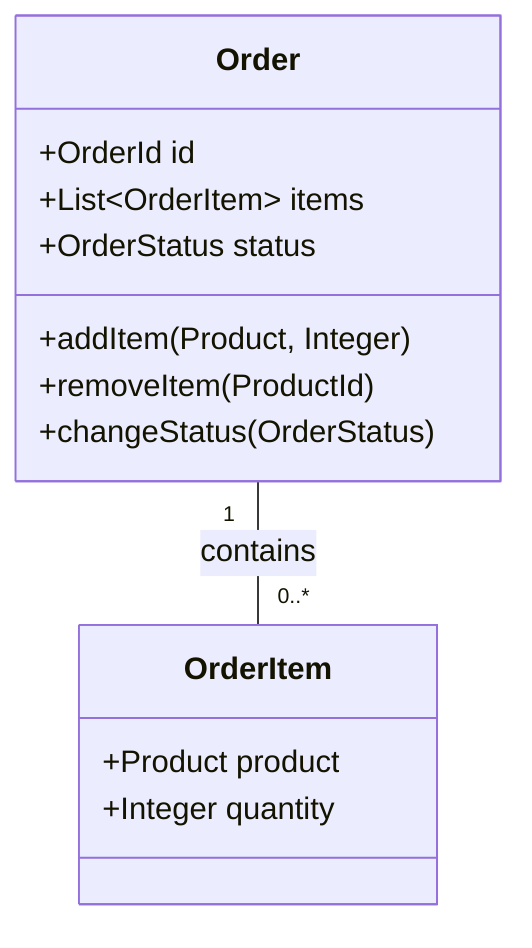
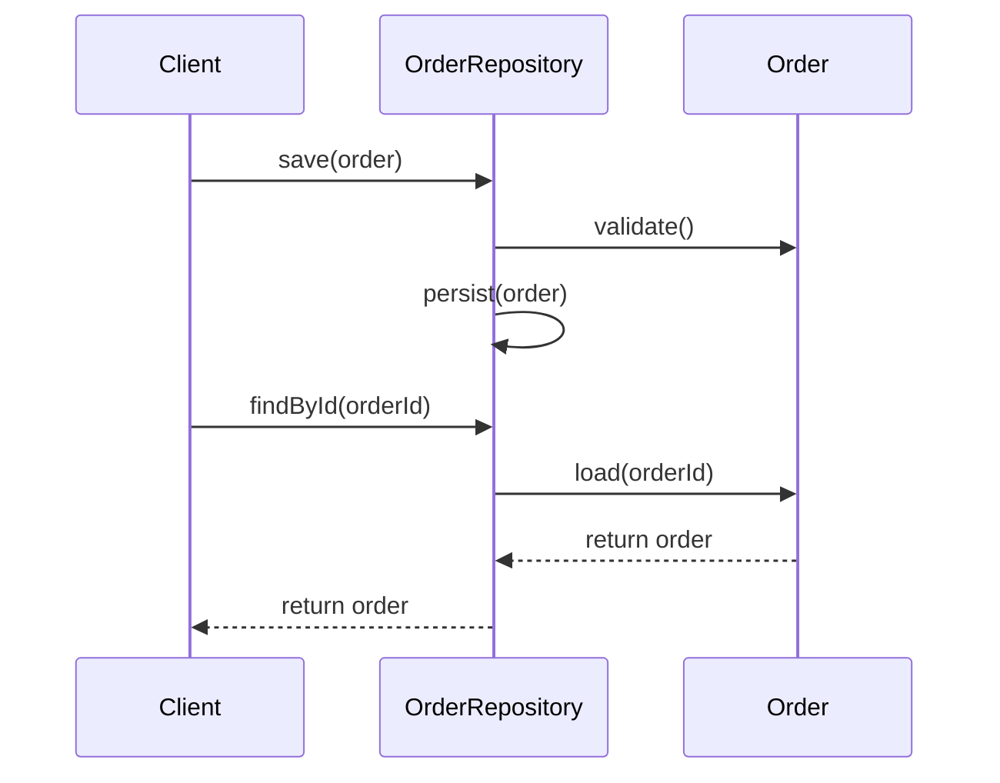

## 14.3. Aggregates and Repositories

In the realm of Domain-Driven Design (DDD), Aggregates and Repositories play pivotal roles in structuring complex software systems. They help manage object graphs and streamline data access patterns, ensuring that the domain model remains consistent and robust. This section delves into these concepts, providing a comprehensive understanding of their purpose, implementation, and best practices.

### Understanding Aggregates

#### Definition and Intent

An **Aggregate** is a cluster of domain objects that can be treated as a single unit. It is a pattern used to maintain the consistency of changes being made to the domain model. The main purpose of an Aggregate is to define a boundary within which invariants are maintained. This boundary is crucial for ensuring that all changes to the domain model are consistent and valid.

#### Key Participants

- **Aggregate Root**: The main entity within an Aggregate that is responsible for maintaining the integrity of the Aggregate. It is the only entity that external objects are allowed to reference directly.
- **Entities**: Objects within the Aggregate that have an identity and can change over time.
- **Value Objects**: Immutable objects within the Aggregate that do not have an identity.

#### Applicability

Use Aggregates when you need to enforce invariants across multiple entities and value objects. They are particularly useful in complex domains where maintaining consistency is critical.

#### Sample Code Snippets

Let's explore a pseudocode example to illustrate the concept of Aggregates. Consider a simple e-commerce domain where an `Order` is an Aggregate.

```pseudocode
class Order {
    private id: OrderId
    private items: List<OrderItem>
    private status: OrderStatus

    method addItem(product: Product, quantity: Integer) {
        item = new OrderItem(product, quantity)
        items.add(item)
    }

    method removeItem(productId: ProductId) {
        items.removeIf(item -> item.product.id == productId)
    }

    method changeStatus(newStatus: OrderStatus) {
        if (canChangeTo(newStatus)) {
            status = newStatus
        }
    }

    private method canChangeTo(newStatus: OrderStatus): Boolean {
        // Logic to determine if status change is allowed
    }
}

class OrderItem {
    private product: Product
    private quantity: Integer
}
```

In this example, `Order` is the Aggregate Root, and it manages a collection of `OrderItem` entities. The `Order` class ensures that all operations on the `OrderItem` entities are valid and consistent.

#### Design Considerations

- **Consistency Boundary**: The Aggregate defines a consistency boundary. Ensure that all invariants are maintained within this boundary.
- **Size of Aggregates**: Keep Aggregates small to avoid performance issues. Large Aggregates can lead to locking and contention problems.
- **Transaction Management**: Transactions should not span multiple Aggregates. Each Aggregate should be modified in its own transaction.

### Visualizing Aggregates

To better understand the structure of Aggregates, let's visualize the relationship between an Aggregate Root and its entities using a class diagram.



**Diagram Description**: This class diagram illustrates the `Order` Aggregate, where `Order` is the Aggregate Root containing multiple `OrderItem` entities.

### Exploring Repositories

#### Definition and Intent

A **Repository** is a pattern that provides an abstraction over data storage, allowing domain objects to be retrieved and persisted without exposing the underlying data access logic. It acts as a collection of domain objects, providing methods to add, remove, and query them.

#### Key Participants

- **Repository Interface**: Defines the operations for accessing and managing domain objects.
- **Concrete Repository**: Implements the Repository Interface, providing the actual data access logic.

#### Applicability

Use Repositories when you need to abstract the data access logic from the domain model. They are essential for maintaining a clean separation of concerns between the domain logic and data persistence.

#### Sample Code Snippets

Let's consider a pseudocode example of a Repository for the `Order` Aggregate.

```pseudocode
interface OrderRepository {
    method save(order: Order)
    method findById(orderId: OrderId): Order
    method findAll(): List<Order>
    method delete(order: Order)
}

class InMemoryOrderRepository implements OrderRepository {
    private storage: Map<OrderId, Order> = new HashMap()

    method save(order: Order) {
        storage.put(order.id, order)
    }

    method findById(orderId: OrderId): Order {
        return storage.get(orderId)
    }

    method findAll(): List<Order> {
        return new ArrayList(storage.values())
    }

    method delete(order: Order) {
        storage.remove(order.id)
    }
}
```

In this example, `OrderRepository` is an interface that defines the operations for managing `Order` Aggregates. `InMemoryOrderRepository` is a concrete implementation that stores `Order` objects in memory.

#### Design Considerations

- **Abstraction**: Repositories should abstract the data access logic, allowing the domain model to remain independent of the persistence mechanism.
- **Consistency**: Ensure that Repositories maintain the consistency of Aggregates when retrieving and persisting them.
- **Performance**: Consider the performance implications of data access operations, especially when dealing with large datasets.

### Visualizing Repositories

To visualize the interaction between a Repository and an Aggregate, let's use a sequence diagram.



**Diagram Description**: This sequence diagram shows the interaction between a client, the `OrderRepository`, and the `Order` Aggregate during save and find operations.

### Managing Object Graphs

#### Challenges and Strategies

Managing object graphs in complex domains can be challenging. Aggregates and Repositories provide strategies to address these challenges by defining clear boundaries and responsibilities.

- **Aggregate Boundaries**: Define clear boundaries for Aggregates to ensure that all changes within the boundary are consistent.
- **Lazy Loading**: Use lazy loading techniques to avoid loading entire object graphs into memory unnecessarily.
- **Cascading Operations**: Ensure that operations on the Aggregate Root cascade to its entities and value objects as needed.

#### Sample Code Snippets

Let's explore a pseudocode example that demonstrates managing object graphs with lazy loading.

```pseudocode
class Order {
    private id: OrderId
    private items: List<OrderItem> = null

    method getItems(): List<OrderItem> {
        if (items == null) {
            items = loadItemsFromDatabase(id)
        }
        return items
    }

    private method loadItemsFromDatabase(orderId: OrderId): List<OrderItem> {
        // Logic to load items from the database
    }
}
```

In this example, the `Order` class uses lazy loading to retrieve `OrderItem` entities only when they are needed, optimizing memory usage.

### Data Access Patterns

#### Repository Pattern

The Repository Pattern is a key data access pattern in DDD. It abstracts the data access logic, allowing the domain model to focus on business logic.

- **Advantages**: Provides a clean separation of concerns, improves testability, and allows for easy switching of persistence mechanisms.
- **Disadvantages**: Can add complexity, especially when dealing with complex queries and relationships.

#### Unit of Work Pattern

The Unit of Work Pattern is often used in conjunction with Repositories to manage transactions and ensure consistency.

- **Advantages**: Manages transactions efficiently, reduces the risk of inconsistent data, and provides a clear boundary for transaction management.
- **Disadvantages**: Can be complex to implement, especially in distributed systems.

#### Sample Code Snippets

Let's explore a pseudocode example that demonstrates the Unit of Work Pattern in conjunction with Repositories.

```pseudocode
class UnitOfWork {
    private newEntities: List<Entity> = new ArrayList()
    private modifiedEntities: List<Entity> = new ArrayList()
    private deletedEntities: List<Entity> = new ArrayList()

    method registerNew(entity: Entity) {
        newEntities.add(entity)
    }

    method registerModified(entity: Entity) {
        modifiedEntities.add(entity)
    }

    method registerDeleted(entity: Entity) {
        deletedEntities.add(entity)
    }

    method commit() {
        // Persist new entities
        for (entity in newEntities) {
            // Logic to persist entity
        }
        // Update modified entities
        for (entity in modifiedEntities) {
            // Logic to update entity
        }
        // Delete removed entities
        for (entity in deletedEntities) {
            // Logic to delete entity
        }
    }
}
```

In this example, the `UnitOfWork` class manages the persistence of new, modified, and deleted entities, ensuring that all changes are committed as a single transaction.

### Differences and Similarities

#### Aggregates vs. Repositories

- **Purpose**: Aggregates define consistency boundaries, while Repositories abstract data access logic.
- **Responsibilities**: Aggregates manage domain logic and invariants, whereas Repositories handle persistence operations.
- **Interactions**: Aggregates are accessed and manipulated through Repositories, which provide a clean interface for data access.

### Try It Yourself

Encourage experimentation by suggesting modifications to the code examples. Try adding new methods to the `Order` Aggregate, such as a method to calculate the total price of the order. Implement additional data access methods in the `OrderRepository`, such as finding orders by status or date range.

### Knowledge Check

- What is the primary role of an Aggregate in DDD?
- How do Repositories abstract data access logic?
- What are the benefits of using the Unit of Work Pattern with Repositories?
- How can lazy loading optimize memory usage in managing object graphs?

### Embrace the Journey

Remember, mastering Aggregates and Repositories is just the beginning of your journey in Domain-Driven Design. As you progress, you'll build more complex and robust systems. Keep experimenting, stay curious, and enjoy the journey!

### Summary

In this section, we've explored the concepts of Aggregates and Repositories in Domain-Driven Design. We've learned how Aggregates define consistency boundaries and how Repositories abstract data access logic. By understanding these patterns, you can build more robust and maintainable software systems.

## Quiz Time!



### What is the primary role of an Aggregate in Domain-Driven Design?

- [x] To define a consistency boundary and maintain invariants
- [ ] To abstract data access logic
- [ ] To manage transactions
- [ ] To handle user interface logic

> **Explanation:** Aggregates define a consistency boundary within which invariants are maintained, ensuring that changes to the domain model are consistent and valid.

### Which component is responsible for maintaining the integrity of an Aggregate?

- [x] Aggregate Root
- [ ] Entity
- [ ] Value Object
- [ ] Repository

> **Explanation:** The Aggregate Root is the main entity within an Aggregate that is responsible for maintaining its integrity.

### What is the primary purpose of a Repository in Domain-Driven Design?

- [x] To abstract data access logic
- [ ] To define consistency boundaries
- [ ] To manage transactions
- [ ] To handle user interface logic

> **Explanation:** Repositories abstract the data access logic, allowing domain objects to be retrieved and persisted without exposing the underlying data access details.

### How does the Unit of Work Pattern complement Repositories?

- [x] By managing transactions and ensuring consistency
- [ ] By defining consistency boundaries
- [ ] By abstracting data access logic
- [ ] By handling user interface logic

> **Explanation:** The Unit of Work Pattern manages transactions and ensures consistency by committing changes to new, modified, and deleted entities as a single transaction.

### What technique can be used to optimize memory usage when managing object graphs?

- [x] Lazy Loading
- [ ] Eager Loading
- [ ] Cascading Operations
- [ ] Data Caching

> **Explanation:** Lazy Loading optimizes memory usage by loading objects only when they are needed, avoiding the unnecessary loading of entire object graphs.

### Which pattern provides a clean separation of concerns between domain logic and data persistence?

- [x] Repository Pattern
- [ ] Aggregate Pattern
- [ ] Unit of Work Pattern
- [ ] Observer Pattern

> **Explanation:** The Repository Pattern provides a clean separation of concerns by abstracting data access logic from the domain model.

### What is a potential disadvantage of using large Aggregates?

- [x] Performance issues due to locking and contention
- [ ] Difficulty in maintaining invariants
- [ ] Increased complexity in data access logic
- [ ] Lack of consistency boundaries

> **Explanation:** Large Aggregates can lead to performance issues due to locking and contention, as they may require more resources to manage.

### What is the role of the Aggregate Root in an Aggregate?

- [x] To manage domain logic and invariants
- [ ] To abstract data access logic
- [ ] To handle transactions
- [ ] To manage user interface logic

> **Explanation:** The Aggregate Root manages domain logic and invariants, ensuring that all changes within the Aggregate are consistent and valid.

### How do Repositories improve testability?

- [x] By abstracting data access logic, allowing for easier mocking and testing
- [ ] By defining consistency boundaries
- [ ] By managing transactions
- [ ] By handling user interface logic

> **Explanation:** Repositories abstract data access logic, making it easier to mock and test the domain model without relying on the actual persistence mechanism.

### True or False: Transactions should span multiple Aggregates to ensure consistency.

- [ ] True
- [x] False

> **Explanation:** Transactions should not span multiple Aggregates. Each Aggregate should be modified in its own transaction to maintain consistency and avoid complexity.


