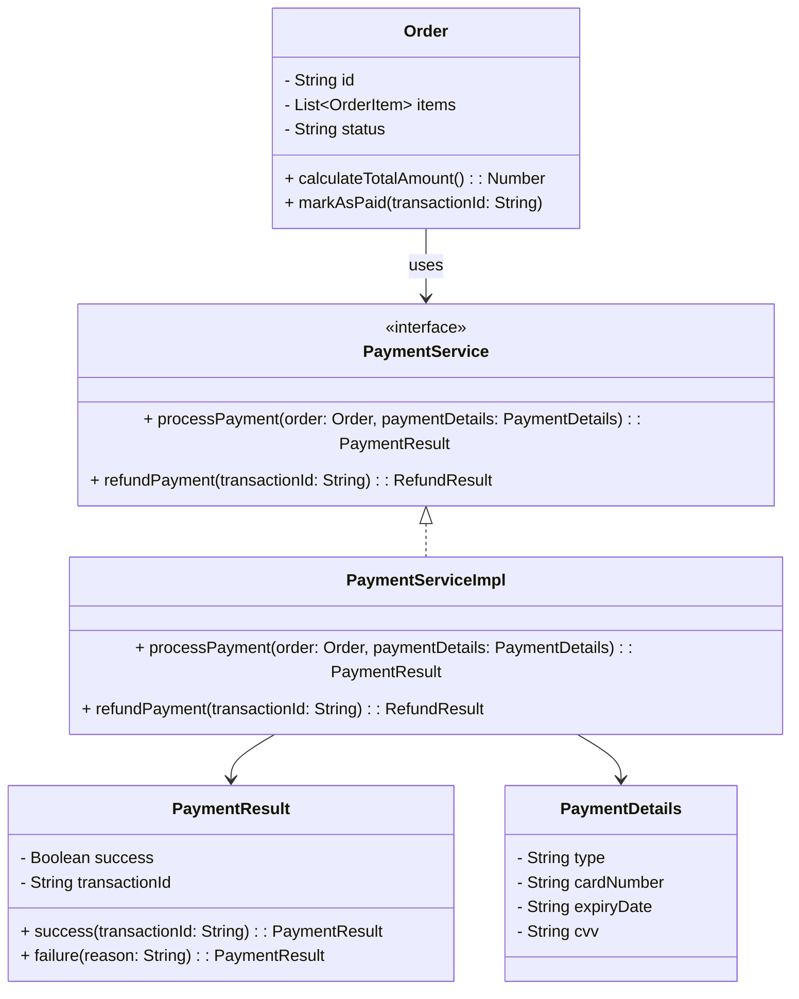

## 14.4. Domain Services

In the realm of Domain-Driven Design (DDD), the concept of Domain Services is pivotal for handling operations that do not naturally belong to any specific entity or value object. This section delves into the intricacies of Domain Services, providing a comprehensive understanding of their role, implementation, and significance within a domain model. We will explore how Domain Services complement entities and value objects, ensuring that domain logic is encapsulated in a manner that maintains the integrity and cohesion of the domain model.

### Understanding Domain Services

Domain Services are a crucial part of the domain layer in DDD. They encapsulate domain logic that does not naturally fit within an entity or value object. This logic often involves operations that span multiple entities or require complex calculations or transformations. By isolating this logic within Domain Services, we maintain the Single Responsibility Principle (SRP) and ensure that our domain model remains clean and focused.

#### Key Characteristics of Domain Services

1. **Statelessness**: Domain Services are typically stateless, meaning they do not hold any state themselves. They operate on the state of entities and value objects passed to them.

2. **Domain Logic Encapsulation**: They encapsulate domain-specific logic that is not naturally part of an entity or value object.

3. **Inter-Entity Operations**: Domain Services often handle operations that involve multiple entities or require coordination between them.

4. **Reusability**: By encapsulating logic in Domain Services, we promote reusability across different parts of the application.

5. **Expressiveness**: They enhance the expressiveness of the domain model by providing clear and meaningful operations that reflect the domain language.

### When to Use Domain Services

Domain Services should be used when:

- The operation involves multiple entities and cannot be naturally assigned to any single entity.
- The logic is complex and would clutter an entity or value object.
- The operation is a significant part of the domain logic and deserves its own abstraction.
- You need to adhere to the SRP by separating concerns.

### Domain Services vs. Application Services

It's important to distinguish between Domain Services and Application Services:

- **Domain Services**: Focus on domain logic and operate within the domain layer. They are part of the core domain model and encapsulate business rules and operations.
- **Application Services**: Reside in the application layer and coordinate tasks, manage transactions, and interact with the domain layer. They are responsible for orchestrating use cases and workflows.

### Implementing Domain Services

Let's explore how to implement Domain Services using pseudocode. We'll cover the essential steps and considerations for creating effective Domain Services.

#### Step 1: Identify the Domain Logic

The first step in implementing a Domain Service is to identify the domain logic that needs to be encapsulated. This logic should be significant enough to warrant its own abstraction and should not naturally belong to any single entity or value object.

#### Step 2: Define the Service Interface

Define a clear and expressive interface for the Domain Service. This interface should reflect the domain language and provide meaningful operations.

```pseudocode
interface PaymentService {
    function processPayment(order: Order, paymentDetails: PaymentDetails): PaymentResult
    function refundPayment(transactionId: String): RefundResult
}
```

#### Step 3: Implement the Service

Implement the Domain Service by encapsulating the identified domain logic. Ensure that the service is stateless and operates on the state of entities and value objects passed to it.

```pseudocode
class PaymentServiceImpl implements PaymentService {
    
    function processPayment(order: Order, paymentDetails: PaymentDetails): PaymentResult {
        // Validate payment details
        if (!validatePaymentDetails(paymentDetails)) {
            return PaymentResult.failure("Invalid payment details")
        }
        
        // Calculate total amount
        totalAmount = order.calculateTotalAmount()
        
        // Process payment with external gateway
        paymentGateway = PaymentGatewayFactory.create(paymentDetails.type)
        transactionId = paymentGateway.process(totalAmount, paymentDetails)
        
        // Update order status
        order.markAsPaid(transactionId)
        
        return PaymentResult.success(transactionId)
    }
    
    function refundPayment(transactionId: String): RefundResult {
        // Retrieve transaction details
        transaction = TransactionRepository.findById(transactionId)
        
        // Validate transaction
        if (transaction == null || !transaction.isRefundable()) {
            return RefundResult.failure("Transaction not refundable")
        }
        
        // Process refund
        paymentGateway = PaymentGatewayFactory.create(transaction.paymentType)
        refundSuccess = paymentGateway.refund(transactionId)
        
        if (refundSuccess) {
            transaction.markAsRefunded()
            return RefundResult.success()
        } else {
            return RefundResult.failure("Refund failed")
        }
    }
}
```

#### Step 4: Integrate with the Domain Model

Integrate the Domain Service with the domain model by injecting it into entities or application services that require its functionality. This integration should be seamless and maintain the cohesion of the domain model.

```pseudocode
class Order {
    private paymentService: PaymentService
    
    constructor(paymentService: PaymentService) {
        this.paymentService = paymentService
    }
    
    function completeOrder(paymentDetails: PaymentDetails): PaymentResult {
        return paymentService.processPayment(this, paymentDetails)
    }
}
```

### Visualizing Domain Services

To better understand the role of Domain Services, let's visualize their interaction with entities and value objects.



**Diagram Description**: This class diagram illustrates the interaction between the `Order` entity, `PaymentDetails` value object, `PaymentResult` value object, and the `PaymentService` domain service. The `Order` entity uses the `PaymentService` to process payments, while the `PaymentServiceImpl` implements the `PaymentService` interface.

### Design Considerations

When designing Domain Services, consider the following:

- **Statelessness**: Ensure that Domain Services remain stateless and do not hold any persistent state. This promotes scalability and reusability.
- **Expressiveness**: Use meaningful names and operations that reflect the domain language, enhancing the expressiveness of the domain model.
- **Separation of Concerns**: Keep domain logic separate from application logic by encapsulating it within Domain Services.
- **Testing**: Write unit tests for Domain Services to ensure that domain logic is correctly implemented and behaves as expected.

### Differences and Similarities with Other Patterns

Domain Services are often confused with other service patterns, such as Application Services and Infrastructure Services. Here's a brief comparison:

- **Domain Services vs. Application Services**: Domain Services focus on domain logic, while Application Services coordinate tasks and workflows at the application level.
- **Domain Services vs. Infrastructure Services**: Domain Services encapsulate domain logic, whereas Infrastructure Services handle technical concerns like data access and messaging.

### Try It Yourself

To deepen your understanding of Domain Services, try modifying the pseudocode examples provided:

- **Enhance the PaymentService**: Add a new operation to handle partial refunds and implement the logic within `PaymentServiceImpl`.
- **Refactor the Order Entity**: Move additional payment-related logic from the `Order` entity to the `PaymentService` to further adhere to the SRP.

### Knowledge Check

Before we conclude, let's reinforce what we've learned with a few questions:

- What are the key characteristics of Domain Services?
- When should you use a Domain Service instead of an entity or value object?
- How do Domain Services differ from Application Services?

### Embrace the Journey

Remember, mastering Domain Services is just one step in your journey to becoming proficient in Domain-Driven Design. As you continue to explore and apply these concepts, you'll gain a deeper understanding of how to design robust and maintainable software systems. Keep experimenting, stay curious, and enjoy the journey!

## Quiz Time!



### What is a primary characteristic of Domain Services?

- [x] Statelessness
- [ ] Statefulness
- [ ] Dependency on UI
- [ ] Persistent storage

> **Explanation:** Domain Services are typically stateless, meaning they do not hold any state themselves but operate on the state of entities and value objects passed to them.

### When should you use a Domain Service?

- [x] When logic involves multiple entities
- [ ] When logic is specific to a single entity
- [ ] For managing UI components
- [ ] For database operations

> **Explanation:** Domain Services should be used when the operation involves multiple entities and cannot be naturally assigned to any single entity.

### How do Domain Services differ from Application Services?

- [x] Domain Services focus on domain logic
- [ ] Domain Services manage transactions
- [ ] Domain Services handle UI rendering
- [ ] Domain Services are part of the application layer

> **Explanation:** Domain Services focus on domain logic and operate within the domain layer, while Application Services coordinate tasks and workflows at the application level.

### What is the role of Domain Services in DDD?

- [x] Encapsulating domain logic not belonging to entities
- [ ] Managing database connections
- [ ] Handling user interface logic
- [ ] Performing data serialization

> **Explanation:** Domain Services encapsulate domain-specific logic that does not naturally belong to any single entity or value object.

### What is a benefit of using Domain Services?

- [x] Reusability of domain logic
- [ ] Increased coupling between components
- [ ] Simplified UI design
- [ ] Direct database manipulation

> **Explanation:** By encapsulating logic in Domain Services, we promote reusability across different parts of the application.

### What should Domain Services avoid holding?

- [x] Persistent state
- [ ] Domain logic
- [ ] Entity references
- [ ] Value objects

> **Explanation:** Domain Services should remain stateless and not hold any persistent state to promote scalability and reusability.

### What is a common use case for Domain Services?

- [x] Operations involving multiple entities
- [ ] Single entity operations
- [ ] UI rendering
- [ ] Database schema design

> **Explanation:** Domain Services often handle operations that involve multiple entities or require coordination between them.

### What is the relationship between Domain Services and entities?

- [x] Domain Services operate on the state of entities
- [ ] Domain Services are stored within entities
- [ ] Domain Services manage entity lifecycles
- [ ] Domain Services replace entities

> **Explanation:** Domain Services are stateless and operate on the state of entities and value objects passed to them.

### Can Domain Services be stateful?

- [ ] Yes
- [x] No

> **Explanation:** Domain Services are typically stateless to ensure scalability and reusability.

### What is a key design consideration for Domain Services?

- [x] Separation of concerns
- [ ] Integration with UI components
- [ ] Direct database access
- [ ] Persistent storage management

> **Explanation:** Keeping domain logic separate from application logic by encapsulating it within Domain Services is a key design consideration.


