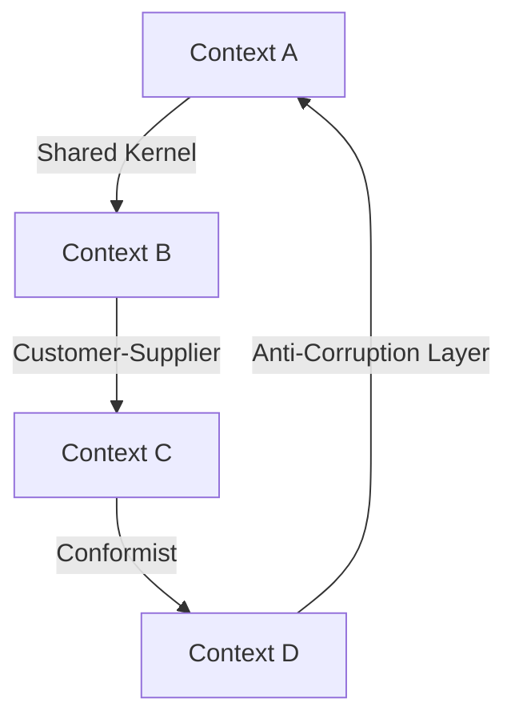

## 14.5. Bounded Contexts

In the realm of software architecture, especially within Domain-Driven Design (DDD), the concept of Bounded Contexts plays a pivotal role. It helps manage complexity by defining clear boundaries within which a particular model is applicable. This section delves into the intricacies of Bounded Contexts, providing expert developers with the knowledge to effectively implement and integrate them into their systems.

### Understanding Bounded Contexts

**Bounded Context** is a central pattern in Domain-Driven Design. It refers to the explicit boundary within which a particular domain model is defined and applicable. Within a Bounded Context, the terms and concepts have specific meanings, and the model is consistent and coherent.

#### Intent

The primary intent of Bounded Contexts is to manage complexity by dividing a large system into smaller, more manageable parts. Each part, or context, is responsible for a specific sub-domain and has its own ubiquitous language and model.

#### Key Participants

- **Domain Model**: Represents the concepts and rules of the domain within the context.
- **Ubiquitous Language**: A shared language used by all team members to ensure clear communication.
- **Context Boundary**: Defines the limits of the context and its interactions with other contexts.

#### Applicability

Bounded Contexts are applicable in scenarios where:

- The domain is complex and requires multiple models.
- Different teams work on different parts of the system.
- Integration between different parts of the system is necessary.

### Visualizing Bounded Contexts

To better understand Bounded Contexts, let's visualize how they interact within a system. The following diagram illustrates a system with multiple Bounded Contexts and their relationships:



**Diagram Explanation**: This diagram shows four Bounded Contexts (A, B, C, D) and their relationships. Context A and B share a kernel, B supplies C, C conforms to D, and D uses an anti-corruption layer to interact with A.

### Context Mapping

Context Mapping is a technique used to visualize and manage the relationships between different Bounded Contexts. It helps identify how contexts interact and what integration strategies are needed.

#### Types of Context Relationships

1. **Shared Kernel**: Two contexts share a common subset of the domain model. Changes require coordination.
2. **Customer-Supplier**: One context (supplier) provides services to another (customer). The supplier must meet the customer's needs.
3. **Conformist**: One context adapts to another without influencing it.
4. **Anti-Corruption Layer**: A layer that translates between two contexts to prevent one from being corrupted by the other.

### Integrating Multiple Models

Integrating multiple models involves ensuring that different Bounded Contexts can work together seamlessly. This often requires careful planning and the use of specific patterns.

#### Sample Code Snippets

Let's explore some pseudocode examples to illustrate how Bounded Contexts can be implemented and integrated.

**Example 1: Shared Kernel**

```pseudocode
// Context A and B share a common domain model
class SharedKernel {
    method commonOperation() {
        // Shared logic
    }
}

class ContextA {
    SharedKernel kernel;

    method performAction() {
        kernel.commonOperation();
        // Additional logic specific to Context A
    }
}

class ContextB {
    SharedKernel kernel;

    method performAction() {
        kernel.commonOperation();
        // Additional logic specific to Context B
    }
}
```

**Example 2: Customer-Supplier**

```pseudocode
// Context B acts as a supplier to Context C
class Supplier {
    method provideService() {
        // Service logic
    }
}

class Customer {
    Supplier supplier;

    method useService() {
        supplier.provideService();
        // Additional logic specific to Customer
    }
}
```

**Example 3: Anti-Corruption Layer**

```pseudocode
// Context D uses an anti-corruption layer to interact with Context A
class AntiCorruptionLayer {
    ContextA contextA;

    method translateAndExecute() {
        // Translate request
        contextA.performAction();
        // Translate response
    }
}

class ContextD {
    AntiCorruptionLayer acl;

    method executeAction() {
        acl.translateAndExecute();
        // Additional logic specific to Context D
    }
}
```

### Design Considerations

When implementing Bounded Contexts, consider the following:

- **Clear Boundaries**: Ensure that each context has well-defined boundaries and responsibilities.
- **Consistent Language**: Use a consistent ubiquitous language within each context to avoid confusion.
- **Integration Strategy**: Choose the appropriate integration strategy based on the relationship between contexts.
- **Team Organization**: Align teams with Bounded Contexts to enhance focus and reduce dependencies.

### Differences and Similarities

Bounded Contexts are often confused with other patterns, such as Microservices. While both aim to manage complexity, Bounded Contexts focus on the domain model and language, whereas Microservices emphasize technical boundaries and scalability.

### Try It Yourself

To deepen your understanding, try modifying the pseudocode examples. For instance, change the integration strategy between Context B and C from Customer-Supplier to Conformist and observe the impact.

### Knowledge Check

- **Question**: What is the primary purpose of a Bounded Context?
- **Exercise**: Identify a real-world system and map out its potential Bounded Contexts.

### Embrace the Journey

Remember, mastering Bounded Contexts is a journey. As you progress, you'll gain a deeper understanding of how to manage complexity and integrate multiple models effectively. Keep experimenting, stay curious, and enjoy the journey!

### References and Links

For further reading, explore the following resources:

- [Domain-Driven Design Reference](https://www.domainlanguage.com/ddd/reference/)
- [Martin Fowler's Article on Bounded Contexts](https://martinfowler.com/bliki/BoundedContext.html)

## Quiz Time!



### What is a Bounded Context in Domain-Driven Design?

- [x] A boundary within which a particular domain model is defined and applicable
- [ ] A shared language used across all contexts
- [ ] A technique for optimizing database queries
- [ ] A method for scaling applications

> **Explanation:** A Bounded Context is a boundary within which a specific domain model is defined and applicable, ensuring consistency and clarity.

### Which of the following is a type of context relationship?

- [x] Shared Kernel
- [x] Customer-Supplier
- [ ] Singleton
- [x] Anti-Corruption Layer

> **Explanation:** Shared Kernel, Customer-Supplier, and Anti-Corruption Layer are types of context relationships in DDD.

### What is the role of an Anti-Corruption Layer?

- [x] To translate between two contexts to prevent corruption
- [ ] To optimize data storage
- [ ] To enhance user interface design
- [ ] To manage database transactions

> **Explanation:** An Anti-Corruption Layer translates between two contexts to prevent one from being corrupted by the other.

### In a Customer-Supplier relationship, who must meet the needs of whom?

- [x] The supplier must meet the needs of the customer
- [ ] The customer must meet the needs of the supplier
- [ ] Both must meet each other's needs equally
- [ ] Neither has specific obligations

> **Explanation:** In a Customer-Supplier relationship, the supplier must meet the needs of the customer.

### What is the main focus of Bounded Contexts compared to Microservices?

- [x] Domain model and language
- [ ] Technical boundaries and scalability
- [ ] User interface design
- [ ] Database optimization

> **Explanation:** Bounded Contexts focus on the domain model and language, while Microservices emphasize technical boundaries and scalability.

### Which pattern is often confused with Bounded Contexts?

- [x] Microservices
- [ ] Singleton
- [ ] Factory Method
- [ ] Observer

> **Explanation:** Bounded Contexts are often confused with Microservices due to their focus on managing complexity.

### What is a key consideration when implementing Bounded Contexts?

- [x] Clear boundaries and responsibilities
- [ ] Maximizing database queries
- [ ] Enhancing user interface design
- [ ] Increasing code redundancy

> **Explanation:** Clear boundaries and responsibilities are essential when implementing Bounded Contexts.

### How does a Conformist relationship work?

- [x] One context adapts to another without influencing it
- [ ] Both contexts influence each other equally
- [ ] One context dominates the other
- [ ] Neither context interacts with the other

> **Explanation:** In a Conformist relationship, one context adapts to another without influencing it.

### What should teams align with to enhance focus?

- [x] Bounded Contexts
- [ ] Database schemas
- [ ] User interface components
- [ ] Network protocols

> **Explanation:** Aligning teams with Bounded Contexts enhances focus and reduces dependencies.

### True or False: Bounded Contexts are only applicable in large systems.

- [ ] True
- [x] False

> **Explanation:** Bounded Contexts are applicable in any system where managing complexity and integrating multiple models is necessary.




