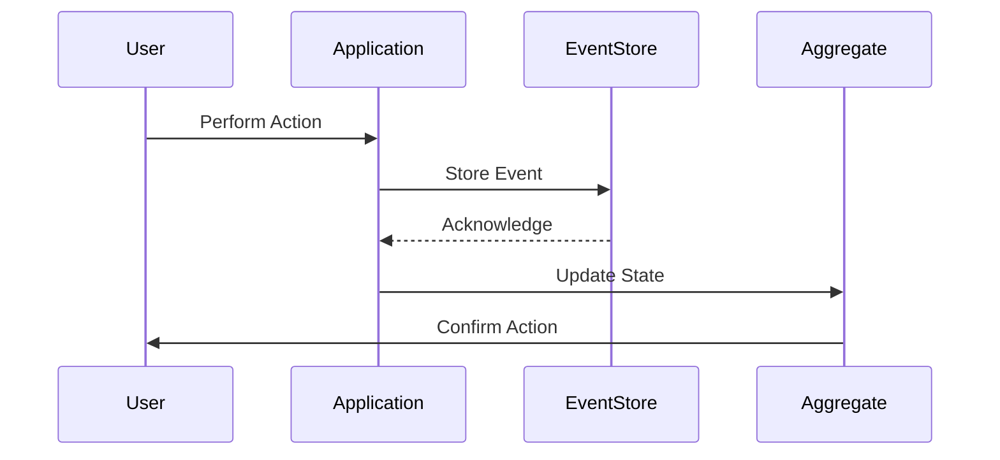
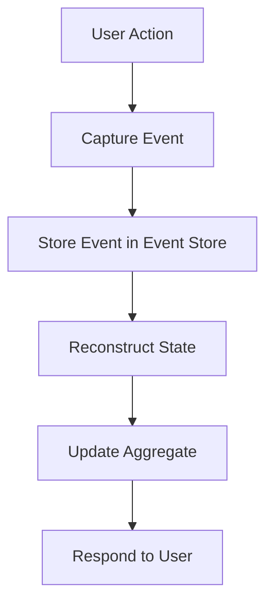

## 14.6. Event Sourcing

Event Sourcing is a powerful design pattern in Domain-Driven Design (DDD) that focuses on storing changes as events and reconstructing state from these events. It is an essential pattern for building robust, scalable, and maintainable systems, especially in event-driven architectures. In this section, we will delve into the intricacies of Event Sourcing, exploring its concepts, benefits, challenges, and practical applications.

### Introduction to Event Sourcing

Event Sourcing is a design pattern where every change to the state of an application is captured as an event. Instead of storing the current state of an entity, Event Sourcing stores a sequence of events that represent state changes. This sequence of events can be used to reconstruct the current state of the entity at any point in time.

#### Key Concepts

- **Event**: An event is a record of a change in state. It is immutable and represents a fact that has occurred in the past.
- **Event Store**: A storage mechanism for events. It acts as a source of truth for the state of the system.
- **Event Stream**: A sequence of events related to a particular entity or aggregate.
- **Snapshot**: A point-in-time representation of the state of an entity, used to optimize the reconstruction process.

### Intent of Event Sourcing

The primary intent of Event Sourcing is to ensure that every state change is captured and stored as an event. This approach provides several benefits, including:

- **Auditability**: Every change is recorded, allowing for a complete audit trail.
- **Reproducibility**: The state of the system can be reconstructed at any point in time.
- **Scalability**: Events can be processed asynchronously, enabling scalable architectures.
- **Flexibility**: New features can be added by replaying events with new logic.

### Diagrams

To better understand Event Sourcing, let's visualize the flow of events and state reconstruction using a Mermaid.js sequence diagram.



**Diagram Description**: This sequence diagram illustrates the flow of events in an Event Sourcing system. A user performs an action, which is captured as an event by the application. The event is stored in the Event Store, and the aggregate's state is updated based on the event.

### Key Participants

- **User**: Initiates actions that result in state changes.
- **Application**: Captures actions as events and manages state updates.
- **Event Store**: Stores events as the source of truth.
- **Aggregate**: Represents the current state of an entity, reconstructed from events.

### Applicability

Event Sourcing is particularly useful in scenarios where:

- **Auditability** is a requirement, and a complete history of changes is needed.
- **Complex Business Logic** involves multiple state transitions.
- **Scalability** is essential, and asynchronous processing is beneficial.
- **Event-Driven Architectures** are employed, and integration with other systems is required.

### Sample Code Snippets

Let's explore how Event Sourcing can be implemented using pseudocode. We will demonstrate the process of storing events and reconstructing state.

#### Storing Events

```pseudocode
class EventStore {
    events = []

    function storeEvent(event) {
        // Store the event in the event store
        events.append(event)
    }

    function getEventsForAggregate(aggregateId) {
        // Retrieve events for a specific aggregate
        return events.filter(event => event.aggregateId == aggregateId)
    }
}

class Event {
    constructor(aggregateId, eventType, eventData) {
        this.aggregateId = aggregateId
        this.eventType = eventType
        this.eventData = eventData
        this.timestamp = getCurrentTimestamp()
    }
}
```

#### Reconstructing State

```pseudocode
class Aggregate {
    state = {}

    function applyEvent(event) {
        // Update the state based on the event type
        switch (event.eventType) {
            case "Created":
                state = event.eventData
                break
            case "Updated":
                state.update(event.eventData)
                break
            // Add more cases for different event types
        }
    }

    function reconstructState(events) {
        // Reconstruct the state by applying each event
        events.forEach(event => applyEvent(event))
    }
}

// Usage
eventStore = new EventStore()
aggregate = new Aggregate()

// Store events
eventStore.storeEvent(new Event("1", "Created", {name: "Item 1"}))
eventStore.storeEvent(new Event("1", "Updated", {name: "Updated Item 1"}))

// Reconstruct state
events = eventStore.getEventsForAggregate("1")
aggregate.reconstructState(events)

print(aggregate.state) // Output: {name: "Updated Item 1"}
```

### Design Considerations

When implementing Event Sourcing, consider the following:

- **Event Granularity**: Determine the level of detail for events. Fine-grained events provide more flexibility but can increase complexity.
- **Event Schema Evolution**: Plan for changes in event structure over time. Use versioning to manage schema changes.
- **Performance Optimization**: Use snapshots to optimize state reconstruction for entities with long event streams.
- **Consistency**: Ensure eventual consistency between the event store and other system components.

### Differences and Similarities

Event Sourcing is often compared to other patterns like:

- **Command Sourcing**: Focuses on storing commands instead of events. Commands represent intent, while events represent facts.
- **CQRS (Command Query Responsibility Segregation)**: Often used in conjunction with Event Sourcing. CQRS separates command and query responsibilities, allowing for different models for reading and writing data.

### Challenges and Solutions

Implementing Event Sourcing comes with its own set of challenges:

- **Complexity**: Managing event streams and state reconstruction can be complex. Use frameworks and libraries to simplify implementation.
- **Data Storage**: Storing large volumes of events can be challenging. Use efficient storage solutions and archiving strategies.
- **Eventual Consistency**: Ensure that the system can handle eventual consistency and provide mechanisms for resolving conflicts.

### Real-World Applications

Event Sourcing is widely used in various domains, including:

- **Financial Systems**: Capturing transactions as events for auditability and compliance.
- **E-commerce Platforms**: Tracking order state changes and inventory updates.
- **IoT Systems**: Storing sensor data as events for analysis and monitoring.

### Try It Yourself

To deepen your understanding of Event Sourcing, try modifying the pseudocode examples:

- **Add New Event Types**: Implement additional event types and update the state reconstruction logic.
- **Implement Snapshots**: Introduce snapshots to optimize state reconstruction for aggregates with long event streams.
- **Simulate Event Replay**: Create a simulation that replays events to observe state changes over time.

### Visualizing Event Sourcing

Let's visualize the concept of Event Sourcing using a flowchart to illustrate the process of storing events and reconstructing state.



**Diagram Description**: This flowchart represents the process of Event Sourcing. A user action triggers the capture of an event, which is stored in the Event Store. The state is reconstructed from the events, and the aggregate is updated accordingly.

### References and Links

For further reading on Event Sourcing, consider the following resources:

- [Martin Fowler's Article on Event Sourcing](https://martinfowler.com/eaaDev/EventSourcing.html)
- [Event Sourcing on Microsoft Docs](https://docs.microsoft.com/en-us/azure/architecture/patterns/event-sourcing)
- [Event Store: An Open Source Event Sourcing Database](https://eventstore.com/)

### Knowledge Check

To reinforce your understanding of Event Sourcing, consider the following questions:

- What are the key benefits of using Event Sourcing in an application?
- How does Event Sourcing differ from traditional state storage methods?
- What challenges might you face when implementing Event Sourcing, and how can they be addressed?

### Embrace the Journey

Remember, mastering Event Sourcing is a journey. As you explore this pattern, you'll gain insights into building scalable, maintainable, and auditable systems. Keep experimenting, stay curious, and enjoy the process of learning and applying Event Sourcing in your projects.

## Quiz Time!



### What is the primary intent of Event Sourcing?

- [x] To capture every state change as an event
- [ ] To store the current state of an entity
- [ ] To optimize database queries
- [ ] To simplify user interfaces

> **Explanation:** Event Sourcing focuses on capturing every state change as an event, providing a complete audit trail and enabling state reconstruction.

### Which component acts as the source of truth in an Event Sourcing system?

- [ ] Aggregate
- [x] Event Store
- [ ] Application
- [ ] User

> **Explanation:** The Event Store acts as the source of truth, storing all events that represent state changes.

### What is a snapshot in the context of Event Sourcing?

- [ ] A real-time representation of an entity
- [x] A point-in-time representation of an entity's state
- [ ] A backup of the entire database
- [ ] A log of user actions

> **Explanation:** A snapshot is a point-in-time representation of an entity's state, used to optimize state reconstruction.

### Which pattern is often used in conjunction with Event Sourcing?

- [ ] Singleton Pattern
- [ ] Factory Pattern
- [x] CQRS (Command Query Responsibility Segregation)
- [ ] Observer Pattern

> **Explanation:** CQRS is often used with Event Sourcing to separate command and query responsibilities, allowing for different models for reading and writing data.

### What is a key challenge of implementing Event Sourcing?

- [ ] Lack of scalability
- [x] Managing event streams and state reconstruction
- [ ] Limited auditability
- [ ] Inability to handle complex business logic

> **Explanation:** Managing event streams and state reconstruction can be complex, requiring careful design and implementation.

### How can performance be optimized in an Event Sourcing system?

- [ ] By storing fewer events
- [x] By using snapshots
- [ ] By increasing server capacity
- [ ] By reducing user interactions

> **Explanation:** Snapshots can be used to optimize performance by reducing the number of events needed to reconstruct an entity's state.

### What is the role of an aggregate in Event Sourcing?

- [x] To represent the current state of an entity
- [ ] To store events
- [ ] To capture user actions
- [ ] To manage database connections

> **Explanation:** An aggregate represents the current state of an entity, reconstructed from events.

### What is a benefit of using Event Sourcing in financial systems?

- [ ] Simplified user interfaces
- [ ] Reduced data storage requirements
- [x] Enhanced auditability and compliance
- [ ] Faster transaction processing

> **Explanation:** Event Sourcing enhances auditability and compliance by capturing every transaction as an event.

### What is the difference between Command Sourcing and Event Sourcing?

- [ ] Command Sourcing stores events, while Event Sourcing stores commands
- [x] Command Sourcing stores commands, while Event Sourcing stores events
- [ ] Both store the current state of an entity
- [ ] Both focus on optimizing database queries

> **Explanation:** Command Sourcing stores commands (intent), while Event Sourcing stores events (facts).

### True or False: Event Sourcing can be used to reconstruct the state of an entity at any point in time.

- [x] True
- [ ] False

> **Explanation:** Event Sourcing allows for the reconstruction of an entity's state at any point in time by replaying events.


