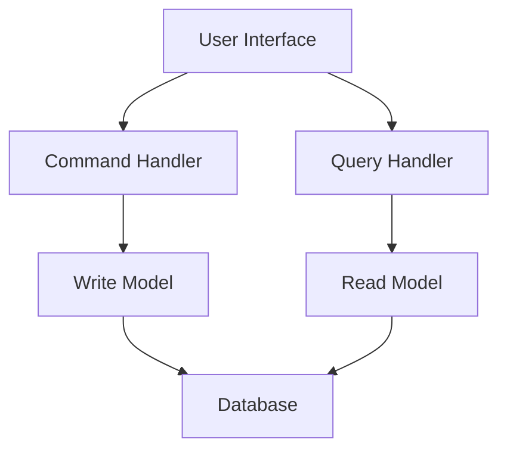
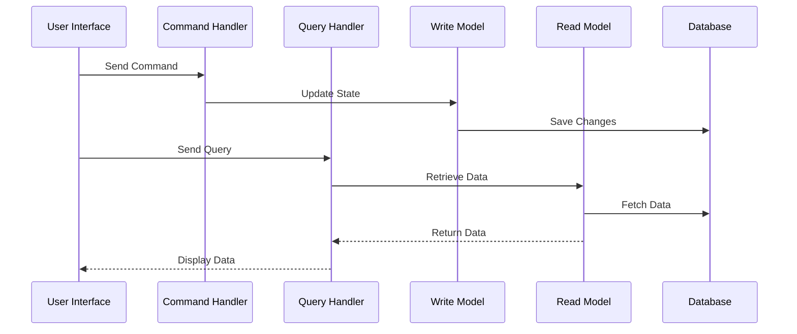

## 14.7. CQRS (Command Query Responsibility Segregation)

In the realm of software architecture, the **CQRS (Command Query Responsibility Segregation)** pattern stands as a powerful paradigm for handling complex systems. By separating the read and write operations of a system, CQRS allows developers to optimize and scale each aspect independently, leading to more efficient and maintainable codebases. This section delves into the intricacies of CQRS, providing a comprehensive understanding of its principles, benefits, and implementation through pseudocode examples.

### Introduction to CQRS

**Command Query Responsibility Segregation (CQRS)** is an architectural pattern that separates the responsibility of handling commands (write operations) from queries (read operations). This separation allows for distinct models to be used for updating and reading data, optimizing each for its specific purpose.

#### Key Concepts

- **Command:** Represents an action that changes the state of the system. Commands are responsible for writing data.
- **Query:** Represents a request for information without modifying the system's state. Queries are responsible for reading data.
- **Separation of Concerns:** By dividing the system into command and query responsibilities, each can be optimized and scaled independently.
- **Event Sourcing (Optional):** Often used in conjunction with CQRS, event sourcing records every change to the state as a sequence of events, providing a complete audit trail.

### Intent of CQRS

The primary intent of CQRS is to provide a clear separation between the concerns of reading and writing data. This separation allows for:

- **Scalability:** Read and write operations can be scaled independently, optimizing resource usage.
- **Performance Optimization:** Each model can be tailored to its specific needs, improving performance.
- **Simplified Complexity:** By dividing responsibilities, the complexity of each part is reduced, making the system easier to understand and maintain.

### Diagrams

To better understand the CQRS pattern, let's visualize its architecture using a diagram:



**Diagram Explanation:** The diagram illustrates the separation of command and query handlers. The command handler interacts with the write model, while the query handler interacts with the read model. Both models interface with the database, but they do so independently, allowing for optimization and scaling.

### Key Participants

- **Command Handler:** Processes commands and updates the write model.
- **Query Handler:** Processes queries and retrieves data from the read model.
- **Write Model:** Represents the state of the system and handles data modifications.
- **Read Model:** Optimized for data retrieval, often denormalized for performance.
- **Database:** Stores the data, often shared between the read and write models.

### Applicability

CQRS is particularly useful in scenarios where:

- **High Scalability is Required:** Systems with high read/write loads benefit from independent scaling.
- **Complex Business Logic:** Systems with intricate business rules can separate concerns for clarity.
- **Event Sourcing is Used:** CQRS complements event sourcing by providing a clear audit trail of changes.

### Sample Code Snippets

Let's explore some pseudocode examples to illustrate the implementation of CQRS.

#### Command Handling

```pseudocode
// Command Interface
interface Command {
    execute(): void
}

// Concrete Command
class CreateOrderCommand implements Command {
    private orderDetails

    constructor(orderDetails) {
        this.orderDetails = orderDetails
    }

    execute() {
        // Logic to create an order
        OrderService.createOrder(this.orderDetails)
    }
}

// Command Handler
class CommandHandler {
    handle(command: Command) {
        command.execute()
    }
}

// Usage
let command = new CreateOrderCommand(orderDetails)
let handler = new CommandHandler()
handler.handle(command)
```

**Explanation:** The `CreateOrderCommand` class implements the `Command` interface, encapsulating the logic to create an order. The `CommandHandler` processes the command by invoking its `execute` method.

#### Query Handling

```pseudocode
// Query Interface
interface Query {
    execute(): Data
}

// Concrete Query
class GetOrderDetailsQuery implements Query {
    private orderId

    constructor(orderId) {
        this.orderId = orderId
    }

    execute() {
        // Logic to retrieve order details
        return OrderRepository.getOrderDetails(this.orderId)
    }
}

// Query Handler
class QueryHandler {
    handle(query: Query): Data {
        return query.execute()
    }
}

// Usage
let query = new GetOrderDetailsQuery(orderId)
let handler = new QueryHandler()
let orderDetails = handler.handle(query)
```

**Explanation:** The `GetOrderDetailsQuery` class implements the `Query` interface, encapsulating the logic to retrieve order details. The `QueryHandler` processes the query by invoking its `execute` method and returning the result.

### Design Considerations

When implementing CQRS, consider the following:

- **Consistency:** Ensure eventual consistency between the read and write models, especially in distributed systems.
- **Complexity:** While CQRS simplifies certain aspects, it can introduce complexity in synchronization and data management.
- **Eventual Consistency:** Be prepared to handle scenarios where data may not be immediately consistent across models.

### Differences and Similarities

CQRS is often confused with other patterns, such as:

- **CRUD (Create, Read, Update, Delete):** Unlike CRUD, which uses a single model for all operations, CQRS separates read and write responsibilities.
- **Event Sourcing:** While not required, event sourcing is commonly used with CQRS to provide a complete history of changes.

### Try It Yourself

To better understand CQRS, try modifying the pseudocode examples:

- **Add Validation:** Implement validation logic in the command handler to ensure data integrity.
- **Optimize Queries:** Modify the query handler to use caching for frequently accessed data.
- **Implement Event Sourcing:** Extend the command handler to emit events after executing commands.

### Visualizing CQRS in Action

Let's visualize the flow of commands and queries in a CQRS system:



**Diagram Explanation:** The sequence diagram illustrates the flow of commands and queries in a CQRS system. Commands update the write model, which saves changes to the database. Queries retrieve data from the read model, which fetches data from the database.

### References and Links

For further reading on CQRS, consider the following resources:

- [Martin Fowler's CQRS](https://martinfowler.com/bliki/CQRS.html)
- [Microsoft's CQRS Journey](https://docs.microsoft.com/en-us/previous-versions/msp-n-p/jj554200(v=pandp.10))

### Knowledge Check

To reinforce your understanding of CQRS, consider the following questions:

- **What is the primary benefit of separating read and write models?**
- **How does CQRS improve scalability in a system?**
- **What are some potential challenges when implementing CQRS?**

### Embrace the Journey

Remember, mastering CQRS is just one step in your journey to becoming a proficient software architect. As you continue to explore design patterns, you'll gain deeper insights into building robust and scalable systems. Keep experimenting, stay curious, and enjoy the journey!

## Quiz Time!



### What is the primary purpose of CQRS?

- [x] To separate read and write responsibilities
- [ ] To combine read and write operations
- [ ] To simplify database interactions
- [ ] To eliminate the need for event sourcing

> **Explanation:** CQRS separates the responsibilities of handling commands (writes) and queries (reads) to optimize each independently.

### Which of the following is a key benefit of CQRS?

- [x] Scalability
- [ ] Reduced complexity
- [ ] Immediate consistency
- [ ] Simplified deployment

> **Explanation:** CQRS allows for independent scaling of read and write operations, enhancing scalability.

### What is a common pattern used alongside CQRS?

- [x] Event Sourcing
- [ ] Singleton
- [ ] Factory Method
- [ ] Adapter

> **Explanation:** Event sourcing is often used with CQRS to provide a complete history of changes.

### In CQRS, what does the command handler do?

- [x] Processes commands and updates the write model
- [ ] Retrieves data from the read model
- [ ] Manages database connections
- [ ] Handles user authentication

> **Explanation:** The command handler processes commands and updates the system's state through the write model.

### What is a potential challenge of implementing CQRS?

- [x] Managing eventual consistency
- [ ] Increased database load
- [ ] Reduced system performance
- [ ] Simplified codebase

> **Explanation:** CQRS can introduce complexity in managing eventual consistency between read and write models.

### How does CQRS differ from CRUD?

- [x] CQRS separates read and write responsibilities
- [ ] CQRS combines read and write operations
- [ ] CQRS eliminates the need for a database
- [ ] CQRS uses a single model for all operations

> **Explanation:** Unlike CRUD, which uses a single model, CQRS separates read and write responsibilities.

### What is the role of the query handler in CQRS?

- [x] Processes queries and retrieves data from the read model
- [ ] Updates the write model
- [ ] Manages user sessions
- [ ] Handles command execution

> **Explanation:** The query handler processes queries and retrieves data from the read model.

### Which of the following is NOT a participant in CQRS?

- [ ] Command Handler
- [ ] Query Handler
- [ ] Read Model
- [x] Singleton

> **Explanation:** Singleton is a design pattern, not a participant in CQRS.

### True or False: CQRS requires the use of event sourcing.

- [ ] True
- [x] False

> **Explanation:** While event sourcing is commonly used with CQRS, it is not a requirement.

### What is a key consideration when implementing CQRS?

- [x] Ensuring eventual consistency
- [ ] Reducing database size
- [ ] Eliminating all queries
- [ ] Combining read and write models

> **Explanation:** Ensuring eventual consistency between read and write models is a key consideration in CQRS.


