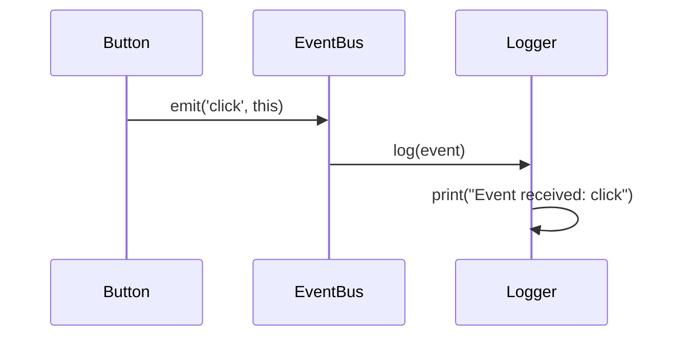

## 15.1. Introduction to Event-Driven Architecture

Event-Driven Architecture (EDA) is a software design paradigm that promotes the production, detection, consumption, and reaction to events. This architecture is particularly effective in systems where decoupling components and ensuring scalability are critical. In this section, we will delve into the core concepts of EDA, its benefits and challenges, and the role of asynchronous communication in facilitating event-driven systems.

### Understanding Event-Driven Architecture

Event-Driven Architecture is a design pattern where the flow of the program is determined by events. An event can be defined as a significant change in state. For instance, a user clicking a button, a sensor detecting a change in temperature, or a new message arriving in a queue are all events that can trigger specific actions within a system.

#### Key Concepts

- **Event Producers**: These are components that generate events. In a web application, a user interface element like a button can act as an event producer.
- **Event Consumers**: These components listen for events and react accordingly. For example, a function that updates the user interface in response to a button click.
- **Event Channels**: These are pathways through which events are transmitted from producers to consumers. They can be implemented using message queues or event buses.
- **Event Processors**: These are components that process the events, often transforming or routing them to the appropriate consumers.

### Benefits of Event-Driven Architecture

EDA offers several advantages that make it an attractive choice for modern software systems:

1. **Scalability**: By decoupling components, EDA allows systems to scale more easily. Each component can be scaled independently based on demand.
2. **Flexibility**: New event producers and consumers can be added with minimal impact on existing components, making the system more adaptable to change.
3. **Resilience**: EDA can enhance system resilience by isolating failures. If one component fails, it does not necessarily impact others.
4. **Real-Time Processing**: EDA supports real-time processing of events, making it ideal for applications that require immediate responses, such as financial trading platforms or IoT systems.

### Challenges of Event-Driven Architecture

Despite its benefits, EDA also presents several challenges:

1. **Complexity**: Designing and managing an event-driven system can be complex, particularly as the number of events and components increases.
2. **Debugging and Testing**: The asynchronous nature of EDA can make it difficult to trace the flow of events and identify issues.
3. **Consistency**: Ensuring data consistency across distributed components can be challenging, especially in systems that require strong consistency guarantees.
4. **Latency**: While EDA can support real-time processing, the added layers of abstraction and communication can introduce latency.

### Asynchronous Communication in Event-Driven Architecture

Asynchronous communication is a cornerstone of EDA, enabling components to interact without waiting for each other to complete tasks. This non-blocking communication model is crucial for building responsive and scalable systems.

#### How Asynchronous Communication Works

In asynchronous communication, a sender dispatches a message and continues its execution without waiting for a response. The receiver processes the message at its own pace and may send a response back if necessary. This model contrasts with synchronous communication, where the sender must wait for the receiver to process the message and respond.

#### Benefits of Asynchronous Communication

- **Improved Responsiveness**: Systems can remain responsive even under heavy load, as components do not block waiting for responses.
- **Decoupling**: Asynchronous communication decouples the sender and receiver, allowing them to operate independently and be developed separately.
- **Scalability**: By not requiring immediate responses, asynchronous systems can handle more significant numbers of concurrent requests.

#### Implementing Asynchronous Communication

Asynchronous communication can be implemented using various technologies and patterns, including:

- **Message Queues**: Systems like RabbitMQ or Apache Kafka provide robust messaging infrastructures that support asynchronous communication.
- **Event Buses**: These are central hubs that manage the distribution of events to interested consumers.
- **Callbacks and Promises**: In programming languages, callbacks and promises are used to handle asynchronous operations.

### Sample Code Snippets

Let's explore a simple pseudocode example illustrating a basic event-driven system with asynchronous communication.

```pseudocode
// Define an event producer
class Button {
    function click() {
        // Emit a click event
        EventBus.emit('click', this)
    }
}

// Define an event consumer
class Logger {
    function log(event) {
        print("Event received: " + event.type)
    }
}

// Define an event bus
class EventBus {
    static listeners = {}

    static function on(eventType, listener) {
        if (!listeners[eventType]) {
            listeners[eventType] = []
        }
        listeners[eventType].push(listener)
    }

    static function emit(eventType, event) {
        if (listeners[eventType]) {
            for (listener in listeners[eventType]) {
                listener(event)
            }
        }
    }
}

// Usage
button = new Button()
logger = new Logger()

// Register the logger as a listener for click events
EventBus.on('click', logger.log)

// Simulate a button click
button.click()
```

In this example, a `Button` acts as an event producer, emitting a `click` event when clicked. The `Logger` is an event consumer that logs the event. The `EventBus` manages the registration of listeners and the emission of events.

### Visualizing Event-Driven Architecture

To better understand how components interact in an event-driven system, let's visualize the architecture using a sequence diagram.



**Diagram Description**: This sequence diagram illustrates the interaction between the `Button`, `EventBus`, and `Logger` components. When the `Button` is clicked, it emits a `click` event to the `EventBus`, which then forwards the event to the `Logger` for processing.

### Try It Yourself

To deepen your understanding of event-driven architecture, try modifying the pseudocode example above:

- **Add a new event consumer** that performs a different action, such as updating a user interface element.
- **Implement a new event type**, such as a `hover` event, and create corresponding producers and consumers.
- **Experiment with different event channels**, such as direct method calls or message queues, to see how they impact the system's behavior.

### Knowledge Check

- **What are the key components of an event-driven architecture?**
- **How does asynchronous communication improve system scalability?**
- **What are some challenges associated with debugging event-driven systems?**

### Conclusion

Event-Driven Architecture is a powerful paradigm for building scalable, flexible, and resilient systems. By embracing asynchronous communication, developers can create systems that respond to events in real-time, decouple components, and scale to meet demand. However, it's essential to be mindful of the complexity and challenges associated with EDA, particularly regarding debugging, testing, and ensuring data consistency.

Remember, mastering event-driven architecture is a journey. As you continue to explore and experiment with these concepts, you'll gain a deeper understanding of how to design and implement effective event-driven systems. Keep experimenting, stay curious, and enjoy the journey!

## Quiz Time!



### What is a key benefit of Event-Driven Architecture (EDA)?

- [x] Scalability
- [ ] Complexity
- [ ] Synchronous Communication
- [ ] Data Inconsistency

> **Explanation:** EDA allows systems to scale more easily by decoupling components, enabling independent scaling based on demand.

### Which component in EDA is responsible for generating events?

- [ ] Event Consumer
- [x] Event Producer
- [ ] Event Channel
- [ ] Event Processor

> **Explanation:** Event Producers are components that generate events, such as user interface elements like buttons.

### What is a challenge associated with Event-Driven Architecture?

- [ ] Improved Responsiveness
- [ ] Decoupling
- [x] Debugging and Testing
- [ ] Real-Time Processing

> **Explanation:** The asynchronous nature of EDA can make it difficult to trace the flow of events and identify issues, making debugging and testing challenging.

### How does asynchronous communication benefit a system?

- [x] It improves responsiveness by allowing components to operate independently.
- [ ] It requires immediate responses, increasing system load.
- [ ] It tightly couples components.
- [ ] It simplifies debugging.

> **Explanation:** Asynchronous communication allows systems to remain responsive under heavy load by enabling components to operate independently without waiting for immediate responses.

### Which technology supports asynchronous communication in EDA?

- [ ] Synchronous Calls
- [x] Message Queues
- [ ] Direct Method Calls
- [ ] Blocking I/O

> **Explanation:** Message Queues, such as RabbitMQ or Apache Kafka, provide robust messaging infrastructures that support asynchronous communication.

### What is the role of an Event Bus in EDA?

- [ ] To generate events
- [x] To manage the distribution of events to consumers
- [ ] To process events
- [ ] To ensure data consistency

> **Explanation:** An Event Bus acts as a central hub that manages the distribution of events to interested consumers.

### What is a common use case for Event-Driven Architecture?

- [ ] Batch Processing
- [ ] Static Websites
- [x] Real-Time Applications
- [ ] Single-Threaded Applications

> **Explanation:** EDA is ideal for real-time applications that require immediate responses, such as financial trading platforms or IoT systems.

### What is a potential drawback of using EDA?

- [ ] Improved Flexibility
- [ ] Enhanced Resilience
- [ ] Real-Time Processing
- [x] Increased Complexity

> **Explanation:** Designing and managing an event-driven system can be complex, particularly as the number of events and components increases.

### How can you ensure data consistency in an event-driven system?

- [ ] By using synchronous communication
- [x] By implementing eventual consistency patterns
- [ ] By avoiding asynchronous communication
- [ ] By tightly coupling components

> **Explanation:** Implementing eventual consistency patterns can help ensure data consistency across distributed components in an event-driven system.

### True or False: Asynchronous communication requires the sender to wait for a response from the receiver.

- [ ] True
- [x] False

> **Explanation:** In asynchronous communication, the sender dispatches a message and continues its execution without waiting for a response, allowing the receiver to process the message at its own pace.


