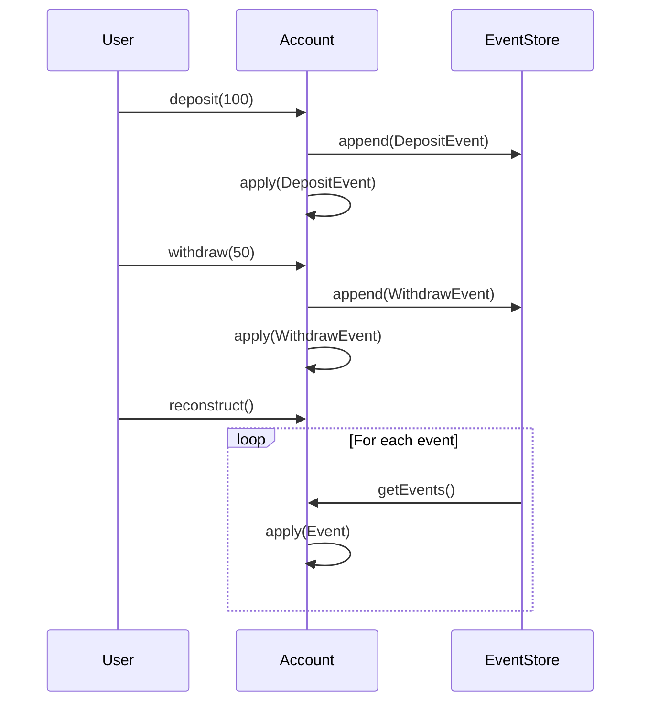

## 15.2. Event Sourcing Pattern

In the realm of software design, managing state changes efficiently and reliably is crucial. The **Event Sourcing Pattern** offers a robust solution by storing every change to the application's state as a sequence of events. This approach not only provides a complete audit trail but also enables the reconstruction of past states and supports complex business logic.

### Intent

The primary intent of the Event Sourcing Pattern is to capture all changes to an application's state as a series of events. Instead of storing only the current state, each state change is recorded as an immutable event. This allows for the reconstruction of any past state by replaying the events.

### Key Participants

- **Event Store**: A specialized database that stores events in the order they were applied.
- **Event**: Represents a change in state, typically containing a timestamp and data about the change.
- **Aggregate**: A cluster of domain objects that can be treated as a single unit for data changes.
- **Command**: An action that triggers a state change, resulting in one or more events.
- **Event Handler**: A component that processes events to update read models or trigger side effects.

### Applicability

Use the Event Sourcing Pattern when:

- You need a complete audit trail of all state changes.
- You want to support complex business logic that depends on historical data.
- You require the ability to reconstruct past states for debugging or analysis.
- You are building systems with high availability and scalability requirements.

### Pseudocode Implementation

Let's delve into a pseudocode example to illustrate the Event Sourcing Pattern. We'll simulate a simple banking system where transactions are recorded as events.

#### Step 1: Define Events

```pseudocode
// Define a base Event class
class Event {
    timestamp: DateTime
    data: Map<String, Any>
}

// Define specific events
class DepositEvent extends Event {
    amount: Decimal
}

class WithdrawEvent extends Event {
    amount: Decimal
}
```

#### Step 2: Create an Event Store

```pseudocode
class EventStore {
    events: List<Event> = []

    function append(event: Event) {
        events.add(event)
    }

    function getEvents(): List<Event> {
        return events
    }
}
```

#### Step 3: Implement Aggregates

```pseudocode
class Account {
    balance: Decimal = 0
    eventStore: EventStore

    function apply(event: Event) {
        if event is DepositEvent {
            balance += event.amount
        } else if event is WithdrawEvent {
            balance -= event.amount
        }
    }

    function deposit(amount: Decimal) {
        let event = new DepositEvent(amount: amount, timestamp: now())
        eventStore.append(event)
        apply(event)
    }

    function withdraw(amount: Decimal) {
        let event = new WithdrawEvent(amount: amount, timestamp: now())
        eventStore.append(event)
        apply(event)
    }
}
```

#### Step 4: Reconstruct State

```pseudocode
function reconstructAccount(eventStore: EventStore): Account {
    let account = new Account(eventStore: eventStore)
    for event in eventStore.getEvents() {
        account.apply(event)
    }
    return account
}
```

### Visualizing Event Sourcing

To better understand the flow of events and state changes, let's visualize the process using a sequence diagram.



### Design Considerations

When implementing the Event Sourcing Pattern, consider the following:

- **Event Versioning**: As your application evolves, the structure of events may change. Implement versioning to handle different event formats.
- **Performance**: Replaying events can be resource-intensive. Consider using snapshots to store intermediate states and reduce the number of events to replay.
- **Consistency**: Ensure that events are applied in the correct order to maintain consistency.
- **Scalability**: Design your event store to handle large volumes of events efficiently.

### Differences and Similarities

Event Sourcing is often compared to the **Command Query Responsibility Segregation (CQRS)** pattern. While both patterns can be used together, they serve different purposes. Event Sourcing focuses on capturing state changes, whereas CQRS separates read and write operations to optimize performance and scalability.

### Try It Yourself

To deepen your understanding, try modifying the pseudocode examples:

1. **Add a new event type**: Implement a `TransferEvent` to handle transfers between accounts.
2. **Implement snapshots**: Create a mechanism to periodically save the account state to reduce the number of events to replay.
3. **Handle event versioning**: Introduce a versioning system to manage changes in event structure over time.

### Knowledge Check

Before we wrap up, let's reinforce our understanding of the Event Sourcing Pattern with a few questions:

- What are the key benefits of using the Event Sourcing Pattern?
- How does Event Sourcing differ from traditional state management approaches?
- What are some potential challenges when implementing Event Sourcing?

### Embrace the Journey

Remember, mastering the Event Sourcing Pattern is a journey. As you experiment with different scenarios and challenges, you'll gain a deeper understanding of how to leverage this pattern to build robust, scalable systems. Keep exploring, stay curious, and enjoy the process of learning and applying new concepts!

## Quiz Time!



### What is the primary intent of the Event Sourcing Pattern?

- [x] To capture all changes to an application's state as a series of events.
- [ ] To store only the current state of an application.
- [ ] To optimize database queries.
- [ ] To separate read and write operations.

> **Explanation:** The primary intent of the Event Sourcing Pattern is to capture all changes to an application's state as a series of events, allowing for complete state reconstruction and audit trails.

### Which component in Event Sourcing is responsible for storing events?

- [ ] Aggregate
- [x] Event Store
- [ ] Command
- [ ] Event Handler

> **Explanation:** The Event Store is responsible for storing events in the Event Sourcing Pattern.

### What is a potential challenge when implementing Event Sourcing?

- [ ] Lack of audit trails
- [x] Replaying events can be resource-intensive
- [ ] Inability to reconstruct past states
- [ ] Difficulty in capturing state changes

> **Explanation:** Replaying events to reconstruct state can be resource-intensive, especially in systems with a large number of events.

### How does Event Sourcing differ from traditional state management?

- [x] It records every state change as an event.
- [ ] It stores only the final state.
- [ ] It does not support historical data.
- [ ] It focuses solely on read operations.

> **Explanation:** Event Sourcing records every state change as an event, unlike traditional state management, which often stores only the final state.

### What is a benefit of using Event Sourcing?

- [x] Complete audit trail of state changes
- [ ] Reduced complexity in state management
- [ ] Limited historical data
- [ ] Simplified database schema

> **Explanation:** Event Sourcing provides a complete audit trail of state changes, which is beneficial for debugging and analysis.

### Which pattern is often used in conjunction with Event Sourcing?

- [ ] Singleton Pattern
- [ ] Factory Pattern
- [x] CQRS (Command Query Responsibility Segregation)
- [ ] Observer Pattern

> **Explanation:** CQRS is often used in conjunction with Event Sourcing to separate read and write operations.

### What is the role of an Aggregate in Event Sourcing?

- [x] To represent a cluster of domain objects treated as a single unit
- [ ] To store events
- [ ] To handle commands
- [ ] To process events

> **Explanation:** An Aggregate represents a cluster of domain objects treated as a single unit for data changes.

### How can performance be improved in an Event Sourcing system?

- [ ] By storing only the final state
- [x] By using snapshots to store intermediate states
- [ ] By ignoring event order
- [ ] By reducing the number of events

> **Explanation:** Using snapshots to store intermediate states can improve performance by reducing the number of events to replay.

### True or False: Event Sourcing provides a mechanism for reconstructing past states.

- [x] True
- [ ] False

> **Explanation:** True. Event Sourcing allows for the reconstruction of past states by replaying events.

### What is a key consideration when designing an Event Store?

- [ ] Ensuring events are stored in random order
- [x] Handling large volumes of events efficiently
- [ ] Storing only the latest event
- [ ] Ignoring event versioning

> **Explanation:** A key consideration is designing the Event Store to handle large volumes of events efficiently.


