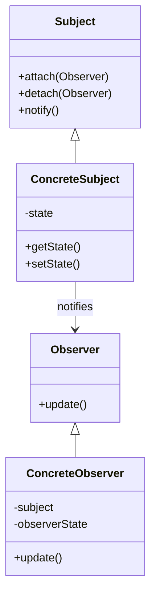
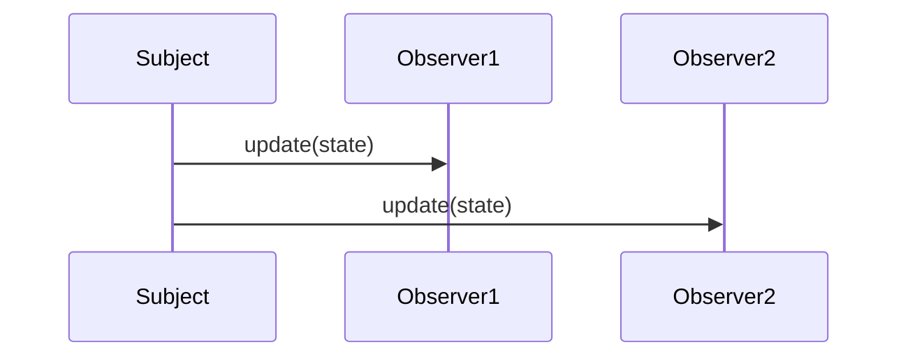
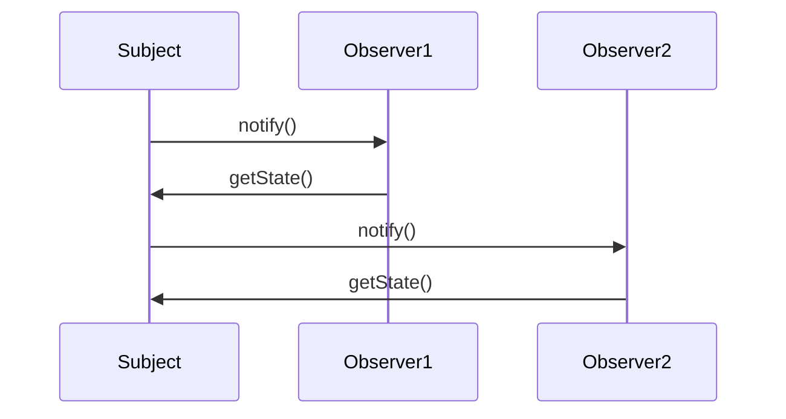

## 15.3. Observer Pattern Revisited

The Observer Pattern is a cornerstone of event-driven programming, enabling systems to react to changes in state or data. In this section, we will delve into the intricacies of the Observer Pattern, focusing on its implementation in reactive systems and the nuances of push versus pull notifications. This exploration will include detailed pseudocode examples, diagrams, and practical applications across programming paradigms.

### Design Pattern Name

**Observer Pattern**

### Category

**Behavioral Design Pattern**

### Intent

The intent of the Observer Pattern is to define a one-to-many dependency between objects so that when one object changes state, all its dependents are notified and updated automatically. This pattern is particularly useful for implementing distributed event-handling systems.

### Diagrams

#### Visualizing the Observer Pattern

Below is a class diagram illustrating the core components of the Observer Pattern.



**Diagram Explanation:** This diagram shows the relationship between the `Subject`, `ConcreteSubject`, `Observer`, and `ConcreteObserver`. The `ConcreteSubject` maintains a list of observers and notifies them of any state changes. Each `ConcreteObserver` is updated with the new state.

### Key Participants

- **Subject**: Maintains a list of observers and provides an interface to attach or detach them.
- **ConcreteSubject**: Stores the state of interest to observers and sends notifications when the state changes.
- **Observer**: Defines an interface for objects that should be notified of changes in the subject.
- **ConcreteObserver**: Implements the `Observer` interface to keep its state consistent with the subject's state.

### Applicability

Use the Observer Pattern when:

- An abstraction has two aspects, one dependent on the other. Encapsulating these aspects in separate objects allows you to vary and reuse them independently.
- A change to one object requires changing others, and you don't know how many objects need to be changed.
- An object should be able to notify other objects without making assumptions about who these objects are.

### Sample Code Snippets

Let's explore the Observer Pattern through pseudocode, demonstrating both push and pull notification mechanisms.

#### Push Notification

In the push model, the subject sends detailed information about the change to the observers.

```pseudocode
class Subject:
    observers = []

    method attach(observer):
        observers.append(observer)

    method detach(observer):
        observers.remove(observer)

    method notify():
        for observer in observers:
            observer.update(state)

class ConcreteSubject extends Subject:
    state

    method setState(newState):
        state = newState
        notify()

class Observer:
    method update(state):
        // To be implemented by concrete observers

class ConcreteObserver extends Observer:
    observerState

    method update(state):
        observerState = state
        print("Observer state updated to:", observerState)

// Usage
subject = ConcreteSubject()
observer1 = ConcreteObserver()
observer2 = ConcreteObserver()

subject.attach(observer1)
subject.attach(observer2)

subject.setState("New State")
```

**Explanation:** In this example, the `ConcreteSubject` pushes the new state to all attached observers. Each `ConcreteObserver` updates its state based on the information received.

#### Pull Notification

In the pull model, the observers request the information they need from the subject.

```pseudocode
class Subject:
    observers = []

    method attach(observer):
        observers.append(observer)

    method detach(observer):
        observers.remove(observer)

    method notify():
        for observer in observers:
            observer.update()

    method getState():
        return state

class ConcreteSubject extends Subject:
    state

    method setState(newState):
        state = newState
        notify()

class Observer:
    method update():
        // To be implemented by concrete observers

class ConcreteObserver extends Observer:
    subject
    observerState

    method update():
        observerState = subject.getState()
        print("Observer state updated to:", observerState)

// Usage
subject = ConcreteSubject()
observer1 = ConcreteObserver(subject)
observer2 = ConcreteObserver(subject)

subject.attach(observer1)
subject.attach(observer2)

subject.setState("New State")
```

**Explanation:** Here, the `ConcreteObserver` pulls the state from the `ConcreteSubject` when notified. This approach can be beneficial when observers need to decide what data to retrieve.

### Design Considerations

- **When to Use**: The Observer Pattern is ideal for scenarios where you need to maintain consistency between related objects without tightly coupling them.
- **Performance**: Be cautious of performance issues when dealing with a large number of observers, as each state change can trigger a cascade of updates.
- **Memory Leaks**: Ensure that observers are properly detached to prevent memory leaks, especially in languages with manual memory management.

### Differences and Similarities

- **Similar Patterns**: The Observer Pattern is often compared to the Publish-Subscribe pattern. While both involve broadcasting events to multiple listeners, the Publish-Subscribe pattern typically involves a more decoupled architecture with a message broker.
- **Distinction**: Unlike the Mediator Pattern, which centralizes communication between objects, the Observer Pattern allows direct communication between subjects and observers.

### Implementing Reactive Systems

Reactive systems are designed to respond to changes in their environment. The Observer Pattern is a natural fit for such systems, allowing components to react to state changes dynamically.

#### Push vs. Pull Notifications

- **Push Notifications**: The subject actively sends updates to observers. This approach is efficient when the subject knows exactly what information the observers need.
- **Pull Notifications**: Observers request the information they need from the subject. This can be more flexible, allowing observers to decide what data to retrieve.

### Visualizing Push vs. Pull Notifications

#### Push Notification Flow



**Diagram Explanation:** In the push model, the subject sends the updated state directly to each observer.

#### Pull Notification Flow



**Diagram Explanation:** In the pull model, the subject notifies observers of a change, and each observer requests the state.

### Practical Applications

- **User Interface Components**: In GUI applications, the Observer Pattern is used to update views in response to changes in the underlying data model.
- **Event Handling Systems**: Many event-driven systems, such as those handling user interactions or network events, leverage the Observer Pattern.
- **Data Binding**: In frameworks like Angular or React, the Observer Pattern underlies data binding, ensuring that UI components reflect the latest data state.

### Try It Yourself

Experiment with the provided pseudocode examples by modifying the state changes and observing how the notifications propagate. Try implementing additional features, such as prioritizing certain observers or adding filtering mechanisms to control which observers receive updates.

### References and Links

- [Observer Pattern on Wikipedia](https://en.wikipedia.org/wiki/Observer_pattern)
- [Design Patterns: Elements of Reusable Object-Oriented Software](https://en.wikipedia.org/wiki/Design_Patterns) by Erich Gamma, Richard Helm, Ralph Johnson, and John Vlissides (Gang of Four)
- [Reactive Programming](https://www.reactivemanifesto.org/)

### Knowledge Check

- **Question**: What is the primary advantage of using the Observer Pattern in a software system?
- **Exercise**: Implement a simple event-driven system using the Observer Pattern in your preferred programming language.

### Embrace the Journey

Remember, mastering design patterns is a continuous journey. As you explore the Observer Pattern, consider how it can be adapted and combined with other patterns to create robust, scalable systems. Stay curious, keep experimenting, and enjoy the process of learning and applying these powerful concepts.

---

## Quiz Time!



### What is the primary purpose of the Observer Pattern?

- [x] To define a one-to-many dependency between objects so that when one object changes state, all its dependents are notified and updated automatically.
- [ ] To encapsulate a request as an object, thereby allowing for parameterization of clients with queues, requests, and operations.
- [ ] To provide a way to access the elements of an aggregate object sequentially without exposing its underlying representation.
- [ ] To define a family of algorithms, encapsulate each one, and make them interchangeable.

> **Explanation:** The Observer Pattern is designed to establish a one-to-many dependency between objects, ensuring that changes in one object result in updates to all dependent objects.

### In the Observer Pattern, what is the role of the ConcreteSubject?

- [x] To store the state of interest to observers and send notifications when the state changes.
- [ ] To define an interface for objects that should be notified of changes in the subject.
- [ ] To implement the Observer interface to keep its state consistent with the subject's state.
- [ ] To maintain a list of observers and provide an interface to attach or detach them.

> **Explanation:** The ConcreteSubject is responsible for storing the state and notifying observers when changes occur.

### What is a key difference between push and pull notifications in the Observer Pattern?

- [x] In push notifications, the subject sends detailed information about the change to the observers, whereas in pull notifications, observers request the information they need from the subject.
- [ ] In push notifications, observers request the information they need from the subject, whereas in pull notifications, the subject sends detailed information about the change to the observers.
- [ ] Both push and pull notifications involve the subject sending detailed information about the change to the observers.
- [ ] Both push and pull notifications involve observers requesting the information they need from the subject.

> **Explanation:** Push notifications involve the subject actively sending updates, while pull notifications require observers to request the necessary information.

### Which of the following is a common use case for the Observer Pattern?

- [x] User Interface Components
- [ ] Sorting Algorithms
- [ ] Data Compression
- [ ] File Encryption

> **Explanation:** The Observer Pattern is commonly used in user interface components to update views in response to changes in the data model.

### What is a potential drawback of using the Observer Pattern?

- [x] Performance issues can arise when dealing with a large number of observers, as each state change can trigger a cascade of updates.
- [ ] It tightly couples the subject and observers, making it difficult to reuse components independently.
- [ ] It requires a centralized mediator to manage communication between objects.
- [ ] It limits the scalability of the system by restricting the number of observers.

> **Explanation:** The Observer Pattern can lead to performance issues if there are many observers, as each update can trigger multiple notifications.

### How does the Observer Pattern differ from the Publish-Subscribe pattern?

- [x] The Observer Pattern involves direct communication between subjects and observers, while the Publish-Subscribe pattern typically involves a more decoupled architecture with a message broker.
- [ ] The Observer Pattern requires a message broker, while the Publish-Subscribe pattern involves direct communication between subjects and observers.
- [ ] Both patterns involve a centralized mediator to manage communication between objects.
- [ ] Both patterns are identical in terms of architecture and communication.

> **Explanation:** The Observer Pattern involves direct communication, whereas the Publish-Subscribe pattern uses a message broker for decoupled communication.

### What is the role of the Observer in the Observer Pattern?

- [x] To define an interface for objects that should be notified of changes in the subject.
- [ ] To store the state of interest to observers and send notifications when the state changes.
- [ ] To implement the Observer interface to keep its state consistent with the subject's state.
- [ ] To maintain a list of observers and provide an interface to attach or detach them.

> **Explanation:** The Observer defines the interface for objects that need to be notified of changes.

### In the pull notification model, what action do observers take?

- [x] Observers request the information they need from the subject.
- [ ] Observers receive detailed information about the change from the subject.
- [ ] Observers send updates to the subject.
- [ ] Observers detach themselves from the subject.

> **Explanation:** In the pull model, observers actively request the information they need from the subject.

### True or False: The Observer Pattern is only applicable in object-oriented programming paradigms.

- [ ] True
- [x] False

> **Explanation:** The Observer Pattern can be applied in various programming paradigms, including functional and procedural programming, not just object-oriented.

### Which of the following best describes the relationship between the Subject and Observer in the Observer Pattern?

- [x] The Subject maintains a list of Observers and notifies them of any state changes.
- [ ] The Observer maintains a list of Subjects and notifies them of any state changes.
- [ ] The Subject and Observer are independent and do not communicate directly.
- [ ] The Observer directly modifies the state of the Subject.

> **Explanation:** The Subject is responsible for maintaining a list of Observers and notifying them when changes occur.


