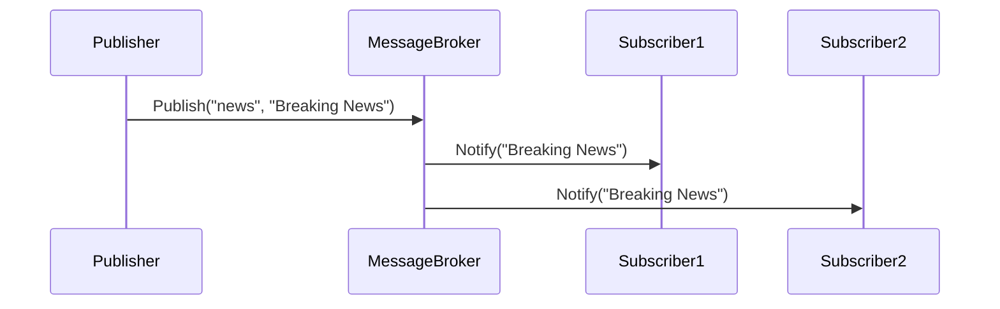

## 15.4. Publish-Subscribe Pattern

In the realm of software design, the Publish-Subscribe pattern stands as a cornerstone for achieving decoupled communication between components. This pattern is pivotal in event-driven architectures, where systems need to react to changes in state or the occurrence of events without being tightly coupled. In this section, we will delve into the intricacies of the Publish-Subscribe pattern, exploring its intent, structure, and practical applications. We will also examine how message brokers and topics play a crucial role in facilitating this pattern.

### Intent

The Publish-Subscribe pattern is designed to enable a system where components can communicate without direct dependencies on each other. The primary intent is to allow publishers to emit messages or events and subscribers to receive them without either party needing to be aware of the other's existence. This decoupling enhances modularity, scalability, and flexibility within software systems.

### Key Participants

1. **Publisher**: The entity that creates and sends messages or events. Publishers are unaware of the subscribers and do not need to know how many subscribers exist or who they are.

2. **Subscriber**: The entity that receives messages or events. Subscribers express interest in specific topics and are notified when relevant events occur.

3. **Message Broker**: An intermediary that manages the distribution of messages from publishers to subscribers. The broker ensures that messages are delivered to all interested subscribers.

4. **Topics**: Named channels through which messages are routed. Publishers send messages to specific topics, and subscribers register interest in topics to receive relevant messages.

### Applicability

The Publish-Subscribe pattern is applicable in scenarios where:

- **Loose Coupling**: Components need to communicate without being tightly bound to each other.
- **Scalability**: Systems require the ability to scale horizontally by adding more publishers or subscribers without significant reconfiguration.
- **Asynchronous Communication**: Events need to be processed asynchronously, allowing systems to handle high volumes of messages efficiently.
- **Dynamic Subscriptions**: Subscribers may change over time, and the system must accommodate these changes without disrupting existing communication.

### Sample Code Snippets

Let's explore a simple pseudocode implementation of the Publish-Subscribe pattern. This example demonstrates the core components and their interactions.

```pseudocode
class MessageBroker:
    def __init__(self):
        self.subscribers = {}

    def subscribe(self, topic, subscriber):
        if topic not in self.subscribers:
            self.subscribers[topic] = []
        self.subscribers[topic].append(subscriber)

    def unsubscribe(self, topic, subscriber):
        if topic in self.subscribers:
            self.subscribers[topic].remove(subscriber)

    def publish(self, topic, message):
        if topic in self.subscribers:
            for subscriber in self.subscribers[topic]:
                subscriber.notify(message)

class Publisher:
    def __init__(self, broker):
        self.broker = broker

    def publish_message(self, topic, message):
        self.broker.publish(topic, message)

class Subscriber:
    def notify(self, message):
        print("Received message:", message)

broker = MessageBroker()
subscriber1 = Subscriber()
subscriber2 = Subscriber()

broker.subscribe("news", subscriber1)
broker.subscribe("news", subscriber2)

publisher = Publisher(broker)
publisher.publish_message("news", "Breaking News: New Design Pattern Discovered!")
```

### Design Considerations

When implementing the Publish-Subscribe pattern, consider the following:

- **Performance**: Ensure that the message broker can handle the expected message throughput and latency requirements.
- **Reliability**: Implement mechanisms for message delivery guarantees, such as acknowledgments or retries.
- **Security**: Protect the message broker and topics from unauthorized access or tampering.
- **Scalability**: Design the system to accommodate an increasing number of publishers and subscribers.

### Differences and Similarities

The Publish-Subscribe pattern is often compared to the Observer pattern. While both involve notifying multiple entities of changes, the Publish-Subscribe pattern typically involves an intermediary (the message broker) and supports more complex routing and filtering through topics.

### Message Brokers and Topics

Message brokers are central to the Publish-Subscribe pattern, acting as intermediaries that facilitate communication between publishers and subscribers. They manage the distribution of messages, ensuring that each subscriber receives the messages they are interested in.

#### Message Brokers

Message brokers can be implemented in various ways, from simple in-memory structures to complex distributed systems. Popular message brokers include:

- **RabbitMQ**: A robust, open-source message broker that supports various messaging protocols.
- **Apache Kafka**: A distributed event streaming platform designed for high-throughput, fault-tolerant messaging.
- **Amazon SNS**: A fully managed messaging service that enables Pub/Sub messaging.

#### Topics

Topics are named channels that categorize messages. Publishers send messages to specific topics, and subscribers register interest in topics to receive relevant messages. Topics enable fine-grained control over message distribution, allowing subscribers to filter messages based on their interests.

### Visualizing the Publish-Subscribe Pattern

To better understand the flow of messages in the Publish-Subscribe pattern, let's visualize the interactions using a sequence diagram.



In this diagram, the Publisher sends a message to the MessageBroker, which then notifies all subscribers interested in the "news" topic.

### Practical Applications

The Publish-Subscribe pattern is widely used in various domains, including:

- **Real-Time Systems**: Stock trading platforms, where price updates are broadcasted to multiple subscribers.
- **IoT**: Devices publish sensor data to topics, and subscribers process the data for analysis or control.
- **Microservices**: Services communicate through events, decoupling them and allowing for independent scaling.

### Try It Yourself

Encourage experimentation by modifying the pseudocode example. Try adding more subscribers, publishing messages to different topics, or implementing a simple message broker with persistence.

### Knowledge Check

- Explain how the Publish-Subscribe pattern achieves decoupled communication.
- Describe the role of a message broker in the Publish-Subscribe pattern.
- What are the advantages of using topics in the Publish-Subscribe pattern?

### Embrace the Journey

Remember, mastering design patterns is a journey. The Publish-Subscribe pattern is just one tool in your toolkit. As you explore more patterns, you'll gain a deeper understanding of how to build robust, scalable, and maintainable software systems. Keep experimenting, stay curious, and enjoy the journey!

### Quiz Time!



### What is the primary intent of the Publish-Subscribe pattern?

- [x] To enable decoupled communication between components
- [ ] To tightly couple publishers and subscribers
- [ ] To ensure synchronous communication
- [ ] To eliminate the need for message brokers

> **Explanation:** The primary intent of the Publish-Subscribe pattern is to enable decoupled communication between components, allowing them to interact without direct dependencies.

### Which component acts as an intermediary in the Publish-Subscribe pattern?

- [ ] Publisher
- [ ] Subscriber
- [x] Message Broker
- [ ] Topic

> **Explanation:** The Message Broker acts as an intermediary, managing the distribution of messages from publishers to subscribers.

### What is a topic in the context of the Publish-Subscribe pattern?

- [ ] A type of message broker
- [x] A named channel for routing messages
- [ ] A specific subscriber
- [ ] A type of publisher

> **Explanation:** A topic is a named channel through which messages are routed, allowing publishers to send messages to specific topics and subscribers to register interest in those topics.

### Which of the following is a popular message broker?

- [ ] Apache HTTP Server
- [x] RabbitMQ
- [ ] MySQL
- [ ] Redis

> **Explanation:** RabbitMQ is a popular message broker that supports various messaging protocols and is commonly used in Publish-Subscribe systems.

### How does the Publish-Subscribe pattern enhance scalability?

- [x] By allowing the addition of more publishers and subscribers without significant reconfiguration
- [ ] By requiring direct communication between components
- [ ] By limiting the number of subscribers
- [ ] By enforcing synchronous communication

> **Explanation:** The Publish-Subscribe pattern enhances scalability by allowing the system to scale horizontally, adding more publishers or subscribers without significant reconfiguration.

### What is the role of a subscriber in the Publish-Subscribe pattern?

- [ ] To create and send messages
- [x] To receive messages from topics of interest
- [ ] To manage the distribution of messages
- [ ] To act as an intermediary

> **Explanation:** A subscriber receives messages from topics of interest, allowing them to react to events without direct dependencies on publishers.

### Which of the following is a key advantage of using the Publish-Subscribe pattern?

- [x] Loose coupling between components
- [ ] Tight coupling between components
- [ ] Synchronous communication
- [ ] Direct dependencies between publishers and subscribers

> **Explanation:** A key advantage of the Publish-Subscribe pattern is the loose coupling it provides between components, enhancing modularity and flexibility.

### What is a potential design consideration when implementing the Publish-Subscribe pattern?

- [ ] Ensuring direct communication between components
- [x] Implementing mechanisms for message delivery guarantees
- [ ] Limiting the number of topics
- [ ] Enforcing synchronous communication

> **Explanation:** When implementing the Publish-Subscribe pattern, it's important to consider mechanisms for message delivery guarantees, such as acknowledgments or retries, to ensure reliability.

### True or False: In the Publish-Subscribe pattern, publishers need to know the identity of subscribers.

- [ ] True
- [x] False

> **Explanation:** False. In the Publish-Subscribe pattern, publishers do not need to know the identity of subscribers, as communication is decoupled through the use of a message broker.

### Which of the following best describes the Publish-Subscribe pattern?

- [x] A design pattern that enables decoupled communication between components using message brokers and topics
- [ ] A pattern that requires direct communication between publishers and subscribers
- [ ] A pattern that enforces synchronous communication
- [ ] A pattern that eliminates the need for message brokers

> **Explanation:** The Publish-Subscribe pattern is a design pattern that enables decoupled communication between components using message brokers and topics, allowing for flexible and scalable systems.




