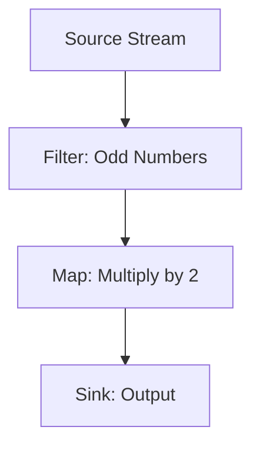
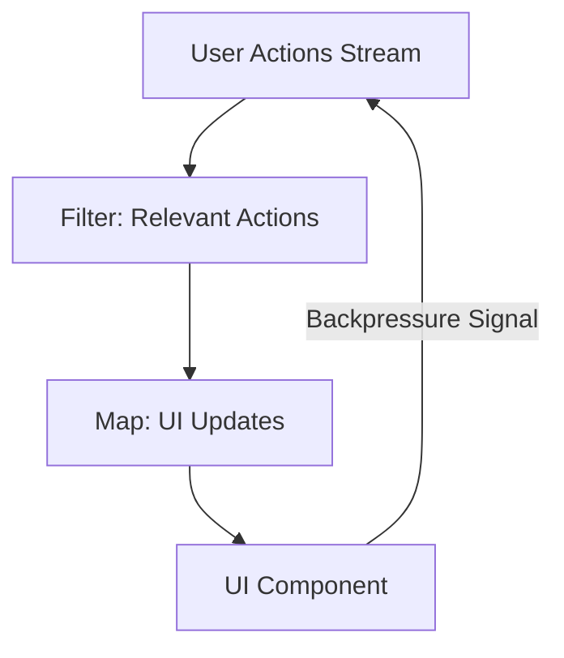

## 15.5. Reactive Programming Concepts

Reactive programming is a paradigm that focuses on asynchronous data streams and the propagation of change. It allows developers to build systems that are resilient, responsive, and scalable. In this section, we will delve into the core concepts of reactive programming, including streams, dataflow, and backpressure handling.

### Introduction to Reactive Programming

Reactive programming is fundamentally about data streams and the propagation of change. It enables developers to write code that reacts to changes in data over time, making it particularly useful for applications that require real-time updates, such as user interfaces, data processing pipelines, and networked applications.

#### Key Characteristics of Reactive Systems

1. **Responsive**: The system responds in a timely manner if at all possible.
2. **Resilient**: The system stays responsive in the face of failure.
3. **Elastic**: The system stays responsive under varying workload.
4. **Message Driven**: Reactive systems rely on asynchronous message passing.

### Streams and Dataflow

In reactive programming, a stream is a sequence of ongoing events ordered in time. Streams can emit three types of items: a value (of some type), an error, or a "completed" signal. Dataflow refers to the movement of these data streams through a system, allowing for transformations and operations on the data as it flows.

#### Understanding Streams

Streams are the backbone of reactive programming. They represent a sequence of data elements made available over time. Streams can be finite or infinite, and they can be transformed, filtered, combined, or consumed.

##### Example of a Stream

Consider a stream that emits numbers:

```pseudocode
stream = [1, 2, 3, 4, 5]
```

This stream emits a sequence of numbers over time. We can perform various operations on this stream, such as filtering out even numbers or transforming each number by multiplying it by two.

##### Pseudocode for Stream Operations

```pseudocode
stream = createStream([1, 2, 3, 4, 5])

filteredStream = stream.filter(number => number % 2 != 0) // Filter out even numbers
transformedStream = filteredStream.map(number => number * 2) // Multiply each number by 2

transformedStream.subscribe(print) // Output: 2, 6, 10
```

#### Dataflow in Reactive Programming

Dataflow represents the path that data takes through a system. In reactive programming, data flows through a series of operators that transform, filter, or combine the data. This allows developers to build complex data processing pipelines that are both efficient and easy to understand.

##### Visualizing Dataflow



In this diagram, data flows from a source stream through a filter that removes even numbers, then through a map operation that multiplies each number by two, and finally to a sink where the data is output.

### Backpressure Handling

Backpressure is a mechanism for handling situations where the rate of data production exceeds the rate of data consumption. In reactive systems, backpressure is crucial for maintaining system stability and preventing resource exhaustion.

#### What is Backpressure?

Backpressure occurs when a data producer generates data faster than a consumer can process it. Without a mechanism to handle this imbalance, the system can become overwhelmed, leading to performance degradation or failure.

##### Strategies for Handling Backpressure

1. **Buffering**: Temporarily store data until the consumer is ready to process it.
2. **Dropping**: Discard excess data to prevent overwhelming the consumer.
3. **Throttling**: Slow down the data producer to match the consumer's processing rate.
4. **Backpressure Signals**: Use signals to communicate the consumer's capacity to the producer.

##### Pseudocode for Backpressure Handling

```pseudocode
producer = createProducer()
consumer = createConsumer()

producer.onData(data => {
    if (consumer.isReady()) {
        consumer.process(data)
    } else {
        producer.pause() // Apply backpressure by pausing the producer
    }
})

consumer.onReady(() => {
    producer.resume() // Resume the producer when the consumer is ready
})
```

### Implementing Reactive Systems

Implementing reactive systems involves using libraries and frameworks that support reactive programming principles. These tools provide abstractions for working with streams, dataflow, and backpressure.

#### Popular Reactive Libraries

- **RxJS**: A library for reactive programming using observables in JavaScript.
- **Reactor**: A reactive library for building non-blocking applications on the JVM.
- **Akka Streams**: A library for building reactive applications on the JVM using the actor model.

#### Example: Building a Reactive System

Let's build a simple reactive system that processes a stream of user actions and updates a user interface in real-time.

##### Pseudocode for a Reactive System

```pseudocode
// Create a stream of user actions
userActions = createStream()

// Filter out irrelevant actions
relevantActions = userActions.filter(action => action.isRelevant())

// Transform actions into UI updates
uiUpdates = relevantActions.map(action => action.toUIUpdate())

// Apply backpressure handling
uiUpdates.onData(update => {
    if (ui.isReady()) {
        ui.applyUpdate(update)
    } else {
        uiUpdates.pause() // Apply backpressure
    }
})

ui.onReady(() => {
    uiUpdates.resume() // Resume updates when UI is ready
})
```

### Try It Yourself

Experiment with the pseudocode examples provided in this section. Try modifying the stream operations or backpressure handling strategies to see how they affect the system's behavior. Consider implementing a simple reactive system using a library like RxJS or Reactor to gain hands-on experience with reactive programming concepts.

### Visualizing Reactive Systems

Reactive systems can be complex, but visualizing their components and dataflow can aid in understanding. Use diagrams to represent the flow of data through streams and the interactions between producers and consumers.



This diagram illustrates a reactive system where user actions are filtered and transformed into UI updates. The UI component sends backpressure signals to the user actions stream to manage the flow of data.

### References and Further Reading

- [Reactive Manifesto](https://www.reactivemanifesto.org/)
- [ReactiveX](http://reactivex.io/)
- [Project Reactor](https://projectreactor.io/)
- [Akka Streams](https://doc.akka.io/docs/akka/current/stream/index.html)

### Knowledge Check

To reinforce your understanding of reactive programming concepts, consider the following questions and exercises:

- What are the key characteristics of reactive systems?
- How do streams and dataflow differ in reactive programming?
- Describe a scenario where backpressure handling is necessary.
- Implement a simple reactive system using a reactive library of your choice.

### Embrace the Journey

Reactive programming offers a powerful paradigm for building responsive and resilient systems. As you explore these concepts, remember that practice and experimentation are key to mastering reactive programming. Keep experimenting, stay curious, and enjoy the journey!

## Quiz Time!



### What is a key characteristic of reactive systems?

- [x] Responsive
- [ ] Synchronous
- [ ] Blocking
- [ ] Sequential

> **Explanation:** Reactive systems are designed to be responsive, meaning they react to changes and events in a timely manner.

### What is a stream in reactive programming?

- [x] A sequence of ongoing events ordered in time
- [ ] A static collection of data
- [ ] A single data point
- [ ] A synchronous process

> **Explanation:** In reactive programming, a stream is a sequence of ongoing events ordered in time, which can be transformed and consumed.

### How does backpressure help in reactive systems?

- [x] It prevents resource exhaustion by managing the flow of data
- [ ] It speeds up data processing
- [ ] It eliminates the need for buffering
- [ ] It synchronizes data streams

> **Explanation:** Backpressure helps manage the flow of data to prevent resource exhaustion when the rate of data production exceeds the rate of consumption.

### Which of the following is a strategy for handling backpressure?

- [x] Buffering
- [x] Dropping
- [x] Throttling
- [ ] Synchronizing

> **Explanation:** Buffering, dropping, and throttling are strategies for handling backpressure, while synchronizing is not typically used for this purpose.

### What is the role of a consumer in a reactive system?

- [x] To process data from a producer
- [ ] To generate data for a producer
- [ ] To synchronize data streams
- [ ] To transform data into streams

> **Explanation:** In a reactive system, a consumer processes data from a producer, often applying backpressure to manage the flow of data.

### What is dataflow in reactive programming?

- [x] The movement of data streams through a system
- [ ] The storage of data in a database
- [ ] The synchronization of data streams
- [ ] The transformation of data into streams

> **Explanation:** Dataflow refers to the movement of data streams through a system, allowing for transformations and operations on the data.

### Which library is commonly used for reactive programming in JavaScript?

- [x] RxJS
- [ ] Akka Streams
- [ ] Reactor
- [ ] Spring

> **Explanation:** RxJS is a library for reactive programming using observables in JavaScript, providing tools for working with streams and dataflow.

### What is the purpose of a backpressure signal?

- [x] To communicate the consumer's capacity to the producer
- [ ] To synchronize data streams
- [ ] To speed up data processing
- [ ] To eliminate the need for buffering

> **Explanation:** A backpressure signal communicates the consumer's capacity to the producer, helping manage the flow of data in a reactive system.

### What is an example of a reactive system?

- [x] A user interface that updates in real-time based on user actions
- [ ] A static webpage with no dynamic content
- [ ] A batch processing system
- [ ] A synchronous file reader

> **Explanation:** A reactive system, such as a user interface that updates in real-time based on user actions, is designed to be responsive and handle data streams.

### True or False: Reactive programming is only applicable to user interfaces.

- [ ] True
- [x] False

> **Explanation:** Reactive programming is applicable to a wide range of applications, including data processing pipelines, networked applications, and more, not just user interfaces.


