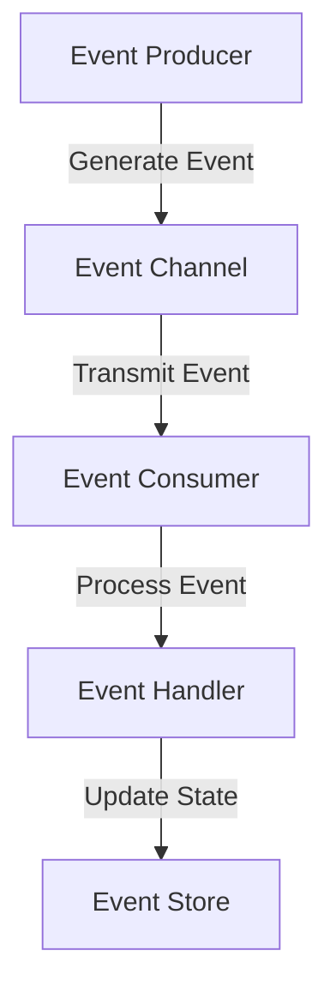

## 15.6. Designing Event-Driven Systems

Designing event-driven systems involves a paradigm shift from traditional request-response architectures to a more dynamic and responsive model. This approach is particularly suited for applications that require high scalability, real-time processing, and loose coupling between components. In this section, we will delve into the core concepts of event-driven systems, explore event storming techniques, and guide you through modeling events and handlers effectively.

### Introduction to Event-Driven Systems

Event-driven systems revolve around the concept of events, which are significant occurrences or changes in state within a system. These systems are designed to respond to events asynchronously, allowing for greater flexibility and responsiveness. Let's break down the key components of an event-driven system:

1. **Events**: These are the fundamental units of communication in an event-driven system. An event represents a change in state or an action that has occurred. Events are typically immutable and carry information about the change.

2. **Event Producers**: These are the components or services that generate events. Producers can be anything from user interactions to system processes.

3. **Event Consumers**: These are the components or services that react to events. Consumers listen for specific events and execute corresponding actions.

4. **Event Channels**: These are the pathways through which events are transmitted from producers to consumers. Channels can be implemented using message queues, event buses, or other messaging systems.

5. **Event Handlers**: These are the functions or methods that process events. Handlers contain the logic that determines how to respond to an event.

6. **Event Stores**: These are repositories that persist events for future reference or auditing. Event stores can be used to reconstruct the state of a system by replaying events.

### Benefits of Event-Driven Systems

Event-driven systems offer several advantages over traditional architectures:

- **Scalability**: By decoupling components and processing events asynchronously, event-driven systems can scale more easily to handle increased loads.

- **Responsiveness**: Events can be processed in real-time, enabling systems to react quickly to changes and provide timely feedback.

- **Flexibility**: Components can be added, removed, or modified without affecting the overall system, allowing for greater adaptability.

- **Resilience**: Event-driven systems can continue to function even if some components fail, as long as events are still being processed.

### Event Storming Techniques

Event storming is a collaborative workshop technique used to explore complex domains and design event-driven systems. It involves stakeholders from various disciplines and focuses on identifying and modeling events, commands, and aggregates. Here are some key steps in conducting an event storming session:

1. **Identify Domain Experts**: Gather a diverse group of stakeholders, including developers, product owners, and domain experts, to ensure a comprehensive understanding of the domain.

2. **Define the Scope**: Clearly define the boundaries of the system or process you want to explore. This helps focus the session and avoid unnecessary complexity.

3. **Brainstorm Events**: Encourage participants to brainstorm and list all possible events that can occur within the system. Use sticky notes or digital tools to visualize these events.

4. **Organize Events**: Group related events together and arrange them in a logical sequence. This helps identify the flow of events and any dependencies between them.

5. **Identify Commands and Aggregates**: Determine the commands that trigger events and the aggregates that manage state changes. This step helps clarify the interactions between different components.

6. **Model Event Handlers**: For each event, identify the corresponding event handlers and define their responsibilities. Consider how handlers process events and update the system state.

7. **Review and Refine**: Continuously review and refine the model, incorporating feedback from participants. This iterative process helps ensure the model accurately reflects the domain.

### Modeling Events and Handlers

Once you have a clear understanding of the events in your system, the next step is to model events and handlers effectively. This involves defining the structure of events, designing event handlers, and implementing event processing logic.

#### Defining Events

Events should be designed to be simple, immutable, and self-descriptive. Here are some best practices for defining events:

- **Use Descriptive Names**: Name events based on the action or change they represent. For example, `OrderPlaced` or `PaymentProcessed`.

- **Include Relevant Data**: Events should carry only the necessary information required by consumers. Avoid including excessive or unrelated data.

- **Ensure Immutability**: Once an event is created, its data should not be modified. This ensures consistency and reliability.

#### Designing Event Handlers

Event handlers are responsible for processing events and executing the necessary actions. Here are some guidelines for designing effective event handlers:

- **Single Responsibility**: Each handler should focus on processing a single type of event. This promotes simplicity and maintainability.

- **Idempotency**: Ensure that handlers can process the same event multiple times without causing unintended side effects. This is crucial for fault tolerance and reliability.

- **Error Handling**: Implement robust error handling to manage failures gracefully. Consider retry mechanisms, dead-letter queues, or compensating actions.

- **Asynchronous Processing**: Design handlers to process events asynchronously, allowing the system to handle multiple events concurrently.

#### Implementing Event Processing Logic

The implementation of event processing logic involves setting up event channels, configuring event handlers, and managing event flows. Here's a step-by-step guide:

1. **Set Up Event Channels**: Choose an appropriate messaging system or event bus to transmit events. Configure channels to ensure reliable and efficient delivery.

2. **Register Event Handlers**: Register handlers with the event bus or messaging system, specifying the events they are interested in.

3. **Process Events**: Implement the logic for processing events within handlers. This may involve updating databases, triggering workflows, or invoking external services.

4. **Persist Events**: If necessary, persist events in an event store for auditing or state reconstruction. Ensure that the event store is scalable and resilient.

5. **Monitor and Optimize**: Continuously monitor the performance of the event-driven system and optimize it for efficiency and scalability. Use metrics and logs to identify bottlenecks or issues.

### Visualizing Event-Driven Architecture

To better understand the flow of events and interactions within an event-driven system, we can use diagrams to visualize the architecture. Below is a simple flowchart representing the flow of events from producers to consumers:

**Diagram Description**: This flowchart illustrates the flow of events in an event-driven system. Events are generated by producers, transmitted through event channels, consumed by event consumers, processed by event handlers, and optionally persisted in an event store.

### Try It Yourself

To solidify your understanding of event-driven systems, try implementing a simple event-driven application. Here are some suggestions for modifications and experimentation:

- **Create a New Event**: Define a new event type and implement a corresponding handler. Observe how it integrates with the existing system.

- **Simulate Failures**: Introduce failures in event processing and implement error handling strategies. Test the system's resilience and recovery mechanisms.

- **Optimize Performance**: Analyze the performance of your event-driven system and identify areas for optimization. Experiment with different configurations and settings.

### Knowledge Check

Before we conclude, let's review some key concepts:

- **What are the main components of an event-driven system?**
- **How does event storming help in designing event-driven systems?**
- **What are the best practices for defining events and designing event handlers?**

### Conclusion

Designing event-driven systems requires a deep understanding of events, event handlers, and the interactions between components. By leveraging event storming techniques and modeling events effectively, you can create scalable, responsive, and resilient systems. Remember, this is just the beginning. As you progress, you'll build more complex and interactive systems. Keep experimenting, stay curious, and enjoy the journey!

## Quiz Time!



### What is the primary benefit of using an event-driven system?

- [x] Scalability and responsiveness
- [ ] Simplicity in design
- [ ] Reduced development time
- [ ] Increased data storage

> **Explanation:** Event-driven systems are known for their scalability and responsiveness, allowing them to handle increased loads and react quickly to changes.

### Which component in an event-driven system is responsible for generating events?

- [x] Event Producer
- [ ] Event Consumer
- [ ] Event Handler
- [ ] Event Store

> **Explanation:** Event producers are responsible for generating events in an event-driven system.

### What is the purpose of event storming in designing event-driven systems?

- [x] To explore complex domains and model events
- [ ] To write detailed code for event handlers
- [ ] To optimize system performance
- [ ] To create user interfaces

> **Explanation:** Event storming is a collaborative technique used to explore complex domains and model events, commands, and aggregates.

### What is a key characteristic of events in an event-driven system?

- [x] Immutability
- [ ] Volatility
- [ ] Complexity
- [ ] Redundancy

> **Explanation:** Events in an event-driven system are immutable, meaning they cannot be changed once created.

### How should event handlers be designed to ensure reliability?

- [x] They should be idempotent
- [ ] They should be synchronous
- [ ] They should handle multiple event types
- [ ] They should store events locally

> **Explanation:** Event handlers should be idempotent, meaning they can process the same event multiple times without causing unintended side effects.

### What is the role of an event store in an event-driven system?

- [x] To persist events for future reference
- [ ] To generate new events
- [ ] To process events
- [ ] To optimize system performance

> **Explanation:** An event store persists events for future reference or auditing, allowing for state reconstruction.

### Which technique is used to identify and model events in an event-driven system?

- [x] Event Storming
- [ ] Code Refactoring
- [ ] System Optimization
- [ ] User Testing

> **Explanation:** Event storming is used to identify and model events, commands, and aggregates in an event-driven system.

### What should be included in an event to make it effective?

- [x] Only the necessary information required by consumers
- [ ] Detailed logs and metadata
- [ ] All possible data related to the event
- [ ] User interface elements

> **Explanation:** Events should carry only the necessary information required by consumers to ensure simplicity and efficiency.

### What is a common tool used to transmit events in an event-driven system?

- [x] Event Channel
- [ ] Database
- [ ] User Interface
- [ ] File System

> **Explanation:** Event channels, such as message queues or event buses, are used to transmit events from producers to consumers.

### True or False: Event-driven systems are inherently synchronous.

- [ ] True
- [x] False

> **Explanation:** Event-driven systems are inherently asynchronous, allowing for greater flexibility and responsiveness.


