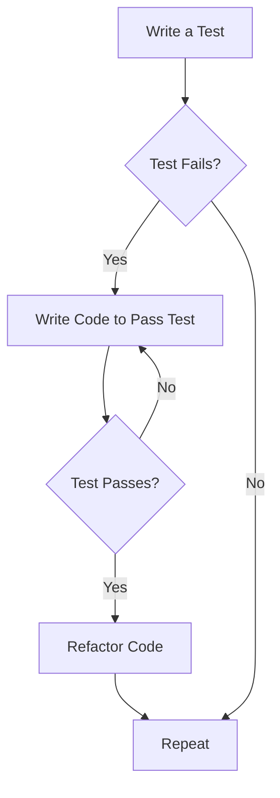
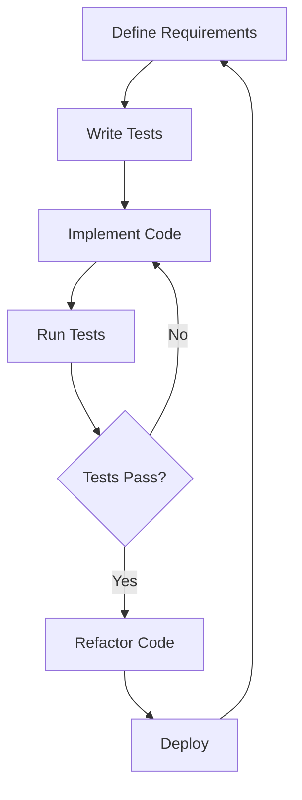

## 16.1. Introduction to TDD

Test-Driven Development (TDD) is a software development process that emphasizes writing tests before writing the corresponding code. This approach not only ensures that the code meets the requirements but also fosters a robust design and architecture. In this section, we will delve into the core principles of TDD, explore the Red-Green-Refactor cycle, and discuss the myriad benefits TDD brings to software development.

### Understanding Test-Driven Development

TDD is a disciplined approach to software development that involves writing a test for a specific functionality before implementing the code to fulfill that functionality. The process is iterative and involves three main stages: Red, Green, and Refactor. Let's explore each of these stages in detail.

#### The Red-Green-Refactor Cycle

The Red-Green-Refactor cycle is the heartbeat of TDD. It is a simple yet powerful process that guides developers in writing clean, efficient, and reliable code. Here's a breakdown of each phase:

1. **Red Phase**: Write a test for a new feature or functionality. At this point, the test will fail because the feature has not been implemented yet. This failure is crucial as it confirms that the test is valid and that the feature is not yet present.

2. **Green Phase**: Write the minimum amount of code necessary to pass the test. The goal here is to make the test pass quickly, without worrying about code quality or optimization. This phase ensures that the functionality works as expected.

3. **Refactor Phase**: Once the test passes, improve the code's structure and readability without altering its behavior. Refactoring is essential for maintaining code quality and preventing technical debt.

Let's visualize the Red-Green-Refactor cycle using a flowchart:



**Caption**: The Red-Green-Refactor cycle in TDD.

### Benefits of Test-Driven Development

TDD offers numerous advantages that can significantly enhance the software development process. Here are some of the key benefits:

1. **Improved Code Quality**: By writing tests first, developers are forced to think about the code's design and functionality upfront, leading to cleaner and more maintainable code.

2. **Faster Debugging**: Since tests are written before the code, any issues can be identified and resolved quickly, reducing the time spent on debugging.

3. **Enhanced Collaboration**: TDD encourages better communication and collaboration among team members, as tests serve as a form of documentation that clearly defines the expected behavior of the code.

4. **Increased Confidence**: With a comprehensive suite of tests, developers can make changes to the codebase with confidence, knowing that any regressions will be caught by the tests.

5. **Facilitates Refactoring**: The presence of tests makes it easier to refactor code, as developers can ensure that the functionality remains intact after changes.

6. **Supports Agile Development**: TDD aligns well with agile methodologies, as it promotes iterative development and continuous feedback.

### Implementing TDD: A Step-by-Step Guide

To effectively implement TDD, it's important to follow a structured approach. Here's a step-by-step guide to help you get started:

#### Step 1: Identify the Requirement

Begin by identifying a specific requirement or feature that needs to be implemented. Clearly define the expected behavior and outcomes.

#### Step 2: Write a Test

Write a test that captures the requirement. The test should be specific, measurable, and focused on a single aspect of the functionality. Use descriptive names for your tests to convey their purpose.

```pseudocode
// Pseudocode Example: Testing a Calculator's Addition Functionality

function testAddition() {
    // Arrange
    calculator = new Calculator();
    
    // Act
    result = calculator.add(2, 3);
    
    // Assert
    assertEqual(result, 5);
}
```

**Caption**: A simple test for a calculator's addition functionality.

#### Step 3: Run the Test and Watch It Fail

Run the test to ensure that it fails. This step confirms that the test is valid and that the feature is not yet implemented.

#### Step 4: Write the Minimum Code to Pass the Test

Implement the minimal amount of code necessary to make the test pass. Focus on functionality rather than optimization or code quality at this stage.

```pseudocode
// Pseudocode Example: Implementing the Addition Functionality

class Calculator {
    function add(a, b) {
        return a + b;
    }
}
```

**Caption**: Implementing the addition functionality to pass the test.

#### Step 5: Run the Test and Watch It Pass

Run the test again to ensure that it passes. This step verifies that the functionality works as expected.

#### Step 6: Refactor the Code

Refactor the code to improve its structure, readability, and performance. Ensure that the tests still pass after refactoring.

```pseudocode
// Pseudocode Example: Refactoring the Calculator Class

class Calculator {
    function add(a, b) {
        // Ensure inputs are numbers
        if (!isNumber(a) || !isNumber(b)) {
            throw new Error("Invalid input");
        }
        return a + b;
    }
}
```

**Caption**: Refactoring the calculator class to handle invalid inputs.

### Try It Yourself: Experiment with TDD

To truly grasp the power of TDD, it's essential to practice it hands-on. Here are some exercises to help you get started:

1. **Exercise 1: Implement a Subtraction Functionality**
   - Write a test for a subtraction method in the calculator class.
   - Implement the method to pass the test.
   - Refactor the code to improve its quality.

2. **Exercise 2: Test-Driven Development for a Shopping Cart**
   - Write tests for adding and removing items from a shopping cart.
   - Implement the functionality to pass the tests.
   - Refactor the code to enhance its design.

3. **Exercise 3: TDD for a User Authentication System**
   - Write tests for user registration and login functionalities.
   - Implement the code to pass the tests.
   - Refactor the code to ensure security and scalability.

### Visualizing TDD in Practice

Let's visualize how TDD fits into the broader software development lifecycle:



**Caption**: TDD within the software development lifecycle.

### Common Challenges and Solutions in TDD

While TDD offers numerous benefits, it also presents certain challenges. Here are some common challenges and solutions:

1. **Challenge: Writing Effective Tests**
   - **Solution**: Focus on writing tests that are specific, measurable, and focused on a single aspect of functionality. Use descriptive names to convey the purpose of each test.

2. **Challenge: Maintaining Test Suites**
   - **Solution**: Regularly review and update test suites to ensure they remain relevant and effective. Remove obsolete tests and refactor tests to improve their readability and maintainability.

3. **Challenge: Balancing Test Coverage and Development Speed**
   - **Solution**: Prioritize writing tests for critical and high-risk areas of the codebase. Use code coverage tools to identify gaps in test coverage and address them as needed.

4. **Challenge: Overcoming Resistance to TDD**
   - **Solution**: Educate team members about the benefits of TDD and provide training and resources to help them adopt the practice. Encourage a culture of continuous improvement and experimentation.

### TDD and Design Patterns

TDD and design patterns complement each other well. Design patterns provide proven solutions to common design problems, while TDD ensures that these solutions are implemented correctly and efficiently. Here are some ways TDD and design patterns intersect:

1. **Designing for Testability**: TDD encourages writing code that is easy to test. Design patterns such as Dependency Injection and Factory Method can enhance testability by decoupling components and promoting modular design.

2. **Utilizing Patterns for Better Tests**: Design patterns can help structure tests more effectively. For example, the Strategy pattern can be used to test different algorithms or behaviors in isolation.

3. **Refactoring with Patterns**: TDD facilitates refactoring, and design patterns provide a roadmap for improving code structure. Patterns such as Adapter and Decorator can be used to refactor code and enhance its flexibility.

### Conclusion: Embrace the TDD Journey

Test-Driven Development is a powerful approach that can transform the way you write and maintain software. By following the Red-Green-Refactor cycle, you can ensure that your code is reliable, maintainable, and aligned with the requirements. Remember, TDD is not just a technique—it's a mindset that encourages continuous improvement and collaboration. As you embark on your TDD journey, keep experimenting, stay curious, and enjoy the process of building high-quality software.

## Quiz Time!



### What is the first step in the Red-Green-Refactor cycle?

- [x] Write a failing test
- [ ] Write the code to pass the test
- [ ] Refactor the code
- [ ] Deploy the code

> **Explanation:** The first step in the Red-Green-Refactor cycle is to write a failing test that defines the desired functionality.

### What is the main goal of the Green phase in TDD?

- [ ] Optimize the code
- [x] Make the test pass
- [ ] Refactor the code
- [ ] Write documentation

> **Explanation:** The main goal of the Green phase is to write the minimum code necessary to make the test pass.

### Which of the following is a benefit of TDD?

- [x] Improved code quality
- [ ] Slower debugging process
- [ ] Increased technical debt
- [ ] Less collaboration among team members

> **Explanation:** TDD improves code quality by encouraging thoughtful design and thorough testing.

### How does TDD facilitate refactoring?

- [x] By providing a safety net of tests
- [ ] By reducing the need for tests
- [ ] By making code more complex
- [ ] By eliminating the need for documentation

> **Explanation:** TDD facilitates refactoring by providing a safety net of tests that ensure functionality remains intact after changes.

### What is a common challenge in TDD?

- [x] Writing effective tests
- [ ] Reducing test coverage
- [ ] Avoiding code reviews
- [ ] Eliminating documentation

> **Explanation:** Writing effective tests is a common challenge in TDD, as tests need to be specific and focused.

### How can design patterns enhance testability in TDD?

- [x] By promoting modular design
- [ ] By increasing code complexity
- [ ] By reducing code coverage
- [ ] By eliminating the need for tests

> **Explanation:** Design patterns enhance testability by promoting modular design and decoupling components.

### What is the relationship between TDD and agile development?

- [x] TDD supports iterative development
- [ ] TDD discourages collaboration
- [ ] TDD slows down the development process
- [ ] TDD eliminates the need for testing

> **Explanation:** TDD supports iterative development and aligns well with agile methodologies.

### Which design pattern can be used to refactor code for better flexibility?

- [x] Adapter
- [ ] Singleton
- [ ] Monolithic
- [ ] Waterfall

> **Explanation:** The Adapter pattern can be used to refactor code for better flexibility by allowing incompatible interfaces to work together.

### What is the purpose of refactoring in the TDD cycle?

- [x] To improve code structure and readability
- [ ] To add new features
- [ ] To deploy the code
- [ ] To remove tests

> **Explanation:** The purpose of refactoring is to improve code structure and readability without changing its behavior.

### True or False: TDD eliminates the need for manual testing.

- [ ] True
- [x] False

> **Explanation:** False. While TDD reduces the need for manual testing, it does not eliminate it entirely. Manual testing is still necessary for exploratory and usability testing.




