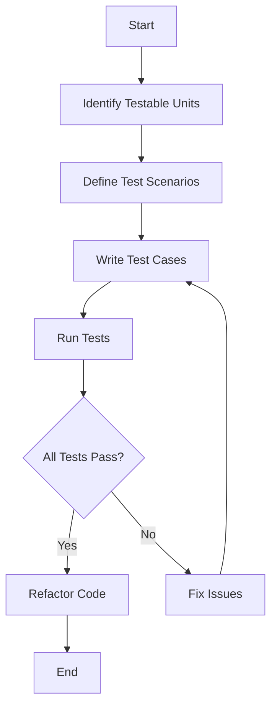

## 16.2. Writing Unit Tests in Pseudocode

Unit testing is a cornerstone of software development, ensuring that individual components of a program function as intended. Writing unit tests in pseudocode allows developers to focus on the logic and structure of tests without being constrained by specific programming languages. This section will guide you through the process of creating effective test cases and mocking dependencies using pseudocode, enhancing your understanding of Test-Driven Development (TDD) and design patterns across programming paradigms.

### Introduction to Unit Testing

Unit testing involves testing the smallest parts of an application, known as units, independently to ensure they perform as expected. A unit can be a function, method, or class, depending on the programming paradigm. The goal is to validate that each unit of the software performs correctly in isolation.

#### Benefits of Unit Testing

- **Early Bug Detection:** Identify issues early in the development cycle.
- **Code Refactoring:** Facilitate safe refactoring by ensuring existing functionality is not broken.
- **Documentation:** Serve as documentation for the code, explaining how it should behave.
- **Design Improvement:** Encourage better design by promoting loosely coupled and modular code.

### Creating Effective Test Cases

Effective test cases are crucial for successful unit testing. They should be clear, concise, and comprehensive, covering all possible scenarios, including edge cases.

#### Steps to Create Effective Test Cases

1. **Identify Testable Units:** Determine which parts of the code can be tested independently.
2. **Define Test Scenarios:** List all possible scenarios, including normal, boundary, and edge cases.
3. **Write Test Cases:** Create test cases for each scenario, specifying the input, expected output, and any setup or teardown required.
4. **Review and Refine:** Continuously review and refine test cases to ensure they remain relevant and comprehensive.

#### Example: Testing a Simple Calculator

Let's consider a simple calculator function that performs basic arithmetic operations. We'll write test cases in pseudocode to validate its functionality.

```pseudocode
// Pseudocode for Calculator Function
function calculator(operation, a, b) {
    if operation == "add" then
        return a + b
    else if operation == "subtract" then
        return a - b
    else if operation == "multiply" then
        return a * b
    else if operation == "divide" then
        if b == 0 then
            return "Error: Division by zero"
        else
            return a / b
    else
        return "Error: Invalid operation"
}

// Pseudocode for Unit Tests
test "Addition of two numbers" {
    assert calculator("add", 2, 3) == 5
}

test "Subtraction of two numbers" {
    assert calculator("subtract", 5, 3) == 2
}

test "Multiplication of two numbers" {
    assert calculator("multiply", 4, 3) == 12
}

test "Division of two numbers" {
    assert calculator("divide", 10, 2) == 5
}

test "Division by zero" {
    assert calculator("divide", 10, 0) == "Error: Division by zero"
}

test "Invalid operation" {
    assert calculator("modulus", 10, 2) == "Error: Invalid operation"
}
```

### Mocking Dependencies

In unit testing, mocking is a technique used to simulate the behavior of complex or external dependencies, allowing you to isolate the unit under test. This is particularly useful when the unit interacts with databases, web services, or other external systems.

#### Why Mock Dependencies?

- **Isolation:** Ensure the unit test focuses solely on the unit's functionality.
- **Control:** Provide controlled inputs and outputs for the dependencies.
- **Performance:** Avoid the overhead of interacting with real dependencies.
- **Stability:** Eliminate flakiness caused by external systems.

#### Implementing Mocks in Pseudocode

Let's consider a scenario where a function retrieves data from a database. We'll mock the database interaction to focus on testing the function's logic.

```pseudocode
// Pseudocode for Function with Database Dependency
function getUserData(userId) {
    dbConnection = Database.connect()
    userData = dbConnection.query("SELECT * FROM users WHERE id = ?", userId)
    return userData
}

// Mocking the Database Dependency
mock Database {
    function connect() {
        return this
    }
    
    function query(queryString, userId) {
        if userId == 1 then
            return { id: 1, name: "John Doe" }
        else
            return null
    }
}

// Pseudocode for Unit Test with Mock
test "Retrieve user data for valid user ID" {
    mock Database as dbMock
    assert getUserData(1) == { id: 1, name: "John Doe" }
}

test "Retrieve user data for invalid user ID" {
    mock Database as dbMock
    assert getUserData(2) == null
}
```

### Visualizing Unit Testing Workflow

To better understand the workflow of unit testing, let's visualize the process using a flowchart.



**Caption:** This flowchart illustrates the typical workflow of unit testing, from identifying testable units to refactoring code after successful tests.

### Try It Yourself

To deepen your understanding, try modifying the pseudocode examples provided. Here are some suggestions:

- **Extend the Calculator Function:** Add more operations, such as modulus or exponentiation, and write corresponding test cases.
- **Enhance Mocking:** Implement a mock for a more complex dependency, such as a web service, and write tests to validate its interaction.

### Best Practices for Unit Testing

- **Keep Tests Independent:** Ensure tests do not depend on each other or share state.
- **Use Descriptive Names:** Name test cases clearly to indicate their purpose.
- **Test One Thing at a Time:** Focus each test on a single aspect of the unit's behavior.
- **Automate Tests:** Integrate tests into the build process for continuous feedback.

### Knowledge Check

To reinforce your learning, consider the following questions:

- What are the benefits of unit testing?
- How do you identify testable units in a codebase?
- Why is mocking important in unit testing?

### Summary of Key Takeaways

- Unit testing is essential for validating the functionality of individual components.
- Effective test cases are clear, concise, and cover all possible scenarios.
- Mocking dependencies allows for isolated and controlled testing environments.
- Visualizing the unit testing workflow can aid in understanding the process.
- Practice and experimentation are key to mastering unit testing.

### Embrace the Journey

Remember, mastering unit testing is a journey. As you practice writing tests and mocking dependencies, you'll gain confidence in your ability to deliver robust and reliable software. Keep experimenting, stay curious, and enjoy the journey!

## Quiz Time!



### What is the primary goal of unit testing?

- [x] Validate that each unit of the software performs correctly in isolation.
- [ ] Ensure the entire application works as expected.
- [ ] Test the integration of multiple units.
- [ ] Identify performance bottlenecks.

> **Explanation:** Unit testing focuses on validating individual components in isolation to ensure they function correctly.

### Why is mocking used in unit testing?

- [x] To simulate the behavior of complex or external dependencies.
- [ ] To test the performance of the application.
- [ ] To replace the need for integration testing.
- [ ] To ensure all units are tested together.

> **Explanation:** Mocking allows for the isolation of the unit under test by simulating external dependencies.

### What should effective test cases include?

- [x] Input, expected output, and any setup or teardown required.
- [ ] Only the expected output.
- [ ] Only the input.
- [ ] Detailed documentation of the entire application.

> **Explanation:** Effective test cases specify the input, expected output, and any necessary setup or teardown.

### What is a benefit of unit testing?

- [x] Early bug detection.
- [ ] Increased application size.
- [ ] Slower development process.
- [ ] Reduced code readability.

> **Explanation:** Unit testing helps identify issues early in the development cycle, leading to more robust software.

### How can you ensure tests remain relevant and comprehensive?

- [x] Continuously review and refine test cases.
- [ ] Write tests once and never update them.
- [ ] Focus only on normal scenarios.
- [ ] Avoid testing edge cases.

> **Explanation:** Regularly reviewing and refining test cases ensures they cover all relevant scenarios.

### What is a key practice in unit testing?

- [x] Keep tests independent.
- [ ] Share state between tests.
- [ ] Test multiple things in one test.
- [ ] Use vague test names.

> **Explanation:** Keeping tests independent ensures they do not affect each other and remain reliable.

### How can you automate tests?

- [x] Integrate tests into the build process.
- [ ] Run tests manually every time.
- [ ] Avoid using testing frameworks.
- [ ] Write tests in a separate document.

> **Explanation:** Automating tests by integrating them into the build process provides continuous feedback.

### What is an example of a test scenario?

- [x] Testing the addition operation in a calculator function.
- [ ] Writing the entire application code.
- [ ] Designing the user interface.
- [ ] Documenting the software architecture.

> **Explanation:** A test scenario involves specifying a particular aspect of the unit's functionality to be tested.

### What is the purpose of a flowchart in unit testing?

- [x] To visualize the unit testing workflow.
- [ ] To replace the need for writing tests.
- [ ] To document the entire application.
- [ ] To design the user interface.

> **Explanation:** A flowchart helps visualize the steps involved in the unit testing process.

### True or False: Mocking eliminates the need for real dependencies in unit testing.

- [x] True
- [ ] False

> **Explanation:** Mocking simulates the behavior of real dependencies, allowing for isolated testing.


