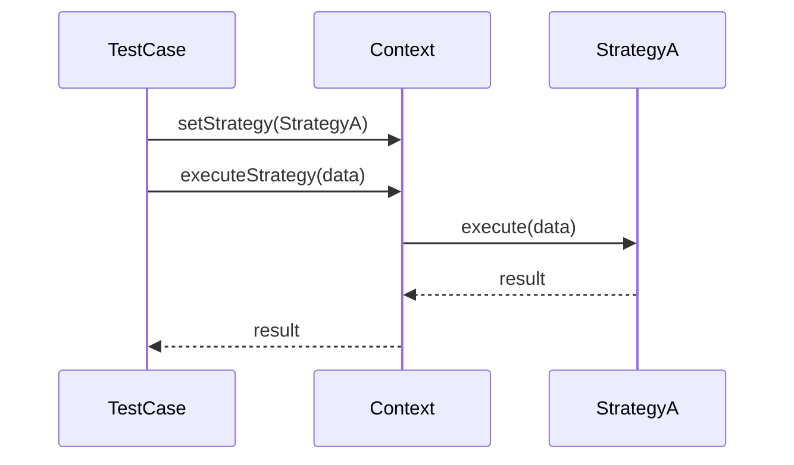

## 16.3. Applying Design Patterns in TDD

In this section, we delve into the powerful combination of Test-Driven Development (TDD) and design patterns. By integrating design patterns into TDD, we can create software that is not only robust and maintainable but also highly testable. Let's explore how these two methodologies complement each other to produce high-quality code.

### Designing for Testability

Testability is a crucial aspect of software design that ensures code can be easily tested and verified. Design patterns play a significant role in enhancing testability by promoting separation of concerns, reducing dependencies, and providing clear interfaces. Let's examine how some common design patterns facilitate testability.

#### The Role of Design Patterns in Testability

Design patterns provide a structured approach to solving recurring design problems. They encapsulate best practices that can be applied to various scenarios, making code more modular and easier to test. Here are a few ways design patterns enhance testability:

1. **Separation of Concerns**: Patterns like MVC (Model-View-Controller) and MVVM (Model-View-ViewModel) separate different aspects of an application, allowing for isolated testing of each component.

2. **Decoupling Dependencies**: Patterns such as Dependency Injection (DI) and the Service Locator pattern reduce tight coupling between components, making it easier to substitute real objects with mocks or stubs during testing.

3. **Clear Interfaces**: Patterns like the Strategy and Command patterns define clear interfaces for interchangeable behaviors, facilitating the creation of mock implementations for testing purposes.

4. **Encapsulation of Behavior**: The State and Visitor patterns encapsulate behavior within objects, allowing for targeted testing of specific functionalities without affecting other parts of the system.

#### Utilizing Patterns for Better Tests

Let's explore how specific design patterns can be applied within a TDD context to improve the quality and effectiveness of tests.

##### 1. Singleton Pattern

**Category**: Creational  
**Intent**: Ensure a class has only one instance and provide a global point of access to it.

**Applicability**: Use the Singleton pattern when you need to control access to shared resources, such as a configuration manager or a logging service.

**Sample Code Snippet**:

```pseudocode
class Singleton {
    private static instance = null

    private Singleton() {
        // Private constructor to prevent instantiation
    }

    static getInstance() {
        if (instance == null) {
            instance = new Singleton()
        }
        return instance
    }
}
```

**Design Considerations**: While the Singleton pattern is useful for managing shared resources, it can introduce challenges in testing due to its global state. Consider using Dependency Injection to inject the singleton instance into classes that require it, allowing for easier substitution during testing.

##### 2. Strategy Pattern

**Category**: Behavioral  
**Intent**: Define a family of algorithms, encapsulate each one, and make them interchangeable.

**Applicability**: Use the Strategy pattern when you have multiple algorithms for a specific task and want to switch between them dynamically.

**Sample Code Snippet**:

```pseudocode
interface Strategy {
    execute(data)
}

class ConcreteStrategyA implements Strategy {
    execute(data) {
        // Implementation of algorithm A
    }
}

class ConcreteStrategyB implements Strategy {
    execute(data) {
        // Implementation of algorithm B
    }
}

class Context {
    private strategy: Strategy

    setStrategy(strategy: Strategy) {
        this.strategy = strategy
    }

    executeStrategy(data) {
        this.strategy.execute(data)
    }
}
```

**Design Considerations**: The Strategy pattern enhances testability by allowing different strategies to be tested independently. Mocks can replace strategies in tests to verify the context's behavior without executing the actual algorithm.

##### 3. Observer Pattern

**Category**: Behavioral  
**Intent**: Define a one-to-many dependency between objects so that when one object changes state, all its dependents are notified and updated automatically.

**Applicability**: Use the Observer pattern when changes to one object require updates to others, such as in event-driven systems.

**Sample Code Snippet**:

```pseudocode
interface Observer {
    update(subject)
}

class ConcreteObserver implements Observer {
    update(subject) {
        // React to changes in the subject
    }
}

class Subject {
    private observers = []

    attach(observer: Observer) {
        observers.push(observer)
    }

    detach(observer: Observer) {
        observers.remove(observer)
    }

    notify() {
        for (observer in observers) {
            observer.update(this)
        }
    }
}
```

**Design Considerations**: The Observer pattern facilitates testing by allowing observers to be mocked or stubbed. This enables verification of notification logic without requiring actual observer implementations.

### Visualizing Design Patterns in TDD

To better understand how design patterns integrate with TDD, let's visualize the process using a sequence diagram. This diagram illustrates the interaction between a test case, a context class, and a strategy implementation.



**Description**: This sequence diagram shows how a test case sets a specific strategy in the context and executes it. The strategy processes the data and returns the result to the context, which is then verified by the test case.

### Try It Yourself

Experiment with the Strategy pattern by implementing a new strategy and testing its integration with the context. Modify the pseudocode to add a `ConcreteStrategyC` and verify its behavior through a test case.

### References and Links

For further reading on design patterns and TDD, consider exploring the following resources:

- [Refactoring Guru: Design Patterns](https://refactoring.guru/design-patterns)
- [Martin Fowler's Blog on TDD](https://martinfowler.com/bliki/TestDrivenDevelopment.html)
- [Design Patterns: Elements of Reusable Object-Oriented Software](https://en.wikipedia.org/wiki/Design_Patterns)

### Knowledge Check

Let's reinforce our understanding with some questions and exercises:

1. How does the Strategy pattern enhance testability in TDD?
2. What are the benefits of using the Observer pattern in event-driven systems?
3. Implement a test case for a new strategy in the Strategy pattern.

### Embrace the Journey

Remember, mastering design patterns and TDD is a continuous journey. As you progress, you'll discover new ways to apply these concepts to create more robust and maintainable software. Keep experimenting, stay curious, and enjoy the journey!

### Quiz Time!



### What is the primary benefit of using the Singleton pattern in TDD?

- [x] It provides a global point of access to a shared resource.
- [ ] It allows for multiple instances of a class.
- [ ] It simplifies the creation of complex objects.
- [ ] It enhances the performance of algorithms.

> **Explanation:** The Singleton pattern ensures a class has only one instance, providing a global point of access to shared resources, which can be useful in TDD for managing dependencies.

### How does the Strategy pattern improve testability?

- [x] By allowing different algorithms to be tested independently.
- [ ] By enforcing a single algorithm for all scenarios.
- [ ] By making algorithms immutable.
- [ ] By reducing the number of test cases needed.

> **Explanation:** The Strategy pattern encapsulates algorithms, allowing them to be tested independently, which enhances testability.

### In the Observer pattern, what is the role of the subject?

- [x] To notify observers of state changes.
- [ ] To execute algorithms.
- [ ] To encapsulate data.
- [ ] To manage dependencies.

> **Explanation:** The subject in the Observer pattern is responsible for notifying observers of any state changes, facilitating communication between objects.

### What is a key advantage of using design patterns in TDD?

- [x] They promote separation of concerns.
- [ ] They increase code complexity.
- [ ] They reduce the need for testing.
- [ ] They eliminate the need for documentation.

> **Explanation:** Design patterns promote separation of concerns, making code more modular and easier to test, which is a key advantage in TDD.

### Which pattern is best suited for managing shared resources?

- [x] Singleton Pattern
- [ ] Strategy Pattern
- [ ] Observer Pattern
- [ ] Factory Pattern

> **Explanation:** The Singleton pattern is designed to manage shared resources by ensuring only one instance of a class exists.

### How does Dependency Injection enhance testability?

- [x] By allowing dependencies to be easily replaced with mocks.
- [ ] By enforcing a fixed set of dependencies.
- [ ] By reducing the number of classes.
- [ ] By increasing code coupling.

> **Explanation:** Dependency Injection enhances testability by allowing dependencies to be easily replaced with mocks or stubs, facilitating isolated testing.

### What is the purpose of the Command pattern in TDD?

- [x] To encapsulate requests as objects.
- [ ] To manage shared resources.
- [ ] To define a family of algorithms.
- [ ] To notify observers of changes.

> **Explanation:** The Command pattern encapsulates requests as objects, allowing for flexible and testable command execution.

### Which design pattern is commonly used for event-driven systems?

- [x] Observer Pattern
- [ ] Singleton Pattern
- [ ] Strategy Pattern
- [ ] Factory Pattern

> **Explanation:** The Observer pattern is commonly used in event-driven systems to manage notifications and updates between objects.

### What is the main challenge of using the Singleton pattern in TDD?

- [x] Managing global state can complicate testing.
- [ ] It requires multiple instances of a class.
- [ ] It increases the number of test cases.
- [ ] It reduces code modularity.

> **Explanation:** The Singleton pattern's global state can complicate testing, as it may introduce dependencies that are difficult to manage.

### True or False: Design patterns eliminate the need for TDD.

- [ ] True
- [x] False

> **Explanation:** False. Design patterns complement TDD by providing structured solutions that enhance testability, but they do not eliminate the need for TDD.


