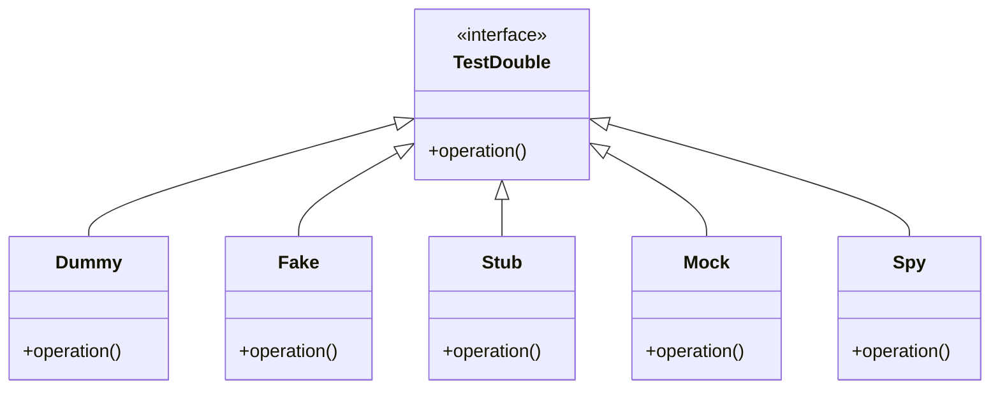

## 16.4. Mock Objects and Test Doubles

In the realm of Test-Driven Development (TDD), the use of mock objects and test doubles is a crucial technique for isolating the unit of work and ensuring that tests are reliable and repeatable. This section will delve into the various types of test doubles, including fakes, stubs, mocks, and spies, providing a comprehensive understanding of their roles and applications. We will also explore how these concepts are implemented through pseudocode examples, enhancing your ability to apply them across different programming paradigms.

### Introduction to Test Doubles

Test doubles are objects that stand in for real objects in a system during testing. They are used to simulate the behavior of complex, unpredictable, or unavailable components, allowing developers to focus on the unit under test. The term "test double" is a generic term that encompasses several specific types, each serving a distinct purpose in testing.

#### Types of Test Doubles

1. **Dummy Objects**: Used to fill parameter lists but are not actually used in the test.
2. **Fakes**: Provide a working implementation, but are simplified and not suitable for production.
3. **Stubs**: Provide predetermined responses to method calls made during the test.
4. **Spies**: Record information about the calls they receive, allowing for verification.
5. **Mocks**: Pre-programmed with expectations which form a specification of the calls they are expected to receive.

### Understanding Fakes

Fakes are a type of test double that provide a simplified but functional implementation of a component. They are often used when the real implementation is unavailable or too complex to use in a test environment. Fakes can be useful for testing interactions with external systems, such as databases or web services, without the overhead of setting up the actual system.

#### Pseudocode Example of a Fake

Consider a scenario where we need to test a service that interacts with a database. We can use a fake database to simulate the behavior of the real database.

```pseudocode
class FakeDatabase:
    def __init__():
        self.data = {}

    def insert(key, value):
        self.data[key] = value

    def find(key):
        return self.data.get(key, None)

class UserService:
    def __init__(db):
        self.db = db

    def add_user(user_id, user_data):
        self.db.insert(user_id, user_data)

    def get_user(user_id):
        return self.db.find(user_id)

fake_db = FakeDatabase()
user_service = UserService(fake_db)

user_service.add_user("123", {"name": "Alice"})
assert user_service.get_user("123") == {"name": "Alice"}
```

In this example, `FakeDatabase` is a fake that mimics the behavior of a real database, allowing us to test `UserService` without relying on an actual database.

### Exploring Stubs

Stubs are test doubles that provide predefined responses to method calls. They are used to control the behavior of a component during a test, allowing us to simulate specific scenarios and edge cases.

#### Pseudocode Example of a Stub

Let's consider a payment processing system where we need to test the behavior when a payment is successful.

```pseudocode
class PaymentGatewayStub:
    def process_payment(amount):
        return "success"

class PaymentService:
    def __init__(gateway):
        self.gateway = gateway

    def make_payment(amount):
        result = self.gateway.process_payment(amount)
        if result == "success":
            return "Payment processed"
        else:
            return "Payment failed"

payment_gateway_stub = PaymentGatewayStub()
payment_service = PaymentService(payment_gateway_stub)

assert payment_service.make_payment(100) == "Payment processed"
```

In this example, `PaymentGatewayStub` is a stub that always returns "success", allowing us to test the `PaymentService` under the assumption that the payment is always successful.

### Delving into Mocks

Mocks are test doubles that are pre-programmed with expectations about the interactions they will receive. They are used to verify that a component behaves as expected by checking that the correct methods are called with the correct parameters.

#### Pseudocode Example of a Mock

Consider a notification system where we need to ensure that a notification is sent when a user registers.

```pseudocode
class NotificationServiceMock:
    def __init__():
        self.sent_notifications = []

    def send_notification(user_id, message):
        self.sent_notifications.append((user_id, message))

    def verify_notification_sent(user_id, message):
        return (user_id, message) in self.sent_notifications

class RegistrationService:
    def __init__(notification_service):
        self.notification_service = notification_service

    def register_user(user_id):
        # Registration logic...
        self.notification_service.send_notification(user_id, "Welcome!")

notification_service_mock = NotificationServiceMock()
registration_service = RegistrationService(notification_service_mock)

registration_service.register_user("123")
assert notification_service_mock.verify_notification_sent("123", "Welcome!")
```

In this example, `NotificationServiceMock` is a mock that records notifications sent during the test, allowing us to verify that the `RegistrationService` sends the correct notification.

### Unveiling Spies

Spies are similar to mocks, but they focus on recording information about the interactions they receive rather than setting expectations in advance. This allows us to verify the behavior of a component after the test has run.

#### Pseudocode Example of a Spy

Let's consider a logging system where we need to verify that a log entry is created when an error occurs.

```pseudocode
class LoggerSpy:
    def __init__():
        self.logged_messages = []

    def log(message):
        self.logged_messages.append(message)

    def verify_log_contains(message):
        return message in self.logged_messages

class ErrorHandler:
    def __init__(logger):
        self.logger = logger

    def handle_error(error_message):
        # Error handling logic...
        self.logger.log(f"Error: {error_message}")

logger_spy = LoggerSpy()
error_handler = ErrorHandler(logger_spy)

error_handler.handle_error("File not found")
assert logger_spy.verify_log_contains("Error: File not found")
```

In this example, `LoggerSpy` is a spy that records log messages during the test, allowing us to verify that the `ErrorHandler` logs the correct message.

### Visualizing Test Doubles

To better understand the relationships and interactions between different types of test doubles, let's visualize them using a class diagram.



**Diagram Description**: This class diagram illustrates the hierarchy of test doubles, showing how each type implements the `TestDouble` interface. Each type of test double serves a unique purpose in testing, from providing simple implementations (Fakes) to verifying interactions (Mocks and Spies).

### When to Use Each Type of Test Double

- **Dummies**: Use when you need to satisfy an interface but the object is not actually used in the test.
- **Fakes**: Use when you need a working implementation that is simpler than the real one, often for external systems.
- **Stubs**: Use when you need to control the behavior of a component to test specific scenarios.
- **Mocks**: Use when you need to verify that certain interactions occur during the test.
- **Spies**: Use when you need to record and verify interactions after the test has run.

### Differences and Similarities

While all test doubles serve the purpose of isolating the unit under test, they differ in their approach and use cases:

- **Fakes** and **Stubs** both provide controlled behavior, but fakes are more complete implementations, while stubs are more focused on specific responses.
- **Mocks** and **Spies** both record interactions, but mocks set expectations beforehand, while spies verify interactions after the fact.

### Design Considerations

When using test doubles, consider the following:

- **Maintainability**: Ensure that test doubles are easy to understand and maintain. Overly complex test doubles can lead to brittle tests.
- **Isolation**: Use test doubles to isolate the unit under test, but avoid overusing them to the point where the test no longer reflects real-world conditions.
- **Verification**: Choose the appropriate type of test double based on the level of verification needed. Mocks are suitable for strict verification, while spies offer more flexibility.

### Try It Yourself

Experiment with the provided pseudocode examples by modifying the behavior of the test doubles. For instance, try changing the response of a stub to simulate different scenarios, or add additional verification steps to a mock or spy.

### References and Further Reading

- [Martin Fowler's article on Mocks Aren't Stubs](https://martinfowler.com/articles/mocksArentStubs.html)
- [xUnit Test Patterns: Refactoring Test Code by Gerard Meszaros](https://www.amazon.com/xUnit-Test-Patterns-Refactoring-Code/dp/0131495054)
- [Test Double on Wikipedia](https://en.wikipedia.org/wiki/Test_double)

### Knowledge Check

Before we wrap up, let's reinforce our understanding of mock objects and test doubles with a few questions.

## Quiz Time!



### What is a test double?

- [x] An object that stands in for a real object in a system during testing
- [ ] A tool for compiling code
- [ ] A type of database
- [ ] A programming language

> **Explanation:** A test double is an object used in testing to simulate the behavior of real objects.

### Which type of test double provides a simplified but functional implementation?

- [x] Fake
- [ ] Stub
- [ ] Mock
- [ ] Spy

> **Explanation:** Fakes provide a simplified but functional implementation of a component.

### What is the primary purpose of a stub?

- [x] To provide predetermined responses to method calls
- [ ] To record interactions
- [ ] To verify interactions
- [ ] To compile code

> **Explanation:** Stubs are used to provide predetermined responses to method calls during testing.

### Which test double is pre-programmed with expectations about interactions?

- [x] Mock
- [ ] Spy
- [ ] Fake
- [ ] Stub

> **Explanation:** Mocks are pre-programmed with expectations about the interactions they will receive.

### What is the main difference between mocks and spies?

- [x] Mocks set expectations beforehand, while spies verify interactions after the fact
- [ ] Spies set expectations beforehand, while mocks verify interactions after the fact
- [ ] Mocks and spies are the same
- [ ] Mocks are used for compiling code

> **Explanation:** Mocks set expectations beforehand, while spies record interactions for verification after the test.

### Which test double is used to fill parameter lists but is not actually used in the test?

- [x] Dummy
- [ ] Fake
- [ ] Stub
- [ ] Mock

> **Explanation:** Dummies are used to fill parameter lists but are not actually used in the test.

### What is a key consideration when using test doubles?

- [x] Maintainability
- [ ] Compilation speed
- [ ] Database connectivity
- [ ] Programming language

> **Explanation:** Maintainability is a key consideration to ensure that test doubles are easy to understand and maintain.

### Which test double records information about the interactions it receives?

- [x] Spy
- [ ] Stub
- [ ] Fake
- [ ] Dummy

> **Explanation:** Spies record information about the interactions they receive during testing.

### What is the role of a fake in testing?

- [x] To provide a working implementation that is simpler than the real one
- [ ] To verify interactions
- [ ] To record interactions
- [ ] To compile code

> **Explanation:** Fakes provide a working implementation that is simpler than the real one, often for testing purposes.

### True or False: Mocks and spies both record interactions, but mocks set expectations beforehand.

- [x] True
- [ ] False

> **Explanation:** True. Mocks set expectations beforehand, while spies record interactions for verification after the test.



Remember, mastering the use of mock objects and test doubles can significantly enhance your testing strategy, making your tests more reliable and focused. Keep experimenting, stay curious, and enjoy the journey!
