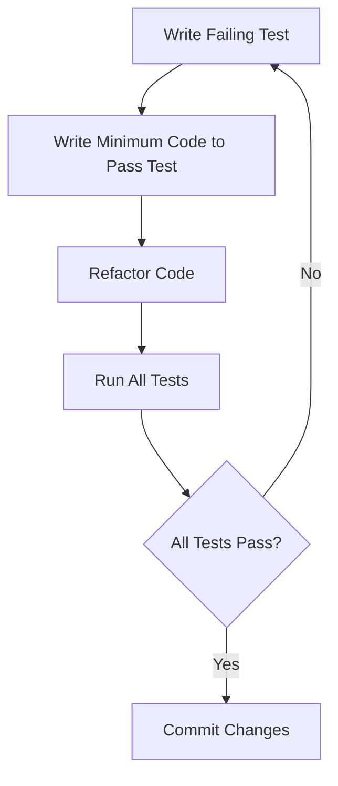

## 16.5. Refactoring with TDD

In the ever-evolving world of software development, maintaining clean, efficient, and adaptable code is paramount. Refactoring, when combined with Test-Driven Development (TDD), becomes a powerful tool for continuous improvement and effective management of legacy code. This section delves into the intricacies of refactoring within the TDD framework, providing expert insights, practical examples, and strategies for handling legacy systems.

### Understanding Refactoring and TDD

**Refactoring** is the process of restructuring existing code without changing its external behavior. The primary goal of refactoring is to improve the internal structure of the code, making it more readable, maintainable, and adaptable to change.

**Test-Driven Development (TDD)** is a software development process where tests are written before the actual code. The TDD cycle consists of three main steps: Red, Green, and Refactor.

- **Red**: Write a failing test that defines a desired improvement or new function.
- **Green**: Write the minimum amount of code necessary to pass the test.
- **Refactor**: Clean up the code while ensuring that all tests still pass.

By integrating refactoring into the TDD cycle, developers can ensure that their code remains robust and adaptable, even as new features are added or existing ones are modified.

### The Synergy Between Refactoring and TDD

Refactoring and TDD complement each other in several ways:

1. **Safety Net**: TDD provides a safety net of tests that ensure refactoring does not introduce new bugs.
2. **Incremental Improvement**: Refactoring encourages incremental improvements, making the codebase cleaner and more efficient over time.
3. **Design Evolution**: TDD facilitates the evolution of design by allowing developers to refactor code confidently, knowing that tests will catch any regressions.

### Refactoring Techniques in TDD

Let's explore some common refactoring techniques that can be effectively applied within the TDD framework:

#### 1. Extract Method

The Extract Method refactoring involves taking a piece of code and turning it into a new method. This technique is useful for reducing code duplication and improving readability.

**Pseudocode Example:**

```pseudocode
// Before Refactoring
function calculateTotal(order) {
    let total = 0;
    for each item in order.items {
        total += item.price * item.quantity;
    }
    return total;
}

// After Refactoring
function calculateTotal(order) {
    return sumOrderItems(order.items);
}

function sumOrderItems(items) {
    let total = 0;
    for each item in items {
        total += item.price * item.quantity;
    }
    return total;
}
```

#### 2. Inline Method

Inline Method is the opposite of Extract Method. It involves replacing a method call with the method's body. This is useful when a method is trivial and does not justify its existence.

**Pseudocode Example:**

```pseudocode
// Before Refactoring
function getDiscountedPrice(price) {
    return applyDiscount(price);
}

function applyDiscount(price) {
    return price * 0.9;
}

// After Refactoring
function getDiscountedPrice(price) {
    return price * 0.9;
}
```

#### 3. Rename Variable

Renaming variables to more descriptive names can significantly improve code readability and maintainability.

**Pseudocode Example:**

```pseudocode
// Before Refactoring
let x = calculateTotal(order);

// After Refactoring
let totalOrderPrice = calculateTotal(order);
```

### Handling Legacy Code with TDD

Legacy code often lacks tests, making it risky to change. TDD can be instrumental in managing and improving legacy systems. Here are some strategies:

#### 1. Characterization Tests

Characterization tests are used to understand and document the current behavior of legacy code. These tests help ensure that any changes do not alter the intended functionality.

**Pseudocode Example:**

```pseudocode
// Characterization Test
test "Legacy method should return expected result" {
    let result = legacyMethod(input);
    assert result == expectedOutput;
}
```

#### 2. Incremental Refactoring

Refactor legacy code incrementally by adding tests around small pieces of functionality. This approach minimizes risk and allows for gradual improvement.

#### 3. Introduce Interfaces

Introducing interfaces can help decouple legacy code from new code, making it easier to test and refactor.

**Pseudocode Example:**

```pseudocode
interface PaymentProcessor {
    function processPayment(amount);
}

class LegacyPaymentProcessor implements PaymentProcessor {
    function processPayment(amount) {
        // Legacy payment processing logic
    }
}

class NewPaymentProcessor implements PaymentProcessor {
    function processPayment(amount) {
        // New payment processing logic
    }
}
```

### Visualizing the Refactoring Process

To better understand the refactoring process within TDD, let's visualize it using a flowchart:



**Caption:** The TDD Cycle: Write a failing test, write code to pass the test, refactor, and ensure all tests pass.

### Try It Yourself

To truly grasp the power of refactoring with TDD, try modifying the provided pseudocode examples. Experiment with different refactoring techniques, such as Extract Class or Move Method, and observe how they impact the code's structure and readability.

### Knowledge Check

- **Question:** What is the primary goal of refactoring?
  - **Answer:** To improve the internal structure of the code without changing its external behavior.

- **Question:** How does TDD provide a safety net during refactoring?
  - **Answer:** TDD provides a suite of tests that ensure refactoring does not introduce new bugs.

### Embrace the Journey

Refactoring with TDD is a journey of continuous improvement. As you practice these techniques, you'll develop a deeper understanding of your codebase and become more adept at managing complexity. Remember, the goal is not just to write code that works, but to write code that is clean, efficient, and maintainable.

### References and Links

- [Martin Fowler's Refactoring](https://martinfowler.com/books/refactoring.html)
- [Kent Beck's Test-Driven Development: By Example](https://www.amazon.com/Test-Driven-Development-Kent-Beck/dp/0321146530)

## Quiz Time!



### What is the primary goal of refactoring?

- [x] To improve the internal structure of the code without changing its external behavior.
- [ ] To add new features to the code.
- [ ] To increase the code's execution speed.
- [ ] To reduce the size of the codebase.

> **Explanation:** Refactoring focuses on enhancing the code's internal structure while maintaining its existing functionality.

### How does TDD provide a safety net during refactoring?

- [x] By providing a suite of tests that ensure refactoring does not introduce new bugs.
- [ ] By automatically refactoring the code.
- [ ] By generating code documentation.
- [ ] By increasing code execution speed.

> **Explanation:** TDD's tests verify that refactoring changes do not break existing functionality.

### Which refactoring technique involves turning a piece of code into a new method?

- [x] Extract Method
- [ ] Inline Method
- [ ] Rename Variable
- [ ] Move Method

> **Explanation:** Extract Method creates a new method from an existing code segment.

### What is a characterization test used for?

- [x] To understand and document the current behavior of legacy code.
- [ ] To refactor code automatically.
- [ ] To increase code execution speed.
- [ ] To reduce code size.

> **Explanation:** Characterization tests capture the existing behavior of legacy code for safe refactoring.

### What is the first step in the TDD cycle?

- [x] Write a failing test.
- [ ] Write the minimum code to pass the test.
- [ ] Refactor the code.
- [ ] Commit changes.

> **Explanation:** The TDD cycle begins with writing a test that initially fails.

### Which technique involves replacing a method call with the method's body?

- [x] Inline Method
- [ ] Extract Method
- [ ] Rename Variable
- [ ] Move Method

> **Explanation:** Inline Method substitutes a method call with its implementation.

### How can interfaces help in refactoring legacy code?

- [x] By decoupling legacy code from new code, making it easier to test and refactor.
- [ ] By automatically refactoring the code.
- [ ] By increasing code execution speed.
- [ ] By reducing code size.

> **Explanation:** Interfaces facilitate separation and testing of legacy and new code.

### What does the "Red" step in TDD signify?

- [x] Writing a failing test.
- [ ] Writing code to pass the test.
- [ ] Refactoring the code.
- [ ] Running all tests.

> **Explanation:** The "Red" step involves creating a test that initially fails.

### Which refactoring technique is the opposite of Extract Method?

- [x] Inline Method
- [ ] Rename Variable
- [ ] Move Method
- [ ] Extract Class

> **Explanation:** Inline Method is the reverse of Extract Method, embedding a method's body directly.

### True or False: Refactoring should change the external behavior of the code.

- [ ] True
- [x] False

> **Explanation:** Refactoring aims to improve internal structure without altering external behavior.


