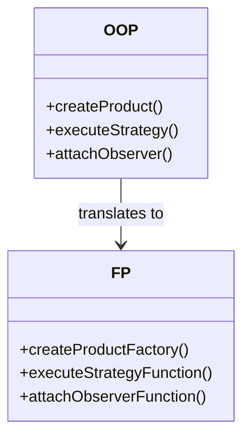

## 17.1. Object-Oriented vs. Functional Implementations

In the realm of software development, design patterns serve as reusable solutions to common problems. These patterns are often associated with Object-Oriented Programming (OOP), but they are equally applicable in Functional Programming (FP). This section delves into the translation of design patterns between these paradigms, providing a comparative analysis to highlight their differences and similarities.

### Understanding the Paradigms

Before diving into the translation of patterns, it's essential to understand the foundational differences between OOP and FP.

**Object-Oriented Programming (OOP):**
- **Encapsulation:** Bundles data and methods that operate on the data within objects.
- **Inheritance:** Allows new classes to inherit properties and behaviors from existing classes.
- **Polymorphism:** Enables objects to be treated as instances of their parent class.
- **State Management:** Objects maintain state, which can change over time.

**Functional Programming (FP):**
- **Immutability:** Data is immutable, meaning it cannot be changed once created.
- **First-Class Functions:** Functions are treated as first-class citizens and can be passed as arguments.
- **Pure Functions:** Functions have no side effects and return the same output for the same input.
- **Higher-Order Functions:** Functions that take other functions as arguments or return them as results.

### Translating Patterns Between Paradigms

#### Singleton Pattern

**Intent:** Ensure a class has only one instance and provide a global point of access to it.

**OOP Implementation:**

In OOP, the Singleton pattern is typically implemented using a private static variable to hold the single instance and a public static method to access it.

```pseudocode
class Singleton {
    private static instance = null

    private Singleton() {
        // Private constructor to prevent instantiation
    }

    public static getInstance() {
        if (instance == null) {
            instance = new Singleton()
        }
        return instance
    }
}
```

**FP Implementation:**

In FP, the Singleton pattern can be achieved using closures to encapsulate the single instance.

```pseudocode
function createSingleton() {
    let instance = null

    function getInstance() {
        if (instance == null) {
            instance = {} // Create the instance
        }
        return instance
    }

    return { getInstance }
}

const singleton = createSingleton()
```

**Comparative Analysis:**

- **State Management:** OOP uses class-level state, while FP uses closures to manage state.
- **Instantiation Control:** OOP relies on private constructors, whereas FP uses function scope to control instantiation.

#### Strategy Pattern

**Intent:** Define a family of algorithms, encapsulate each one, and make them interchangeable.

**OOP Implementation:**

In OOP, the Strategy pattern involves defining a strategy interface and concrete strategy classes.

```pseudocode
interface Strategy {
    execute(data)
}

class ConcreteStrategyA implements Strategy {
    execute(data) {
        // Implementation for strategy A
    }
}

class ConcreteStrategyB implements Strategy {
    execute(data) {
        // Implementation for strategy B
    }
}

class Context {
    private strategy

    setStrategy(strategy) {
        this.strategy = strategy
    }

    executeStrategy(data) {
        this.strategy.execute(data)
    }
}
```

**FP Implementation:**

In FP, strategies can be represented as functions, and the context can apply these functions.

```pseudocode
function strategyA(data) {
    // Implementation for strategy A
}

function strategyB(data) {
    // Implementation for strategy B
}

function executeStrategy(strategy, data) {
    strategy(data)
}
```

**Comparative Analysis:**

- **Encapsulation:** OOP encapsulates strategies within classes, while FP uses functions.
- **Flexibility:** FP provides more flexibility in passing and composing strategies as functions.

#### Observer Pattern

**Intent:** Define a one-to-many dependency between objects so that when one object changes state, all its dependents are notified and updated automatically.

**OOP Implementation:**

In OOP, the Observer pattern involves subject and observer interfaces with concrete implementations.

```pseudocode
interface Observer {
    update(subject)
}

class ConcreteObserver implements Observer {
    update(subject) {
        // Update logic
    }
}

class Subject {
    private observers = []

    attach(observer) {
        observers.push(observer)
    }

    detach(observer) {
        observers.remove(observer)
    }

    notify() {
        for (observer in observers) {
            observer.update(this)
        }
    }
}
```

**FP Implementation:**

In FP, the Observer pattern can be implemented using higher-order functions and immutable data structures.

```pseudocode
function createSubject() {
    let observers = []

    function attach(observer) {
        observers = [...observers, observer]
    }

    function detach(observer) {
        observers = observers.filter(o => o !== observer)
    }

    function notify() {
        observers.forEach(observer => observer())
    }

    return { attach, detach, notify }
}
```

**Comparative Analysis:**

- **State Management:** OOP uses mutable state within objects, while FP uses immutable data structures.
- **Notification Mechanism:** Both paradigms use a similar mechanism for attaching and notifying observers, but FP emphasizes immutability.

### Key Participants in Pattern Translation

When translating patterns, it's crucial to identify the key participants and their roles in both paradigms.

**OOP Participants:**
- **Classes and Interfaces:** Define the structure and behavior of objects.
- **Inheritance and Polymorphism:** Facilitate code reuse and dynamic behavior.

**FP Participants:**
- **Functions and Closures:** Serve as the primary building blocks for behavior.
- **Higher-Order Functions:** Enable composition and abstraction.

### Applicability of Patterns Across Paradigms

Design patterns are applicable across paradigms, but their implementation details vary.

- **Creational Patterns:** Focus on object creation mechanisms. In FP, these patterns often involve function factories or closures.
- **Structural Patterns:** Concerned with object composition. FP uses function composition and data transformation.
- **Behavioral Patterns:** Deal with object interaction. FP emphasizes function application and chaining.

### Sample Code Snippets

Let's explore a few more patterns with sample pseudocode snippets for both paradigms.

#### Factory Method Pattern

**OOP Implementation:**

```pseudocode
abstract class Creator {
    abstract createProduct()
}

class ConcreteCreator extends Creator {
    createProduct() {
        return new ConcreteProduct()
    }
}
```

**FP Implementation:**

```pseudocode
function createProductFactory() {
    return function() {
        return {} // Create product
    }
}

const productFactory = createProductFactory()
```

#### Decorator Pattern

**OOP Implementation:**

```pseudocode
interface Component {
    operation()
}

class ConcreteComponent implements Component {
    operation() {
        // Base operation
    }
}

class Decorator implements Component {
    private component

    constructor(component) {
        this.component = component
    }

    operation() {
        // Additional behavior
        component.operation()
    }
}
```

**FP Implementation:**

```pseudocode
function baseOperation() {
    // Base operation
}

function decorator(operation) {
    return function() {
        // Additional behavior
        operation()
    }
}

const decoratedOperation = decorator(baseOperation)
```

### Design Considerations

When choosing a paradigm for implementing design patterns, consider the following:

- **Complexity:** OOP may introduce more complexity with class hierarchies, while FP can simplify through function composition.
- **State Management:** OOP allows mutable state, which can be beneficial or detrimental depending on the context. FP's immutability promotes safer concurrency.
- **Flexibility:** FP offers greater flexibility in composing and reusing functions, whereas OOP provides a more structured approach through inheritance.

### Differences and Similarities

While OOP and FP have distinct characteristics, they share common goals in software design:

- **Modularity:** Both paradigms aim to create modular and reusable code.
- **Abstraction:** They provide mechanisms for abstraction, whether through classes or functions.
- **Encapsulation:** OOP encapsulates data within objects, while FP encapsulates behavior within functions.

### Visualizing Pattern Translation

To better understand the translation of patterns, let's visualize the process using Mermaid.js diagrams.



**Diagram Description:** This diagram illustrates the translation of key pattern operations from OOP to FP, highlighting the functional equivalents of traditional OOP methods.

### Try It Yourself

Experiment with the provided pseudocode examples by modifying or extending them:

- **Singleton Pattern:** Try implementing a thread-safe Singleton in both paradigms.
- **Strategy Pattern:** Add additional strategies and test their interchangeability.
- **Observer Pattern:** Implement a concrete observer that reacts to specific changes.

### References and Links

For further reading on design patterns and programming paradigms, consider the following resources:

- [Design Patterns: Elements of Reusable Object-Oriented Software](https://en.wikipedia.org/wiki/Design_Patterns)
- [Functional Programming in JavaScript](https://developer.mozilla.org/en-US/docs/Web/JavaScript/Guide/Functions)
- [Object-Oriented Programming Concepts](https://www.oracle.com/java/technologies/javase/oop.html)

### Knowledge Check

To reinforce your understanding, consider the following questions and exercises:

- **Exercise:** Implement the Factory Method pattern in both paradigms for a different product type.
- **Question:** How does immutability in FP affect the implementation of the Observer pattern?
- **Challenge:** Translate the Decorator pattern into a purely functional style without using classes.

### Embrace the Journey

Remember, mastering design patterns across paradigms is a journey. As you explore these concepts, you'll gain a deeper understanding of how to apply them effectively in different contexts. Keep experimenting, stay curious, and enjoy the process!

## Quiz Time!



### Which of the following is a key characteristic of Functional Programming?

- [x] Immutability
- [ ] Encapsulation
- [ ] Inheritance
- [ ] Polymorphism

> **Explanation:** Immutability is a core principle of Functional Programming, ensuring that data cannot be changed once created.


### In OOP, how is the Singleton pattern typically implemented?

- [x] Using a private static variable and a public static method
- [ ] Using closures
- [ ] Using inheritance
- [ ] Using polymorphism

> **Explanation:** The Singleton pattern in OOP is implemented with a private static variable to hold the instance and a public static method to provide access.


### What is the primary building block for behavior in Functional Programming?

- [ ] Classes
- [x] Functions
- [ ] Interfaces
- [ ] Objects

> **Explanation:** Functions serve as the primary building blocks in Functional Programming, enabling composition and abstraction.


### How does the Strategy pattern differ between OOP and FP?

- [x] OOP uses classes, FP uses functions
- [ ] OOP uses functions, FP uses classes
- [ ] Both use classes
- [ ] Both use functions

> **Explanation:** In OOP, the Strategy pattern is implemented with classes, while in FP, it is implemented with functions.


### Which pattern involves defining a one-to-many dependency between objects?

- [x] Observer Pattern
- [ ] Singleton Pattern
- [ ] Strategy Pattern
- [ ] Factory Method Pattern

> **Explanation:** The Observer pattern defines a one-to-many dependency, allowing objects to be notified of changes.


### What is a common goal shared by both OOP and FP?

- [x] Modularity
- [ ] Mutable State
- [ ] Class Hierarchies
- [ ] Global Variables

> **Explanation:** Both paradigms aim to create modular and reusable code, though they achieve this through different means.


### In FP, how is state typically managed?

- [ ] Mutable objects
- [x] Immutable data structures
- [ ] Class hierarchies
- [ ] Global variables

> **Explanation:** FP emphasizes immutability, managing state with immutable data structures.


### What is a benefit of using FP for implementing design patterns?

- [x] Greater flexibility in composing functions
- [ ] More complex class hierarchies
- [ ] Easier mutable state management
- [ ] Increased use of inheritance

> **Explanation:** FP offers greater flexibility in composing and reusing functions, which can simplify pattern implementation.


### Which of the following is NOT a characteristic of OOP?

- [ ] Encapsulation
- [ ] Inheritance
- [ ] Polymorphism
- [x] Immutability

> **Explanation:** Immutability is a characteristic of Functional Programming, not Object-Oriented Programming.


### True or False: Both OOP and FP aim to achieve abstraction in software design.

- [x] True
- [ ] False

> **Explanation:** Both paradigms provide mechanisms for abstraction, though they differ in their approaches.


