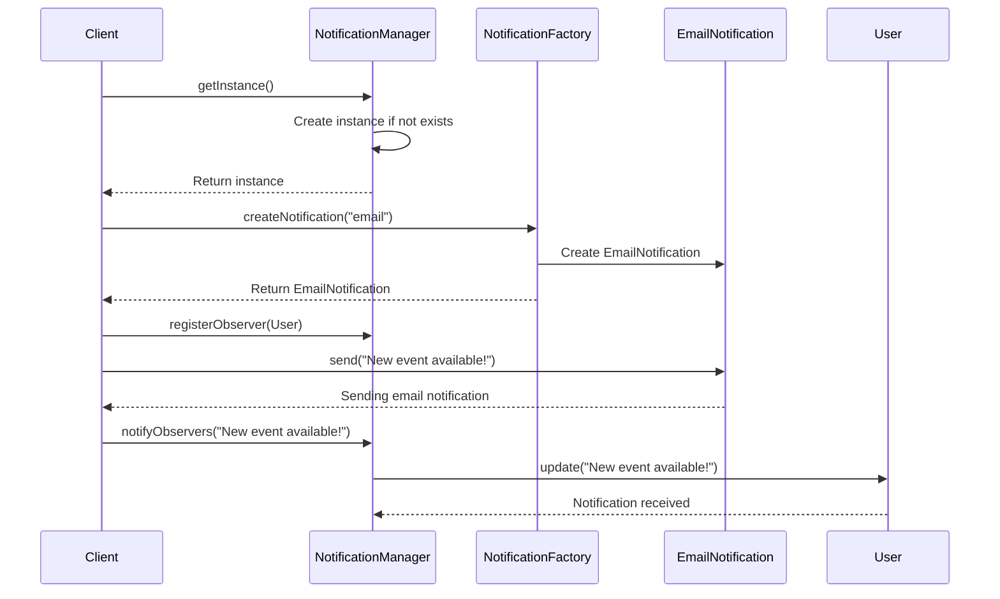

## 17.2. Combining Patterns for Robust Solutions

In the ever-evolving landscape of software development, creating robust, maintainable, and scalable solutions is a paramount goal for expert software engineers and architects. One of the most effective strategies to achieve this is by combining design patterns. This approach leverages the strengths of individual patterns to address complex software design challenges, resulting in solutions that are greater than the sum of their parts. In this section, we'll delve into the concept of composite patterns, explore real-world case studies, and provide practical guidance on how to combine patterns effectively.

### Understanding Composite Patterns

Composite patterns, also known as pattern compositions, involve the integration of multiple design patterns to solve a specific problem or set of problems. This approach is particularly useful when a single pattern is insufficient to address the complexity of a given scenario. By combining patterns, we can create solutions that are more flexible, reusable, and easier to maintain.

#### Key Concepts of Composite Patterns

1. **Synergy**: The primary goal of combining patterns is to achieve synergy, where the combined effect of the patterns is greater than their individual contributions. This synergy often results in more elegant and efficient solutions.

2. **Modularity**: Composite patterns promote modularity by breaking down complex problems into smaller, manageable components. Each pattern addresses a specific aspect of the problem, making the overall solution easier to understand and maintain.

3. **Flexibility**: By leveraging the strengths of multiple patterns, composite patterns offer greater flexibility in adapting to changing requirements and evolving technologies.

4. **Reusability**: Composite patterns enhance reusability by encapsulating common design solutions that can be applied across different projects and domains.

#### Examples of Composite Patterns

To illustrate the concept of composite patterns, let's consider a few examples:

- **MVC (Model-View-Controller) with Observer and Strategy Patterns**: The MVC architecture can be enhanced by incorporating the Observer pattern to facilitate communication between the model and the view, and the Strategy pattern to allow dynamic selection of algorithms for the controller.

- **Decorator and Composite Patterns**: These patterns can be combined to create a flexible and extensible system for managing graphical user interfaces (GUIs), where components can be dynamically decorated and organized in a hierarchical structure.

- **Factory Method and Singleton Patterns**: By combining these patterns, we can create a system where a single instance of a factory is responsible for creating instances of various product classes, ensuring controlled access to shared resources.

### Real-World Case Studies

To better understand the practical application of composite patterns, let's explore a few real-world case studies.

#### Case Study 1: E-Commerce Platform

**Problem Statement**: An e-commerce platform needs to manage a complex inventory system, support multiple payment gateways, and provide a seamless user experience across different devices.

**Solution**: By combining the following patterns, the platform can achieve its goals:

- **Composite Pattern**: Used to manage the hierarchical structure of the inventory, allowing products to be organized into categories and subcategories.

- **Strategy Pattern**: Implemented to support multiple payment gateways, enabling the platform to dynamically select the appropriate payment processing algorithm based on user preferences.

- **Observer Pattern**: Facilitates real-time updates to the user interface, ensuring that changes in the inventory are immediately reflected on the user's screen.

- **Facade Pattern**: Provides a simplified interface for interacting with the complex subsystems of the platform, such as inventory management and payment processing.

**Outcome**: The combination of these patterns results in a scalable, maintainable, and user-friendly e-commerce platform that can easily adapt to changing business requirements.

#### Case Study 2: Social Media Application

**Problem Statement**: A social media application needs to handle a large volume of user-generated content, support real-time notifications, and provide a personalized user experience.

**Solution**: The following patterns are combined to address these challenges:

- **Decorator Pattern**: Used to add dynamic features to user profiles, such as badges and achievements, without modifying the underlying user data structure.

- **Observer Pattern**: Enables real-time notifications by allowing users to subscribe to updates from their friends and followers.

- **Command Pattern**: Facilitates the implementation of undo and redo functionality for user actions, such as posting, commenting, and liking.

- **Proxy Pattern**: Provides a layer of abstraction for accessing remote resources, such as user data and media files, improving performance and security.

**Outcome**: The social media application becomes highly responsive, personalized, and capable of handling a large volume of content and interactions.

### Combining Patterns: Best Practices

When combining design patterns, it's important to follow best practices to ensure the resulting solution is effective and maintainable.

#### 1. **Identify the Core Problem**

Before combining patterns, clearly define the core problem you are trying to solve. This will help you determine which patterns are most appropriate for addressing different aspects of the problem.

#### 2. **Select Complementary Patterns**

Choose patterns that complement each other and address different facets of the problem. Avoid combining patterns that have conflicting intents or introduce unnecessary complexity.

#### 3. **Maintain Separation of Concerns**

Ensure that each pattern addresses a specific concern and does not overlap with the responsibilities of other patterns. This will help maintain modularity and prevent tight coupling between components.

#### 4. **Encapsulate Complexity**

Use patterns to encapsulate complexity and provide a simplified interface for interacting with the system. This will make the solution easier to understand and use.

#### 5. **Test and Validate**

Thoroughly test the combined solution to ensure it meets the desired requirements and performs as expected. Validate that the patterns work together seamlessly and do not introduce unintended side effects.

### Pseudocode Example: Combining Patterns

Let's explore a pseudocode example that demonstrates the combination of the Factory Method, Singleton, and Observer patterns in a notification system.

```pseudocode
// Singleton Pattern: NotificationManager
class NotificationManager {
    private static instance: NotificationManager

    private constructor() {}

    public static getInstance(): NotificationManager {
        if (instance == null) {
            instance = new NotificationManager()
        }
        return instance
    }

    public notifyObservers(message: String) {
        // Notify all registered observers
    }
}

// Observer Pattern: Observer Interface
interface Observer {
    update(message: String)
}

// Concrete Observer: User
class User implements Observer {
    private name: String

    public User(name: String) {
        this.name = name
    }

    public update(message: String) {
        print(name + " received notification: " + message)
    }
}

// Factory Method Pattern: NotificationFactory
abstract class NotificationFactory {
    public abstract createNotification(type: String): Notification
}

// Concrete Factory: EmailNotificationFactory
class EmailNotificationFactory extends NotificationFactory {
    public createNotification(type: String): Notification {
        if (type == "email") {
            return new EmailNotification()
        }
        // Add more notification types if needed
    }
}

// Product Interface: Notification
interface Notification {
    send(message: String)
}

// Concrete Product: EmailNotification
class EmailNotification implements Notification {
    public send(message: String) {
        print("Sending email notification: " + message)
    }
}

// Client Code
function main() {
    // Get the singleton instance of NotificationManager
    manager = NotificationManager.getInstance()

    // Create observers
    user1 = new User("Alice")
    user2 = new User("Bob")

    // Register observers
    manager.registerObserver(user1)
    manager.registerObserver(user2)

    // Create a notification using the factory method
    factory = new EmailNotificationFactory()
    notification = factory.createNotification("email")

    // Send notification and notify observers
    message = "New event available!"
    notification.send(message)
    manager.notifyObservers(message)
}
```

### Visualizing Composite Patterns

To better understand how composite patterns work, let's visualize the interaction between the Factory Method, Singleton, and Observer patterns in our notification system example.



**Diagram Description**: This sequence diagram illustrates the interaction between the client, the singleton `NotificationManager`, the `NotificationFactory`, and the `User` observers. The client retrieves the singleton instance, creates a notification using the factory method, and sends the notification. The `NotificationManager` then notifies all registered observers.

### Try It Yourself

To deepen your understanding of composite patterns, try modifying the pseudocode example:

- **Add a New Notification Type**: Extend the `NotificationFactory` to support a new notification type, such as SMS or push notifications.
- **Implement a New Observer**: Create a new observer class that reacts differently to notifications, such as logging them to a file.
- **Enhance the NotificationManager**: Add functionality to the `NotificationManager` to allow observers to unsubscribe from notifications.

### Knowledge Check

To reinforce your understanding of combining patterns, consider the following questions:

1. What are the benefits of combining design patterns in software development?
2. How do composite patterns promote modularity and flexibility?
3. What are some best practices for combining design patterns effectively?
4. How does the combination of the Factory Method, Singleton, and Observer patterns enhance the functionality of a notification system?

### Conclusion

Combining design patterns is a powerful strategy for creating robust, maintainable, and scalable software solutions. By leveraging the strengths of multiple patterns, we can address complex design challenges and build systems that are greater than the sum of their parts. As you continue your journey in mastering design patterns, remember to experiment with different combinations and explore new ways to enhance your software designs.

## Quiz Time!



### What is the primary goal of combining design patterns?

- [x] To achieve synergy where the combined effect is greater than individual contributions
- [ ] To reduce the number of patterns used in a solution
- [ ] To make the code more complex
- [ ] To eliminate the need for testing

> **Explanation:** The primary goal of combining design patterns is to achieve synergy, where the combined effect of the patterns is greater than their individual contributions.

### Which of the following is a benefit of composite patterns?

- [x] Modularity
- [ ] Increased complexity
- [ ] Reduced flexibility
- [ ] Tighter coupling

> **Explanation:** Composite patterns promote modularity by breaking down complex problems into smaller, manageable components.

### In the provided pseudocode example, which pattern ensures only one instance of `NotificationManager` exists?

- [x] Singleton Pattern
- [ ] Observer Pattern
- [ ] Factory Method Pattern
- [ ] Decorator Pattern

> **Explanation:** The Singleton Pattern ensures that only one instance of `NotificationManager` exists.

### What role does the Observer pattern play in the notification system example?

- [x] It allows users to receive real-time updates
- [ ] It creates notifications
- [ ] It manages the lifecycle of notifications
- [ ] It ensures only one instance of a class exists

> **Explanation:** The Observer pattern allows users to receive real-time updates by notifying all registered observers of changes.

### Which pattern is used to dynamically select the appropriate payment processing algorithm in the e-commerce platform case study?

- [x] Strategy Pattern
- [ ] Observer Pattern
- [ ] Composite Pattern
- [ ] Factory Method Pattern

> **Explanation:** The Strategy Pattern is used to dynamically select the appropriate payment processing algorithm based on user preferences.

### What is a key consideration when combining design patterns?

- [x] Maintain separation of concerns
- [ ] Increase the number of patterns used
- [ ] Ensure patterns overlap in responsibilities
- [ ] Avoid testing the combined solution

> **Explanation:** Maintaining separation of concerns is crucial to ensure each pattern addresses a specific aspect of the problem without overlapping responsibilities.

### How can the Decorator pattern enhance a social media application?

- [x] By adding dynamic features to user profiles
- [ ] By managing user data storage
- [ ] By ensuring only one instance of a user profile exists
- [ ] By creating notifications

> **Explanation:** The Decorator pattern can add dynamic features to user profiles, such as badges and achievements, without modifying the underlying data structure.

### What is the role of the Facade pattern in the e-commerce platform case study?

- [x] It provides a simplified interface for interacting with complex subsystems
- [ ] It manages the hierarchical structure of the inventory
- [ ] It supports multiple payment gateways
- [ ] It enables real-time updates to the user interface

> **Explanation:** The Facade pattern provides a simplified interface for interacting with complex subsystems, such as inventory management and payment processing.

### True or False: Composite patterns can reduce the complexity of a solution.

- [x] True
- [ ] False

> **Explanation:** True. Composite patterns can reduce complexity by encapsulating complexity and providing a simplified interface for interacting with the system.

### What is a potential outcome of combining design patterns effectively?

- [x] A scalable, maintainable, and user-friendly solution
- [ ] Increased code duplication
- [ ] Reduced system performance
- [ ] Tighter coupling between components

> **Explanation:** Combining design patterns effectively can lead to a scalable, maintainable, and user-friendly solution that adapts to changing requirements.


