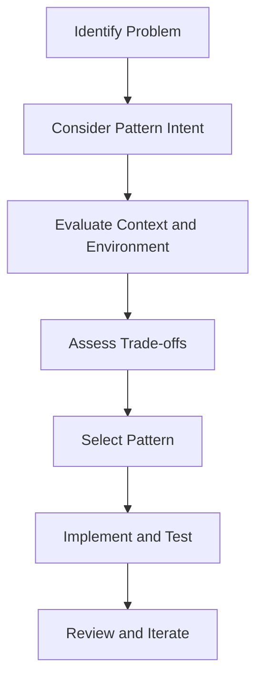

## 17.3. Pattern Selection and Trade-offs

Design patterns are essential tools in a software engineer's toolkit, offering tried-and-tested solutions to common design problems. However, selecting the right pattern is not always straightforward. It requires a deep understanding of the problem at hand, the context in which the solution will be applied, and the trade-offs involved in using a particular pattern. In this section, we will explore the nuances of pattern selection and the trade-offs that come with each choice, empowering you to make informed decisions in your software design process.

### Choosing the Right Pattern

Selecting the appropriate design pattern is akin to choosing the right tool for a job. Each pattern has its strengths and weaknesses, and understanding these is crucial to applying them effectively. Let's delve into the key considerations when choosing a design pattern:

#### 1. **Problem Identification**

Before selecting a pattern, clearly define the problem you are trying to solve. This involves understanding the requirements, constraints, and desired outcomes. Ask yourself:

- What specific problem am I addressing?
- Are there existing solutions or patterns that address similar issues?
- What are the constraints and limitations of the current system?

#### 2. **Pattern Intent and Applicability**

Each design pattern has a specific intent and is applicable in certain scenarios. Familiarize yourself with the intent of various patterns and match them to your problem. For example:

- **Creational Patterns**: Useful when you need to control object creation. Patterns like Singleton or Factory Method can help manage object instantiation.
- **Structural Patterns**: Ideal for organizing code and managing relationships between entities. Consider Adapter or Composite patterns for such needs.
- **Behavioral Patterns**: Focus on communication between objects. Patterns like Observer or Strategy can facilitate interaction and behavior management.

#### 3. **Context and Environment**

Consider the context in which the pattern will be applied. This includes the programming paradigm (OOP, FP), the existing codebase, and the overall architecture. Some patterns may be more suitable for certain paradigms or environments.

#### 4. **Trade-offs and Consequences**

Every design pattern comes with trade-offs. Understanding these trade-offs is crucial for making informed decisions. Consider:

- **Complexity vs. Simplicity**: Some patterns introduce additional complexity. Ensure the benefits outweigh the added complexity.
- **Performance Implications**: Patterns may impact performance. Evaluate the performance trade-offs and choose patterns that align with your performance goals.
- **Scalability and Flexibility**: Consider how the pattern affects the scalability and flexibility of your system. Some patterns may limit future changes or extensions.

#### 5. **Pattern Combinations**

In some cases, combining multiple patterns can provide a more robust solution. However, this requires careful consideration to avoid unnecessary complexity. Evaluate the interactions between patterns and ensure they complement each other.

#### 6. **Experience and Expertise**

Your familiarity with certain patterns can influence your choice. Leverage your expertise and past experiences to select patterns you are comfortable with, but remain open to exploring new patterns when appropriate.

### Understanding Consequences

The consequences of pattern selection extend beyond immediate implementation. They impact the maintainability, extensibility, and overall quality of your software. Let's explore these consequences in more detail:

#### 1. **Maintainability**

Design patterns can enhance maintainability by providing a clear structure and separating concerns. However, they can also introduce complexity if not used judiciously. Consider:

- **Code Readability**: Patterns should improve code readability, not obscure it. Ensure the pattern's intent is clear and well-documented.
- **Ease of Modification**: Patterns should facilitate changes and extensions. Evaluate how easy it is to modify the code when using a particular pattern.

#### 2. **Extensibility**

Patterns can promote extensibility by defining clear interfaces and promoting loose coupling. However, they can also impose constraints on future changes. Consider:

- **Interface Design**: Patterns often define interfaces that dictate how components interact. Ensure these interfaces are flexible enough to accommodate future changes.
- **Coupling and Cohesion**: Patterns should promote loose coupling and high cohesion. Avoid patterns that tightly couple components, as this can hinder extensibility.

#### 3. **Performance**

The performance implications of design patterns can vary. Some patterns may introduce overhead, while others can optimize performance. Consider:

- **Resource Utilization**: Evaluate how the pattern affects resource utilization, such as memory and CPU usage.
- **Latency and Throughput**: Consider the impact on latency and throughput, especially in performance-critical applications.

#### 4. **Scalability**

Patterns can influence the scalability of your system. Some patterns may facilitate scaling, while others may impose limitations. Consider:

- **Horizontal and Vertical Scaling**: Evaluate how the pattern supports horizontal and vertical scaling.
- **Distributed Systems**: In distributed systems, patterns like Microservices or Event-Driven Architecture can enhance scalability.

#### 5. **Complexity**

Patterns can introduce complexity, both in terms of implementation and understanding. Consider:

- **Implementation Complexity**: Evaluate the complexity of implementing the pattern and whether it aligns with your team's expertise.
- **Cognitive Load**: Patterns should reduce cognitive load, not increase it. Ensure the pattern is well-understood by the team.

### Sample Code Snippets

Let's explore some pseudocode examples to illustrate the application of design patterns and their trade-offs.

#### Singleton Pattern

The Singleton pattern ensures a class has only one instance and provides a global point of access to it.

```pseudocode
class Singleton {
    private static instance = null

    private Singleton() {
        // Private constructor to prevent instantiation
    }

    public static getInstance() {
        if (instance == null) {
            instance = new Singleton()
        }
        return instance
    }
}
```

**Trade-offs**: While the Singleton pattern provides a controlled access point, it can introduce global state, making testing and concurrency more challenging.

#### Factory Method Pattern

The Factory Method pattern defines an interface for creating objects but allows subclasses to alter the type of objects that will be created.

```pseudocode
interface Product {
    method operation()
}

class ConcreteProductA implements Product {
    method operation() {
        // Implementation for Product A
    }
}

class ConcreteProductB implements Product {
    method operation() {
        // Implementation for Product B
    }
}

abstract class Creator {
    abstract method factoryMethod(): Product

    method someOperation() {
        product = factoryMethod()
        product.operation()
    }
}

class ConcreteCreatorA extends Creator {
    method factoryMethod(): Product {
        return new ConcreteProductA()
    }
}

class ConcreteCreatorB extends Creator {
    method factoryMethod(): Product {
        return new ConcreteProductB()
    }
}
```

**Trade-offs**: The Factory Method pattern promotes flexibility and extensibility but can introduce complexity by requiring additional classes and interfaces.

#### Observer Pattern

The Observer pattern defines a one-to-many dependency between objects so that when one object changes state, all its dependents are notified and updated automatically.

```pseudocode
interface Observer {
    method update()
}

class ConcreteObserver implements Observer {
    method update() {
        // Update logic
    }
}

class Subject {
    private observers = []

    method attach(observer: Observer) {
        observers.add(observer)
    }

    method detach(observer: Observer) {
        observers.remove(observer)
    }

    method notify() {
        for observer in observers {
            observer.update()
        }
    }
}
```

**Trade-offs**: The Observer pattern facilitates communication between objects but can lead to performance issues if not managed properly, especially with a large number of observers.

### Visualizing Pattern Selection

To better understand the process of pattern selection and trade-offs, let's visualize the decision-making process using a flowchart.



**Caption**: This flowchart illustrates the process of selecting a design pattern, from problem identification to implementation and review.

### Differences and Similarities

Design patterns often share similarities, which can lead to confusion. Let's explore some common patterns and clarify their distinctions:

#### Singleton vs. Factory Method

- **Singleton**: Ensures a single instance of a class.
- **Factory Method**: Provides a way to create objects without specifying the exact class.

**Similarity**: Both control object creation but serve different purposes.

#### Observer vs. Mediator

- **Observer**: Facilitates communication between objects through a one-to-many relationship.
- **Mediator**: Centralizes communication between objects, promoting loose coupling.

**Similarity**: Both manage communication but differ in their approach and structure.

#### Strategy vs. State

- **Strategy**: Defines a family of algorithms, encapsulating each one and making them interchangeable.
- **State**: Allows an object to alter its behavior when its internal state changes.

**Similarity**: Both encapsulate behavior but differ in their focus (algorithms vs. state).

### Try It Yourself

To deepen your understanding, try modifying the provided pseudocode examples:

- **Singleton Pattern**: Implement thread-safe Singleton using double-checked locking.
- **Factory Method Pattern**: Add a new product type and corresponding creator.
- **Observer Pattern**: Implement a concrete observer that logs updates to a file.

### Knowledge Check

Let's test your understanding of pattern selection and trade-offs with some questions:

1. What are the key considerations when choosing a design pattern?
2. How do trade-offs impact pattern selection?
3. What are the similarities and differences between the Singleton and Factory Method patterns?

### Embrace the Journey

Remember, selecting the right design pattern is a journey, not a destination. As you gain experience and encounter new challenges, your understanding of patterns and their trade-offs will deepen. Keep experimenting, stay curious, and enjoy the journey!

### References and Links

- [Design Patterns: Elements of Reusable Object-Oriented Software](https://en.wikipedia.org/wiki/Design_Patterns)
- [Refactoring: Improving the Design of Existing Code](https://martinfowler.com/books/refactoring.html)
- [Head First Design Patterns](https://www.oreilly.com/library/view/head-first-design/0596007124/)

## Quiz Time!



### What is the primary goal of the Singleton pattern?

- [x] Ensure a class has only one instance and provide a global point of access.
- [ ] Facilitate communication between objects.
- [ ] Define a family of algorithms.
- [ ] Separate abstraction from implementation.

> **Explanation:** The Singleton pattern is designed to ensure that a class has only one instance and provides a global point of access to that instance.

### Which pattern is best suited for creating objects without specifying the exact class?

- [ ] Singleton
- [x] Factory Method
- [ ] Observer
- [ ] Strategy

> **Explanation:** The Factory Method pattern provides a way to create objects without specifying the exact class of object that will be created.

### What is a key trade-off of using the Observer pattern?

- [x] Potential performance issues with a large number of observers.
- [ ] Introduces global state.
- [ ] Requires additional classes and interfaces.
- [ ] Limits future changes or extensions.

> **Explanation:** The Observer pattern can lead to performance issues if there are a large number of observers, as each observer needs to be notified of changes.

### Which pattern centralizes communication between objects?

- [ ] Observer
- [x] Mediator
- [ ] Strategy
- [ ] State

> **Explanation:** The Mediator pattern centralizes communication between objects, promoting loose coupling by having objects communicate through a mediator.

### How does the Strategy pattern differ from the State pattern?

- [x] Strategy defines a family of algorithms, while State allows an object to alter its behavior based on its state.
- [ ] Strategy ensures a single instance of a class, while State provides a way to create objects.
- [ ] Strategy facilitates communication between objects, while State centralizes communication.
- [ ] Strategy separates abstraction from implementation, while State defines a family of algorithms.

> **Explanation:** The Strategy pattern defines a family of algorithms, encapsulating each one and making them interchangeable, whereas the State pattern allows an object to alter its behavior when its internal state changes.

### What should you consider when evaluating the trade-offs of a design pattern?

- [x] Complexity, performance, maintainability, extensibility, and scalability.
- [ ] Only performance and scalability.
- [ ] Only maintainability and extensibility.
- [ ] Only complexity and performance.

> **Explanation:** Evaluating the trade-offs of a design pattern involves considering complexity, performance, maintainability, extensibility, and scalability.

### Which pattern is commonly used to manage object instantiation?

- [x] Creational Patterns such as Singleton or Factory Method.
- [ ] Structural Patterns such as Adapter or Composite.
- [ ] Behavioral Patterns such as Observer or Strategy.
- [ ] Concurrency Patterns such as Thread Pool or Future.

> **Explanation:** Creational Patterns like Singleton or Factory Method are commonly used to manage object instantiation.

### What is a potential downside of using the Singleton pattern?

- [x] It can introduce global state, making testing and concurrency more challenging.
- [ ] It requires additional classes and interfaces.
- [ ] It can lead to performance issues with a large number of observers.
- [ ] It centralizes communication between objects.

> **Explanation:** The Singleton pattern can introduce global state, which can make testing and concurrency more challenging.

### Which pattern is used to define a one-to-many dependency between objects?

- [ ] Singleton
- [ ] Factory Method
- [x] Observer
- [ ] Strategy

> **Explanation:** The Observer pattern defines a one-to-many dependency between objects so that when one object changes state, all its dependents are notified and updated automatically.

### True or False: The Factory Method pattern is used to ensure a class has only one instance.

- [ ] True
- [x] False

> **Explanation:** False. The Factory Method pattern is used to create objects without specifying the exact class, not to ensure a class has only one instance.


