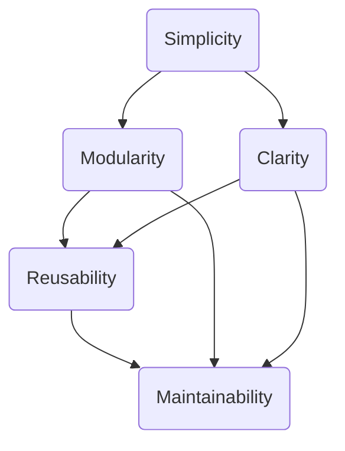

## 18.1. Principles of Good Design

In the realm of software development, the principles of good design are the bedrock upon which robust, efficient, and maintainable systems are built. These principles guide developers in crafting solutions that not only meet current requirements but are also adaptable to future changes. In this section, we delve into the core principles of simplicity, clarity, modularity, and reusability, exploring how they contribute to effective software design.

### Simplicity and Clarity

Simplicity and clarity are often cited as the most critical principles in software design. They ensure that the system is easy to understand, maintain, and extend. Let's explore these concepts in detail.

#### Simplicity

**Simplicity** in design means reducing complexity wherever possible. It involves breaking down complex problems into smaller, more manageable parts and avoiding unnecessary complications. A simple design is easier to understand, test, and modify.

- **Avoid Over-Engineering:** Resist the temptation to add features or complexity that aren't necessary for the current requirements. Over-engineering can lead to bloated code that's difficult to maintain.
  
- **Use Clear and Concise Code:** Write code that is straightforward and easy to read. Avoid clever tricks that may confuse others (or yourself in the future).

- **Focus on the Essentials:** Identify the core functionality and ensure it is implemented as simply as possible. Additional features can be layered on top of a solid foundation.

**Example of Simplicity in Code:**

```pseudocode
// Pseudocode for a simple function to calculate the factorial of a number
function factorial(n)
    if n == 0
        return 1
    else
        return n * factorial(n - 1)
```

This recursive function is a simple and clear way to calculate the factorial of a number. It avoids unnecessary complexity by focusing on the essential logic.

#### Clarity

**Clarity** in design ensures that the purpose and functionality of the code are immediately apparent. Clear code is self-explanatory, reducing the need for extensive documentation.

- **Descriptive Naming:** Use meaningful names for variables, functions, and classes. Names should convey the purpose and usage of the entity they represent.

- **Consistent Style:** Adhere to a consistent coding style and conventions throughout the project. This consistency aids in readability and understanding.

- **Commenting and Documentation:** While clear code should minimize the need for comments, use them judiciously to explain complex logic or decisions that aren't immediately obvious.

**Example of Clarity in Code:**

```pseudocode
// Pseudocode for a function to check if a number is prime
function isPrime(number)
    if number <= 1
        return false
    for i from 2 to sqrt(number)
        if number mod i == 0
            return false
    return true
```

In this example, the function name `isPrime` clearly indicates its purpose, and the logic is straightforward, making the code easy to follow.

### Modularity and Reusability

Modularity and reusability are principles that enhance the maintainability and scalability of software systems. They promote the creation of components that can be easily modified and reused across different parts of a system or even in different projects.

#### Modularity

**Modularity** refers to the design principle of breaking down a system into smaller, independent modules. Each module encapsulates a specific functionality, making the system easier to understand, test, and maintain.

- **Encapsulation:** Each module should encapsulate its functionality and expose only what is necessary through well-defined interfaces. This separation of concerns allows for easier maintenance and testing.

- **Loose Coupling:** Modules should be loosely coupled, meaning changes in one module should have minimal impact on others. This is achieved by minimizing dependencies and using interfaces or abstract classes for interaction.

- **High Cohesion:** Ensure that each module is focused on a single task or responsibility. High cohesion within modules makes them easier to understand and maintain.

**Example of Modularity in Code:**

```pseudocode
// Pseudocode for a modular system with separate modules for user management and authentication

// User Management Module
module UserManager
    function createUser(name, email)
        // Logic to create a user
    function deleteUser(userId)
        // Logic to delete a user

// Authentication Module
module Authenticator
    function login(username, password)
        // Logic to authenticate a user
    function logout(userId)
        // Logic to log out a user
```

In this example, the `UserManager` and `Authenticator` modules encapsulate distinct functionalities, promoting modularity.

#### Reusability

**Reusability** is the ability to use existing components or modules in different contexts or applications. It reduces redundancy and accelerates development by leveraging pre-existing solutions.

- **Design for Reuse:** When designing modules, consider how they might be reused in other projects or contexts. This involves creating generic and flexible interfaces.

- **Library and Framework Utilization:** Leverage existing libraries and frameworks that provide reusable components. This can save time and effort in development.

- **Avoid Duplication:** Identify common functionality and abstract it into reusable modules or functions. This reduces code duplication and potential errors.

**Example of Reusability in Code:**

```pseudocode
// Pseudocode for a reusable utility function to format dates
function formatDate(date, format)
    // Logic to format a date according to the specified format
    return formattedDate
```

The `formatDate` function is a reusable utility that can be used across different parts of an application or in different projects.

### Visualizing Design Principles

To better understand how these principles interconnect and support each other, let's visualize them using a diagram.



**Diagram Description:** This diagram illustrates how simplicity and clarity contribute to modularity, which in turn enhances reusability. Together, these principles lead to maintainability, the ultimate goal of good design.

### Applying Good Design Principles in Practice

Now that we've explored the core principles of good design, let's discuss how to apply them in practice. These principles are not isolated; they work together to create a cohesive and efficient design.

#### Start with a Clear Understanding

Before diving into code, ensure you have a clear understanding of the problem you're solving. This involves gathering requirements, understanding user needs, and defining the scope of the project.

- **Requirements Gathering:** Engage with stakeholders to gather detailed requirements. This ensures that the design addresses the actual needs and constraints of the project.

- **Define the Scope:** Clearly define the scope of the project to avoid scope creep. This helps maintain focus and ensures that the design remains simple and manageable.

#### Embrace Iterative Development

Good design is often achieved through iteration. Start with a simple design and refine it over time as you gain a deeper understanding of the problem and receive feedback.

- **Prototype and Iterate:** Develop prototypes to explore different design options. Use feedback to refine and improve the design iteratively.

- **Continuous Feedback:** Seek feedback from users and stakeholders throughout the development process. This helps identify issues early and ensures that the design meets user needs.

#### Prioritize Maintainability

Design with maintainability in mind from the outset. This involves considering how the system will evolve over time and ensuring that it can be easily modified and extended.

- **Write Clean Code:** Follow coding standards and best practices to ensure that the code is clean and maintainable. This includes using meaningful names, consistent formatting, and clear logic.

- **Document Thoughtfully:** Provide documentation that explains the design and its rationale. This helps future developers understand the system and make informed changes.

#### Encourage Collaboration

Good design is often the result of collaboration. Encourage collaboration among team members to leverage diverse perspectives and expertise.

- **Code Reviews:** Conduct regular code reviews to ensure that the design adheres to principles of good design. This also provides an opportunity for team members to learn from each other.

- **Pair Programming:** Use pair programming to encourage collaboration and knowledge sharing. This can lead to better design decisions and improved code quality.

### Try It Yourself

To reinforce your understanding of these principles, try modifying the code examples provided. Experiment with simplifying the logic, improving clarity, or refactoring the code to enhance modularity and reusability. Consider how these changes impact the overall design and maintainability of the system.

### Knowledge Check

To test your understanding of the principles of good design, consider the following questions:

1. How can you ensure that your code is simple and clear?
2. What are the benefits of modularity in software design?
3. How does reusability contribute to efficient development?
4. Why is maintainability an important consideration in design?

### Summary

In this section, we've explored the foundational principles of good design: simplicity, clarity, modularity, and reusability. These principles guide developers in creating systems that are efficient, maintainable, and adaptable to change. By applying these principles in practice, you can enhance the quality of your software and ensure its long-term success.

Remember, this is just the beginning. As you continue to develop your skills, you'll discover new ways to apply these principles and create even more effective designs. Keep experimenting, stay curious, and enjoy the journey!

## Quiz Time!



### What is the primary goal of simplicity in software design?

- [x] To reduce complexity and make the system easier to understand
- [ ] To add as many features as possible
- [ ] To focus on aesthetics over functionality
- [ ] To prioritize performance over clarity

> **Explanation:** Simplicity aims to reduce complexity, making the system easier to understand, maintain, and extend.

### How does clarity in design benefit software development?

- [x] It makes the purpose and functionality of the code immediately apparent
- [ ] It allows for more complex and intricate code
- [ ] It focuses on reducing the number of lines of code
- [ ] It emphasizes the use of advanced algorithms

> **Explanation:** Clarity ensures that the code's purpose and functionality are immediately apparent, reducing the need for extensive documentation.

### What is a key characteristic of modularity?

- [x] Breaking down a system into smaller, independent modules
- [ ] Combining all functionality into a single module
- [ ] Prioritizing speed over structure
- [ ] Using global variables for communication between modules

> **Explanation:** Modularity involves breaking down a system into smaller, independent modules, each encapsulating specific functionality.

### Why is reusability important in software design?

- [x] It reduces redundancy and accelerates development
- [ ] It focuses on creating unique solutions for each problem
- [ ] It emphasizes the use of proprietary libraries
- [ ] It discourages the use of existing solutions

> **Explanation:** Reusability allows developers to leverage existing components, reducing redundancy and accelerating development.

### Which principle ensures that each module is focused on a single task?

- [x] High cohesion
- [ ] Loose coupling
- [ ] Encapsulation
- [ ] Abstraction

> **Explanation:** High cohesion ensures that each module is focused on a single task or responsibility, making it easier to understand and maintain.

### What is the benefit of loose coupling in modular design?

- [x] Changes in one module have minimal impact on others
- [ ] Modules are tightly integrated for better performance
- [ ] It allows for more complex interactions between modules
- [ ] It encourages the use of global variables

> **Explanation:** Loose coupling ensures that changes in one module have minimal impact on others, enhancing maintainability.

### How can you design for reusability?

- [x] By creating generic and flexible interfaces
- [ ] By hardcoding specific use cases
- [ ] By focusing on a single application context
- [ ] By avoiding the use of libraries

> **Explanation:** Designing for reusability involves creating generic and flexible interfaces that can be used in different contexts.

### What is a common pitfall of over-engineering?

- [x] Adding unnecessary complexity that makes the code difficult to maintain
- [ ] Simplifying the code too much
- [ ] Focusing on immediate requirements only
- [ ] Ignoring future scalability

> **Explanation:** Over-engineering involves adding unnecessary complexity, leading to bloated code that's difficult to maintain.

### True or False: Clear code should minimize the need for comments.

- [x] True
- [ ] False

> **Explanation:** Clear code should be self-explanatory, reducing the need for extensive comments.

### What is the ultimate goal of applying the principles of good design?

- [x] Maintainability
- [ ] Performance
- [ ] Aesthetics
- [ ] Complexity

> **Explanation:** The ultimate goal of applying the principles of good design is maintainability, ensuring the system can be easily modified and extended.


