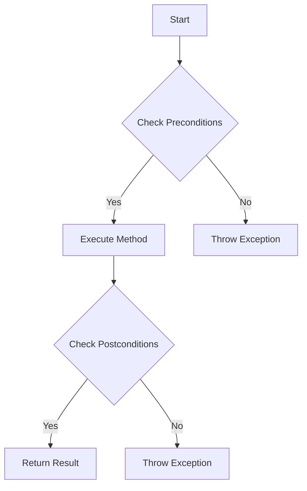

## 18.2. Design by Contract

Design by Contract (DbC) is a software development methodology introduced by Bertrand Meyer, which emphasizes the importance of defining formal, precise, and verifiable interface specifications for software components. This approach is akin to a legal contract, where both parties (the client and the supplier) agree on certain conditions and guarantees. In the context of software, these "contracts" are implemented through preconditions, postconditions, and invariants that govern the behavior of software components.

### Understanding Design by Contract

#### The Essence of Contracts in Software

In the realm of software engineering, a contract defines the obligations and benefits for both the client and the supplier. The client is responsible for ensuring that the preconditions are met before invoking a method, while the supplier guarantees that the postconditions will hold true after the method execution, provided the preconditions were met. Invariants are conditions that must remain true throughout the lifecycle of an object.

**Key Concepts:**

- **Preconditions:** Conditions that must be true before a method is executed.
- **Postconditions:** Conditions that must be true after a method has completed execution.
- **Invariants:** Conditions that must always hold true for an object, regardless of the method being executed.

#### Benefits of Design by Contract

1. **Improved Reliability:** By clearly specifying the expectations and guarantees, DbC reduces the likelihood of bugs and unexpected behavior.
2. **Enhanced Documentation:** Contracts serve as a form of documentation that is both precise and executable.
3. **Facilitated Debugging:** When a contract is violated, it provides immediate feedback on where the fault lies, aiding in quicker debugging.
4. **Encouraged Reusability:** Well-defined contracts make it easier to reuse components in different contexts.

### Implementing Design by Contract

To implement DbC, we need to define the preconditions, postconditions, and invariants for our methods and classes. Let's explore how to do this using pseudocode.

#### Specifying Interface Expectations

When designing a method, it's crucial to specify what the method expects from its inputs and what it promises to deliver. This is where preconditions and postconditions come into play.

**Example:**

Let's consider a simple class `BankAccount` with a method `withdraw(amount)`.

```pseudocode
class BankAccount
    private balance: Number

    method withdraw(amount: Number)
        // Precondition: amount must be positive and less than or equal to balance
        require amount > 0 and amount <= balance

        // Perform the withdrawal
        balance := balance - amount

        // Postcondition: balance must be non-negative
        ensure balance >= 0
```

In this example, the precondition ensures that the `amount` to be withdrawn is positive and does not exceed the current balance. The postcondition guarantees that the balance remains non-negative after the withdrawal.

#### Enforcing Invariants

Invariants are conditions that must always hold true for an object. They are typically used to maintain the consistency of an object's state.

**Example:**

Continuing with the `BankAccount` example, let's add an invariant to ensure that the balance is always non-negative.

```pseudocode
class BankAccount
    private balance: Number

    // Invariant: balance must always be non-negative
    invariant balance >= 0

    method deposit(amount: Number)
        // Precondition: amount must be positive
        require amount > 0

        // Perform the deposit
        balance := balance + amount

        // Postcondition: balance must be non-negative
        ensure balance >= 0

    method withdraw(amount: Number)
        // Precondition: amount must be positive and less than or equal to balance
        require amount > 0 and amount <= balance

        // Perform the withdrawal
        balance := balance - amount

        // Postcondition: balance must be non-negative
        ensure balance >= 0
```

The invariant `balance >= 0` ensures that the balance never becomes negative, regardless of the operations performed on the `BankAccount` object.

### Visualizing Design by Contract

To better understand the flow of preconditions, postconditions, and invariants, let's visualize the process using a flowchart.



**Caption:** This flowchart illustrates the process of executing a method with Design by Contract. Preconditions are checked before execution, and postconditions are verified after execution. If any condition is violated, an exception is thrown.

### Applying Design by Contract Across Paradigms

Design by Contract is not limited to a specific programming paradigm. It can be applied in both Object-Oriented Programming (OOP) and Functional Programming (FP).

#### Object-Oriented Programming

In OOP, DbC is often implemented using assertions or specific language features that support contracts, such as Eiffel's `require` and `ensure` keywords.

**Example:**

```pseudocode
class Rectangle
    private width: Number
    private height: Number

    // Invariant: width and height must be positive
    invariant width > 0 and height > 0

    method setWidth(newWidth: Number)
        // Precondition: newWidth must be positive
        require newWidth > 0

        width := newWidth

        // Postcondition: width must be positive
        ensure width > 0

    method setHeight(newHeight: Number)
        // Precondition: newHeight must be positive
        require newHeight > 0

        height := newHeight

        // Postcondition: height must be positive
        ensure height > 0
```

#### Functional Programming

In FP, DbC can be implemented using pure functions and immutability, where the function's contract is defined by its input-output relationship.

**Example:**

```pseudocode
function calculateArea(width: Number, height: Number) -> Number
    // Precondition: width and height must be positive
    require width > 0 and height > 0

    // Calculate the area
    let area = width * height

    // Postcondition: area must be positive
    ensure area > 0

    return area
```

### Design Considerations

When implementing Design by Contract, consider the following:

- **Performance Overhead:** Checking contracts can introduce performance overhead. Use them judiciously in performance-critical applications.
- **Granularity:** Decide on the level of granularity for contracts. Too coarse-grained contracts may miss important details, while too fine-grained contracts can become cumbersome.
- **Tool Support:** Some languages and tools provide built-in support for DbC, while others may require custom implementations.

### Differences and Similarities

Design by Contract shares similarities with other methodologies like Test-Driven Development (TDD) but differs in its focus on formalizing interface expectations rather than testing behavior. While TDD emphasizes writing tests before code, DbC emphasizes defining contracts that the code must adhere to.

### Try It Yourself

Experiment with the following pseudocode examples by modifying the preconditions, postconditions, and invariants. Observe how changes affect the behavior and reliability of the code.

```pseudocode
class Counter
    private count: Number

    // Invariant: count must be non-negative
    invariant count >= 0

    method increment()
        count := count + 1

    method decrement()
        // Precondition: count must be greater than 0
        require count > 0

        count := count - 1

        // Postcondition: count must be non-negative
        ensure count >= 0
```

### Knowledge Check

- **Question:** What are the three main components of Design by Contract?
- **Exercise:** Implement a simple `Calculator` class with methods for addition and subtraction, specifying preconditions and postconditions.

### Summary

Design by Contract is a powerful methodology for specifying and enforcing interface expectations in software components. By clearly defining preconditions, postconditions, and invariants, DbC enhances reliability, documentation, and debugging. It is applicable across programming paradigms and provides a formal framework for ensuring software correctness.

## Quiz Time!



### What is the primary purpose of Design by Contract?

- [x] To specify and enforce interface expectations
- [ ] To improve code readability
- [ ] To optimize performance
- [ ] To simplify code structure

> **Explanation:** Design by Contract focuses on specifying and enforcing interface expectations through preconditions, postconditions, and invariants.

### Which of the following is a precondition?

- [x] A condition that must be true before a method is executed
- [ ] A condition that must be true after a method is executed
- [ ] A condition that must always be true for an object
- [ ] A condition that is optional

> **Explanation:** Preconditions are conditions that must be true before a method is executed to ensure correct behavior.

### What is an invariant in Design by Contract?

- [x] A condition that must always hold true for an object
- [ ] A condition that must be true before a method is executed
- [ ] A condition that must be true after a method is executed
- [ ] A condition that is checked occasionally

> **Explanation:** Invariants are conditions that must always hold true for an object, ensuring its consistency.

### How does Design by Contract differ from Test-Driven Development?

- [x] DbC focuses on formalizing interface expectations, while TDD emphasizes writing tests before code
- [ ] DbC is only applicable to OOP, while TDD is applicable to FP
- [ ] DbC is a testing methodology, while TDD is not
- [ ] DbC and TDD are identical methodologies

> **Explanation:** Design by Contract formalizes interface expectations, while Test-Driven Development emphasizes writing tests before code.

### In which programming paradigm can Design by Contract be applied?

- [x] Both Object-Oriented Programming and Functional Programming
- [ ] Only Object-Oriented Programming
- [ ] Only Functional Programming
- [ ] Neither OOP nor FP

> **Explanation:** Design by Contract can be applied in both Object-Oriented Programming and Functional Programming paradigms.

### What is a potential drawback of using Design by Contract?

- [x] Performance overhead due to contract checking
- [ ] Increased code complexity
- [ ] Reduced code readability
- [ ] Limited applicability to small projects

> **Explanation:** Checking contracts can introduce performance overhead, especially in performance-critical applications.

### Which of the following is a benefit of Design by Contract?

- [x] Enhanced documentation through precise and executable contracts
- [ ] Simplified code structure
- [ ] Reduced development time
- [ ] Increased code complexity

> **Explanation:** Design by Contract enhances documentation by providing precise and executable contracts.

### What should be considered when deciding on the granularity of contracts?

- [x] Balance between detail and manageability
- [ ] Maximizing performance
- [ ] Minimizing code length
- [ ] Ensuring all possible conditions are covered

> **Explanation:** The granularity of contracts should balance detail and manageability to avoid missing important details or becoming cumbersome.

### True or False: Invariants are only checked at the end of a method execution.

- [ ] True
- [x] False

> **Explanation:** Invariants must always hold true for an object, not just at the end of a method execution.

### What is the role of postconditions in Design by Contract?

- [x] To ensure conditions are true after a method has completed execution
- [ ] To specify conditions before a method is executed
- [ ] To maintain object consistency
- [ ] To optimize performance

> **Explanation:** Postconditions are conditions that must be true after a method has completed execution, provided the preconditions were met.



Remember, this is just the beginning. As you progress, you'll build more complex and interactive systems using Design by Contract. Keep experimenting, stay curious, and enjoy the journey!
