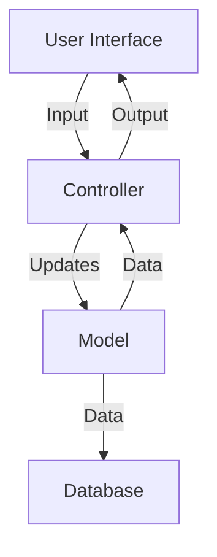

## 18.3. Separation of Concerns

In the realm of software development, the principle of **Separation of Concerns (SoC)** is a fundamental design principle that aims to divide a computer program into distinct sections, such that each section addresses a separate concern. A concern is any piece of interest or focus in a program. By decoupling components, SoC enhances maintainability, scalability, and readability of code, making it easier to manage and evolve over time.

### Understanding Separation of Concerns

Separation of Concerns is about organizing code in a way that each part of the program has a distinct responsibility. This principle is not tied to any specific programming paradigm and can be applied in Object-Oriented Programming (OOP), Functional Programming (FP), and other paradigms. Let's delve into the core concepts and benefits of SoC:

- **Decoupling Components**: By separating concerns, you decouple components, reducing dependencies and making the system more modular.
- **Enhancing Maintainability**: With clear boundaries between different parts of the system, changes in one area have minimal impact on others, making maintenance easier.
- **Improving Readability and Understanding**: Well-separated concerns lead to cleaner code, which is easier to read and understand.
- **Facilitating Reusability**: Components that handle specific concerns can be reused across different parts of the application or even in different projects.

### Key Concepts and Terminology

Before we dive deeper, let's clarify some key terms related to Separation of Concerns:

- **Concern**: A specific requirement or behavior of a system, such as data persistence, user interface, or business logic.
- **Modularity**: The degree to which a system's components can be separated and recombined.
- **Cohesion**: The measure of how closely related and focused the responsibilities of a single module are.
- **Coupling**: The degree of interdependence between software modules.

### Historical Context and Evolution

The concept of Separation of Concerns has been around for decades, evolving alongside programming languages and paradigms. It was popularized by Edsger W. Dijkstra in the 1970s, who emphasized the importance of dividing complex systems into manageable parts. Over time, SoC has been integrated into various design principles and patterns, such as MVC (Model-View-Controller), MVVM (Model-View-ViewModel), and microservices architecture.

### Applying Separation of Concerns Across Paradigms

#### In Object-Oriented Programming (OOP)

In OOP, SoC is often achieved through encapsulation, inheritance, and polymorphism. By defining classes that encapsulate specific behaviors and data, developers can create systems where each class has a clear responsibility.

**Example: MVC Pattern**

The MVC pattern is a classic example of SoC in OOP. It divides an application into three interconnected components:

- **Model**: Manages the data and business logic.
- **View**: Handles the display and user interface.
- **Controller**: Manages user input and updates the model and view accordingly.

```pseudocode
class Model {
    // Handles data and business logic
    function getData() {
        // Retrieve data
    }
}

class View {
    // Handles display
    function render(data) {
        // Display data
    }
}

class Controller {
    // Manages user input
    function handleRequest() {
        data = model.getData()
        view.render(data)
    }
}
```

#### In Functional Programming (FP)

Functional Programming emphasizes immutability and pure functions, which naturally align with SoC. By using higher-order functions and function composition, FP allows developers to separate concerns effectively.

**Example: Function Composition**

In FP, complex operations can be broken down into smaller, reusable functions, each handling a specific concern.

```pseudocode
function fetchData() {
    // Fetch data from source
}

function processData(data) {
    // Process and transform data
}

function displayData(data) {
    // Display data to user
}

// Compose functions
function handleRequest() {
    data = fetchData()
    processedData = processData(data)
    displayData(processedData)
}
```

### Benefits of Separation of Concerns

1. **Improved Maintainability**: Changes in one part of the system have minimal impact on others, reducing the risk of introducing bugs.
2. **Enhanced Scalability**: As the system grows, new features can be added with minimal disruption to existing components.
3. **Better Collaboration**: Teams can work on different concerns independently, improving efficiency and reducing conflicts.
4. **Increased Reusability**: Well-defined components can be reused across different projects, saving time and effort.

### Challenges and Considerations

While SoC offers numerous benefits, it also presents challenges:

- **Overhead of Abstraction**: Excessive separation can lead to complexity and overhead, making the system harder to understand and manage.
- **Balancing Cohesion and Coupling**: Achieving the right balance between cohesion and coupling is crucial for effective SoC.
- **Communication Between Components**: Well-separated components need clear interfaces for communication, which can be challenging to design.

### Visualizing Separation of Concerns

To better understand SoC, let's visualize it using a simple diagram that illustrates the separation of concerns in a typical web application.



**Diagram Description**: This diagram represents the flow of data and control in an MVC architecture. The user interface interacts with the controller, which updates the model. The model communicates with the database and sends data back to the controller, which then updates the view.

### Practical Applications and Examples

#### Example 1: Web Application Architecture

In a web application, SoC can be applied by separating the frontend and backend concerns. The frontend handles user interaction and presentation, while the backend manages data processing and storage.

**Frontend (JavaScript/HTML/CSS)**

```pseudocode
function renderUI(data) {
    // Render user interface
}

function handleUserInput() {
    // Handle input and send to backend
}
```

**Backend (Node.js/Python/Java)**

```pseudocode
function processData(input) {
    // Process input data
}

function storeData(data) {
    // Store data in database
}
```

#### Example 2: Microservices Architecture

Microservices architecture is a modern approach to SoC, where each service is responsible for a specific business capability.

**Service A: User Management**

```pseudocode
function createUser(userData) {
    // Create new user
}

function getUser(userId) {
    // Retrieve user information
}
```

**Service B: Order Processing**

```pseudocode
function createOrder(orderData) {
    // Process new order
}

function getOrder(orderId) {
    // Retrieve order details
}
```

### Try It Yourself

To deepen your understanding of SoC, try modifying the pseudocode examples provided. For instance, in the MVC example, add a new feature to the model and update the controller and view accordingly. Observe how changes in one component affect the others.

### References and Further Reading

- [MDN Web Docs: Separation of Concerns](https://developer.mozilla.org/en-US/docs/Glossary/Separation_of_concerns)
- [Wikipedia: Separation of Concerns](https://en.wikipedia.org/wiki/Separation_of_concerns)
- [Design Patterns: Elements of Reusable Object-Oriented Software](https://en.wikipedia.org/wiki/Design_Patterns)

### Knowledge Check

- **What is Separation of Concerns and why is it important?**
- **How does SoC improve maintainability and scalability?**
- **What are some common challenges associated with implementing SoC?**

### Embrace the Journey

Remember, mastering Separation of Concerns is a continuous journey. As you apply this principle in your projects, you'll discover new ways to enhance your code's maintainability and scalability. Keep experimenting, stay curious, and enjoy the process of learning and growing as a developer.

## Quiz Time!



### What is the primary goal of Separation of Concerns?

- [x] To divide a program into distinct sections, each addressing a separate concern
- [ ] To increase the complexity of the code
- [ ] To make the code run faster
- [ ] To reduce the number of lines of code

> **Explanation:** The primary goal of Separation of Concerns is to divide a program into distinct sections, each addressing a separate concern, which enhances maintainability and readability.

### Which of the following is a benefit of Separation of Concerns?

- [x] Improved maintainability
- [ ] Increased coupling
- [ ] More complex code
- [ ] Reduced functionality

> **Explanation:** Separation of Concerns improves maintainability by reducing dependencies and making the code easier to manage and evolve.

### In the MVC pattern, which component is responsible for managing user input?

- [ ] Model
- [ ] View
- [x] Controller
- [ ] Database

> **Explanation:** In the MVC pattern, the Controller is responsible for managing user input and updating the Model and View accordingly.

### What is a common challenge associated with Separation of Concerns?

- [x] Overhead of abstraction
- [ ] Increased speed
- [ ] Reduced code readability
- [ ] Less modular code

> **Explanation:** A common challenge of Separation of Concerns is the overhead of abstraction, which can lead to complexity if not managed properly.

### How does Functional Programming naturally align with Separation of Concerns?

- [x] By emphasizing immutability and pure functions
- [ ] By using global variables
- [ ] By focusing on inheritance
- [ ] By avoiding modularity

> **Explanation:** Functional Programming aligns with Separation of Concerns by emphasizing immutability and pure functions, which help in separating different concerns effectively.

### What is the relationship between cohesion and Separation of Concerns?

- [x] High cohesion supports effective Separation of Concerns
- [ ] Low cohesion supports effective Separation of Concerns
- [ ] Cohesion is unrelated to Separation of Concerns
- [ ] Cohesion decreases with Separation of Concerns

> **Explanation:** High cohesion supports effective Separation of Concerns by ensuring that each module has a focused responsibility.

### Which architectural style is a modern approach to Separation of Concerns?

- [x] Microservices architecture
- [ ] Monolithic architecture
- [ ] Layered architecture
- [ ] Client-server architecture

> **Explanation:** Microservices architecture is a modern approach to Separation of Concerns, where each service is responsible for a specific business capability.

### What does the term "concern" refer to in Separation of Concerns?

- [x] A specific requirement or behavior of a system
- [ ] A type of error in the code
- [ ] A method of optimizing performance
- [ ] A way to reduce code size

> **Explanation:** In Separation of Concerns, a "concern" refers to a specific requirement or behavior of a system.

### What is the role of the Model in the MVC pattern?

- [x] To manage the data and business logic
- [ ] To handle user input
- [ ] To display the user interface
- [ ] To store data in the database

> **Explanation:** In the MVC pattern, the Model is responsible for managing the data and business logic.

### True or False: Separation of Concerns can only be applied in Object-Oriented Programming.

- [ ] True
- [x] False

> **Explanation:** False. Separation of Concerns is a principle that can be applied across various programming paradigms, not just Object-Oriented Programming.


