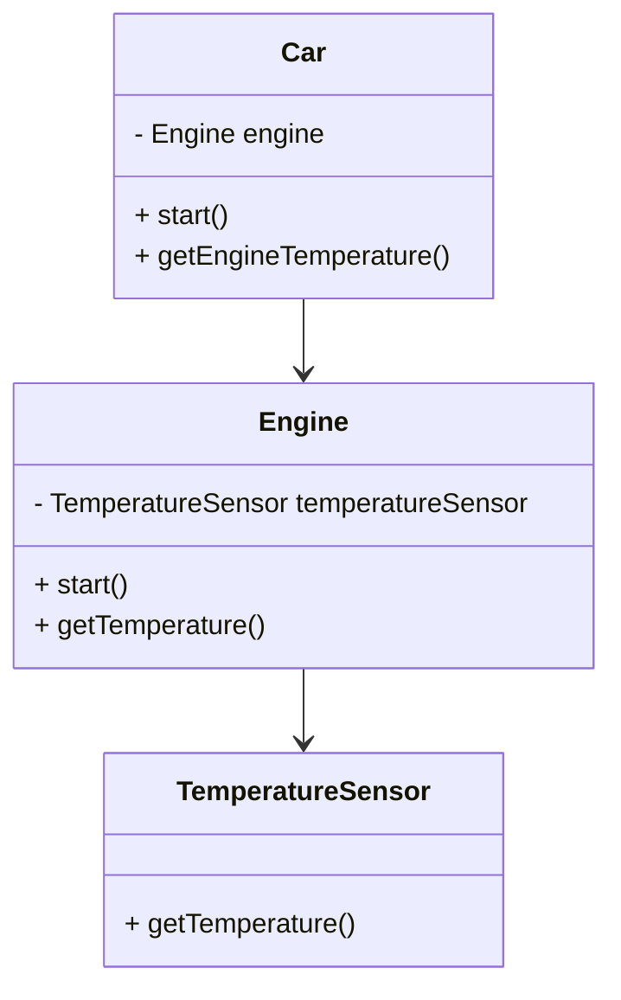

## 18.4. Law of Demeter

In the realm of software design, the Law of Demeter (LoD) stands as a guiding principle for minimizing coupling and promoting loosely coupled code. This principle, also known as the "Principle of Least Knowledge," advises developers to limit the knowledge that a given module has about other modules. By adhering to the Law of Demeter, you can create systems that are more modular, maintainable, and resilient to change.

### Understanding the Law of Demeter

The Law of Demeter was introduced in 1987 by Ian Holland at Northeastern University. It is a set of guidelines for designing software systems that aim to reduce the dependencies between components. The core idea is that a module should only communicate with its immediate collaborators and not with the collaborators of its collaborators.

#### Key Concepts

- **Minimizing Coupling**: By limiting the interactions between modules, the Law of Demeter helps reduce coupling, making the system easier to understand and modify.
- **Encapsulation**: The principle encourages encapsulation by ensuring that objects only expose necessary information.
- **Modularity**: By following the Law of Demeter, you can create more modular systems where components can be developed and tested independently.

### The "Don't Talk to Strangers" Rule

The Law of Demeter can be summarized by the "Don't Talk to Strangers" rule. This rule states that a method `M` of an object `O` should only call methods of:

1. `O` itself.
2. `M`'s parameters.
3. Any objects created/instantiated within `M`.
4. `O`'s direct component objects.
5. A global variable, accessible within the scope of `M`.

This rule helps ensure that each module only interacts with its immediate dependencies, reducing the risk of unintended side effects from changes in other parts of the system.

### Benefits of the Law of Demeter

- **Improved Maintainability**: By reducing dependencies, changes in one part of the system are less likely to affect other parts.
- **Enhanced Readability**: Code that adheres to the Law of Demeter is often easier to read and understand because it limits the scope of interactions.
- **Increased Reusability**: Loosely coupled components are easier to reuse in different contexts.

### Applying the Law of Demeter

To apply the Law of Demeter effectively, follow these guidelines:

1. **Limit Method Calls**: Ensure that methods only call other methods on objects they directly own or have created.
2. **Use Interfaces**: Define clear interfaces for components to interact with each other, reducing the need for direct access to internal details.
3. **Encapsulate Data**: Keep data encapsulated within objects and provide methods for accessing and modifying it, rather than exposing it directly.
4. **Avoid Method Chaining**: Method chaining can lead to violations of the Law of Demeter by allowing a single line of code to access multiple levels of objects.

### Pseudocode Example

Let's explore a pseudocode example to illustrate the application of the Law of Demeter.

```pseudocode
class Car {
    private Engine engine;

    function start() {
        // Correct: Directly calling a method on a component object
        engine.start();
    }

    function getEngineTemperature() {
        // Violation: Accessing a method on an object returned by another method
        return engine.getTemperatureSensor().getTemperature();
    }
}

class Engine {
    private TemperatureSensor temperatureSensor;

    function start() {
        // Start the engine
    }

    function getTemperatureSensor() {
        return temperatureSensor;
    }
}

class TemperatureSensor {
    function getTemperature() {
        return 90; // Example temperature
    }
}
```

In this example, the `Car` class violates the Law of Demeter by accessing the `TemperatureSensor` through the `Engine` object. To adhere to the Law of Demeter, the `Car` class should only interact with the `Engine` directly.

### Refactoring for Compliance

To refactor the example for compliance with the Law of Demeter, we can modify the `Engine` class to provide a method for retrieving the temperature directly.

```pseudocode
class Car {
    private Engine engine;

    function start() {
        engine.start();
    }

    function getEngineTemperature() {
        // Correct: Directly calling a method on a component object
        return engine.getTemperature();
    }
}

class Engine {
    private TemperatureSensor temperatureSensor;

    function start() {
        // Start the engine
    }

    function getTemperature() {
        return temperatureSensor.getTemperature();
    }
}

class TemperatureSensor {
    function getTemperature() {
        return 90; // Example temperature
    }
}
```

By adding a `getTemperature` method to the `Engine` class, we ensure that the `Car` class only interacts with its direct component, the `Engine`.

### Visualizing the Law of Demeter

To better understand the interactions between objects and how they relate to the Law of Demeter, let's visualize the relationships using a class diagram.



**Diagram Description**: This class diagram illustrates the relationships between the `Car`, `Engine`, and `TemperatureSensor` classes. The `Car` class interacts directly with the `Engine`, which in turn interacts with the `TemperatureSensor`. By adhering to the Law of Demeter, we ensure that each class only communicates with its direct collaborators.

### Common Misconceptions

- **Over-Encapsulation**: Some developers may interpret the Law of Demeter as a call for excessive encapsulation, leading to overly complex interfaces. It's important to balance encapsulation with practical design considerations.
- **Performance Concerns**: There may be concerns that adhering to the Law of Demeter could lead to performance overhead due to additional method calls. However, the benefits of maintainability and readability often outweigh these concerns.

### Differences and Similarities with Other Principles

The Law of Demeter is often compared to other design principles, such as:

- **Single Responsibility Principle (SRP)**: Both principles aim to reduce complexity by limiting the responsibilities and interactions of a module.
- **Encapsulation**: While encapsulation focuses on hiding internal details, the Law of Demeter emphasizes minimizing interactions with external modules.

### Try It Yourself

To deepen your understanding of the Law of Demeter, try modifying the pseudocode examples to introduce new components and interactions. Observe how these changes affect the adherence to the Law of Demeter and consider refactoring to maintain compliance.

### Practical Applications

The Law of Demeter is particularly useful in large-scale systems where minimizing dependencies is crucial for maintainability. It is also beneficial in environments where multiple teams work on different components, as it helps define clear boundaries and interfaces.

### Knowledge Check

- **Question**: What is the primary goal of the Law of Demeter?
  - **Answer**: To minimize coupling between components by limiting their interactions.

- **Question**: How does the Law of Demeter relate to encapsulation?
  - **Answer**: Both principles aim to hide internal details, but the Law of Demeter specifically focuses on minimizing interactions with external modules.

### Conclusion

The Law of Demeter is a powerful principle for designing loosely coupled systems. By adhering to this principle, you can create software that is easier to maintain, understand, and extend. Remember, the journey to mastering design patterns and principles is ongoing. Keep experimenting, stay curious, and enjoy the process of refining your software design skills.

## Quiz Time!



### What is the primary goal of the Law of Demeter?

- [x] To minimize coupling between components by limiting their interactions.
- [ ] To maximize encapsulation of all data within a single class.
- [ ] To ensure all classes have access to global variables.
- [ ] To enforce strict inheritance hierarchies.

> **Explanation:** The Law of Demeter aims to reduce dependencies by limiting the interactions between components, promoting loosely coupled systems.

### Which of the following is a violation of the Law of Demeter?

- [x] Accessing a method on an object returned by another method.
- [ ] Calling a method on an object created within the current method.
- [ ] Calling a method on a parameter passed to the current method.
- [ ] Calling a method on the current object itself.

> **Explanation:** The Law of Demeter advises against accessing methods on objects returned by other methods, as this increases coupling.

### How does the Law of Demeter relate to encapsulation?

- [x] Both aim to hide internal details and reduce dependencies.
- [ ] Encapsulation focuses on performance, while the Law of Demeter focuses on security.
- [ ] The Law of Demeter requires exposing all internal details.
- [ ] Encapsulation and the Law of Demeter are unrelated.

> **Explanation:** Both encapsulation and the Law of Demeter aim to hide internal details, but the Law of Demeter specifically focuses on minimizing interactions with external modules.

### What is a common misconception about the Law of Demeter?

- [x] It requires excessive encapsulation, leading to complex interfaces.
- [ ] It improves performance by reducing method calls.
- [ ] It simplifies code by increasing global variable usage.
- [ ] It mandates the use of inheritance for all classes.

> **Explanation:** A common misconception is that the Law of Demeter requires excessive encapsulation, which can lead to overly complex interfaces.

### Which principle is often compared to the Law of Demeter?

- [x] Single Responsibility Principle (SRP)
- [ ] Open/Closed Principle (OCP)
- [ ] Liskov Substitution Principle (LSP)
- [ ] Dependency Inversion Principle (DIP)

> **Explanation:** The Law of Demeter is often compared to the Single Responsibility Principle (SRP) as both aim to reduce complexity by limiting responsibilities and interactions.

### What does the "Don't Talk to Strangers" rule imply in the context of the Law of Demeter?

- [x] A method should only call methods on its immediate collaborators.
- [ ] A method should call methods on any object it can access.
- [ ] A method should avoid calling methods on its own parameters.
- [ ] A method should only call methods on global variables.

> **Explanation:** The "Don't Talk to Strangers" rule implies that a method should only interact with its immediate collaborators, reducing dependencies.

### How can method chaining lead to violations of the Law of Demeter?

- [x] It allows a single line of code to access multiple levels of objects.
- [ ] It simplifies code by reducing the number of method calls.
- [ ] It enforces strict encapsulation of all data.
- [ ] It increases the use of global variables.

> **Explanation:** Method chaining can lead to violations of the Law of Demeter by allowing a single line of code to access multiple levels of objects, increasing coupling.

### What is a benefit of adhering to the Law of Demeter?

- [x] Improved maintainability due to reduced dependencies.
- [ ] Increased complexity of interfaces.
- [ ] Enhanced performance through fewer method calls.
- [ ] Greater use of global variables.

> **Explanation:** Adhering to the Law of Demeter improves maintainability by reducing dependencies and promoting loosely coupled systems.

### Which of the following is NOT a guideline for applying the Law of Demeter?

- [ ] Limit method calls to immediate collaborators.
- [ ] Use interfaces to define clear interactions.
- [ ] Encapsulate data within objects.
- [x] Increase the use of global variables.

> **Explanation:** The Law of Demeter does not advocate for the use of global variables; instead, it promotes limiting method calls to immediate collaborators and using interfaces.

### True or False: The Law of Demeter is also known as the "Principle of Least Knowledge."

- [x] True
- [ ] False

> **Explanation:** True. The Law of Demeter is also referred to as the "Principle of Least Knowledge" because it emphasizes limiting the knowledge that a module has about other modules.


