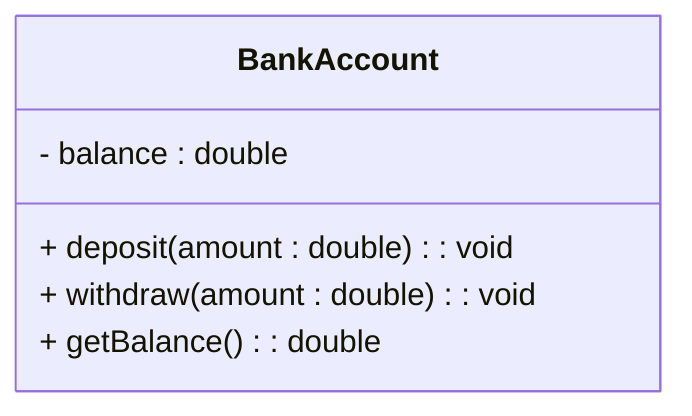

## 18.5. Encapsulation and Information Hiding

In the realm of software design, encapsulation and information hiding are pivotal concepts that contribute to the robustness, security, and maintainability of code. These principles are not just theoretical constructs but practical tools that guide developers in structuring their code effectively. In this section, we will delve into these concepts, exploring their significance, implementation, and impact on software development.

### Understanding Encapsulation

Encapsulation is a fundamental principle of object-oriented programming (OOP) that involves bundling the data (attributes) and the methods (functions) that operate on the data into a single unit, known as a class. This encapsulation ensures that the internal representation of an object is hidden from the outside world, exposing only what is necessary through a well-defined interface.

#### Key Benefits of Encapsulation

1. **Data Protection**: By restricting direct access to an object's data, encapsulation protects the integrity of the data. This prevents external entities from making unauthorized changes, ensuring that the object remains in a valid state.

2. **Modularity**: Encapsulation promotes modularity by allowing developers to change the internal implementation of a class without affecting other parts of the program. This separation of concerns makes the code easier to manage and extend.

3. **Ease of Maintenance**: With encapsulation, changes to the internal workings of a class do not impact the code that uses the class. This isolation simplifies maintenance and reduces the risk of introducing bugs when making changes.

4. **Improved Security**: By controlling access to the internal data, encapsulation enhances the security of the application. Sensitive data can be safeguarded from unauthorized access or modification.

#### Implementing Encapsulation

To implement encapsulation, developers typically use access modifiers to control the visibility of class members. Common access modifiers include:

- **Private**: Members declared as private are accessible only within the class itself. This is the most restrictive access level, ensuring that the data is completely hidden from outside access.

- **Protected**: Members declared as protected are accessible within the class and by derived classes. This allows for controlled inheritance while maintaining some level of data protection.

- **Public**: Members declared as public are accessible from anywhere in the program. Public members form the interface through which external entities interact with the class.

#### Pseudocode Example of Encapsulation

Let's consider a simple example of encapsulation in pseudocode:

```pseudocode
class BankAccount
    private balance

    function BankAccount(initialBalance)
        this.balance = initialBalance

    public function deposit(amount)
        if amount > 0
            this.balance = this.balance + amount

    public function withdraw(amount)
        if amount > 0 and amount <= this.balance
            this.balance = this.balance - amount

    public function getBalance()
        return this.balance
```

In this example, the `balance` attribute is encapsulated within the `BankAccount` class. It is declared as private, ensuring that it cannot be accessed directly from outside the class. Instead, the class provides public methods (`deposit`, `withdraw`, and `getBalance`) that allow controlled access to the balance.

### Exploring Information Hiding

Information hiding is a design principle that complements encapsulation by focusing on hiding the internal details of a class or module from the outside world. The goal of information hiding is to reduce the complexity of the system by exposing only the necessary information and keeping the rest hidden.

#### Key Benefits of Information Hiding

1. **Reduced Complexity**: By hiding unnecessary details, information hiding reduces the cognitive load on developers. They can focus on the high-level functionality without being overwhelmed by the intricacies of the implementation.

2. **Enhanced Flexibility**: Information hiding allows developers to change the internal implementation of a class or module without affecting its external interface. This flexibility is crucial for adapting to changing requirements and optimizing performance.

3. **Improved Reusability**: By exposing only the essential features, information hiding makes it easier to reuse classes and modules in different contexts. The hidden details are irrelevant to the users, allowing for greater adaptability.

4. **Increased Robustness**: By minimizing the dependencies between different parts of the system, information hiding reduces the risk of errors and enhances the overall robustness of the application.

#### Implementing Information Hiding

Information hiding is typically achieved by defining a clear interface for a class or module and keeping the implementation details private. This interface acts as a contract between the class and its users, specifying what the class can do without revealing how it does it.

#### Pseudocode Example of Information Hiding

Consider the following pseudocode example that demonstrates information hiding:

```pseudocode
class TemperatureSensor
    private currentTemperature

    private function readSensor()
        // Code to read the temperature from the sensor
        return sensorValue

    public function getTemperature()
        this.currentTemperature = this.readSensor()
        return this.currentTemperature
```

In this example, the `TemperatureSensor` class hides the details of how the temperature is read from the sensor. The `readSensor` method is private, ensuring that it cannot be accessed directly from outside the class. Instead, the class provides a public method (`getTemperature`) that allows users to obtain the current temperature without knowing how it is measured.

### Encapsulation and Information Hiding in Different Paradigms

While encapsulation and information hiding are often associated with object-oriented programming, these principles are applicable across various programming paradigms, including functional programming and procedural programming.

#### Encapsulation in Functional Programming

In functional programming, encapsulation is achieved through the use of closures and higher-order functions. Closures allow functions to capture and encapsulate their environment, providing a way to hide internal state and expose only the necessary functionality.

#### Pseudocode Example of Encapsulation in Functional Programming

```pseudocode
function createCounter()
    let count = 0

    function increment()
        count = count + 1
        return count

    return increment
```

In this example, the `createCounter` function returns an `increment` function that encapsulates the `count` variable. The `count` variable is hidden from the outside world, and the only way to interact with it is through the `increment` function.

#### Information Hiding in Procedural Programming

In procedural programming, information hiding is often achieved through the use of modules or namespaces. These constructs allow developers to group related functions and data together, exposing only the necessary parts to the outside world.

#### Pseudocode Example of Information Hiding in Procedural Programming

```pseudocode
module MathOperations
    private function add(a, b)
        return a + b

    private function subtract(a, b)
        return a - b

    public function calculateSum(a, b)
        return add(a, b)

    public function calculateDifference(a, b)
        return subtract(a, b)
```

In this example, the `MathOperations` module hides the `add` and `subtract` functions from the outside world. Instead, it provides public functions (`calculateSum` and `calculateDifference`) that allow users to perform mathematical operations without knowing the details of how they are implemented.

### Visualizing Encapsulation and Information Hiding

To better understand the relationship between encapsulation and information hiding, let's visualize these concepts using a class diagram:



In this diagram, the `BankAccount` class encapsulates the `balance` attribute and provides public methods for interacting with it. The private `balance` attribute is hidden from the outside world, illustrating the principle of information hiding.

### Design Considerations

When implementing encapsulation and information hiding, it is important to consider the following:

1. **Balance Between Exposure and Hiding**: While encapsulation and information hiding are valuable, it is important to strike a balance between exposing necessary interfaces and hiding implementation details. Overly restrictive access can hinder flexibility and usability.

2. **Consistency in Interface Design**: Ensure that the public interface of a class or module is consistent and intuitive. This consistency enhances usability and reduces the likelihood of errors.

3. **Documentation**: Clearly document the public interface and the intended use of each method. This documentation serves as a guide for developers using the class or module.

4. **Testing**: Thoroughly test the public interface to ensure that it behaves as expected. Testing helps identify edge cases and potential issues, enhancing the reliability of the code.

### Differences and Similarities with Related Concepts

Encapsulation and information hiding are often confused with related concepts such as abstraction and modularity. While these concepts are interconnected, they have distinct meanings:

- **Abstraction**: Abstraction involves simplifying complex systems by focusing on the essential features and ignoring the irrelevant details. While encapsulation and information hiding contribute to abstraction, abstraction is a broader concept that encompasses the design of interfaces and the representation of data.

- **Modularity**: Modularity refers to the division of a system into smaller, independent components. Encapsulation and information hiding are techniques used to achieve modularity by ensuring that each component has a well-defined interface and hides its internal details.

### Try It Yourself

To deepen your understanding of encapsulation and information hiding, try modifying the pseudocode examples provided in this section. Experiment with changing the access levels of class members, adding new methods, or refactoring the code to improve encapsulation. Observe how these changes impact the usability and maintainability of the code.

### References and Further Reading

For more information on encapsulation and information hiding, consider exploring the following resources:

- [Encapsulation in Object-Oriented Programming](https://en.wikipedia.org/wiki/Encapsulation_(computer_programming))
- [Information Hiding in Software Design](https://en.wikipedia.org/wiki/Information_hiding)
- [Functional Programming Principles](https://en.wikipedia.org/wiki/Functional_programming)

### Knowledge Check

To reinforce your understanding of encapsulation and information hiding, consider the following questions:

1. What are the key benefits of encapsulation in software design?
2. How does information hiding contribute to the flexibility and robustness of a system?
3. In what ways can encapsulation be achieved in functional programming?
4. How do access modifiers play a role in implementing encapsulation?
5. What is the relationship between encapsulation, information hiding, and abstraction?

### Embrace the Journey

Remember, mastering encapsulation and information hiding is a journey that involves continuous learning and practice. As you apply these principles in your software development projects, you'll gain a deeper understanding of their impact on code quality and maintainability. Keep experimenting, stay curious, and enjoy the journey!

## Quiz Time!



### What is the primary goal of encapsulation in software design?

- [x] To bundle data and methods into a single unit
- [ ] To expose all internal details
- [ ] To increase code complexity
- [ ] To eliminate the need for interfaces

> **Explanation:** Encapsulation aims to bundle data and methods into a single unit, protecting the internal state and exposing only necessary interfaces.

### Which access modifier is the most restrictive in terms of visibility?

- [x] Private
- [ ] Protected
- [ ] Public
- [ ] Internal

> **Explanation:** The private access modifier is the most restrictive, allowing access only within the class itself.

### How does information hiding enhance software flexibility?

- [x] By allowing changes to internal implementation without affecting the external interface
- [ ] By exposing all internal details to users
- [ ] By increasing the complexity of the system
- [ ] By making the code less reusable

> **Explanation:** Information hiding allows developers to change the internal implementation without affecting the external interface, enhancing flexibility.

### In functional programming, what construct is commonly used to achieve encapsulation?

- [x] Closures
- [ ] Classes
- [ ] Interfaces
- [ ] Modules

> **Explanation:** Closures in functional programming capture and encapsulate their environment, providing a way to hide internal state.

### What is the relationship between encapsulation and modularity?

- [x] Encapsulation is a technique used to achieve modularity
- [ ] Modularity eliminates the need for encapsulation
- [ ] Encapsulation and modularity are unrelated concepts
- [ ] Modularity is a subset of encapsulation

> **Explanation:** Encapsulation is a technique used to achieve modularity by ensuring that each component has a well-defined interface and hides its internal details.

### Which of the following is NOT a benefit of information hiding?

- [ ] Reduced complexity
- [ ] Enhanced flexibility
- [ ] Improved reusability
- [x] Increased code duplication

> **Explanation:** Information hiding reduces complexity, enhances flexibility, and improves reusability, but it does not increase code duplication.

### What is the role of access modifiers in encapsulation?

- [x] They control the visibility of class members
- [ ] They eliminate the need for interfaces
- [ ] They increase the complexity of the code
- [ ] They expose all internal details

> **Explanation:** Access modifiers control the visibility of class members, playing a crucial role in implementing encapsulation.

### How does encapsulation contribute to code maintainability?

- [x] By isolating changes to the internal workings of a class
- [ ] By exposing all internal details to users
- [ ] By increasing the complexity of the system
- [ ] By making the code less reusable

> **Explanation:** Encapsulation isolates changes to the internal workings of a class, simplifying maintenance and reducing the risk of introducing bugs.

### What is the primary focus of information hiding?

- [x] Hiding internal details from the outside world
- [ ] Exposing all internal details to users
- [ ] Increasing code complexity
- [ ] Eliminating the need for interfaces

> **Explanation:** Information hiding focuses on hiding internal details from the outside world, reducing complexity and enhancing flexibility.

### True or False: Encapsulation and information hiding are only applicable in object-oriented programming.

- [ ] True
- [x] False

> **Explanation:** Encapsulation and information hiding are applicable across various programming paradigms, including functional and procedural programming.




